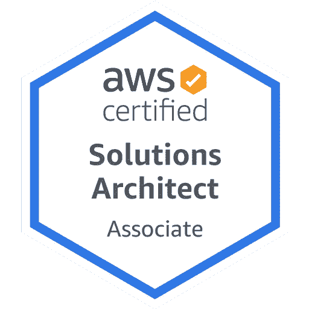
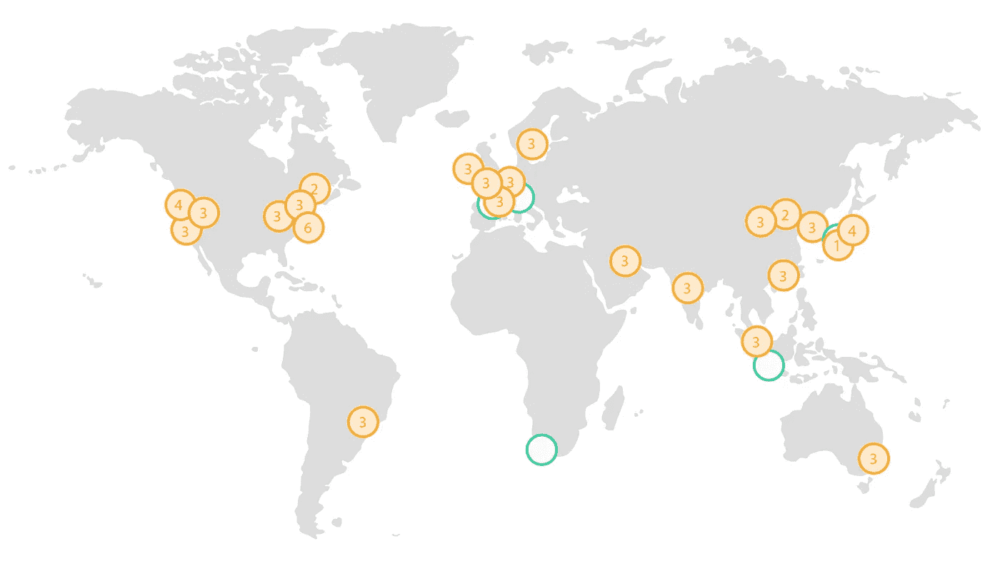
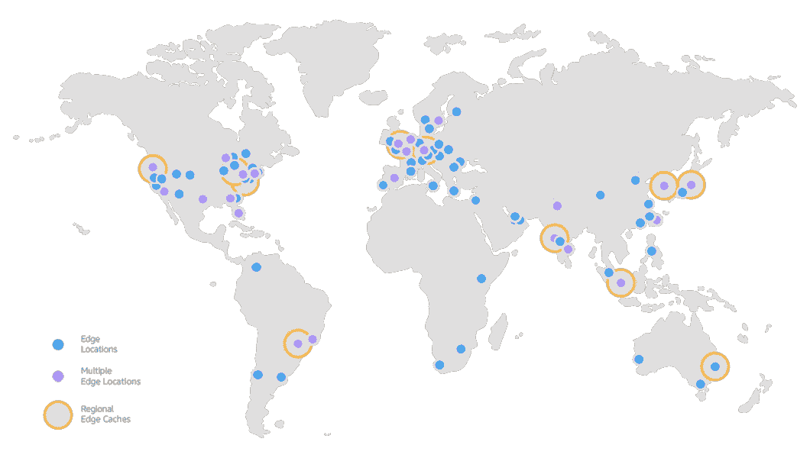
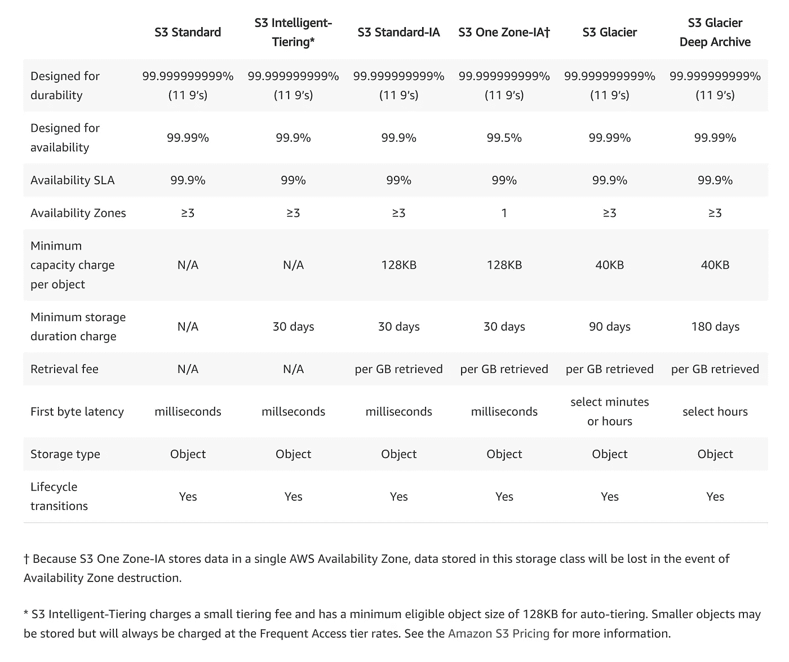
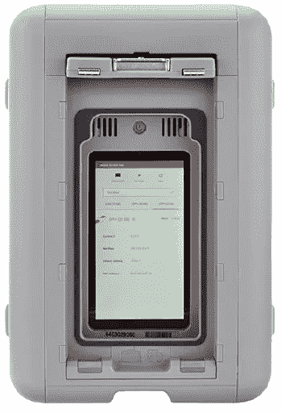
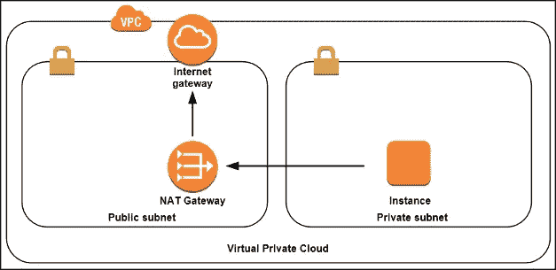

# 如何通过 AWS 认证解决方案架构师助理考试？

> 原文：<https://levelup.gitconnected.com/how-to-pass-the-aws-certified-solution-architect-associate-exam-b75ee5e35045>

## 准备考试和学习 AWS 基础知识的主观提示、活动和资源列表



通过考试本身不应该是一个目标。这并不意味着我不鼓励服用。大部分考试最大的好处是，我们在备考的同时，可以真正的对一门学科的知识进行结构化，填补漏洞。这样做的时候，我真的有很多“啊哈”的时刻和乐趣。因此，问心无愧地说，如果你想拓宽自己的知识面，我强烈建议你参加 AWS 解决方案架构师助理考试。

这篇文章是一篇关于如何准备通过考试的主观指南，尽管一开始对 AWS 了解不多。如果您不打算参加考试，这可能仍然是一个很好的 AWS 基础演练。我会尽量把故事写得简短，但是由于涉及的服务和概念范围很广，所以它可能会成为一个很大的阅读量。我试着强调考试中最常出现和最有价值的科目。

# 了解关键服务

## 基础

使用 AWS 有两种主要方式:命令行界面(CLI)和控制台。控制台是一个可视化界面，允许我们在[aws.com](https://console.aws.amazon.com/console/home)上使用 web 浏览器管理 AWS 服务，CLI 允许我们从 shell 进行编程访问。

AWS 被分成多个自治区**地区**。每个区域由一个或多个数据中心和两个或多个**可用区**组成。可用性区域(AZ)是区域内的一个独立单元。它被设计为独立的，不共享基础设施。如果 AZ 失败了，该地区的其他公司仍然可以使用。到目前为止，有 22 个地区有 69 个 az。这些数字将来肯定会增加。并非每个地区都有相同的服务和价格。你可以在 AWS 网站或者[成本计算器](https://calculator.s3.amazonaws.com/index.html)上查看。

如果我们想要一个高度可用的应用程序，它应该利用多个 az 或区域。如果我们使用的是 AWS 控制台，当前区域会显示在菜单的右上方。



有许多 az 的区域。资料来源:aws.com

我们希望让我们的应用程序尽可能靠近最终用户，以最小化延迟。AWS 区域横跨多个大陆，但在某些情况下可能仍然不够。边缘位置是可以从最小距离向用户提供内容的区域之外的地方。充分利用边缘位置的服务是 T2 云锋。这是一个可以显著提高性能的**内容分发网络(CDN)** 。有 200 多个边缘位置，在不久的将来还会有更多。我们可以通过使用这个[应用](https://s3-accelerate-speedtest.s3-accelerate.amazonaws.com/en/accelerate-speed-comparsion.html)的边缘位置来检查在我们的例子中 S3 的性能会提高多少。



边缘位置。资料来源:aws.com

我们现在将非常简要地讨论一些对考试最有用的关键 AWS 服务。我们不会在本文中详细讨论和探究它们，但是我们强烈建议这样做。玩得开心是了解服务的最好方式。

## 计算

曾几何时，创建一台新服务器需要几天甚至几周的时间。我们需要在一些数据中心安装和连接新的物理服务器。随着虚拟化成为主流，我们可以轻松地在多个客户端之间共享服务器，这种情况将不复存在。**弹性云计算** ( **EC2** )是 AWS 上最受欢迎的服务之一。它让我们可以在几秒钟内构建一个新的虚拟服务器。我们不必承担任何前期成本，因为我们可以只为使用时间付费，并在**按需定价模式**中使用 EC2。这是非常方便和有用的，但也是最昂贵的选择。当使用**保留实例**时，我们可以承诺在一年或三年内达到一定的使用水平，并受益于较低的价格。如果我们需要旧式的独立硬件实例，我们可以使用**专用主机**定价选项。有些情况下，这是最佳选择，尤其是对于许可或法律要求。我们还可以受益于未使用的 AWS 资源，并使用 **Spot 实例**。在这种情况下，我们可以有更低的价格，但我们的实例可以在任何时候有人开始使用该资源时被终止。有一种拍卖，出价最高者使用可用资源。对于容错应用程序或开发和测试过程来说，这可能是一个经济有效的选择。

当启动一个新的 EC2 实例时，我们可以选择想要使用哪种操作系统映像。这些被称为**亚马逊机器图像(AMI)** 。我们可以从提供的大量选项中选择，也可以创建自己的选项。我们还可以从众多硬件选项中选择一个。

可以控制实例的位置。在创建过程中，我们可以手动选择可用区域或使用**放置组**。有三种类型的放置组:

*   分散-越远越好(在不同的 az 中)
*   群集—越接近越好
*   分区—在彼此远离的封闭组中(在不同的 az 中)

我们的实例属于**安全组**。这些是虚拟的防火墙规则集，可以开放进出实例的给定流量。一个实例可以使用多个安全组。对安全组所做的更改会立即生效，并且**是有状态的**(如果我们打开入站流量，出站流量会自动打开)。理解安全组对于考试来说是绝对必要的。

如果我们需要从我们的 EC2 中获得关于实例的信息，我们总是可以调用 **169.254.169.254** 。

```
ubuntu@ip-XXX-XX-XX-XX:~$ curl 169.254.169.254/latest/meta-dataami-id
ami-launch-index
ami-manifest-path
block-device-mapping/
events/
hostname
identity-credentials/
instance-action
instance-id
instance-type
local-hostname
local-ipv4
mac
metrics/
network/
placement/
profile
public-hostname
public-ipv4
public-keys/
reservation-id
security-groups
```

我们的实例需要一些存储来运行操作系统。**弹性块存储(EBS)** 可以连接到 EC2，并根据需要进行配置。我们可以选择每个 EBS 的大小(4 GB — 16 TB)和类型(不同类型的 SSD 或 HHD ),以最大限度地满足我们的需求。我们可以随时创建 EBS 的快照。快照是增量的，因此只会添加新数据。EBS 的快照也可以用作新的定制 AMI 的源。每个使用的 EBS 与其 EC2 位于相同的可用性区域。如果我们想将 EC2 移动到另一个可用性区域，我们可以创建一个快照，从该快照创建 AMI，并在所选的 AZ 中存放新的实例。

我们的 EC2 实例也可以使用**弹性文件系统(EFS)** ，它与 EBS 不同，可以被多个实例同时使用。它是一个可扩展的存储解决方案，与 NFSv4 一起安装，并自动扩展。我们不必预先选择尺寸，只需为使用的空间付费。EFS 有两种类型的存储类别:标准访问和非频繁访问。根据文件的使用频率，我们可以在这两者之间移动它们并优化成本。一个区域中多个可用性区域中的实例可以使用 EFS。

我们实例的性能由**云监控**自动监控。我们可以看到使用了多少 it 资源(例如 CPU 使用率、磁盘 I/O 或网络流量),并创建警报，通知我们是否达到了选定的指标。默认情况下，Cloud Watch 使用五分钟的时间间隔，但在启用详细监控的情况下，可以缩短为一分钟。

## EC2 自动缩放

许多应用程序根据时间和条件接收不同的流量。如果我们想要一个高度可用的应用程序，它应该能够自动扩展并跨越多个可用性区域。为了做到这一点，我们的 EC2 实例可以放在带有**弹性负载平衡器**的**自动伸缩组**中。

有三种类型的负载平衡器可用:

*   应用负载平衡器([第 7 层](https://freeloadbalancer.com/load-balancing-layer-4-and-layer-7/)负载平衡器)
*   网络负载平衡器(高性能和高成本，[第 4 层](https://freeloadbalancer.com/load-balancing-layer-4-and-layer-7/)
*   经典负载平衡器(最便宜的，[第 4 层](https://freeloadbalancer.com/load-balancing-layer-4-and-layer-7/)负载平衡器)

我们可以使用**午餐模板**或**午餐配置**创建一个新的自动缩放组。我们可以在两者中定义每个新实例的类型和配置。午餐模板给了我们更多的选择(例如版本控制)，AWS 推荐使用它来创建自动缩放组。每个自动缩放组可以有多个缩放规则。我们正在使用云观察警报，并在所选场景下从组中添加或删除实例(例如，达到较高的平均 CPU 使用率)。

我们将不讨论集装箱的 AWS 服务，因为这些服务在考试中很少出现。然而，有许多解决方案可以使在云中使用容器变得简单和可扩展，例如:

*   [弹性集装箱服务(ECS)](https://aws.amazon.com/ecs/)
*   [法盖特](https://aws.amazon.com/fargate/)
*   [弹性容器注册(ECR)](https://aws.amazon.com/ecr/)

## InternationalAssociationofMachinists 国际机械师协会

一旦我们在 AWS 上创建了一个帐户，我们就使用了一个拥有所有可能权限的“根帐户”。将它用于开发或与任何人共享都不是一种好的做法。我们可以通过使用**身份访问管理(IAM)** 创建一个新用户，该用户只具有给定的权限。IAM 是一项独立于地区的全球性服务。

我们的**用户**可以被分配到**组**，并被赋予若干**策略**。策略有一种 JSON 形式，列出了对资源和服务的权限。默认情况下，新用户没有权限。

**角色**可以附加到我们的资源上。如果我们希望 EC2 实例使用其他 AWS 服务，我们可以将它分配给一个 IAM 角色。因此，我们不必在实例上配置 AWS CLI 和存储凭据。通过使用 IAM，来自实例的所有请求都将被自动接受，不会有机密数据直接存储在 EC2 上。

如果我们创建一个新的 AWS 资源，它可以由一个唯一的标识符来标识。它叫做——**亚马逊资源号(ARN)** 。我们只能将权限分配给具有给定 ARN 的资源。

## 储存；储备

**亚马逊简单存储服务(S3)** 绝对是互联网上最受欢迎的存储服务之一。这是一个非常成熟和廉价的解决方案，有多种选择。我们以给定键识别的对象的形式存储文件。根据我们的需要，文件可以存储在不同的 triers 中。有六种不同成本、可靠性和延迟的尝试器。我们可以使用 bucket **生命周期规则**在存储层之间移动我们的文件，或者在一段给定时间后让它们过期。



S3 特里尔的比较。资料来源:aws.com

**S3 桶**是我们放文件的虚拟目录。它的名字在整个 AWS 中必须是唯一的。一个账户里可以有一百桶。如果我们需要更多，我们可以联系 AWS 并提高限额。桶中文件的大小可以从零到 5tb。默认情况下，没有文件是公开的，如果我们愿意，我们必须手动更改它。

存储桶中的文件可以被**版本化**。我们将能够看到对文件所做的所有更改，它不会被删除，只会添加一个删除标记，我们仍然能够恢复它。

S3 通过设计实现了高可用性。我们不必担心丢失任何文件，因为这些文件被复制到至少三个可用性区域(一个区域 IA 除外)。我们已经为新文件实现了写后读一致性，但在删除和更新的情况下最终实现了一致性。变化需要复制，所以在很短的时间内，我们可能会收到以前的版本。

如果我们真的担心持久性，我们的文件可以复制到另一个区域。必须在两个存储桶上启用版本控制，复制将只影响新文件(不会自动复制以前存储的文件)。

存储在 S3 上的文件可以在传输过程中和静止状态下进行加密。来自 S3 存储桶的文件由 HTTPS 提供，因此传输中的加密总是得到保证。服务器端加密可以通过 S3 管理的密钥(SSE-S3)、密钥管理服务(SSE-KMS)或客户提供的密钥(SSE-C)来实现。

S3 也可以用来托管静态网站。此外，有可能实现转移加速并受益于边缘位置。

**存储网关**支持在内部实例中使用 AWS 存储解决方案。我们可以使用三种类型的存储网关:

*   文件网关(NFS 和中小企业)—文件存储在 S3
*   卷网关(iSCASI) —存储在 EBS 快照中的备份
*   磁带网关(虚拟类型库)—虚拟磁带存储在 S3

通过互联网转移大量文件可能会很棘手。网络有其局限性，因此 AWS 提供了一种以不同方式传输大量数据的选择。我们可以订购一个叫做**雪球**的设备，手动上传文件。当设备将返回 AWS 时，所有数据将被传输到 S3 存储桶。Snowball 还可以用于从现有的存储桶中导入数据，而不仅仅是导出到云中。雪球上的数据是加密的，每次使用后设备都会被完全擦除。



AWS 雪球边缘。资料来源:aws.com

## 建立工作关系网

**虚拟私有云(VPC)** 是我们必须了解的关键服务之一，以便与 AWS 顺利合作。这是一个我们可以自己创建和管理的虚拟云。它可以(但不是必须)通过**互联网网关**连接到互联网。每个 VPC 可以由多个具有指定 IP 范围的私有或公共子网组成。AWS 总是保留五个 IP 地址，所以我们的 IP 地址池有点有限。一个子网只能位于一个可用性区域中。

**网络访问控制列表(ACL)** 是一组规则，适用于进出我们 VPC 子网的流量。与安全组规则不同，ACL 是无状态的，因此我们必须分别配置入站和出站流量。一个子网只能与一个 ACL 关联。ACL 按数字顺序进行评估(每条规则都有一个数字)，如果符合其中一条规则，则允许流量通过，而无需验证其余规则。**ACL 可以允许和拒绝给定端口和 IP 的流量。**

VPC 可以使用 **VPC 对等**连接到另一个。VPC 对等是有限制的，一个 VPC 只能对等到另外四个 VPC。对等 VPC 能够相互连接，就好像它们在同一个网络中一样。如果我们希望来自私有 VPC 的资源使用其他 AWS 服务，我们也可以使用 **VPC 端点**。在这种情况下，不会有流量离开 AWS 网络，我们的服务将能够安全地相互通信。



带有私有和公有子网以及 NAT 网关的 VPC。资料来源:aws.com

如果我们在一个私有子网中，我们仍然需要能够与外界通信并安装新软件，而不需要将实例暴露给互联网。我们可以用 **Nat 实例**或者 **Nat 网关**来实现。这两者的区别在于，Nat 实例是在我们的私有子网之间路由流量的实例，而 Nat 网关是由 AWS 管理的高可用性服务。

## 数据库

AWS 为托管数据库解决方案提供了许多选项。我们总是可以在自己的 EC2 实例上创建一个数据库服务器，或者让 AWS 卸下我们的负担。

**关系数据库服务(RDS)** 为我们提供了各种随时可用的托管关系数据库。有六种数据库解决方案可供我们选择:

*   Aurora(兼容 MySQL 和 PostgreSQL 的 AWS 专有数据库解决方案)
*   关系型数据库
*   MariaDB
*   一种数据库系统
*   神谕
*   Microsoft SQL Server

**RDS 是** **不是无服务器** **解决方案**(无服务器版本只能用极光)。我们正在选择底层实例的类型，但无法直接访问它。

为了提高性能，我们可能会创建 RDS 的读取副本。这些数据库可以位于与主数据库相同或不同的区域。每个数据库最多可以有五个读取副本。如果我们的实例所在的可用性区域出现问题，我们还可以使用多 AZ 部署进行自动故障转移。

数据库可以在选定的保留期内自动备份。由于备份会产生一些性能问题，我们可以选择备份的时间。AWS 也将在给定的时间窗口内维护实例。我们还可以随时手动创建数据库的快照。

所有 RDS 数据库类型都可以使用**密钥管理系统(KSM)** 进行静态加密。如果我们的数据库被加密，那么读取副本、备份和快照也会被加密。

**DynamoDB** 是由 AWS 创建的一个极具伸缩性的 NoSQL 数据库解决方案。它是一个完全无服务器的高可用性产品，可复制到一个区域中的三个独立可用性区域。DynamoDB 支持最终一致性和强一致性读取模型。根据使用案例，我们可以从更高的性能或更强的数据一致性中受益。

AWS 提供了一个名为**elastic cache**的企业级缓存解决方案。我们可以使用 **Redis 或者 Memcached** 。在使用 Redis 的情况下，我们还可以受益于多 AZ 自动故障转移和自动备份的可能性。

**Redshift** 是一个在线分析处理( **OLAP** )工具，可以处理海量数据。它被设计成一个可以处理复杂查询的业务分析解决方案。目前，红移集群只能部署到一个可用区域。

还有许多数据库解决方案绝对值得了解，但被认为超出了解决方案架构师助理考试的范围。其中一些是:

*   Neptune(图形数据库解决方案)
*   托管 Cassandra 服务
*   弹性搜索服务
*   弹性 MapReduce(托管大数据平台，如 Hadoop)
*   Athena(无服务器大数据查询服务)

## **无服务器**

无服务器是一个非常受欢迎的范例，它可以使应用程序开发更加容易和经济。AWS **Lambda** 是一个**功能即服务(FaaS)** 解决方案。除了我们写的代码之外，我们不必关心其他任何东西。我们以一种受支持语言(或我们提供的自定义运行时)的函数形式运行代码。我们只为响应选择的触发器而执行的运行付费。触发器可以是 API 网关(例如 HTTP 请求)、S3(例如创建或更新文件)或 DynamoDB(例如添加新项目)。Lambda 自动水平扩展，通过设计实现了高可用性。

Lambda 运行在非常小的虚拟机上，这些虚拟机有给定数量的 RAM，只在需要时才打开。Lambda 在终止前有一个规定的运行时间，不会超过 15 分钟。

Lambda 也可以通过使用**步骤函数**组织在状态机中，并在给定的工作流中执行。

如果我们想要一个 API，我们可以从一个名为 **API Gateway** 的完全托管服务中受益，它可以成为我们应用程序的“前门”。该解决方案可自动扩展，并支持节流、授权、认证和将日志存储到云观察中。API Gateway 同时支持:REST API 和 WebSockets。我们根据收到的电话数量和传输的数据量付费。API Gateway 可以将请求传递给 Lambda 或 Kinesis 或 EC2 等服务。

**简单通知服务(SNS)** 是一种基于推送的消息服务。将消息发布到 SNS 后，它可以被传递到 Lambda 或 SQS 等服务，或者通过电子邮件或短信发送。

AWS 上第一个可用的服务是**简单队列服务(SQS)** 。这是一个基于拉的小消息服务(最大大小为 256 KB)。SQS 有两种主要类型:

*   先进先出(FIFO)队列(消息按照严格的顺序只传递一次，效率较低，成本较高)
*   标准队列(不能保证完全相同的顺序、高吞吐量、低成本)

# 其他服务

## **云的形成**

**基础设施即代码(IaaS)** 这是一个非常有用的概念，我们可以通过脚本来管理和发布我们的服务器和服务。我们可以为开发带来相同的配置和服务器，并轻松跟踪变化。AWS 提供了一项名为**云形成**的服务。我们可以在一个 YAML 或 JSON 文件中定义我们正在使用的所有服务，并且只用几个命令就可以管理它们。**无服务器应用模型(SAM)** 是云形成的扩展，旨在使使用无服务器解决方案更加容易。这也是唯一一个有自己吉祥物的 AWS 服务。


友好的“松鼠山姆”。资料来源:aws.com

AWS 提供了一系列的**开发工具**。我们用**代码管道、代码构建和代码启动**扫描构建整个 CI / CD 管道。还有一个 app 开发的云 IDE 叫做 **Cloud 9** 。

## 云迹

了解每个用户在我们的帐户上执行什么操作以及正在使用什么服务是很重要的。Cloud Trail 注册所有 API 调用和手动控制台操作。

## **53 号公路**

AWS 拥有与其他服务深度集成的 DNS 解决方案。它提供了许多可能的路由策略，如:

*   基于延迟的路由
*   地理定位
*   地球邻近性
*   加权循环赛

## 由外界刺激引起的不随意运动

在某些情况下，我们会收到持续的数据流(例如来自 IOT 设备的数据流)。我们可以一个接一个地处理它们，但是这会产生大量的操作。使用 Kinesis，我们可以缓冲这样的数据，只有在收集了足够的数据或给定的时间后，它才会被传递给不同的服务来处理它们。

## **认知到**

AWS 为我们提供了身份验证和 Web 身份联合的解决方案。它使大规模用户管理变得容易，并与多种其他 AWS 服务集成。它还使得与第三方身份提供商(如脸书或谷歌)的集成变得极其容易。

## **云锋**

我们在前面的章节中已经简单地提到了这个服务。Cloud Front 使我们能够让文件更接近最终用户，并减少延迟。其可以是静态文件或用于媒体流的 RTMP。Cloud Front 是一个内容交付网络，受益于全球各地的边缘位置。

# 阅读一些文章和常见问题

值得花点时间阅读 AWS 服务的用例及不同视角。人们非常热衷于分享他们的经验和代码样本。真的有成千上万篇关于 medium 本身的文章，以及关于 AWS 的教程和想法。

网站上的大多数 FAQ 都很没用，与现实脱节。AWS 服务的常见问题不属于这一类。很明显，为了使它们尽可能有用，投入了大量的时间和精力。当我们开始考虑每项服务时，会自动产生许多问题。信不信由你，但其中很大一部分都在 FAQ 中有答案。了解他们是至关重要的，就好像你想成为 AWS 专家一样，你将会是那个接收问题并能够回答问题的人。

[](https://aws.amazon.com/faqs/) [## AWS |常见问题

### 从以下产品和技术常见问题列表中选择。浏览这些常见问题，找到常见问题的答案…

aws.amazon.com](https://aws.amazon.com/faqs/) [](https://medium.com/tag/aws) [## 关于 AWS 的最有见地的故事—中等

### 在媒体上阅读关于 AWS 的故事。发现关于 AWS 和对您最重要的主题的聪明、独特的观点…

medium.com](https://medium.com/tag/aws) 

# 架构良好的框架

推荐的考试资源之一是由 AWS 创建的架构良好的框架。它是一组规则，可以帮助利用云的大部分功能，并确定改进的空间。它还包括一个广泛的问题列表，应该有助于这样做。此外，甚至有一个 AWS 服务的目标就是这个。AWS 架构良好的工具帮助您评估潜在的风险，并通过使用里程碑来跟踪项目架构的状态和改进。绝对值得使用的工具，而且完全免费。

该框架基于五大支柱:

*   **卓越运营**

交付最高质量的软件需要建立适当的内部规则和实践。我们系统的性能应该用度量标准来评估，而不是主观意见。我们应该收集有助于理解和提高我们的运营和服务质量的数据。该框架促进知识共享和反馈回路的建立，以便能够从过去的事件中学习。您的软件在不断发展，流程、架构和解决方案也应该不断发展。

*   **安全**

如果安全性没有得到应有的重视，即使是最优秀的软件也可能搞垮整个公司。我们必须能够保护我们的系统使用的数据，并防止未经授权使用服务。安全事故可能总是会发生，并且可能会在某个时候发生，但是我们必须准备好做出反应并了解原因。AWS 提供的服务有助于跟踪我们系统中的事件并检测异常情况。

IAM 是一个关键工具，可以限制每个服务和用户的权限。最小特权原则规定，我们应该将用户和服务的权限限制在必要的最低限度。任何人都不能执行不必要的操作。我们还应该考虑数据加密，包括静态数据和传输中的数据。

[应用的共同责任模式](https://aws.amazon.com/compliance/shared-responsibility-model/)承担 AWS 和客户之间的安全和合规任务分工。客户不必担心某些方面，但也绝不是完全放心。

*   **表演效率**

我们可用的资源总是有限的，必须明智地使用它们。选择正确的解决方案并非易事。AWS 云有许多不同的服务，可以用来以不同的方式解决类似的问题。权衡是不可避免的，选择解决方案时应该考虑项目驱动因素和使用模式。

我们的软件应该能够自动伸缩，以便能够服务于不同数量的用户，并提供高质量的服务。扩大和缩小规模应取决于工作负载，并有助于成本优化。在云中，我们还可以受益于托管解决方案，并最大限度地减少运营和配置工作。采用进化的架构方法并从经验中学习，我们应该采用我们的解决方案来适应不断变化的环境。

*   **可靠性**

我们的系统应该是容错的，能够从损坏或错误配置中恢复。失败往往会发生，从长远来看肯定会发生。我们必须做好应对 DDoS 攻击、错误配置、网络问题和其他常见情况的准备。我们可以从云的灵活性中获益，并以最低的成本测试设计的恢复策略。拥有多个可自动扩展的系统实例，我们还可以避免单点故障。

我们应该能够为我们的系统提供可预测的服务水平对象(SLO)和服务水平协议(SLA)。这些指标必须考虑到所采用的系统的依赖性和服务的可用性。没有自动恢复，就不可能达到高 SLA 和 SLO 目标。如果我们的目标是高可用性(例如，99.99%每年只给我们 52 分钟的停机时间)，手动方法是不可能的。

*   **成本优化**

我们应该意识到云为我们提供的灵活性。我们不必预先购买大量物品，而是能够根据需要调整使用的资源。我们可以监控哪些资源最昂贵，并将其与这些资源提供的消费者价值进行比较。使用标签和 AWS 成本浏览器可能有助于消除不必要的成本，并限制花费的金额。

了解资源使用模式可以大幅降低成本。有多种潜在的购买和服务选项(例如，使用现场或预约实例，而不是按需实例)。

这只是一个简短的介绍。我们强烈建议阅读整篇论文:

[](https://aws.amazon.com/architecture/well-architected/) [## AWS 架构完善—构建安全、高效、支持云的应用程序

### 设计良好的框架旨在帮助云架构师构建安全、高性能、弹性的…

aws.amazon.com](https://aws.amazon.com/architecture/well-architected/) 

在框架白皮书的最后有一个问题列表，里面有相当广泛的指南和描述。我们认为最好的练习是针对您目前正在从事的项目回答这些问题。您还可以将结果保存在 AWS 架构良好的工具中。

# 概观

考试有 65 道题。我们将在一个考试中心参加考试，并通过一个专门的网站预订一个位置。选择题和单项选择题都有。我们有 130 分钟，必须支付 150 美元以上的增值税。我强烈建议尽量多呆一会儿，把所有答案都复习一遍。我们可以在考试期间随时更改它们。每个问题多看一遍也可以减少可能的错误。

我们在一个受监控的房间里用特殊的软件回答问题。所有物品必须放在房间外面的一个特别的地方。还给我配了静音耳机和耳塞。我们不需要使用它们，但是它们可以帮助我们集中注意力。

目前有两种不同版本的考试:SAA C01 和 SAA C02。从 3 月 23 日起，只能选择后者。它被认为有一个更广泛的范围，但两者之间不应该有太大的差异。官方网站上有一个简短的指南和几个示例问题:

[](https://aws.amazon.com/certification/certification-prep/) [## 准备 AWS 认证考试

### 查找考试指南、样题和其他备考资源。在参加 AWS 认证考试之前，我们…

aws.amazon.com](https://aws.amazon.com/certification/certification-prep/) 

如果你通过了考试(这显然会发生)，你会在考试后马上在屏幕上看到正确的信息，并在接下来的几天内收到详细的分数。

# 玩得开心，把手弄脏

学习简单的理论是一回事，但我们确实倾向于通过实践来理解和记忆事物。AWS 可能很有趣，尤其是如果你对编程和软件感兴趣的话。有数百万个有趣的附带项目可以用来测试 AWS 服务。通过这种方式，我们可以更好地了解大多数服务，并了解它如何在给定的场景中提供帮助。

对于自己的示例项目，您可能有很多想法。如果你需要更多，这里有:

1.  使用或开发一个非常简单的基于 web 的应用程序(最好有一个，因为它对其他任务也很方便)。创建一个午餐配置或午餐模板，它将使用我们的 web 应用程序自动创建 EC2 实例。使用它创建一个带有应用程序负载平衡器的自动扩展组。
2.  使用 AWS CodeStar 为简单 web 应用程序设置 CI / CD 管道。
3.  使用 API Gateway，创建一个简单的 REST API，其中两个端点通过两个 Lambda 函数连接，以不同的方式欢迎用户。
4.  创建一个应用程序，将上传到 S3 桶的视频从. mp4 转换为. webm。当一个新的. mp4 文件上传时，会触发一个 Lambda 函数，并使用弹性转码器完成该任务。
5.  在 VPC 中创建公共和私有子网，每个子网都有一个 EC2 实例。使用 NAT 网关将实例从私有子网连接到外部世界。运行`apt-get update`或`yum update`来验证连接。
6.  创建一个简单的单页应用程序，并将其托管在 S3 上。用 API Gateway & Lambda 创建一个简单的 REST API，使其更具交互性。
7.  使用 AWS Cognito 创建一个具有脸书和谷歌登录的单页面应用程序。允许登录用户将文件上传到 S3。[放大](https://aws.amazon.com/amplify/)会很得心应手。

最后但同样重要的是，慢慢来，前一天好好睡一觉。

## 祝你考试顺利！

## 资源:

[](https://aws.amazon.com/architecture/well-architected/) [## AWS 架构完善—构建安全、高效、支持云的应用程序

### 设计良好的框架旨在帮助云架构师构建安全、高性能、弹性的…

aws.amazon.com](https://aws.amazon.com/architecture/well-architected/) [](https://lobster1234.github.io/2018/11/29/aws-certified-solutions-architect-associate-2018-exam-notes/) [## AWS 认证解决方案架构师助理 2018 注释

### 我 2016 年的 CSAA 已经到期，我在拉斯维加斯参加 re:Invent 2018。我借此机会重新认证…

龙虾 1234.github.io](https://lobster1234.github.io/2018/11/29/aws-certified-solutions-architect-associate-2018-exam-notes/) [](https://www.udemy.com/course/aws-w-7-dni/) [## 亚马逊 AWS-AWS w 7 dni

### 杰利·多皮耶罗·扎齐纳斯·swoją·普日戈日·chmurą

www.udemy.com](https://www.udemy.com/course/aws-w-7-dni/) [](https://www.udemy.com/course/aws-certified-solutions-architect-associate/) [## AWS 认证解决方案架构师:助理认证考试

### 注意:我们的课程材料，如 AWS 认证考试，是不断发展的。本课程涵盖了您需要的所有内容…

www.udemy.com](https://www.udemy.com/course/aws-certified-solutions-architect-associate/)