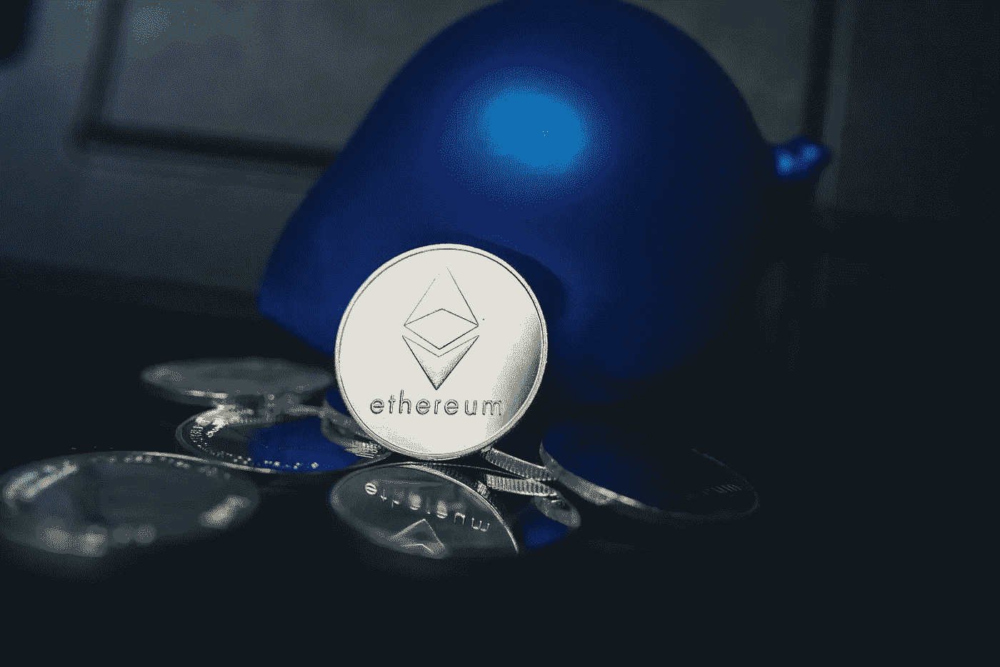

# 如何零费用开采以太坊

> 原文：<https://levelup.gitconnected.com/how-to-pay-zero-fees-mining-ethereum-d318898cfb81>

交易费正在影响小规模矿商的收入，但有一个解决方案。



[老钱](https://unsplash.com/@moneyphotos?utm_source=unsplash&utm_medium=referral&utm_content=creditCopyText)在 [Unsplash](https://unsplash.com/s/photos/ethereum?utm_source=unsplash&utm_medium=referral&utm_content=creditCopyText) 上的照片

众所周知，以太坊是我最喜欢的区块链，而且已经很久了。以太坊长期以来对区块链技术的愿景远远超出了传统货币的简单替代品。然而，以太坊有一个主要的交易费用问题，这使得使用网络成为一个麻烦和过于昂贵。开发人员试图通过更新费用计算方式来解决这个问题，但是，在 ETH 2.0 过渡的后期引入碎片链之前，任何更新都不太可能显著降低费用。

幸运的是，这个问题现在有了解决方案。最近，2miners pool 推出了一个新功能，如果矿工愿意以 Nano 支付，他们可以获得免费支付；他们还提供比特币支付，费用比以太坊支付低得多。在这篇文章中，我将讨论如何切换到使用 2miners 池，以零或低交易费获得免费的每日支出，并避免因费用而损失很大一部分收入。

# 问题是

> 假设一名矿工拥有一个 GPU，每天采矿收入为 3.00 美元。如果他在每个月底提取收入并支付 8 美元以上的费用，他已经损失了将近 10%的收入用于交易费用。这一数字非常高，许多矿商更愿意比每月领取更多的奖金。

小规模以太坊矿商尤其受到高交易费的影响，因为从他们的资金池中提取他们的收入将花费他们相对于其总收入的大量以太坊。这意味着，矿商要么必须将很大一部分支出损失在费用上，要么在支出之间等待很长时间。在伦敦硬分叉之前，许多池，如以太矿，向矿工提供免费支付，因为他们可以将交易包括在他们解决的区块中。然而，由于现在每笔交易都必须为网络支付基本费用，因此资金池不再能够提供免费的 ETH 支付。

一个资金池目前能做的最好的事情，就是允许矿商设定一个价格上限，限制他们在获得奖金时愿意支付的天然气价格。然而，由于以太坊网络长期超负荷，天然气价格可能需要几天时间才能降到 10 美元或 15 美元这样的合理阈值以下。这意味着，除非他们愿意在交易费用上花费更多的收入，否则预定的支付可能会被大大推迟。

# 解决方案

对于我们这些小型矿商来说，自从伦敦硬分叉事件发生以来，这个问题还没有一个合理的解决方案。然而，2miners pool 建立了一个新系统，只要支付金额超过 1.75 美元，就可以零费用进行日常支付。问题是你的支出不会在 ETH 中。取而代之的是，资金池会用 Nano 支付你，Nano 是一种较小的加密货币，旨在实现即时和自由交易。需要注意的是，NANO 最近把股票代号从 Nano 改成了 XNO。

一旦你用纳米支付，你可以把它换成以太币，或者卖掉它换成美元。最酷的是，将你的纳米从你选择的钱包转移到交易所出售也是免费的，因为在纳米区块链上没有任何交易费用。如果你决定将它转换成以太坊，你可能会支付一个较低的转换费，如果你继续支付以太坊交易费时，从池中收到你的收入。

由于纳米是一个小硬币，并不是每个人都愿意接受他们在纳米的采矿支出，2miners 也允许你选择比特币。比特币确实有交易费，但比以太坊的交易费少得多。

## 它是如何工作的？

当有人用 2 分钟开始采矿时，他们会设置一个支出阈值，例如 0.0005 ETH (~$2)。每天，只要一个矿工达到他们的支付阈值，这个池就把每个人开采的 ETH 发送到一个交易所，以转换成 Nano。这个联盟为转换支付少量费用，但是，这个费用相对较小，因为他们一次转换许多矿工的 ETH。现在，这个资金池可以向 Nano 中的每个人发放奖金，而矿工不会因为收费而损失任何利润。

这整个过程可以很容易地从您的 2Miners 仪表板监控，他们让您监控整个系统，包括信息，如汇率使用。他们在 UTC 时间每天中午处理一次支出，整个过程需要几个小时。这是一个非常聪明的想法。

# 如何用 Nano (XNO)支付零费用

您首先需要您的 Nano 钱包地址。钠是一种流行的纳米钱包，但许多其他钱包如 Exodus 也支持它。虽然我一般不建议使用交换钱包进行采矿，但 2miners 特别提到了使用币安、北海巨妖和 KuCoin 钱包进行支付的能力。其他 exchange 钱包可能会工作，尽管您需要确保密钥不会改变，并且应该阅读服务条款。

首先，你需要做的就是用你的 Nano 钱包地址替换你的 ETH 钱包地址。你可以继续使用你选择的采矿软件——我用的是 T-Rex——如果你还没有的话，你需要使用 2miners 池。下面是我们总是用来开始挖掘的通用终端命令，但是使用 2miners 而不是 Ethermine 作为我们的池:

```
t-rex.exe -a ethash -o stratum+tcp://eth.2miners.com:2020 -u NANO_WALLET_ADDRESS.RIG_ID -p x
```

开始采矿后，您可以访问 2Miners 网站，在搜索栏中输入您的钱包地址。这将带你到你的仪表板，在那里你可以看到你的表现，并访问统计页面，以改变你的支出阈值。如果你不想的话，你不必每天都得到报酬，但是如果你接受纳米支付，频繁的支付也没有坏处。

## 下降趋势

在 Nano 中接受支付的潜在缺点是它是一个小硬币——在撰写本文时在 CMC 上排名 237。这意味着它的交易量较低，其价值通常不如更大的硬币稳定。一些交易所不支持它，比如 Crypto.com 和比特币基地。目前，只有币安，库币和北海巨妖支持纳米转换成其他硬币。然而，Kucoin 只支持转换到 USDT，而币安和北海巨妖允许出售菲亚特和更多的转换。

# 如何获得比特币支付

与 Nano 相关的许多不利因素是由于其较小的市值和交易量。如果你更喜欢用更受欢迎的硬币支付，但仍然支付较低的费用，那么 2Miners 的比特币支付就是为你准备的。总的来说，它与我上面解释的 Nano 支付系统非常相似。

主要区别在于，当接收比特币而不是纳米时，需要支付交易费，然而，与以太坊的汽油费相比，这笔费用非常低。就像纳米支付一样，2 名矿工将获得矿工赚取的超过支付阈值的所有以太币，并将其兑换为比特币。然后，他们将所有矿工支出的成本分组，并在接受者之间平均分配。这往往会导致非常低的费用，通常低于 1.00 美元。将 ETH 转换为 BTC 所涉及的所有其他费用都包含在资金池中。

因为这个系统是如此无缝，而且费用很低，所以本质上是使用 GPU 而不是 ASIC 来挖掘比特币的一种方式。令人印象深刻的是，2 名矿工可以将开采的 ETH 转化为 BTC，而无需向矿工收取更多的钱。

## 设置

设置过程基本上与接收 Nano 支出相同。两者的区别在于，你需要使用比特币钱包地址，你的支付门槛需要设置得更高——最低 0.005 ETH。因为有一笔费用要由泳池支付，所以设置一个高于最低限额的支付门槛不失为一个好主意。然而，这是由你来决定多久，你想有赚取硬币坐在池中。

除了使用您的比特币钱包地址之外，挖矿的命令与之前相同:

```
t-rex.exe -a ethash -o stratum+tcp://eth.2miners.com:2020 -u BTC_WALLET_ADDRESS.RIG_ID -p x
```

开始采矿后，您可以在 2Miners 网站的搜索栏中输入您的钱包地址，并调整您的支出阈值。

# 包扎

很酷的是，2Miners 已经找到了一种方法来减少或消除从以太坊矿池接受支付的高昂费用。我真的很高兴他们决定同时提供纳米和比特币，因为有充分的理由根据偏好选择任何一个选项。对于精通交换加密货币和管理费用的人来说，用 Nano 支付并出售或转换成 ETH 可能是增加整体利润的一个好方法。对于那些对更稳定、市值和交易量更高的硬币感兴趣的人来说，比特币支付比以太坊支付的费用低得多。可能有很多人更喜欢直接赚取比特币，在这种情况下，这种方法的缺点很少。

# 资源

*   [2 分钟池启动指南](https://eth.2miners.com/help)
*   [霸王龙矿工](https://github.com/trexminer/T-Rex/releases)
*   [纳纳米钱包](https://natrium.io)(2 miners 推荐)
*   [2 名矿工关于纳诺/BTC 奖金的博文](https://2miners.com/blog/how-to-get-payouts-for-ethereum-mining-without-fees/)

**注意:**如果你喜欢在 Medium 上阅读我和其他人的内容，考虑使用下面的链接订阅，以支持这样的内容创作，并解锁无限的故事！

[](https://medium.com/@willmnorris/membership) [## 用我的推荐链接加入媒体-威尔·诺里斯

### 作为一个媒体会员，你的会员费的一部分会给你阅读的作家，你可以完全接触到每一个故事…

medium.com](https://medium.com/@willmnorris/membership) 

***免责声明*** *:本人不是理财顾问。本帖内容无一是理财建议。我在这里分享的一切都是个人经历和研究的结果。*