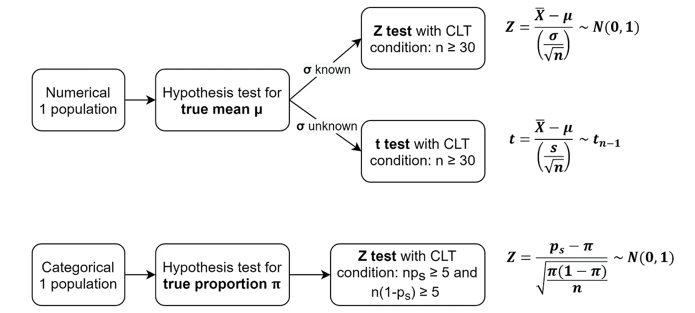
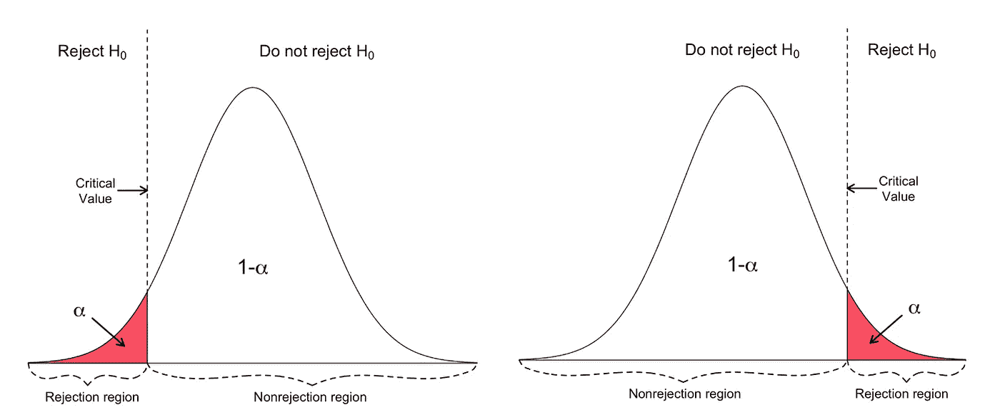
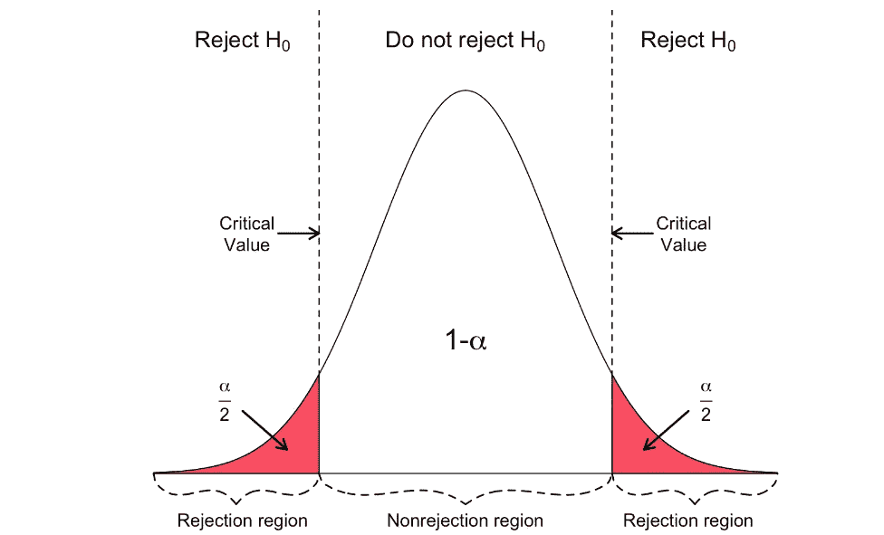
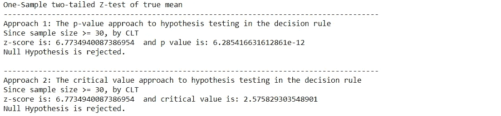
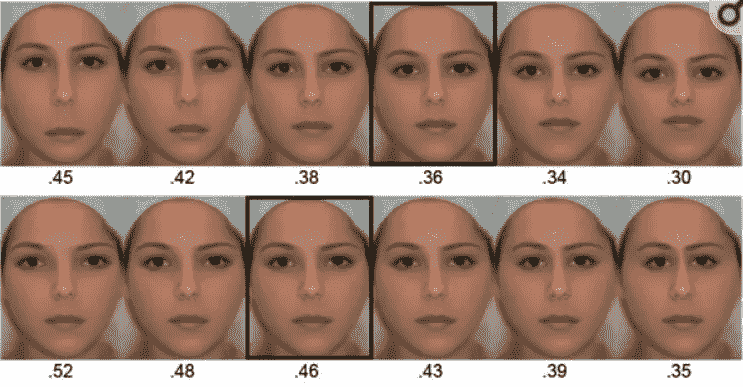
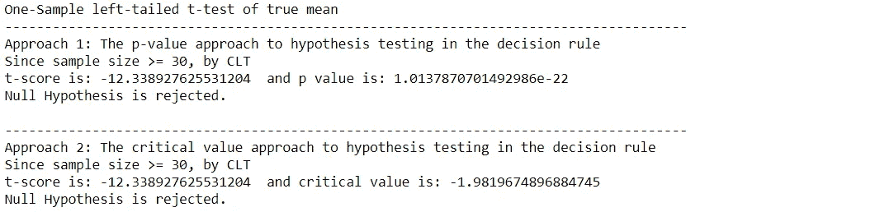
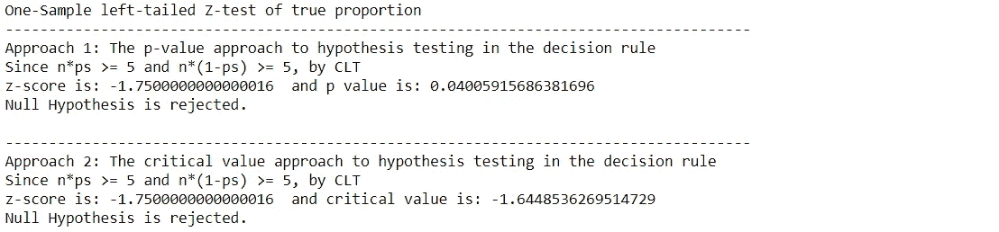

# 使用 Python 进行单样本假设检验

> 原文：<https://levelup.gitconnected.com/how-to-perform-one-sample-hypothesis-tests-with-python-308eae8789fc>

## 执行单样本假设检验的完全初学者指南(带代码！)

卢卡·布拉沃在 [Unsplash](https://unsplash.com/?utm_source=medium&utm_medium=referral) 上的照片

假设检验是一种统计检验，用于检验所做的假设，并得出关于总体的结论。在本文中，我将分享如何在不同场景下对单个人群进行单样本假设检验。

# 这五个步骤从这里开始:

1.  定义零假设(H₀)
    零假设是假设检验的起点或某人认为他有证据支持的最初主张。
    始终使用**参数**，如 **μ** 或 **σ** 或𝛑，具体取决于测试类型。
    一个零假设总是包含一个等号: **=** 、 **≤** 或 **≥。**
2.  定义替代假设(h₁)
    **与 H₀** 相反的陈述，是一个可疑的主张或发现某人想要证明的东西。
    总是使用**参数**，如 **μ** 或 **σ** 或𝛑，这取决于测试的类型。
    H₁ **语句中从来没有**有等号，它呈现出严格的不等式:**≦**或 **<** 或 **>** 。
3.  设置显著性水平(α)
    为犯 I 型错误的概率，其中
    α= p(I 型错误)= p(h₀为真时拒绝 h₀)
    预设，通常选择为 0.01，0.05，0.1。
4.  收集数据并计算测试统计

图 1:测试统计取决于不同的情况

5.构建拒绝和非拒绝区域

图 2:单尾测试——左尾和右尾[1]

图 3:双尾检验[1]

检验统计的判定规则或临界值将曲线(Z 曲线或 t 曲线)下的整个区域分为两个主要区域:微小的**拒绝区域**和巨大的**非拒绝区域**。

最后，根据检验统计量和决策规则，在α显著性水平上决定是否拒绝 H₀。

# 通过示例查看测试统计数据:

例 1:Carl Reinhold August Wunderlich 是一名医生，他率先测量了健康人的平均体温，发现体温为 98.6 华氏度。大约 150 年后，马里兰大学的研究人员评估了著名的 98.6 华氏度标准。他们测量了 T2 148 名健康男女的体温，他们的平均 T4 是 98.24923 华氏度(T5)。传统上**已知的人体温度标准偏差**约为 **0.63 华氏度**，在 **1%的显著性水平**下，是否有证据表明真实的平均人体温度**不同于 98.6 华氏度**？[2]

设 **μ** 为以 f 为单位的真实平均人体温度
给定:n = 148，x̄ = 98.24923 F，σ = 0.63 F
现在让我们按照五个步骤:
1 .H₀: μ = 98.6 F
2。H₁: μ ≠ 98.6 F(双尾检验)
3。α = 0.01
4。如图 1 所示，这是一个已知方差 **σ** 的真均值 **μ** 的单样本双尾 **Z 检验**。

结论:在 1%的显著性水平上，我们有足够的证据证明真实的平均体温不是 98.6 华氏度。

**例 2**:2010 年，研究人员用长度比例来研究个人的面部吸引力。他们已经做了 4 个不同的实验，为了简单起见，我将使用实验 1 来做测试。[3]

图 4:实验 1 [3]

实验一:研究人员修改单张人脸的长度比例，得到一系列人脸，如图 4 所示。然后，将修改后的人脸和原始人脸相互配对，以创建具有相同面部特征但不同长度比例的人脸对。参与者被展示随机的面孔对来判断哪张面孔看起来更有吸引力。从 **110** 结果来看，最有魅力的脸的**样本平均长度比**为 **0.36** ，其**标准差**为 **0.017** 。

从实验中，是否有证据表明，在 2.5%的显著性水平上，面孔吸引力的真实平均长度比小于经典的黄金比例 0.38？

设 **μ** 为脸部吸引力的真实平均长度比
给定:n = 110，x̄ = 0.36，s = 0.017
现在让我们按照五个步骤:
1 .H₀: μ ≥ 0.38
2。H₁: μ < 0.38(左尾检验)
3。α = 0.025
4。如图 1 所示，这是一个单样本左尾 t 检验**用于真实均值 **μ** 和未知方差 **σ** 。**

结论:在 2.5%的显著性水平上，我们有充分的证据证明真实平均长度比小于 0.38。

**例子 3** :假设首席执行官声称*公司的 100 万客户中至少有 80%非常满意*。同样，**的 100 位**客户也是采用简单随机抽样的方式进行调查的。结果表明**百分之七十三**非常满意。基于这些结果，我们应该接受还是拒绝 CEO 的假设？假设**显著性水平为 0.05** 。[4]

设𝛑 为非常满意客户的真实比例
给定:n = 100，pₛ= 0.73
现在让我们按照五个步骤:
1 .H₀: 𝜋 ≥ 0.8
2。H₁: 𝜋 < 0.8(左尾检验)
3。α = 0.05
4。在图 1 之后，是对真实比例𝜋.的单样本左尾 z 检验

结论:我们有足够的证据表明，非常满意的顾客的真实比例小于 0.8%，在 5%的显著性水平。

# 推荐阅读

 [## 使用 Python 进行双样本假设检验

### 执行双样本假设检验的完全初学者指南(带代码！)

levelup.gitconnected.com](/two-sample-hypothesis-tests-with-python-43e1b8c52306)  [## 卡方检验，用 Python

### 执行卡方检验的完全初学者指南(带代码！)

towardsdatascience.com](https://towardsdatascience.com/chi-square-test-with-python-d8ba98117626)  [## 用 Python 进行 ANOVA 测试

### 执行 ANOVA 测试的完全初学者指南(带代码！)

towardsdatascience.com](https://towardsdatascience.com/anova-test-with-python-cfbf4013328b)  [## 使用 Python 进行双向 ANOVA 测试

### 执行双向 ANOVA 检验的完全初学者指南(带代码！)

towardsdatascience.com](https://towardsdatascience.com/two-way-anova-test-with-python-a112e2396d78)  [## McNemar 的测试，使用 Python

### 执行麦克纳玛测试的完整初学者指南(带代码！)

towardsdatascience.com](https://towardsdatascience.com/mcnemars-test-with-python-e1bab328d15c) 

# 参考

[1]“临界值和 p 值 SOGA 地球科学部”【在线】。可用:[https://www . geo . fu-Berlin . de/en/v/soga/Basics-of-statistics/Hypothesis-Tests/Introduction-to-Hypothesis-Testing/Critical-Value-and-the-p-Value-Approach/index . html](https://www.geo.fu-berlin.de/en/v/soga/Basics-of-statistics/Hypothesis-Tests/Introduction-to-Hypothesis-Testing/Critical-Value-and-the-p-Value-Approach/index.html)

[2] P. A. Mackowiak，S. S .乏色曼和 M. M. Levine，“对 98.6 华氏度(正常体温的上限)的批判性评估，以及卡尔·赖因霍尔德·奥古斯特·温德里奇的其他遗产，”*JAMA j . Am .医学。协会*，第 268 卷，第 12 期，第 1578-1580 页，1992 年 9 月。

[3] P. M. Pallett，S. Link 和 K. Lee，“面部美容的新‘黄金’比例[，*视觉研究*，第 50 卷，第 2 期，第 149-154 页，2010 年 1 月。](https://www.ncbi.nlm.nih.gov/pmc/articles/PMC2814183/)

[4]“假设检验:比例。”【在线】。可用:[https://stattrek.com/hypothesis-test/proportion.aspx](https://stattrek.com/hypothesis-test/proportion.aspx)