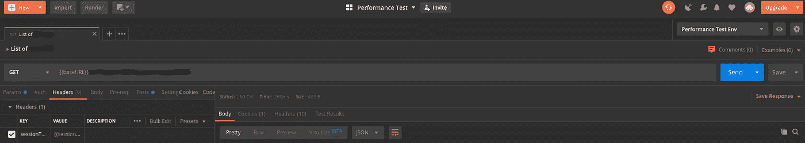
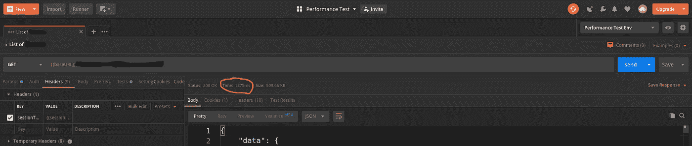
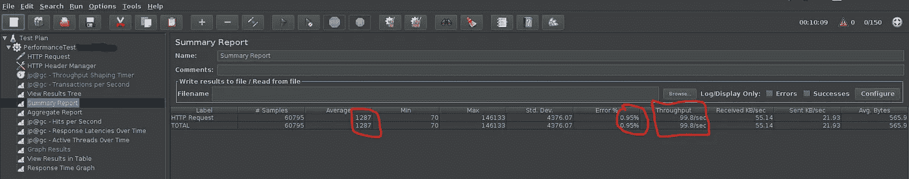
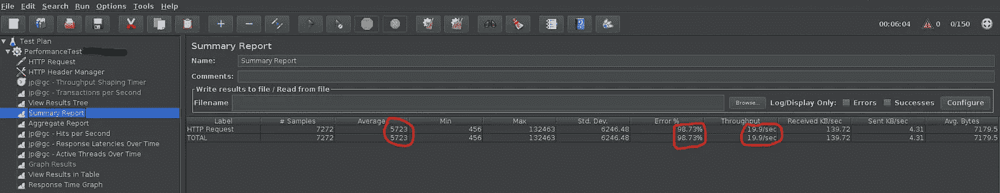
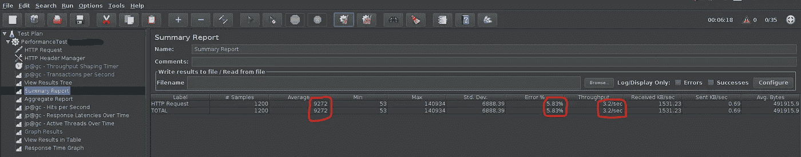
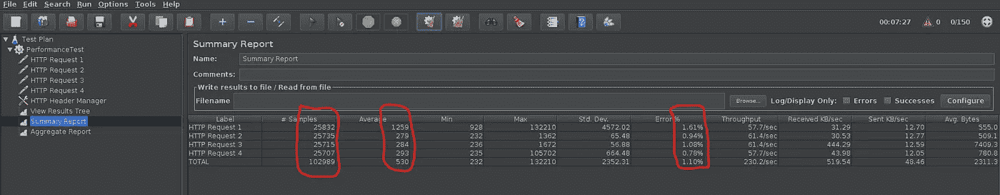

# 如何以正确的方式对 API 进行性能测试并提高可靠性

> 原文：<https://levelup.gitconnected.com/how-to-performance-test-your-api-the-right-way-and-improve-reliability-8d7ff17c0037>

图片来自 [Pixabay](https://pixabay.com/?utm_source=link-attribution&utm_medium=referral&utm_campaign=image&utm_content=24053) 的 [Clker-Free-Vector-Images](https://pixabay.com/users/Clker-Free-Vector-Images-3736/?utm_source=link-attribution&utm_medium=referral&utm_campaign=image&utm_content=24053)

已经有很多由于高流量导致[网络应用失败](https://www.cs.cmu.edu/~priya/PDL-CMU-05-109.pdf)的案例。这些主要是由于系统复杂性、不充分的测试、对系统依赖性的理解差、系统过载、资源耗尽和复杂的故障恢复例程。

我们可以采取必要的步骤来避免故障，并通过执行性能测试来更好地理解应用程序的局限性。

# 一 **性能测试简介**

性能测试[PT]有助于确定系统和应用程序在预期负载下的限制。它还有助于微调应用程序，以确保应用程序稳定、可伸缩，并以最佳的资源利用率按预期一致地执行。

性能测试是应用程序生命周期的一个非常重要的方面。如果处理得当，PT 可以通过考虑响应时间、可伸缩性、停机时间、基础设施成本等因素，确保应用程序在最佳条件下运行。PT 将有助于早期识别瓶颈，并使团队能够修复它们。

应用程序的测试是多方面的，但是可以大致分为 API 测试和应用程序测试。

1.  **API 测试** —测量响应时间，分析托管和支持应用程序的基础设施
2.  **应用测试** —测试应用对安装它们的设备的影响。例如，考虑一个打算在 iOS 或 Android 设备上使用的应用程序。需要进行完整的应用程序测试，以确保安装该应用程序不会降低设备的整体性能(如电池消耗、系统频繁挂起)

在本文中，我将讨论 API 性能测试的重要性和不同方面。

我们将使用:

*   用于 API 性能测试的 Apache JMeter
*   AWS EC2 来托管我们的应用程序
*   数据库——MongoDB 图集

# API 性能测试的重要性

*   维护应用程序性能和可伸缩性的一致性
*   帮助开发团队解决性能问题，并随着用户群的增加提供适当的资源
*   识别热点(缓慢的 API、内存泄漏)
*   帮助财务团队决定基础架构，注意估计的用户
*   根据应用程序的类型及其目标用户群，应用程序应该在没有太多延迟和绝对无停机时间的情况下满足请求。(特别是当应用程序是新进入市场时，这在用户接受应用程序方面起着重要作用)

而在发布应用之前进行 PT 有助于维系用户，提供良好的用户体验。应用程序生命周期中的 PT 通过确保应用程序的稳定性来帮助留住用户。

## 执行 API 性能测试之前需要考虑的要点

1.  测试应该通过实时模拟预期的数据来完成
2.  使用应用程序特定功能的预期用户和频率
3.  服务器部署的地理位置以及执行负载测试的位置

现在让我们看看这些因素对我们应用程序的性能意味着什么。

# 模拟数据

拥有预期的实时数据集有助于验证 API 的功能和性能。通过使用 Postman 工作流和 collection runner 功能，可以模拟实际的应用程序流，并且通过使用脚本，我们可以为将要测试的功能创建负载。

*   例如，如果一个 API 列出了所有注册用户，页面大小限制为 100，那么需要创建至少 100 个负载(注册用户)来测试这个 API
*   在空载或负载较小的情况下，PT 将不起作用
*   即使在生成不切实际的数据集的情况下，PT 也不会有效，因为解决此类数据集的问题将导致分配额外的资源，从而增加部署成本。

> **注意:**应用服务器和数据库的配置在整个测试中是相同的。

图 1:没有数据时的 API 响应。响应时间小于 300 毫秒

图 2:当预期的实时数据出现时的 API 响应。响应时间高于 1200 毫秒

图 1 和图 2 显示了对我们的 API 进行单次调用的响应时间。有数据时的响应时间= 4 *无数据时的响应时间。

## 用 JMeter 测试

我们打算实现每秒 100 个请求的吞吐量[RPS],测试进行了 10 分钟。两个测试都是在相同的服务器配置下进行的。

> **重要**:使用 JMeter GUI 设置测试脚本，使用 CLI 进行测试(Apache JMeter 推荐)。

图 3:没有数据的负载测试

图 4:用数据进行负载测试

对于没有数据的测试(图 3)，我们有不到 1%的错误率(即使这是在 JMeter 中关闭线程期间)，平均响应时间为 1300 ms，并且能够实现 100 RPS。

但是当使用数据进行测试时(图 4 ),我们有 98%的错误率，响应时间超过 5000 毫秒，并且仅实现了 15 RPS。这主要是由于数据库连接和配置的数量。API 在这里没有分页，这也导致了额外的处理时间。

我们可以通过减少线程的数量来提高数据测试的错误率，但是 RPS 会比我们预期的要少(参见图 5)。错误率从 98%提高到 6%，吞吐量为 3 RPS，平均响应时间为 9000 ms。

图 5:减少线程(虚拟用户)的数量以降低错误率

# 原料药的选择

以前面列出所有注册用户的 API 作为应用程序的主要功能/屏幕为例，如果这个 API 本身需要很长时间来加载，那么用户将很难使用这个应用程序。

选择用于测试的 API 是 API 性能测试的关键方面之一，因为每个 API 都有不同的被调用频率和复杂性。因此，为测试确定正确的 API 是非常重要的。选择 API 时要考虑的因素:

1.  被呼叫的频率
2.  性能密集型操作(如查找不同的集合)
3.  API 在加载主屏幕上的调用。

以及根据应用需要考虑的更多因素。

如果应用程序在生产中，通过收集使用统计数据，可以确定哪个功能/API 面临高流量、用户/功能花费的平均时间、哪个 API 需要很长时间来响应以及哪个功能具有增加流量的范围。

在 JMeter 中，我们创建虚拟用户[VU]，并在一段时间内对选定的 API 进行并发调用。JMeter 生成的报告有助于我们了解响应时间、错误率、实现的吞吐量(以每秒请求数衡量)。

来自 AWS 的数据让我们了解 CPU 利用率、内存消耗、服务器请求处理能力和其他一些参数。

图 6:对服务器的请求被分配给 4 个 API

在 4 个 API 中，2 个 API 返回对象列表，另外 2 个将只返回一个对象。对服务器的总请求是 102989(样本数)，平均分配给所有 4 个 API(即大约 25747 个样本)。通过这样做，我们能够实现 230 RPS 的吞吐量和 530 ms 的平均响应时间。

因此，将请求分布在不同的 API 上以模拟实时场景是很重要的。为了获得更好的结果，JMeter 测试脚本应该以这样一种方式配置，即很少的 API 具有较高的样本数，而其他 API 具有较少的样本数。这可以通过为在同一测试计划下测试的每个请求创建一个单独的线程组来实现。

# 地理因素

应用程序服务器和用户可以并且在大多数情况下将位于全球的不同地方。这将增加系统的网络延迟。

考虑到这一事实，需要解决性能范围的两个极端点(有和没有网络延迟的响应时间)。

> **注意:**对于我们的应用程序，我们使用 JMeter 链接方法进行了性能测试，该方法使用主从配置来创建大量并发用户。AWS EC2 用于托管主服务器和从服务器。

## 范围的高端

*   PT 从应用服务器所在的同一区域执行，这意味着用于执行负载测试的工具也必须部署在与应用服务器相同区域的服务器上。考虑到我们的情况，JMeter slave 和应用程序都来自同一个区域。
*   这将为用户提供最佳的性能体验。

> 示例场景:应用服务器部署在俄勒冈州地区，访问应用程序的用户也在俄勒冈州。

## 范围的低端

*   PT 是从应用服务器所在的不同地方执行的，这意味着用于执行负载测试的工具部署在离应用服务器最远的服务器上。
*   这将使用户体验到最大延迟。

> 示例场景:应用服务器部署在 Oregon 地区，访问应用程序的用户在中亚的某个地方。

解决这些地理用例有助于理解网络延迟和响应时间对实际用户的影响。

# F 发现

来自 [Pixabay](https://pixabay.com/?utm_source=link-attribution&utm_medium=referral&utm_campaign=image&utm_content=1424831) 的[图形制作团队](https://pixabay.com/users/GraphicMama-team-2641041/?utm_source=link-attribution&utm_medium=referral&utm_campaign=image&utm_content=1424831)的图片

通过性能测试，我们能够在应用程序中识别的一些问题是

1.  **索引** —当我们开始基于最初的需求构建应用程序时，索引是为了支持这些需求而建立的，而当应用程序增长时，索引并没有得到优化。这导致查询执行时间更长。
2.  **分页** —与将整个数据加载到内存中并进行处理相比，查询数据子集并对其进行处理使用的内存更少，所需的时间也更少。
3.  **缓存** —我们在查询数据库中的静态数据或不常变化的数据，引入缓存后，数据库的负载有所降低。
4.  **拥有正确的数据集** —我们没有数据，因为应用程序正在开发中，尚未发布。这就是我们能够使用 Postman 特性模拟应用程序流并生成数据的地方。
5.  **剖析 API**—这需要定期练习，因为通过利用语言提供的功能、数据结构和算法，总是有更好地处理数据的余地。
6.  **数据库连接** —池框架有助于优化连接数据库连接的利用率

# **总结**

性能测试需要在应用程序的整个生命周期中进行，以解决一旦应用程序上线、用户群增加或某些关键功能被修改时可能出现的问题。

为了获得最佳结果，必须进行多次迭代。这需要大量的时间和金钱，这取决于应用程序的类型和特定的 API 集，以通过优化的资源设置来实现期望的吞吐量。

> 不可能消除所有问题并使资源规格尽善尽美，但我们可以做到足够接近。
> 如果资源规格有误，应用程序可能会在关键时期变慢或崩溃。用户会很恼火，公司可能会赔钱和名誉。如果您超出规格并拥有过剩的容量，将导致成本和复杂性成倍增加，但这是您为降低风险所付出的代价。