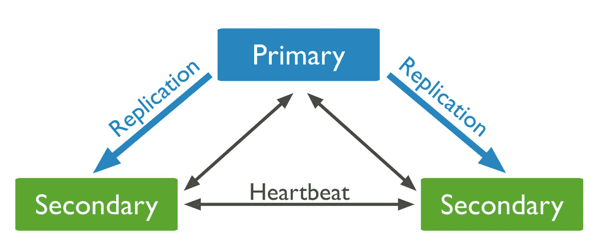

# 如何定期检查 MongoDB 副本集状态

> 原文：<https://levelup.gitconnected.com/how-to-periodically-check-mongodb-replica-set-status-c25fc36d2b9e>

## 本教程将学习如何在 MongoDB 中检查副本集状态。

[**MongoDB**](https://www.mongodb.com/) **是**一款 NoSQL 面向文档的数据库，让你轻松入门面向文档的数据库。



来自 [Mongo](https://docs.mongodb.com/manual/replication/) 的 mongo 副本集

MongoDB 的 [**副本** **集**](https://docs.mongodb.com/manual/reference/glossary/#std-term-replica-set) 状态会告诉你副本集的健康状况，每个成员中有多少副本，副本集的大小，以及有多少副本集成员可用。

本教程将学习如何在 MongoDB 中定期检查副本集状态。

# Mongo Shell

Mongo shell 客户端提供了一些助手函数来与 Mongo 服务器对话。

*   `rs.status()`:检查副本集的状态
*   `rs.initiate()`:用默认设置初始化 set
*   `rs.conf()`:获取当前配置对象
*   `rs.add(hostportstr)`:向集合中添加新成员
*   `rs.remove(hostportstr)`:从副本集中删除主机
*   `rs.printReplicationInfo()`:检查`oplog`大小和时间范围
*   `rs.printSecondaryReplicationInfo()`:检查副本集成员和复制延迟
*   `db.isMaster()`:检查谁是主要的
*   `db.hello()`:检查谁是主要的

其中最有用的是`rs.status()` 。它返回关于副本集的足够信息，并且易于记忆。另一个同样重要的功能是`rs.printSecondaryReplicationInfo()`。

以下是该函数的结果示例。

```
source: ctbx-dbup.cc:27017
 syncedTo: Fri Jan 07 2022 05:34:38 GMT+0000 (UTC)
 411 secs (0.11 hrs) behind the primary
source: ctbx-db-i1.cc:27017
 syncedTo: Fri Jan 07 2022 05:41:28 GMT+0000 (UTC)
 1 secs (0 hrs) behind the primary
source: ctbx-db-i2.cc:27017
 syncedTo: Fri Jan 07 2022 05:41:25 GMT+0000 (UTC)
 4 secs (0 hrs) behind the primary
```

我们可以看到，它为我们提供了主节点和辅助节点之间复制延迟信息的格式化报告。

> 如何定期检查复制滞后信息？

在 Mongo Shell 客户机中手动执行该函数是不可行的。让我们在下一节写一个简单的围棋程序。

# Go 程序

## 数据结构

现在，让我们首先定义保存数据的基本数据结构

*   `OpTime` : Mongo 时间戳对象
*   `ReplSetMember`:副本节点成员信息
*   `ReplSetGetStatus`:功能`rs.status()`的结果

## `GetReplSetStatus`

`GetReplSetStatus`函数返回`ReplSetGetStatus`结构。

在其实现中，它首先在管理数据库上运行`replSetGetStatus`命令，然后将结果解组到`ReplSetGetStatus`结构中并返回。

## PrintSecondaryLags

通过给定`ReplSetGetStatus`结构，`PrintSecondaryLags`函数打印每个辅助成员的滞后。

它首先遍历 ReplSetGetStatus 结构的成员数组，以找到主成员的 optime。然后，它再次遍历成员数组，以打印每个次要成员的 lag。

## 主要功能

主函数是程序的入口点。

*   它首先创建一个`mongo.Client`类型并连接到 MongoDB 数据库。
*   每隔 5 秒，它执行`GetReplSetStatus`函数来获取`ReplSetGetStatus`结构。然后它调用`PrintSecondaryLags`函数来打印每个辅助成员的滞后。
*   最后，它关闭与数据库的连接。

main 函数还处理 Ctrl+C 信号。它在退出之前关闭与数据库的连接。

完整的代码是[这里是](https://gist.github.com/jerryan999/07c5fa5ad961ada799f4359b0faa6f0f)。

如果你喜欢这篇文章，请鼓掌，让其他人也能看到。💚