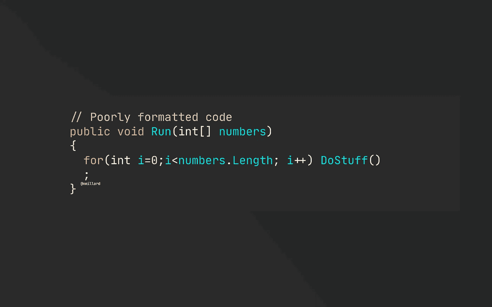
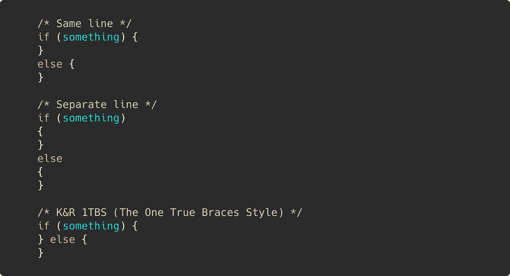

# 如何惹怒一个开发商

> 原文：<https://levelup.gitconnected.com/how-to-piss-off-a-developer-eea2069633fc>

## 编程；编排

## 谈论 If-else 与多态性是一种方式。

尼克拉斯·米勒德拍摄的图片

老实说，这很容易。基本上，任何事情都可以激怒开发者。开发者持有的“宗教”观点越多，就越容易。在我看来，没有比开发人员、程序员和工程师的文化更有害的了。

是的，当你是一个微不足道的开发人员——也就是代码猴子——一个受人尊敬的程序员，或者一个道貌岸然的工程师时，甚至会有很多讨论。当被称为“开发者”时，一些工程师非常激动。

我将列举一些真正打动开发者的东西，排名不分先后。我想它们都在不同程度上激怒了程序员，这取决于经验、技能和信仰。

## If-else 与多态性。

好家伙，当我发表我的第一篇文章[停止使用 If-Else](https://medium.com/swlh/stop-using-if-else-statements-f4d2323e6e4) 时，我不知道我走进了一个什么样的马蜂窝。这篇文章在不到几天的时间里就获得了超过 100，000 的浏览量(这在中等标准下有点像病毒一样传播)。它甚至在 Reddit 上发布了自己的仇恨帖。显然，有一种宗教围绕着用传统的分支编写糟糕的代码，比如使用 if-else。

如果你对这个主题感兴趣，你可能还想读读[用命令和处理程序](/replacing-if-else-with-commands-and-handlers-527e0abe2147)或[替换 If-else 是穷人的多态](/if-else-is-a-poor-mans-polymorphism-ab0b333b7265)。

简单地使用 OOP 对一些人来说很烦人，同样的还有[告诉初学者面向对象的思想对他们来说太复杂](/object-oriented-thinking-is-too-complex-for-you-76d59ccd3734)。

🔔[想要更多这样的文章？在这里签名。](https://nmillard.medium.com/subscribe)

## 非技术人员评估编程任务。

我的第一个项目是由一位拥有政治学硕士学位的同事评估的。我们必须在项目期间交付一个从头开发的解决方案，其中包括设置三个云环境、创建数据库模型、编写业务逻辑、后端和前端。

估计时间和资源:34–36 小时，单个开发人员。时间表是在没有咨询我什么是现实的情况下提交给客户的。

这让开发者们很恼火。

## 技术和代码文章。

文章经常挑战别人的做事方式。对我来说，收到类似“我有 20 年的经验，我总是用同样的方法做 X，而且很有效”这样的评论是很常见的。

这个人实际上是在说他/她的代码风格在过去 20 年里没有改变，他/她只是阅读这篇文章来证明他们的古老知识仍然有效——令他们失望的是，它没有。

给出建议，如编程技巧、小窍门和经验法则总是有争议的，可能会激起一些仇恨。

## 其他人的代码。

伙计，我们有时会讨厌其他开发人员的代码吗？尤其是如果我们不确定它实际上应该做什么，那时候我们真的喜欢咆哮代码有多愚蠢(掩盖我们不理解意图的事实)。除了试图理解目的，从字面上来说，一切都是潜在的浮夸者。像花括号这样的小事情放在同一行，单独的一行，或者 K&R——谷歌*花括号讨论，你会变得越来越笨。*

不同的大括号样式。

制表符与空格也是一个经典。

## 混乱节(代码审查和拉取请求)

谈到有毒文化，CR/PR 实际上是那些能揭示最糟糕情况的事件之一。

代码审查就像公开邀请别人为他们糟糕的编程能力感到羞愧。或者，至少有些人是这样对待 PRs 的。没有什么比花时间让一个特性准备好进入 master(不是 main，而是 master……)更烦人的了，结果你的代码被其他甚至没有参与实现该特性的人破坏了。

这基本上是一个公开表达你个人对其他人应该如何编写代码的看法的季节。

## 代码注释。代码-气味还是有用的？

同样，开发商对此很虔诚。您可以很容易地找到一个可以进行冗长讨论的人。众所周知，代码注释在代码审查时会吸引很多注意力，“如果你需要一个注释，你的代码不够清晰。”

荒谬的代码评论。

显然，对你的代码进行有意识的评论对任何追随你的人来说都是一个巨大的帮助。即使是你未来的自己也会感激。

我已经就此表达了我个人的观点。在这里尝试一下:[是的，您的代码需要注释](/yes-your-code-need-comments-a96348bf3fb7)。

**Nicklas Millard** 是一家增长最快的银行的软件开发工程师，致力于构建任务关键型金融服务基础设施。

此前，他是 Big4 的高级技术顾问，为商业客户和政府机构开发软件。

> [新的 YouTube 频道(@Nicklas Millard)](https://www.youtube.com/channel/UCaUy83EAkVdXsZjF3xGSvMw)
> 
> *通过*[*LinkedIn*](https://www.linkedin.com/in/nicklasmillard/)连接

# 分级编码

感谢您成为我们社区的一员！ [**订阅我们的 YouTube 频道**](https://www.youtube.com/channel/UC3v9kBR_ab4UHXXdknz8Fbg?sub_confirmation=1) 或者加入 [**Skilled.dev 编码面试课程**](https://skilled.dev/) 。

 [## 编写面试问题+获得开发工作

### 掌握编码面试的过程

技术开发](https://skilled.dev)