# 如何在 Unity 中播放音效

> 原文：<https://levelup.gitconnected.com/how-to-play-sound-effects-in-unity-6a122bb32970>

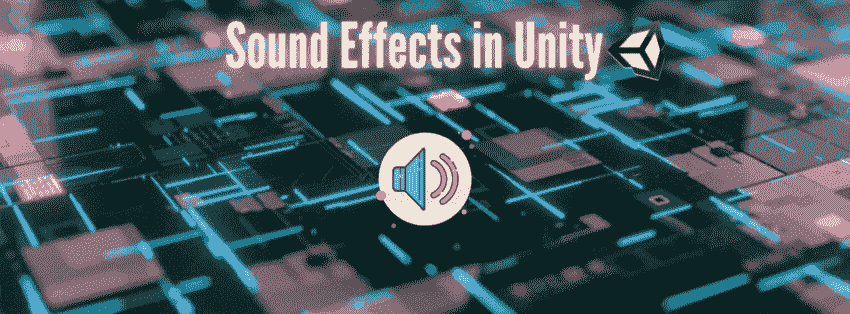

在上一篇文章中，我谈到了[如何给你的游戏](https://medium.com/codex/immersion-starts-with-sound-6f51eefbd9e7)添加背景音乐。在这篇文章中，你将学习如何给你的游戏添加音效！

# 播放声音效果

**目标**:增加一个响应玩家动作/按键的音效。在这个例子中，我将展示如何在玩家开火或按下空格键时播放激光音效。

**流程**:我将介绍两种实现方式:
∘ [如何直接从音源组件中的预设剪辑播放声音](#54a9)
∘ [如何通过代码设置播放声音](#e90d)

## 如何在音频源组件中直接播放预设剪辑中的声音

1.  将 AudioSource 组件添加到对象中。

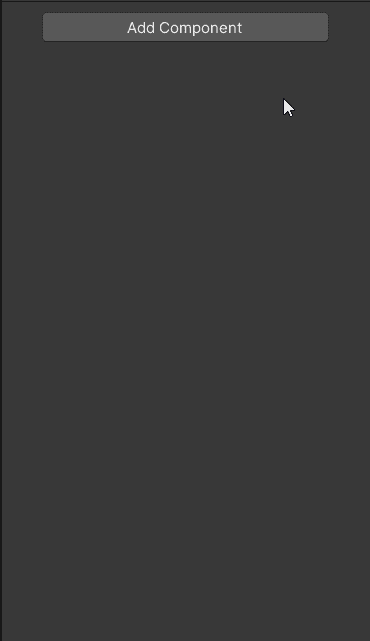

2.将所需的音频剪辑从检查器的音频源组件拖放到相应的位置。

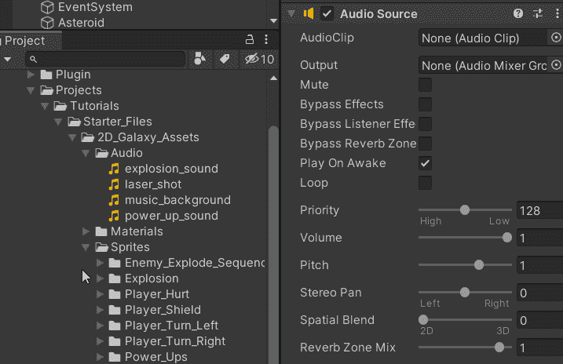

3.确保没有选中“唤醒时播放”和“循环播放”。

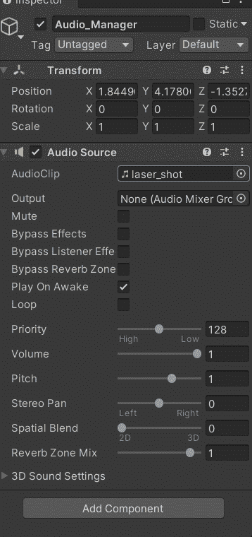

4.创建一个变量来引用音频源。

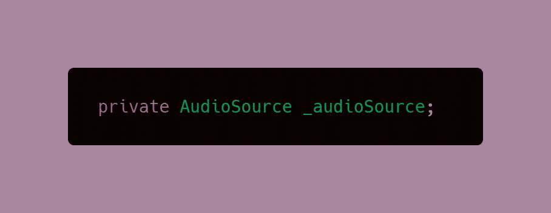

4.找到音频源组件。您可以直接找到组件，而不必访问对象，只要这些代码是在附加到具有音频的对象的脚本上编写的。

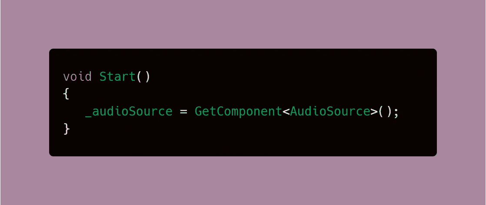

5.对组件进行空检查。这是一个最佳实践，只要您在试图执行任何涉及到它的逻辑之前获得一个组件以确保它确实被找到了。

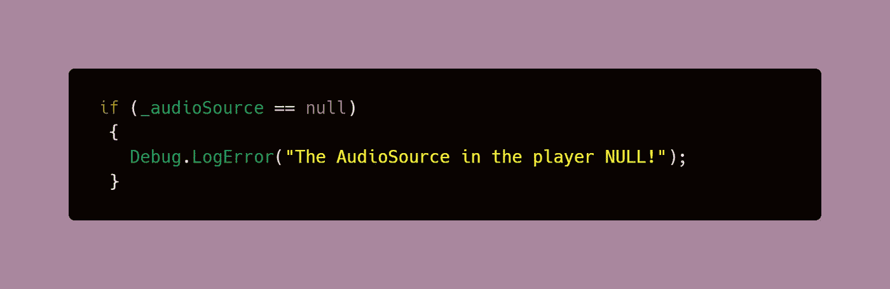

6.现在，您可以从音频源访问剪辑，并按下按钮播放它。

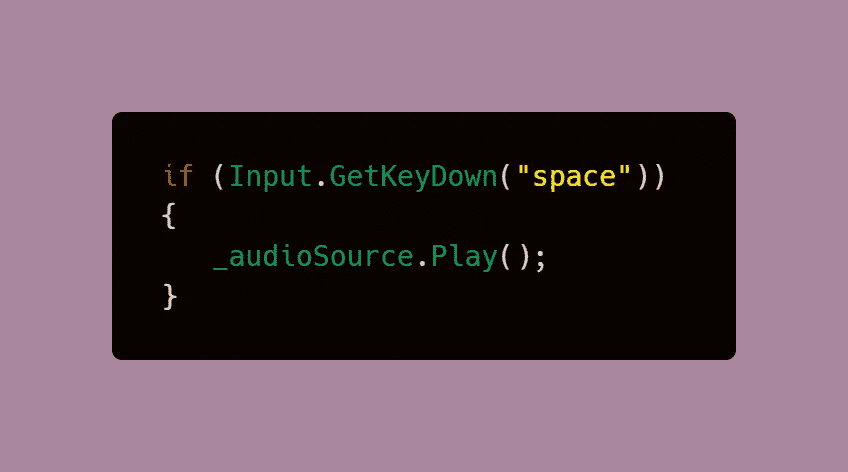

## 如何通过代码设置来播放声音剪辑

此过程允许您通过代码设定音频片段，而不是通过音频源组件中的检查器预先设定。当需要在同一次执行中使用不同的片段时，这很有用。例如，如果玩家要把他们的武器换成别的东西，就要改变激光的声音。

1.  添加音频源组件。但是，与前面的过程相反，组件的 Clip 部分现在将保持为空。

2.为音频源创建一个全局变量，也为音频片段创建一个全局变量。音频剪辑变量将是一个 SerializeField，它将在检查器中分配。

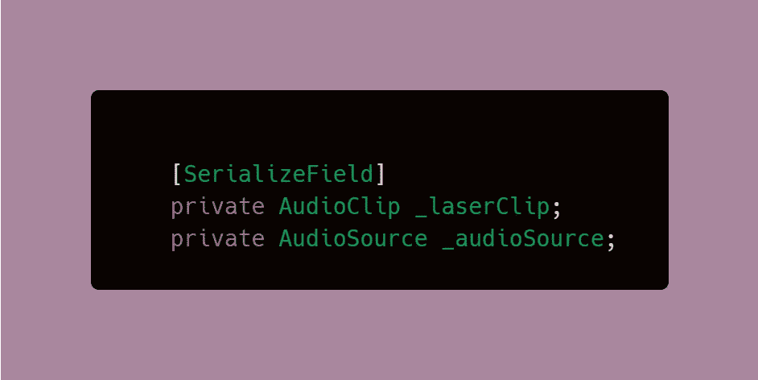

3.在**新创建的变量**中设置音频剪辑，该变量现在在检查器中可见。

> **注意**:此**不**进入**音源组件**。

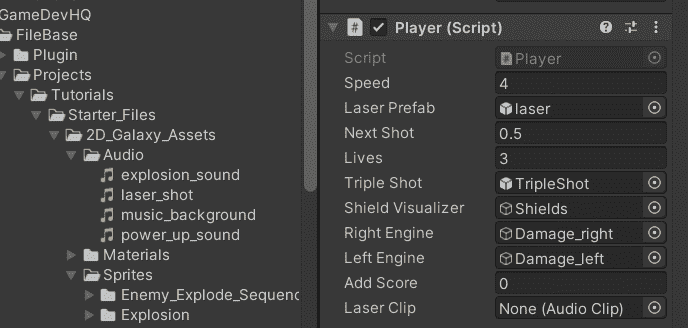

4.在“音频源”组件中，确保没有选中“唤醒时播放”和“循环播放”。

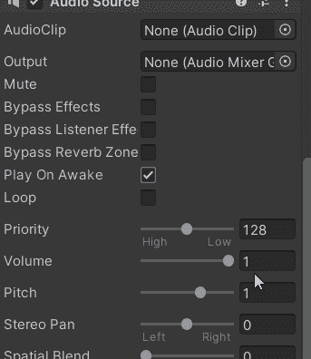

5.找到音频源组件。您可以直接找到组件，而不必访问对象，只要这些代码是在附加到具有音频的对象的脚本上编写的。

6.对组件进行空检查。这是一个最佳实践，只要您在试图执行任何涉及组件的逻辑之前，确保确实找到了组件。

7.当您进行空值检查时，您也可以借此机会设置音频剪辑。如果找到该组件，请使用您在步骤 2 中创建的引用来设定音频剪辑。

> **注意**:通过使用代码来设置剪辑，如果您有多个音频剪辑要交换，可以通过 if-else 语句，或者更好的是 switch cases 或数组，以相同的逻辑来完成。

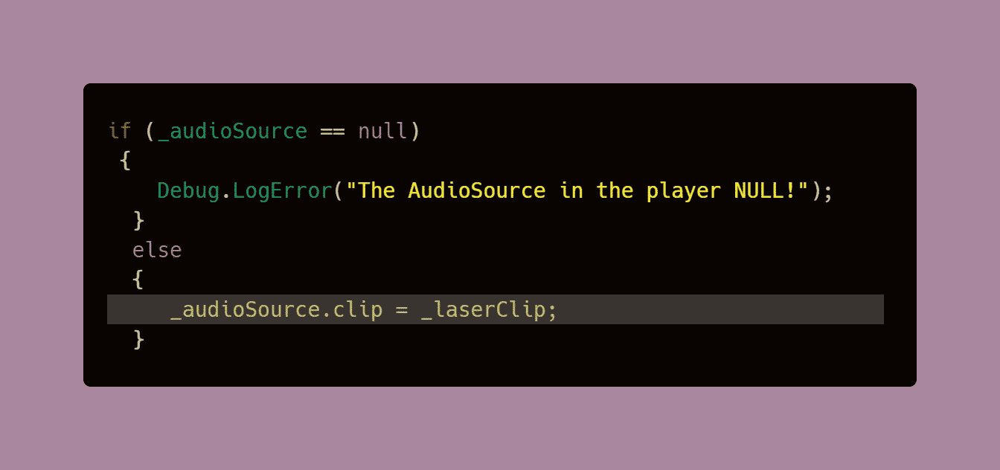

8.现在，你可以按下按钮播放音频。

> **注意**:在我的代码中，播放音频是为了响应玩家发射他们的激光武器。由于光的传播速度比声音快，所以该语句放在激光对象的实例化之后。

**我的样本代码:**

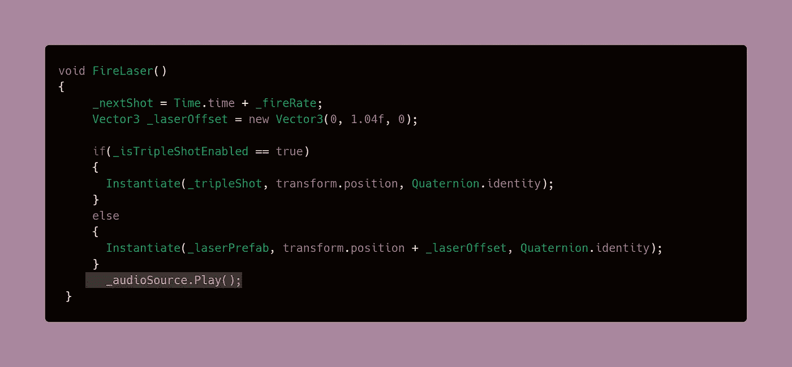

## **结果**

在下一篇文章中，我将介绍如何构建和测试你的 Unity 游戏！