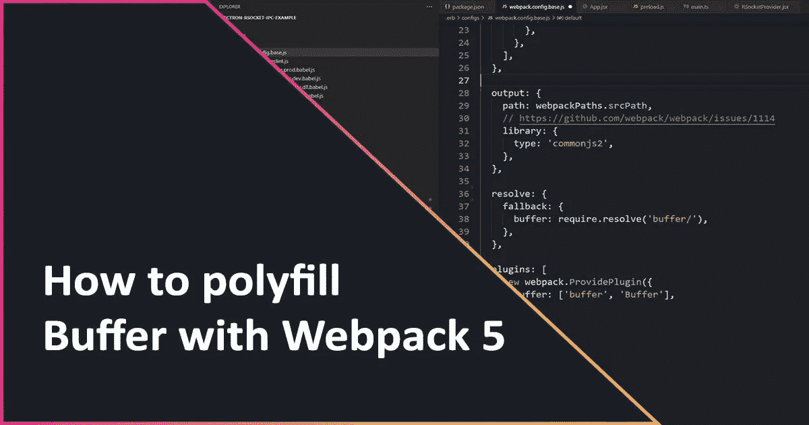

# 如何用 Webpack 5 填充缓冲液

> 原文：<https://levelup.gitconnected.com/how-to-polyfill-buffer-with-webpack-5-1b6559ab87b8>



[Buffer](https://nodejs.org/api/buffer.html) 是一个核心 Node.js API，在处理二进制数据时非常有用。本文将简要概述如何使用 Webpack 5 为浏览器环境填充缓冲 API。

# 为什么我们需要填充缓冲液？

当在浏览器环境的上下文中工作时，Node.js APIs，比如 [Buffer](https://nodejs.org/api/buffer.html) ，是不可用的。浏览器环境中有时也有类似的 API。但是，您可能正在使用的第三方库和代码的作者必须用浏览器版本替换他们正在使用的 Node.js 特定 API，或者提供另一种机制来提供您的 API 以满足库的需求。

不幸的是，库作者通常不考虑浏览器环境，或者他们的库可能并不打算在浏览器环境中使用。在这些情况下，通常使用 Webpack 之类的构建工具来替换库使用的 Node.js 特定 API，替换为提供浏览器环境兼容 API 的版本，称为 [polyfilling](https://developer.mozilla.org/en-US/docs/Glossary/Polyfill) 。

# Webpack v5

在 Webpack v5 之前，许多 Node.js APIs 的多填充是自动执行的。在 v5 中， [Webpack 将不再自动填充 node . js API](https://webpack.js.org/blog/2020-10-10-webpack-5-release/#automatic-nodejs-polyfills-removed)。

# 解决问题

## 安装聚合填料

首先，我们需要安装或提供一个浏览器兼容的缓冲区实现。对于我的需求，我发现 [feross/buffer](https://www.npmjs.com/package/buffer) 包是合适的。

下面的命令将把`buffer`安装为`dev`的依赖项。

```
npm install -D buffer
```

## 配置 Webpack 回退

Webpack `resolve.fallback`配置选项允许我们配置 Webpack，以利用提供的包作为 API 的“后备”,这些 API 在 Webpack 构建的目标环境(即浏览器)中不是本地可用的。

在`buffer/`结尾的`/`可能对你来说很奇怪，就像我一样。然而，由于 Node.js 模块查找算法的工作方式，它被`[buffer](https://www.npmjs.com/package/buffer#usage)` [文档](https://www.npmjs.com/package/buffer#usage)推荐。

> *要显式要求此模块，请使用 require('buffer/')，它告诉 node.js 模块查找算法(也由 browserify 使用)使用名为 buffer 的 npm 模块，而不是名为 buffer 的 node.js 核心模块！*

## 配置网络包`ProvidePlugin`

Webpack `ProvidePlugin`提供了一种注入模块/值的机制，作为全局变量的替换/API，否则这些变量将是未定义的。例如，在 Node.js 中，您可以利用全局名称空间中的`Buffer`类，而无需任何`import`或`require`语句。“Buffer”类在浏览器环境中是“未定义的”,并且没有`ProvidePlugin.`

我们可以通过 Webpack 配置`plugins`数组提供一个兼容的`Buffer`类实现来克服这个问题。

提供的数组(`['buffer', 'Buffer']`)通知`webpack.ProvidePlugin`将`Buffer`的全局值设置为从`buffer`包导出的`Buffer`。

例如:

`const Buffer = require(‘buffer/’).Buffer;`

## 一起

下面是使用 Webpack v5 聚合填充`Buffer`类的 Webpack 配置相关部分的组合示例。

# 结论

现在您已经配置了 Webpack 来全局填充`Buffer`类，您应该能够引用并创建`Buffer`类的实例，而不会出现讨厌的`Uncaught ReferenceError: Buffer is not defined`错误。此外，您的“捆绑包”中包含的库中对`Buffer`的任何引用现在也应该引用提供的 polyfill。

最后，不要忘记让我在下面的评论中(或者在 Twitter 上)知道这个教程是否对你有所帮助！

【https://viglucci.io/how-to-polyfill-buffer-with-webpack-5】原载于。