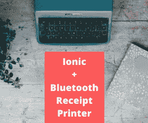
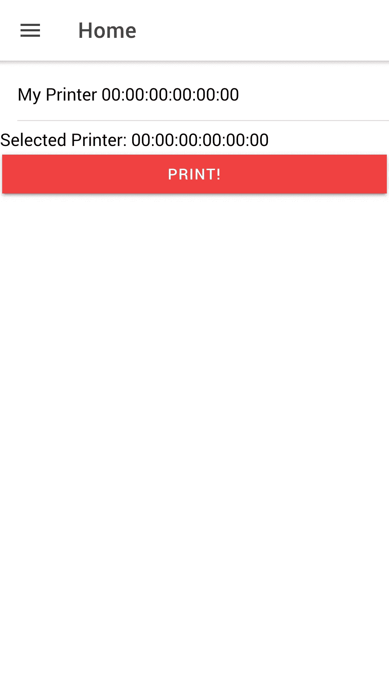

# 如何使用 Ionic 应用程序在蓝牙打印机上打印

> 原文：<https://levelup.gitconnected.com/how-to-print-on-a-bluetooth-printer-using-your-ionic-application-ceabc45abf75>



Ionic +蓝牙收据打印机

你有一个蓝牙收据打印机，你想知道，我如何使用我的 Ionic 应用程序？

我搜遍了万维网，寻找如何不走运地做到这一点的答案。这里的方法适用于几乎所有类型的蓝牙收据打印机。

我假设你是 Ionic 开发人员，所以我将跳过安装 Ionic 的部分。如果你想知道如何安装 Ionic，我推荐你去 Ionic 网站[看看。](https://www.ionicframework.com)

**请注意:**在撰写本文时，这应该对 Ionic 4 和 Ionic 5 都有效。

## **启动和设置**

1.  开始一个离子项目

```
ionic start myPrintApp
```

2.选择角度

```
**Pick a framework! 😁**Please select the JavaScript framework to use for your new app. To bypass thisprompt next time, supply a value for the --type option.? **Framework:** (Use arrow keys)❯ Angular | https://angular.ioReact   | https://reactjs.org
```

选择您想要的任何模板

```
? **Framework:** Angular**Let's pick the perfect starter template! 💪**Starter templates are ready-to-go Ionic apps that come packed with everything you need to build yourapp. To bypass this prompt next time, supply template, the second argument to ionic start.? **Starter template:** (Use arrow keys)❯ tabs         | A starting project with a simple tabbed interfacesidemenu     | A starting project with a side menu with navigation in the content areablank        | A blank starter projectmy-first-app | An example application that builds a camera with galleryconference   | A kitchen-sink application that shows off all Ionic has to offer
```

3.创建应用程序后，`cd`进入目录并创建新服务。姑且称之为‘打印’:

```
ionic g service services/print
```

4.您还需要安装科尔多瓦蓝牙系列。

运行此行:

```
ionic cordova plugin add cordova-plugin-bluetooth-serial
```

….然后这一行:

```
npm install @ionic-native/bluetooth-serial
```

像这样将`BluetoothSerial` 添加到`app.module.ts`的提供者中(我添加的内容以**粗体显示**):

```
import {BluetoothSerial} from '@ionic-native/bluetooth-serial/ngx';@NgModule({
  declarations: [AppComponent],
  entryComponents: [],
  imports: [...],
  providers: [
    StatusBar,
    SplashScreen,
    { provide: RouteReuseStrategy, useClass: IonicRouteStrategy },
    **BluetoothSerial**
  ],
  bootstrap: [AppComponent]
```

设置完成！现在进入下一部分，在你的“打印”服务中编写代码来处理所有的蓝牙连接。

## **准备您的“打印”服务**

1.  打开您的 IDE 并找到“打印”服务文件，它应该在 service 文件夹中。这里您要做的是首先将蓝牙串口导入到您的代码中:

```
import { BluetoothSerial } from '@ionic-native/bluetooth-serial/ngx';
```

您还需要在您的构造函数中添加`BluetoothSerial`，如下所示:

```
constructor(public btSerial:BluetoothSerial){}
```

2.接下来，您需要创建 4 个不同的函数来:

> a.搜索蓝牙打印机
> 
> b.连接到蓝牙打印机
> 
> c.向蓝牙打印机发送数据
> 
> d.断开蓝牙打印机

```
searchBluetoothPrinter()
{//This will return a list of bluetooth devices return this.btSerial.list(); 
}connectToBluetoothPrinter(macAddress)
{
//This will connect to bluetooth printer via the mac address provided return this.btSerial.connect(macAddress)}disconnectBluetoothPrinter()
{
//This will disconnect the current bluetooth connection return this.btSerial.disconnect();}//macAddress->the device's mac address 
//data_string-> string to be printersendToBluetoothPrinter(macAddress,data_string)
{
   //1\. Try connecting to bluetooth printer this.connectToBluetoothPrinter(macAddress)
   .subscribe(_=>{ //2\. Connected successfully
      this.btSerial.write(data_string)
      .then(_=>{ //3\. Print successful
       //If you want to tell user print is successful,
       //handle it here //4\. IMPORTANT! Disconnect bluetooth after printing this.disconnectBluetoothPrinter() },err=>{ //If there is an error printing to bluetooth printer
         //handle it here }) },err=>{

     //If there is an error connecting to bluetooth printer
     //handle it here })}
```

3.在将上述四个功能都插入到您的“打印”服务中之后，下一步就是对其进行测试。我建议在您的 home.page.ts 和 home.page.ts 上试用一下，看看效果如何:

在 home.page.ts 中，增加了**粗体**的行:

```
import { Component } from '@angular/core';**import { PrintService } from '../service/print/print.service';**@Component({ selector: 'app-home', templateUrl: 'home.page.html', styleUrls: ['home.page.scss'],})export class HomePage { **bluetoothList:any=[];
  selectedPrinter:any;** constructor(**private print:PrintService**) {} **//This will list all of your bluetooth devices
    listPrinter() { 
      this.print.searchBluetoothPrinter()
       .then(resp=>{

 *//List of bluetooth device list*        this.bluetoothList=resp;** **});****}** **//This will store selected bluetooth device mac address
selectPrinter(macAddress)
{
  *//Selected printer macAddress stored here* this.selectedPrinter=macAddress;
}**  **//This will print
printStuff()
{** ***//The text that you want to print*   var myText="Hello hello hello \n\n\n This is a test \n\n\n";** **this.print.sendToBluetoothPrinter(this.selectedPrinter,myText);
}**}
```

home.page.html 内部`<ion-content>`

```
<ion-list><ion-item *ngFor="let item of bluetoothList" (click)="selectPrinter(item.id)"> {{item.name}} {{item.id}}</ion-item></ion-list><div> Selected Printer: {{selectedPrinter}}</div><ion-button expand="full" color="danger" *ngIf='selectedPrinter' (click)="printStuff()">PRINT!</ion-button>
```

您的应用程序应该如下所示:



你的 home.page.html 应该是什么样子

4.显然，您不能在浏览器中尝试这段代码。你需要把这变成一个完整的 Android 或 iOS 应用程序。或者，您也可以使用 Ionic DevApp。要使用 Ionic DevApp，请确保您的设备上安装了 [Ionic DevApp](https://ionicframework.com/docs/appflow/devapp) 。要使用 Ionic DevApp 运行它，请执行以下命令，并确保您的设备和开发计算机在同一个网络上:

```
ionic serve --devapp
```

5.你现在需要做的就是选择你的打印机，然后按“打印”。你应该可以在你的蓝牙打印机上打印。

给你。这就是你如何用 Ionic 编写一个通过蓝牙打印机打印的应用程序。要了解更多信息，请查看我的 Github(尽管是一个过时的版本)，那里有这段代码的存储库:

[](http://github.com/razmans) [## 拉兹曼斯-概述

### 在 GitHub 上注册你自己的个人资料，这是托管代码、管理项目和构建软件的最佳地方…

github.com](http://github.com/razmans) 

* *注意:更新后在 app.module.ts 中添加了**提供程序，我忽略了这一点，对此表示歉意。特别感谢[伊曼纽·贝内代蒂](https://medium.com/u/303db23a7989?source=post_page-----ceabc45abf75--------------------------------)指出这一点。作为对她第二点的回应，home.page.html 境内的打印机列表在上面的*ngFor 中。**