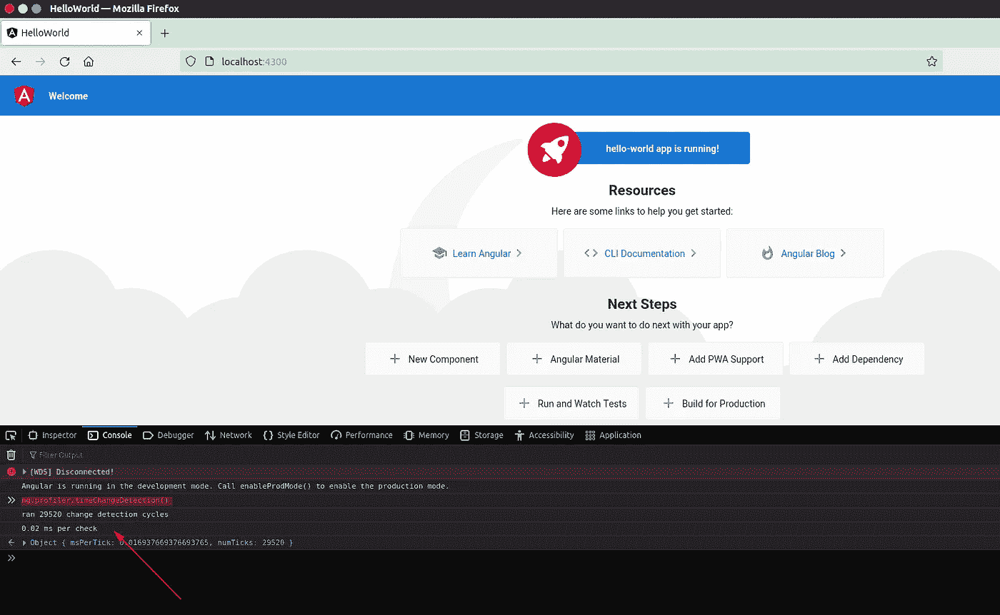
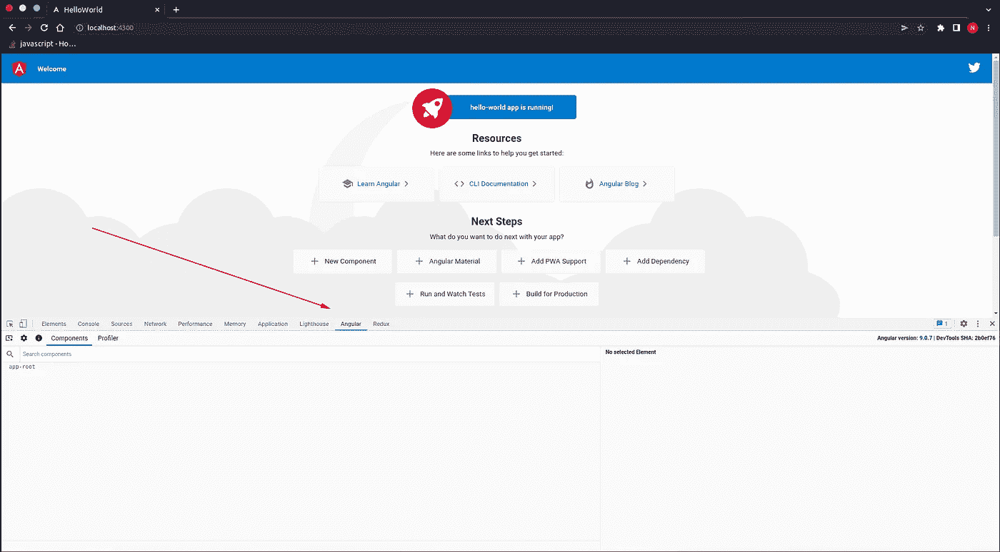
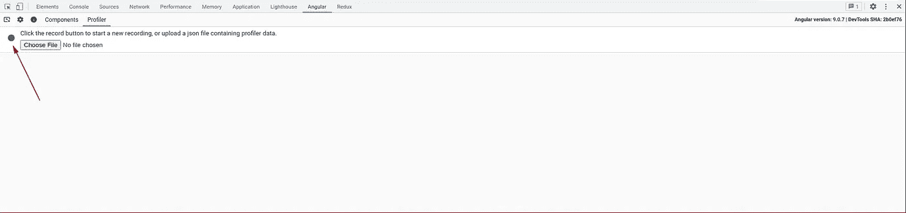
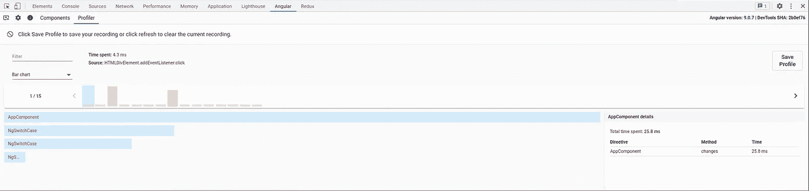
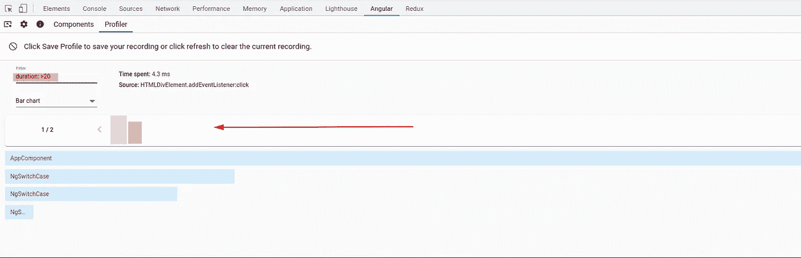
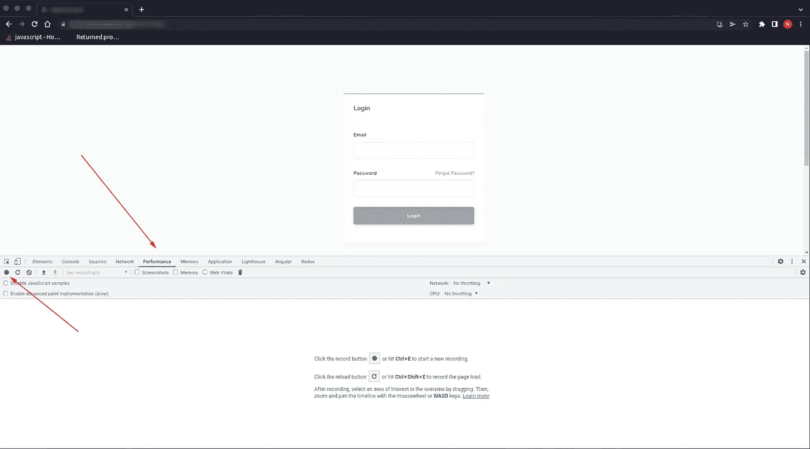
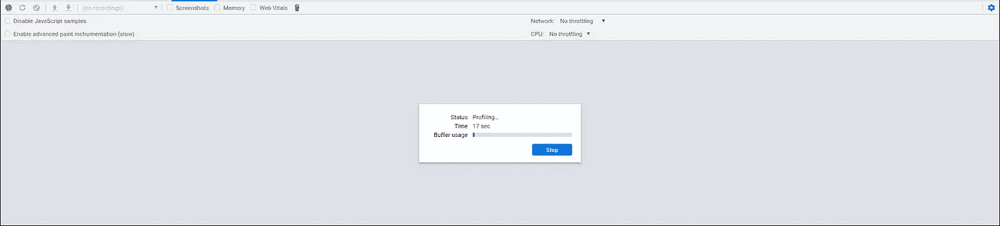
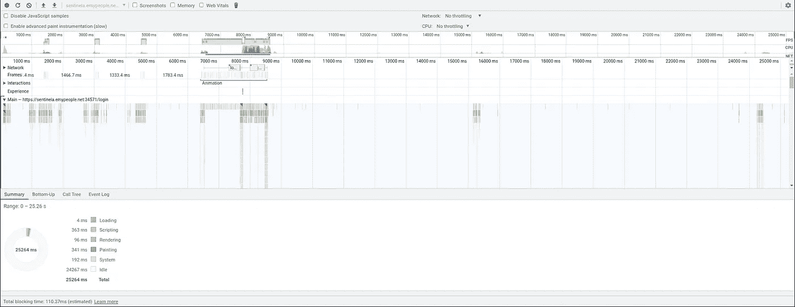
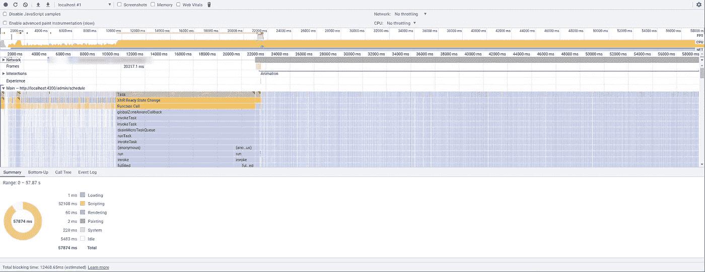

# 如何分析 Angular 应用程序的运行时性能

> 原文：<https://levelup.gitconnected.com/how-to-profile-the-runtime-performance-of-an-angular-app-2c37f87b0100>

## 性能问题正在恶化。😠

就像内裤里有碎玻璃被塞进飞机座位一样令人恼火。

尤其是当你不知道是什么引起的时候。

…

那么，如何分析 Angular 应用程序，并发现是什么导致运行时性能缓慢呢？

你从哪里开始？

一旦发现性能问题，如何解决呢？

我写了一篇关于如何修复角度性能问题的大文章，但是在修复性能问题之前，你首先必须找到角度运行时性能问题。

那我们从哪里开始挖？⛏ ⛏ ⛏

# 什么导致了角度运行时性能问题？

一个不可忽视的重要考虑是，你的 Angular app 慢并不意味着慢是 Angular 框架造成的。

我见过 Angular 应用程序运行时出现性能问题，这是由导入 Angular 应用程序的第三方库引起的。当 JavaScript 线程被后台处理、错误的 HTTP 请求、不正确的 Firebase 查询和一大堆其他**配置不良的任务**弄得不堪重负时，你的 Angular 应用程序就无法响应了。当您的 Angular 应用程序在处理能力有限、连接性差的移动设备上使用时，这些类型的性能问题只会更加突出。

同时，运行时性能问题可能是由 Angular 框架引起的。并且需要调整角度框架以获得最佳性能，例如[改进变化检测](https://danielk.tech/home/heres-how-you-can-improve-angular-change-detection-performance)。

但是首先，让我们学习如何使用分析工具来找到 Angular 应用程序中运行时性能问题的原因。

# 启用和使用 Angular 调试工具来分析变更检测性能

Angular 中一个常见的运行时弱点是用于在模板文件和代码之间绑定数据的变化检测机制。

弱点？嗯……也许更像是一个很酷的功能，我们太多的人都善于误用它。🤓

那么 profile Angular 的变化检测机制如何发现它是否是运行时性能问题的原因呢？

第一步，打开`main.ts`文件，启用[内置角度调试工具](https://angular.io/api/platform-browser/enableDebugTools#description)。

```
import { ApplicationRef, enableProdMode } from '@angular/core';
import { enableDebugTools } from '@angular/platform-browser';
import { platformBrowserDynamic } from '@angular/platform-browser-dynamic';

import { AppModule } from './app/app.module';
import { environment } from './environments/environment';

if (environment.production) {
  enableProdMode();
}

platformBrowserDynamic().bootstrapModule(AppModule)
  .then(moduleRef => {
    const applicationRef = moduleRef.injector.get(ApplicationRef);
    const componentRef = applicationRef.components[0];
    enableDebugTools(componentRef);
  })
  .catch(err => console.error(err));
```

接下来，我们将使用 serve 命令运行 Angular 应用程序。

```
ng serve --open
```

在浏览器中启动并加载后，我们将打开 web developer 工具的控制台选项卡。在控制台内部，我们将运行以下命令来进行一些更改检测分析。

```
ng.profiler.timeChangeDetection()
```



但是这个功能到底是做什么的呢？

这有点神秘，因为没有关于这个函数的官方文档。但是从目前为止我们所知道的最好的情况来看**，它告诉 Angular 的变化检测运行大约 500ms，然后打印变化检测运行了多少次，变化检测花费的平均时间**。

如果您怀疑 Angular 应用程序中的特定页面导致了变化检测过载，那么这是一种快速而肮脏的方法来进行一些变化检测分析。

但是，如果您想要一些更高级的变更检测监控呢？

或者更好的方法来描述 Angular 应用程序的运行时性能？

这就是 Angular DevTools 扩展真正闪光的地方。

# 如何使用 [Angular DevTools](https://chrome.google.com/webstore/detail/angular-devtools/ienfalfjdbdpebioblfackkekamfmbnh) 扩展来分析你的 Angular 应用

你知道角框架有它自己的延伸吗？


它是为 Chrome 浏览器创建的，并添加了特定的角度调试和分析功能。这是一个非常酷的工具，帮助我摆脱了很多困难。

要开始用这个很酷的扩展来分析你的 Angular 应用的性能，你必须首先[去 Chrome 网上商店下载它](https://chrome.google.com/webstore/detail/angular-devtools/ienfalfjdbdpebioblfackkekamfmbnh)。

安装完成后，打开你的开发者工具，你应该会看到一个名为 Angular 的新标签。**如果您没有看到它**单击右边的 3 个点，然后单击更多工具，您应该会在列表中看到它。



有两种工具可以使用。

*   组件(用于查看角度组件的渲染结构)。
*   轮廓仪(用于测量角度变化检测)。

我们对第二种工具感兴趣。

您需要单击 Profiler，然后单击 record circle 开始记录和分析角度变化检测。



当它分析你的应用程序的性能时，你需要点击你的角度应用程序运行缓慢的地方。

完成后，单击 stop 按钮，您应该会看到类似下图的图形。



图表上的每个条形代表一个变化检测周期。

短的绿色条意味着变更检测是快速且性能良好的。而黄色和红色状态栏表明变更检测花费的时间比预期的要长，并表明存在性能问题。

您可以通过单击其中一个条来进一步调查，以发现变化检测是从哪里开始的以及缓慢的可能原因。您还可以过滤结果，找出最慢的结果，并只调查那些结果。



# 使用 Chrome 的性能分析工具

如果您已经尝试使用上面的工具，但仍然没有找到性能问题的根源，那么是时候重新使用一个强大的工具了。

…请击鼓…

🥁 🥁 🥁

…

🥁 🥁 🥁

…还有…

…欢迎来到…

强大的 Chrome Profiler——一个我又爱又鄙视的工具。

如果你不得不使用 Chrome profiler 来分析你的 Angular 应用，那么你很可能会遇到一个比 Angular 框架更复杂的运行时性能问题。

第一步是在 Chrome 浏览器中加载 Angular 应用程序。接下来准备触发您正在经历的性能问题。

然后你会想要打开 Chrome 的开发者工具并选择*性能*标签。

当您准备好开始分析 Angular 应用程序的性能时，请点按“录制”按钮。



当你与它交互时，它将开始分析你的角度应用。现在是触发应用程序中任何性能错误的时候了。



完成后，点击*停止*按钮，你会看到各种显示你的应用程序运行情况的图表。

解释各种图表以及如何阅读它们超出了本文的范围。另外，Minko 制作了一个很棒的视频，深入解释了*性能*工具和火焰图等(见下文)。

然而，这里有一些提示。

*   当使用 Chrome 的性能工具分析 Angular 应用程序时，您会希望在图形顶部寻找任何红色条。
*   点击这些图标，了解一项任务破坏应用性能的时间。
*   您还可以深入到*主*图中的各种函数调用等。
*   当检查一个功能或任务时，请注意浏览器底部的 Summary 选项卡，看看它是否能告诉您关于发起者的更多信息。

性能图表会有很大变化，所以你可能会想知道其他 Angular 应用程序的表现如何，它们会生成什么样的性能图表？

嗯，这里有一个性能良好的 Angular 应用程序的快照。



和一个由于第三方库而表现不佳的快照。



# 我应该使用哪个工具来描述我的角度应用？

就个人而言，我认为 Angular Devtools 扩展是一个非常好的工具。

当我需要深入研究角度性能问题时，这是我使用的第一个工具。

除此之外，Chrome 的剖析工具对于更深入的挖掘也很方便。

你喜欢用哪种工具？你为什么喜欢它？

请在下面的评论中告诉我。

如果你觉得这篇文章有用，请击碎它👏 👏 👏按钮！💥

**关注我:** [GitHub](https://github.com/dkreider) ，[媒体](https://dkreider.medium.com/)，[个人博客](https://danielk.tech/)


*原载于*[*https://danielk . tech*](https://danielk.tech/home/angular-how-to-profile-runtime-performance)*。*