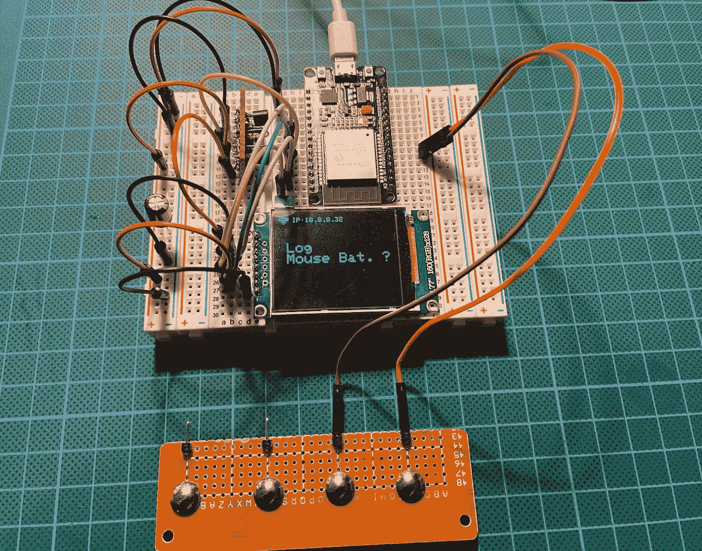
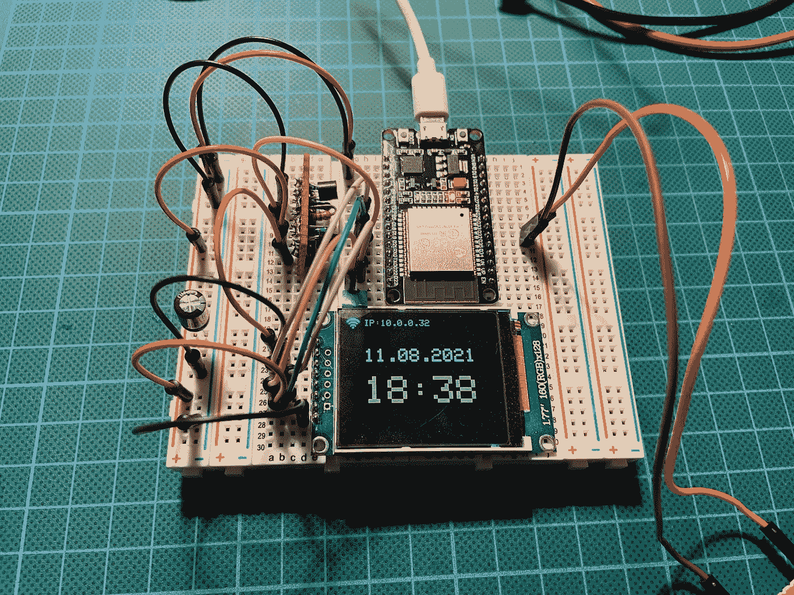

# 如何为 Arduino 项目设计两个按钮的步骤菜单

> 原文：<https://levelup.gitconnected.com/how-to-program-a-two-button-step-menu-for-arduino-projects-ab7305a16492>

## 只需轻按一个按钮，即可轻松记录任何重复发生的事件

照片由[作者](https://medium.com/@the_tech_maker)拍摄

我有很多经常需要更换电池或给电池充电的设备和小配件。为了跟踪电池寿命，我开始在一张纸上写下日期和时间，大多数时候我会忘记或找不到这张纸。然后我试着在电脑上用 txt 文件记录时间，但是我也忘记了。

所以我决定用一个 ESP32 构建一个数据记录器，用 Arduino IDE 和一个小 TFT 显示器编程。我的想法是在我的桌子上放一个小装置，当更换电池时，我可以按下按钮。
然后，日志记录器使用 Wifi 连接到我的网络服务器，并将日志事件的日期和时间写入一个. txt 文件。这让我可以完整地统计我的小工具的电池寿命，而不用手动记录任何东西

# 我需要多少个按钮？

我开始记录三种电池寿命，一种是我的电脑鼠标，一种是屋外的气象站，一种是客厅里的时钟。首先，我评估了我是否需要两个或三个按钮来方便地浏览我的菜单，以及如果我将来想登录更多的话，什么是必要的？

我想出了使用多步菜单的想法，一个按钮一步一步通过三个要记录的电池，另一个按钮进行记录。是的，还有第四个动作:进入睡眠模式，以保存能量，使记录器方便和移动，并由狮子电池供电。

# 带 2 个按钮的记录器

照片由[作者](https://medium.com/@the_tech_maker)

在正常模式下，记录器显示来自时间服务器的日期和时间，如果您按下步进按钮，它会显示第一个记录选项，再按下一个，依此类推。过了一会儿，它应该会再次显示日期和时间。

下面你会发现 2 个按钮(步骤按钮和执行按钮)的样本代码编程 3 个菜单项。

*   首先，我们定义一个名为“menuIdx”的变量，它最初被设置为-1，这意味着没有菜单被选中。
*   当按下“步骤”按钮时，“menuIdx”设置为 0，我们开始一个 while 循环，5 秒钟后有一个中断条件。
*   在循环中，我们检查“步骤”按钮和“执行”按钮。
*   通过步进按钮，我们增加了“menuIdx”。
*   使用 Execute 按钮，我们调用执行当前菜单项代码的函数，并退出循环。

为了在显示器上或通过串行输出显示所选菜单，有一个包含菜单标题的文本数组“menuText”。

菜单代码两个(或三个)按钮步骤菜单，用于 Arduino 项目

在这个例子中，我们只需要两个按钮，**,如果我们有更多的菜单项或者想要浏览一个大的项目列表，我们也可以这样做。**
你可能已经注意到了，这里有注释代码。如果您注释掉这些行，您可以添加第三个按钮来退出。
这样我们就可以上下浏览我们的菜单项。

我希望您喜欢这个代码，并可以将其用于您自己的 Maker 项目。
快乐制造！