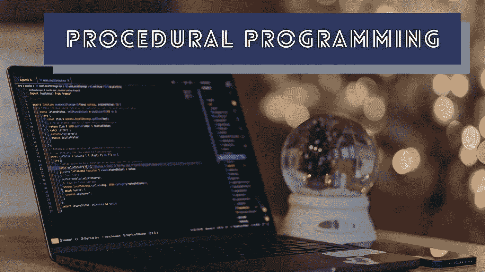
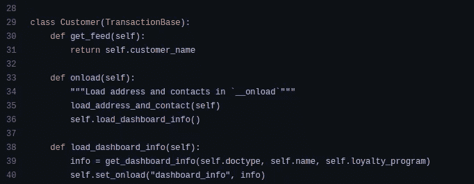
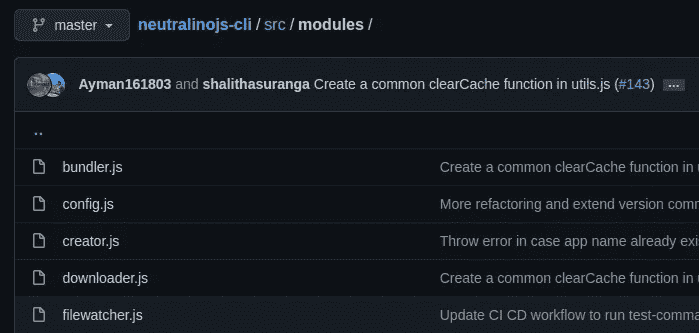
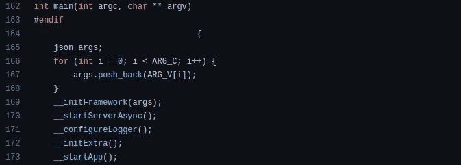
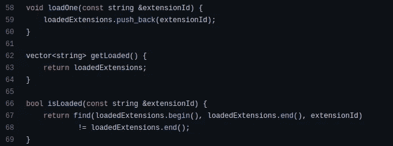
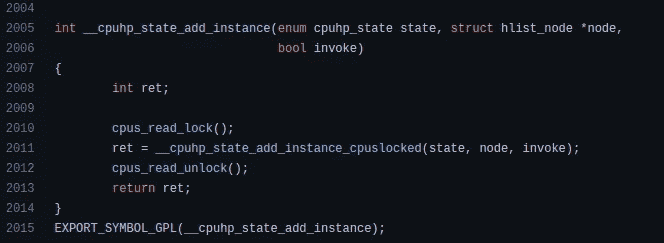

# 如何通过不使用面向对象编程来简单地编程

> 原文：<https://levelup.gitconnected.com/how-to-program-simply-by-not-using-object-oriented-programming-368de601fc26>

## OOP 很棒，但是它悄悄地让你的简单程序变得复杂



Joshua Aragon 在 [Unsplash](https://unsplash.com/s/photos/programming?utm_source=unsplash&utm_medium=referral&utm_content=creditCopyText) 上拍摄的照片，由 Canva 编辑

程序员使用各种编程范例来开发软件系统。有几种流行的编程范例:结构化的、过程化的、函数式的、模块化的和面向对象的。这些范例帮助程序员通过使用一种特定的编码风格来组织他们的源代码，这种风格先于众所周知的软件开发原则和模式。例如，我们可以通过将语句安排到几个过程(函数)中来使用过程范式，我们可以使用[干](https://en.wikipedia.org/wiki/Don%27t_repeat_yourself)和 [YAGNI](https://en.wikipedia.org/wiki/You_aren%27t_gonna_need_it) 原则来进一步改进源代码。

现代程序员往往倾向于使用 OOP(面向对象编程),甚至没有考虑项目领域、需求、规模和扩展需求。OOP 无疑是很好地组织代码库的一个很好的范例，但是它会让你的简单程序无声地变得复杂。

在这个故事中，我将解释另一种基于过程的编程范例，您可以用它来简化您的软件开发项目。除了 OOP 之外，这种可选的编程范式借用了现有范式中的几个概念。

# OOP 如何使简单的项目复杂化

CPU 是遵循[图灵机](https://en.wikipedia.org/wiki/Turing_machine)概念的计算设备。换句话说，CPU 理论上可以执行一个程序的无限系列的线性汇编指令。最初，程序员用原始汇编指令编写软件程序，但后来他们引入了对人类友好的编程语言，以提高生产率和代码可移植性。我在下面的故事中解释了这些低级编程概念:

[](/5-computer-hardware-concepts-that-every-programmer-should-know-32711c759dc0) [## 每个程序员都应该知道的 5 个计算机硬件概念

### 多亏了这些概念，你的计算机执行了你编写的程序

levelup.gitconnected.com](/5-computer-hardware-concepts-that-every-programmer-should-know-32711c759dc0) 

如今，我们可以使用各种范式的人类友好的编程语言——这要归功于类似英语的语法和现代语言功能。OOP 范例激励开发人员将源代码语句分解成类，并用动作创建有状态对象。OOP 是解决面向业务问题的好选择，因为我们可以很容易地将业务实体隔离为类。例如，看看基于 Python 的 [ERPNext](https://github.com/frappe/erpnext) 开源平台如何使用带有`TransactionBase`父类的`Customer`业务实体的继承:



ERPNext 平台的[客户](https://github.com/frappe/erpnext/blob/4b2521c9f3b79619db30cd1bb456f9ae60889c01/erpnext/selling/doctype/customer/customer.py#L29)类实现，作者截图

用基本的面向对象方法编程不会使程序变得复杂，但是与面向对象(OO)相关的概念，如继承、多态和基于 OO 的设计模式通常会使程序变得复杂。另一方面，如果没有这样的概念，我们无法做出更好的实用的基于 OOP 的源代码。因此，基于 OOP 的软件项目经常会过度使用 OOP 原则和设计模式。结果，你的软件程序的简单逻辑流程会因为多个对象和分散的状态而变得复杂。由于这个原因，像 Golang 这样的现代编程语言不提供复杂的 OOP 概念支持。

> 此外，缺少类型层次结构使得 Go 中的“对象”比 C++或 Java 等语言中的“对象”要轻得多。—转到[常见问题解答](https://go.dev/doc/faq#Is_Go_an_object-oriented_language)

有时，您甚至必须为不需要多个实例的实体(例如，应用程序、服务器、配置等)创建类和对象。)来坚持 OO 风格。这种情况经常发生在非面向业务的项目中。

# 软件项目的过程化编程范例

如果 OOP 经常使项目复杂化，那么哪种替代范式适合开发软件系统？函数式编程？—我们可以使用函数式编程中的一些概念，但不是全部——因为纯函数式编程为非通用用例提供了解决方案，如复杂的数据操作和数学计算。

你第一次学习计算机算法是什么时候，怎么学的？—您可能是通过学习通用控制结构开始学习流程图算法的。后来，你可能通过使用那些控制语句学习了结构化编程。用结构化编程开发软件并不复杂，因为它对理论计算机科学算法没有任何抽象，对 CPU 本机语言的抽象也较少( [ISA](https://en.wikipedia.org/wiki/Instruction_set_architecture) Assembly)。我们可以将结构化、模块化、过程化和函数式编程范例中的概念结合起来，为 OOP 提供一个简单的替代方案。

这里有一个面向对象的简单替代方案:

我们可以用模块代替类，用过程(函数)代替类方法(或类)，用记录代替有状态对象，用自定义代码风格代替访问修饰符，用模块级变量代替持久类状态。例如，请看我如何根据模块化编程原理将一个 CLI 程序代码分解成几个 [CommonJS](https://en.wikipedia.org/wiki/CommonJS) 模块:



模块化编程的一个例子，作者截图

在 OOP 中，我们经常在类方法中分布逻辑，然后我们必须检查多个类来理解特定的逻辑流。在基于 OOP 的大型项目中，理解一个特定的逻辑流程无疑是非常耗时的。因此，我们可以写函数而不是类方法。但是，私有方法的替代方法是什么呢？我们可以使用自定义代码风格来表示私有函数。请看下面的例子:



将大函数分解成更小的私有函数，作者截图

用 OOP 管理程序状态是简单而自然的，但是类似继承的概念会使状态处理流程变得复杂。在过程化编程中有两种管理程序状态的方法:使用全局变量或者将状态作为参数传递——根据您的偏好和需求选择一种。基于参数的状态处理产生了可测试性好且干净的代码。然而，基于全局变量的状态处理并不坏——只要我们不在许多地方改变程序状态，它也能产生好的代码。

一些非循环程序(如 CLI 程序、自动化脚本、实用程序等)通常不需要持久状态，因此我们可以根据函数范式的纯函数概念编写所有函数，而不会产生[副作用](https://en.wikipedia.org/wiki/Side_effect_(computer_science))。

这种过程化编程看起来很棒，但是我们如何管理有状态对象池呢？例如，如果没有基于 OOP 的`Process`类，我们如何实现进程列表？在过程化编程的世界里，一个对象变成了一条记录。请看下面的例子:



Neutralinojs 框架的扩展管理[模块](https://github.com/neutralinojs/neutralinojs/blob/main/extensions_loader.cpp)，作者截图

上面的 C++代码片段是扩展管理模块的一部分。它有一个模块级的`loadedExtensions`变量和几个与之相关的过程。如果我们用 OOP 范式重写，我们可能需要创建两个类:`Extension`和`ExtensionManager`，但是现在，用一个最小的模块，一切都很简单。这里我们使用了一个字符串向量来保存扩展信息，但是如果扩展记录中有很多字段(不是 object ),我们也可以使用 struct 向量。

# 使用过程化编程范例

由于 C 是一种过程化语言，我们确实可以使用 C 的过程化编程方法。例如，检查来自 [C 标准库](https://en.wikipedia.org/wiki/C_standard_library)的文件处理函数，你会注意到你需要将`FILE`指针传递给每个文件处理函数。此外，通过检查 Linux 内核源代码，我们可以看到过程化编程模式，如下所示:



示例 C 语言程序来自 Linux 内核[源码](https://github.com/torvalds/linux/blob/b2d229d4ddb17db541098b83524d901257e93845/kernel/cpu.c#L2005)，作者截图

对于像 C++、JavaScript 和 Python 这样的流行编程语言来说，使用纯过程范式无疑是不可能的。原因是这些语言的标准库 API 为程序员提供了面向对象类。例如，看看 JavaScript 标准库如何为创建集合提供面向对象接口:

```
let numbers = new Set(); // constructor
numbers.add(10); // class method
console.log(numbers.size); // class property
```

另一方面，C++也提供了一组与 C++标准库交互的类。然而，所有现代的稳定编程语言都是多范式语言，所以那些语言支持带有 lambda 函数、回调、递归和匿名函数的函数式编程。因此，通过用函数包装基于 OOP 的标准库接口，我们可以在任何编程语言中使用这种替代的过程范式。我们可以在我们的过程中使用基于 OOP 的标准库类，而不用将整个项目的范例变成 OOP。

# 结论

OOP 是解决几乎所有现实世界问题的自然编程范式，但从 CPU 的角度来看，它是人工的。CPU 不把特定程序的指令集当作对象和引用，而是把整个程序当作一组过程和参数。因此，从技术角度来看，自然编程范式是开发软件系统的过程化范式。

然而，从面向业务的角度来看，OOP 很好地映射了业务逻辑和代码库——这就是为什么大多数面向业务的软件系统倾向于使用 OOP 而不是其他范例。此外，过程化编程方法可能会在面向业务的软件项目(例如，电子商务系统、工资软件等)中产生代码味道

但是，如果我们试图将一些软件程序分解成类，它们就会变得复杂。此外，如果我们倾向于添加 OOP 原则，算法解决方案通常会变得复杂。作为程序员，我们总是需要用简单、最小和有效的解决方案来解决问题，而不是增加不必要的复杂性。因此，在绘制类图之前，为您的下一个令人惊叹的项目尝试一种过程化的、功能化的、模块化的混合方法。

这个故事并不是要批评 OOP——它确实向您展示了一个替代范例，通过消除过度工程化效应来提高您未来软件项目的简单性。下面的故事解释了在软件开发中保持简单性的优势:

[](/5-programming-principles-that-help-you-to-write-better-code-5d96197725cc) [## 帮助你写出更好代码的 5 条编程原则

### 用这些编程原则编写更好的代码，给编译器和你的队友留下深刻印象

levelup.gitconnected.com](/5-programming-principles-that-help-you-to-write-better-code-5d96197725cc) 

感谢阅读。