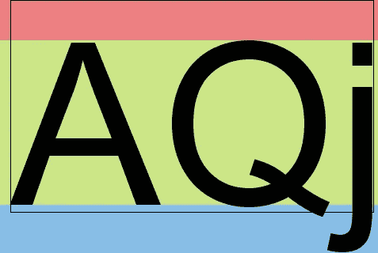
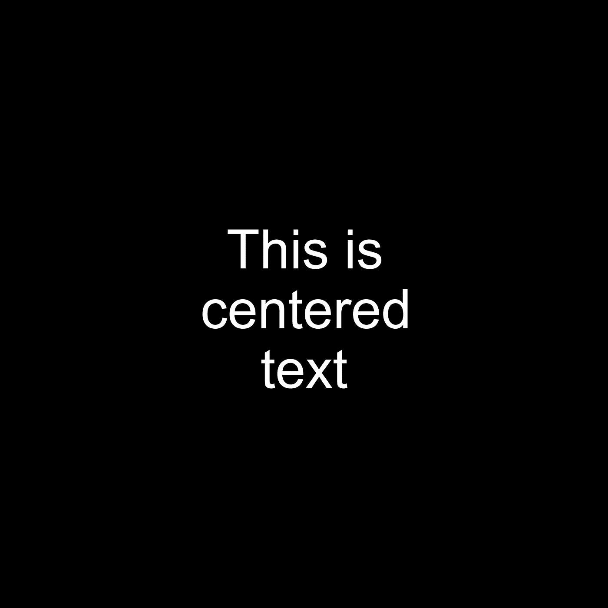

# 如何正确计算 PIL 图像中的文本大小

> 原文：<https://levelup.gitconnected.com/how-to-properly-calculate-text-size-in-pil-images-17a2cc6f51fd>

PIL 是一个很棒的用 Python 创建和编辑图像的包。然而，它的一个问题是计算文本大小。所以今天我将向大家展示一个简短的 Python 脚本，它用于在用 PIL 创建的图像中绘制适当居中的文本。

# 问题是

不幸的是，绘图接口的`textsize`方法没有返回字符串的正确文本大小。

例如，使用这个示例代码

```
img = Image.new("RGB", (width, height), color="white")
draw_interface = ImageDraw.Draw(img)
size_width, size_height = draw_interface.textsize("some string", font)
```

`size_width`和`size_height`将会[返回不正确的值](https://github.com/python-pillow/Pillow/issues/644)。

# 解决方案

因此，解决方案是对文本大小使用不同的计算方法。遵循[中发布的解决方案，这个](https://stackoverflow.com/questions/43060479/how-to-get-the-font-pixel-height-using-pils-imagefont-class/46220683#46220683)堆栈溢出线程(有一些变化)，下面的函数是我最后得到的。

文本大小计算

现在让我试着解释一下代码。



字体规格([来源](https://stackoverflow.com/questions/43060479/how-to-get-the-font-pixel-height-using-pils-imagefont-class/46220683#46220683))

从那个堆栈溢出线程借用上面的图片，我从用`font.getmetrics`获取一些字体度量开始。这返回上升和下降，即根据 [PIL 文档](https://pillow.readthedocs.io/en/stable/reference/ImageFont.html?highlight=getmetrics#PIL.ImageFont.FreeTypeFont.getmetrics)

> “从基线到最高轮廓点的距离”和“从基线到最低轮廓点的距离，负值”

换句话说，`font.getmetrics`返回一个元组，分别包含图像的红色和蓝色区域。

黑色矩形由`font.getmask(text_string).getbox()`给出，它返回一个四项元组:水平偏移量、垂直偏移量、矩形的宽度和矩形的高度。

现在我们有了黑色矩形的下降和尺寸，高度由下式给出:

```
font.getmask(text_string).getbox()[3] + descent
```

宽度为:

```
font.getmask(text_string).getbox()[2]
```

这意味着高度是通过将图像中所有区域的高度相加计算出来的，宽度就是黑色矩形的宽度。

# 实际例子

最后，让我们应用这个新发现的知识来创建一个文本居中的 PIL 图像。

创建文本居中的图像

`get_y_and_heights`是对先前代码要点中`get_text_dimensions`功能的改编。通过这种方式，函数返回开始绘制文本的垂直坐标以及每一文本行的高度列表。由于这个新函数还返回一个包含每行高度的列表，所以我还在高度计算中添加了垂直边距。这样，当循环通过文本行来绘制它们(第 55 到 65 行)时，可以将文本高度添加到`y`变量中来找到下一个垂直坐标。

代码的其余部分是创建新的 PIL 图像并在其上绘制文本的标准代码。



结果图像

# 结论

希望这段代码对你将来和 PIL 一起工作有用。所有这些文本度量对我来说仍然是混乱的，没有包括在 PIL 文档中也没有帮助(即`getbox`函数)。

无论如何，我认为这是一个实现目标的好解决方案:正确计算用特定字体绘制的字符串的文本大小。

像往常一样，这篇文章的代码可以在我的 [GitHub 库](https://github.com/Ze1598/medium-articles/tree/a4d4c28a8fdd847a1fa45efa9dcd8bab0bb0c593/How%20to%20properly%20calculate%20text%20size%20in%20PIL%C2%A0images)上找到。

对于额外的阅读，我建议查看“[基本 Pil(枕头)图像教程(针对机器学习人员)](https://neptune.ai/blog/pil-image-tutorial-for-machine-learning)”博客帖子，以全面介绍 PIL 的功能。