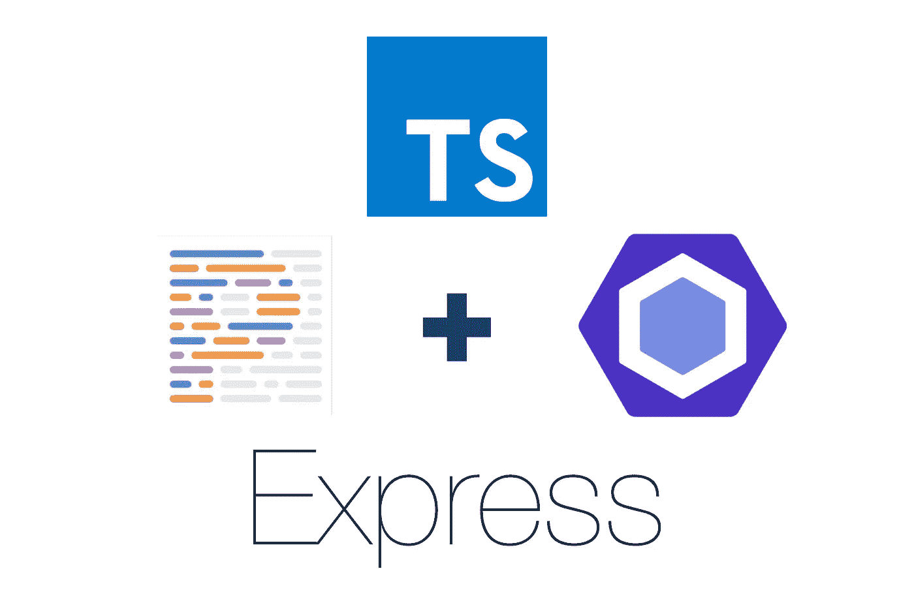
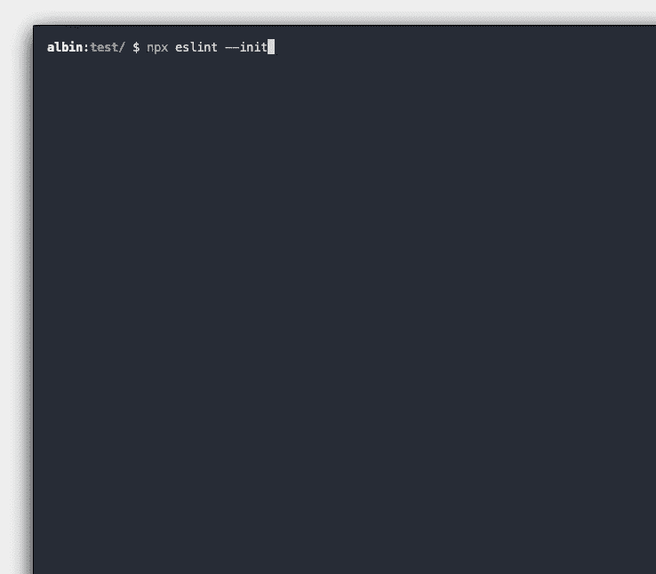
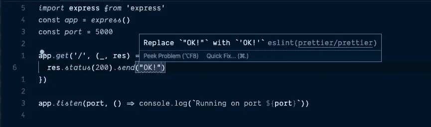

# 如何正确设置 Express With TypeScript

> 原文：<https://levelup.gitconnected.com/how-to-properly-set-up-express-with-typescript-1b52570677c9>

## 正确设置 Express 和 Typescript 的指南，以及可选的 Eslint 和更漂亮的。



我一直在寻找一个像这样的基础教程，但我没有找到一个。我最终想出了如何自己设置一切，所以我想我可以在这里分享。在这个 tutoria 中，我不打算介绍 Typescript 的好处或任何东西，但我还将向您展示如何另外设置 Eslint 和 Prettier，因为我认为这是您应该做的。但这是以后的事，所以现在不用担心。

# 第 1 部分:用 Typescript 设置 Express

## 1.安装依赖项

```
npm install express && npm install --save-dev typescript nodemon @types/node @types/express
```

## 2.添加 package.json 脚本和主字段

在将 typescript 包作为 dev 依赖项安装之后，用这三个命令更新 package.json 脚本块。此外，我们需要通过相应地设置 main 字段，将主文件设置为 Typescript 为我们编译的代码的输出。

```
"main": "dist/index.js",
"scripts": {
  "build": "tsc",
  "start": "tsc & node .",
  "dev": "tsc -w & nodemon .",
}
```

## 3.添加 tsconfig.json 文件

最后一步，确保在项目的根目录下创建一个 tsconfig.json 文件。如果不创建此 Typescript，它将不知道使用什么选项以及如何正确地键入您的项目。

```
{
  "compilerOptions": {
    "module": "commonjs",
    "esModuleInterop": true,
    "target": "es6",
    "noImplicitAny": true,
    "moduleResolution": "node",
    "sourceMap": true,
    "outDir": "dist",
    "baseUrl": ".",
    "paths": {
      "*": ["node_modules/*"]
    }
  },
  "include": ["src/**/*"]
}
```

## 4.创建主服务器文件

现在，您的项目应该支持使用 Typescript。在将成为项目中心的 src 文件夹中创建主文件。

```
mkdir src && touch src/index.ts
```

将以下代码添加到 index.ts 中

```
import express from 'express'
const app = express()
const port = 5000app.get('/', (_, res) => {
  res.status(200).send()
})app.listen(port, () => console.log(`Running on port ${port}`))
```

## 5.运行服务器

现在，您应该能够通过在项目的根目录下运行以下命令来启动项目。这将在监视模式下运行 Typescript，并通过使用 nodemon，启用服务器的自动重启。

```
npm run dev
```

# 第 2 部分:设置 Eslint 和 beauty

既然我们已经用 Typescript 正确地设置了 Express，我们可能还希望通过 Eslint 进行林挺，并用 Prettier 进行代码格式化。传统上，这是一个有点痛苦的后方设置正确，但只要跟着做，你会发现这并不困难。我们将从安装 Eslint 和 Prettier 开始，同时安装几个插件将所有东西绑定在一起。

## 1.安装其他依赖项

```
npm install --save-dev eslint prettier eslint-config-prettier eslint-plugin-prettier @typescript-eslint/parser @typescript-eslint/eslint-plugin
```

## 2.设置 Eslint

通过 npx 运行全局 eslint 命令来运行 Eslint 配置向导，如下所示。这将询问您几个问题，然后在项目的根目录下创建一个初始配置文件。

```
npx eslint --init
```



## 3.更新 Eslint 配置文件

现在您需要更新从前面的命令中生成的 Eslint 配置文件(该文件将被命名为**)。eslintrc** )来使用我们安装的 Typescript 和更漂亮的插件。

```
/* eslint-disable */
module.exports = {
  env: {
    browser: true,
    es2020: true,
  },
  extends: ['eslint:recommended', **'plugin:@typescript-eslint/recommended**'],
  parser: '@typescript-eslint/parser',
  parserOptions: {
    ecmaVersion: 11,
    sourceType: 'module',
  },
  plugins: ['@typescript-eslint', **'prettier'**],
  rules: {
 **'prettier/prettier': [
      1,
      {
        trailingComma: 'es5',
        singleQuote: true,
        semi: false,
      },
    ],**
 **...require('eslint-config-prettier').rules,
    ...require('eslint-config-prettier/@typescript-eslint').rules,**
  },
}
```

## 4.瞧啊。

如果你做的一切都是正确的，你现在应该得到一个 Eslint 警告，如果你使用双引号而不是单引号——因为这是我们在 Eslint 配置文件的 Prettier plugin 部分指定的。



# 就是这样！

现在，您已经正确地设置了 Express、Typescript、Eslint 和 Prettier，而不需要使用任何第三方生成器或模板，这些都会带来很多开销。将来，您将拥有一个示例项目，可以在建立新项目时参考。甚至更好的是，把它放在一个源代码控制提供程序上，并选择把它保存为模板。

我希望这个指南对你有用，并且一切顺利。如果您有任何问题或反馈，请不要犹豫，在下面留下评论，或者亲自联系我，我会尽力帮助您。