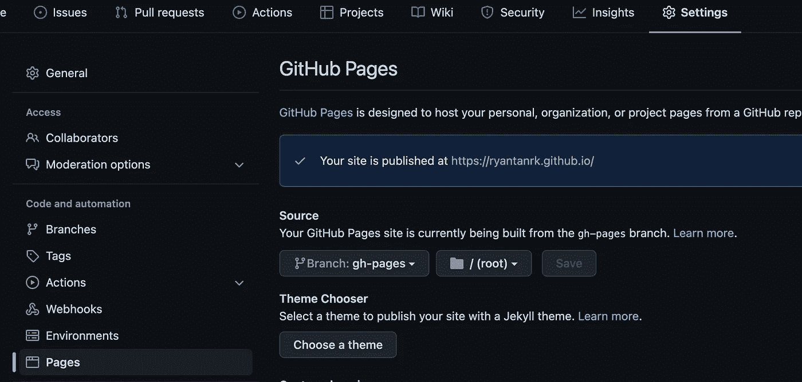

# 如何用 GitHub 页面免费发布单页应用程序(React、Svelte 等)

> 原文：<https://levelup.gitconnected.com/how-to-publish-a-single-page-application-at-no-cost-with-github-pages-react-svelte-etc-897b8f75a22b>


有了 GitHub Pages，你可以创建一个网站并免费发布。这适合展示你一直在做的一个**项目**，你的**作品集**(用于你的个人网站)，或者你的**组织/公司**。

常规的静态网页可以很容易地部署，或者它可以只显示您的存储库的`README.md`。


默认情况下显示 README.md

那么，我们如何将自己制作的**单页面应用**(用 React、Svelte 等)部署到 GitHub 页面上呢？这很简单。

请记住，如果你的网站使用了一个**后端**，它可能不得不被托管在其他地方。

## 步骤 1:您的项目存储库！

如果你正在制作一个个人网站，确保你的库像`yourusername.github.io`一样命名。显然，这是 GitHub 的另一个“秘密”，这样网站就不会在一个路径`/`下，而是仅仅在`yourusername.github.io`下。


项目存储库

如果你的库名不像上面的，你的网站可以在`yourusername.github.io/repository-name`下访问。

另外，除非你有一个 **Pro** GitHub 账户，否则你的**私有**库不能启用 GitHub 页面。因此，如果你的存储库包含任何敏感信息，请记住这一点。


升级通知

## 步骤 2:安装 gh-pages 包

npm 包`**gh-pages**`对于**部署**你的应用到 GitHub 页面是必要的。所以只需将它安装在项目的`devDependencies`中:

```
npm i -D gh-pages
```

## 第三步:你的脚本

转到`package.json`并添加以下**脚本**:

```
*"predeploy"*: "npm run build",*"deploy"*: "gh-pages -d build"
```

`"predeploy"`必须指向脚本，让**构建**一个生产就绪的优化版应用。至于`"deploy"`脚本，`-d`标志后的文件夹名就是`gh-pages`要**部署**的。在我这里，它叫做`build`。

综上所述，`"predeploy"`会将你的代码编译到一个 **build** 文件夹中。`"deploy"`脚本将获取该文件夹的内容，并**将其部署到 GitHub 页面。所以一定要指向**正确的脚本和文件夹**！**

## 步骤 4:构建和部署

只需在终端中运行`npm run deploy`来运行`"deploy"`脚本。在将构建发送到 GitHub 之前，将首先调用`"predeploy"`脚本。

当您看到终端显示`Published`时，您可以继续检查您的存储库的分支。你会看到**另一个分支**叫做`gh-pages`。这个分支包含你的应用程序的**生产版本**。


分支

要更改应用程序部署到的分支，您可以在脚本中添加`-b`标志，后跟您选择的分支名称:

```
*"deploy"*: "gh-pages -d build -b branchname"
```

## 步骤 5:启用 GitHub 页面

如果你的库名和`yourusername.github.io`一样，你的 GitHub 页面会自动**启用**。当您进入该页面时，它将显示您的存储库的`README.md`，如上所示。但是，我们希望它显示我们刚刚部署的应用程序。所以让我们现在就开始吧:

转到您的**存储库设置**，点击**页面**:



页面设置

在此页面中，您可以选择要部署的分支和文件夹。确保选择脚本刚刚将**部署到**的分支，在我的例子中，应该是`gh-pages`。点击**保存**，GitHub Actions 将开始部署 app。


GitHub 操作部署到 GitHub 页面

完成后，当您访问您的网址时，将显示您的应用程序。


我的个人网站部署在 GitHub 页面中

我们走吧！您的应用程序现已部署并公开。任何人输入你的**网址**都可以访问。

## 提示:路由

对于多个页面之间的路由，应该使用**散列路由器**。是的，你的 URL 之间会有一个`#`，但是如果不使用，其他页面**就不能直接访问**。

对于 React，你可以从`react-router-dom`导入`HashRouter`，对于 Svelte，你可以从`svelte-spa-router`导入`Router`。


GitHub 页面错误页面

## 提示:图标

我在我的网站上添加了一个图标。但是当发布在 GitHub 页面上时，却看不到**和**。

当应用程序发布在 GitHub 页面上时，图标的链接方式是不同的。**这里有一个对我有用的例子:**

```
<link rel="shortcut icon" type="image/x-icon" href="favicon.ico?" />
```

**问号(？)**最后是 favicon 能够显示的内容。还有，确保开头没有**没有**斜线`/`。

# 结论

这就是你如何用 GitHub Pages 发布自己的单页应用程序。老实说，这很容易做到。感谢您的阅读，我希望这有助于您建立自己的网站，或展示您的项目的网站。

可以随意查看我的 [**网站**](https://ryantanrk.github.io/) 及其 [**源代码**](https://github.com/ryantanrk/ryantanrk.github.io) 。

## 来源

*   [GitHub:git name/react-GH-pages](https://github.com/gitname/react-gh-pages)
*   [GitHub:tschaub/GH-pages](https://github.com/tschaub/gh-pages)
*   [Tomer Ben Rachel(freeCodeCamp):如何将路由 React 应用部署到 GitHub 页面](https://www.freecodecamp.org/news/deploy-a-react-app-to-github-pages/)
*   [堆栈溢出:带有 GitHub 页面的 html-Favicon](https://stackoverflow.com/a/55121118)