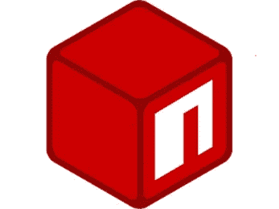
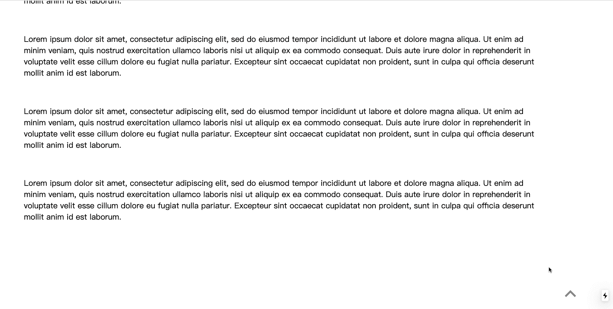

# 如何将您的 react 组件包发布到 npm？

> 原文：<https://levelup.gitconnected.com/how-to-publish-your-react-component-package-to-npm-20ee4f81a506>



**什么是 NPM？**

npm 是 Node.js 的包管理器，也是超过一百万个 javascript 开发工具(包)的在线数据库。要从 npm 下载软件包，您只需运行命令:

```
npm install <package>
```

这个包将会自动下载到项目中的 node_modules 文件夹中。你可以马上使用它。它为开发人员节省了大量时间。作为一个开源库，你也可以通过发布到 npm 来分享你的酷东西。

让我们构建一个简单而有用的包，然后将其发布到 npm。

**创建项目**

首先我们必须下载 npm。我们可以通过安装 Node.js 来获取，我们从它的官方网站下载 Node.js 吧。

[](https://nodejs.org/en/) [## 节点. js

### Node.js 是基于 Chrome 的 V8 JavaScript 引擎构建的 JavaScript 运行时。

nodejs.org](https://nodejs.org/en/) 

打开您的终端并运行:

```
npm -v
```

如果版本信息出现，这意味着您成功地安装了它。

然后创建一个新文件夹，并初始化这个文件夹。

```
mkdir react-scroll-up-button cd react-scroll-up-buttonnpm init
```

在根目录下创建一个 src 文件夹和一个 lib 文件夹。我们将把 react 组件放在。src 文件夹。编译后的 js 文件会出现在。lib 文件夹。

**编辑 package.json**

运行`npm init -y`后会有一个 package.json 文件自动生成。通常这就足够我们发展了。但是为了将这个项目发布到 npm，有些细节需要处理。只需编辑 package.json 文件，如下所示:

*   名称:这个包的名称。包名不能重复使用。因此，在命名项目之前，最好在 npm 上检查是否存在同名包。

[](https://www.npmjs.com/) [## npm

### 编辑描述

www.npmjs.com](https://www.npmjs.com/) 

*   版本:包的版本。记得每次更新这个包的时候都要更新版本。
*   描述:它将成为 npm 官方网站上这个包的副标题。越准确，人们找到这个包的机会就越大。
*   main:是这个包的入口点。请确保路径正确。
*   存储库:它是这个包的源代码所在的地方。比如你把代码放在 GitHub 上。把 GitHub 资源库的网址放在这里就行了。
*   关键词:将会是 npm 官方网站上这个包的标签。旨在帮助人们更容易地找到包裹。
*   bug:应该是用户可以报告 bug 的地方。通常，它与存储库在同一个地方。
*   脚本:我们用来运行这个项目的脚本。例如，我们使用 webpack 来捆绑这个项目，因此我们创建一个脚本“build”来运行 webpack。

编辑完 package.json 之后，让我们安装将要使用的工具和库。像 React，Webpack，Babel，和 Material UI。

```
npm install webpack webpack-cli 

npm install react 

npm install babel-loader @babel/core

npm install @babel/preset-env @babel/preset-reactnpm install @babel/preset-stage-0npm install @material-ui/core
```

**创建 webpack.config.js**

接下来，我们将设置 webpack 配置文件。创建一个 webpack.config.js 文件。在这个文件中，我们将一些重要的信息传递给 webpack，比如项目的入口和输出表单。

*   条目:React 组件文件的路径。
*   输出:它是一个对象。Path 指出 javascript 文件编译后的位置。在我们的项目中，它是 lib 文件夹。filename 是它的名字。
*   规则:它是一个对象。我们在这里制定规则。面对不同类型的文件时使用哪些工具进行编译的规则。在我们的项目中，我们使用 babel-loader 来编译以。用 css-loader 编译以. css 结尾的文件。
*   解决方案:当人们将我们的包导入到他们自己的项目中时，可能会有一些包在不同的版本中同时使用。它总是不停地反应。我们应该把它们放在这里以防止潜在的冲突。

这些是可以处理大多数情况的一些基本设置。

**创造。babelrc**

将 JSX 与 react 结合使用非常棒。但是浏览器不能读取 JSX。这就是为什么我们用巴别塔把 JSX 编译成 javascript。只需将我们要使用的包放在预置中。

**。npmignore，。gitignore 和 Readme.md**

。npmignore 是过滤掉我们不必发布到 npm 的文件。。gitignore 就是过滤掉我们不用推送到 GitHub 的文件。

Readme.md 用于介绍您的软件包。它同时出现在 npm 和 GitHub 库上。最好在这里提供尽可能多的细节。因为大多数人倾向于下载信息完整的包。如果你创建了一个超级杀手包，但没有 Readme.md，没有人会使用它。

**创建 react 包**

在我们设置好一切之后，让我们开始写代码。我将创建一个简单但有用的包，这是一个滚动到顶部按钮。这将是一个按钮，点击它，你会回到网页的顶部，无论你在哪里。

你可以在这里创造任何你想要的东西。这无关紧要，因为我们的重点是如何发表它。

所以让我们跳过如何创建这个 react 组件。好奇就去查代码。

[](https://github.com/weianofsteel/react-scroll-up-button) [## weianofsteel/react-向上滚动按钮

### 一个简单的向上滚动按钮。通过创建……为 weianofsteel/react-scroll-up-button 开发做出贡献

github.com](https://github.com/weianofsteel/react-scroll-up-button) 

**在本地主机上试试**

完成 react 组件后，只需运行:

```
npm run build
```

理想情况下，我们会收到成功消息。在我们发布它之前，我们应该测试这个包是否工作。运行:

```
npm pack
```

然后会生成一个. tgz 文件。让我们将它安装到另一个随机 react 项目中，并将其导入到一个组件中。使用这个包的本地路径来安装它，如下所示:

```
npm install /Users/wangweian/Desktop/xxxxxxxxxxx.tgz
```

理想情况下，这个包是有效的！

**发布到国家预防机制**

在本地主机上成功运行这个包之后。我们可以出版它！

我们需要一个 npm 账户。如果你没有，就创建一个。

[www.npmjs.com](https://www.npmjs.com/)

首次登录本地主机时，运行:

```
npm adduser
```

如果没有，运行:

```
npm login
```

成功登录后，我们可以发布它，运行:

```
npm publish
```

我们将收到一条成功消息。然后等待几分钟，到 npm 网站搜索我们的包。当我们在 npm 网站上看到它时，我们就完成了！

每次发布前记得检查版本。如果您忘记更新版本，发布将会失败。

最后，让我们导入这个包，看看它是什么样子的:



就是这个！希望你喜欢这个，并在 npm 上发表一些很酷的东西。