# 如何将您的 Unity3D WebGL/HTML5 应用程序或游戏发布到 AWS

> 原文：<https://levelup.gitconnected.com/how-to-publish-your-unity3d-html5-application-or-game-to-aws-3bb053b59d21>

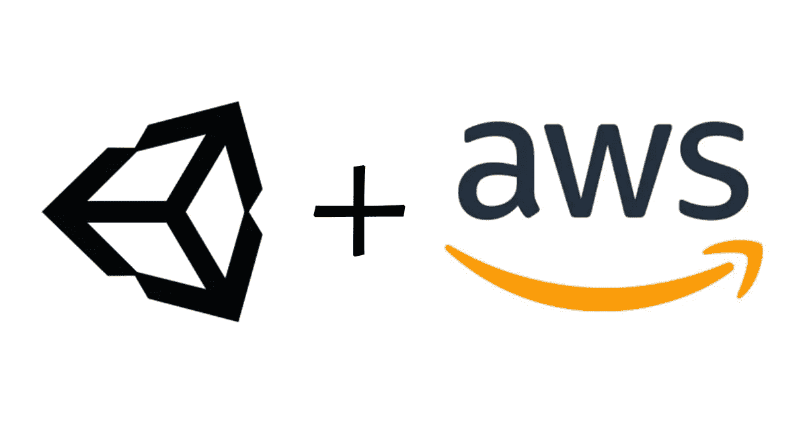

> *本文的目标读者是新用户或已经熟悉 Unity3D 的用户，他们正在寻找将 HTML5/WebGL 应用程序或游戏发布到 AWS 的方法。亚马逊 S3 和亚马逊 CloudFront 的 AWS 经验优先，但不是必需的！*

# Unity3D 是什么？

[Unity3D](https://unity.com/) 是一款多平台游戏引擎，被从创业公司到大型企业的各类组织广泛采用。它支持大量的用例，包括视频制作、游戏开发和模拟。

Unity3D 可以让你一次编写代码，部署到多个平台，包括 Xbox，Playstation，PC，Mac，Linux，以及作为 HTML5 部署到 Web。

# HTML5 和 WebGL 是什么？

[HTML5](https://developer.mozilla.org/en-US/docs/Web/Guide/HTML/HTML5) 是 HTML 的新版本，为网站提供了大量以前没有的强大功能，如 2D 或 3D 图形。

HTML5 已经被主流浏览器广泛使用，包括 Chrome、Opera、Safari、Firefox 等等。

HTML5 释放了通过 [WebGL](https://developer.mozilla.org/en-US/docs/Web/API/WebGL_API) 在你的网站上提供高度互动、身临其境和引人入胜的体验的力量。

WebGL 是一个 JavaScript API，用于在任何兼容的 web 浏览器中渲染交互式 2D 和 3D 图形，而无需使用插件。

# 将你的应用或游戏部署到 HTML5/WebGL 有什么好处？

到目前为止，最大的好处是你打开你的应用程序或游戏的广阔范围和可访问性。

如果你花点时间想想有多少手机、平板电脑、电脑和智能显示器拥有支持 WebGL 的网络浏览器，你会对你的发现感到非常惊讶。客观来看，自生产开始以来，全球已售出约 22 亿部 iPhones。现在想象一下有多少安卓手机，有多少平板电脑和电脑。

如果你之前已经开发并发布了应用程序或游戏，你应该知道在你发布它之前，你必须从每笔销售中给 AppStore 提成(30%)，并且必须严格遵守他们的指导方针，否则你的应用程序或游戏可能会被从 AppStore 中删除。

网络应用或游戏没有这样的要求，他们可以随心所欲地发布自己的游戏，而不必与其他人分享收入。

从用户体验的角度来看，你将能够把你的体验交付给你的用户，而不会有任何摩擦。没有更多的应用程序下载。

# 为什么要发布到亚马逊 S3/亚马逊 CloudFront？

亚马逊 S3 代表简单的存储服务。亚马逊 S3 是一项托管服务，其主要功能是存储内容。这是亚马逊网络服务提供的最古老的服务之一。它有许多功能，并与 AWS 生态系统的其他部分集成得非常好。

首先，亚马逊 S3 允许您轻松托管和扩展您的 web 应用程序来处理大量用户，而无需担心管理服务器或基础设施。

[亚马逊 CloudFront](https://aws.amazon.com/cloudfront/) 也是一项托管 AWS 服务，为你的起源提供 [CDN](https://en.wikipedia.org/wiki/Content_delivery_network) 功能。通过将内容缓存在离用户最近的边缘位置，您可以显著提高网站的访问时间。此外，亚马逊 CloudFront 很容易与亚马逊 S3 集成为一个源。

有了亚马逊 S3 和亚马逊 CloudFront，你就不必担心管理底层基础设施或计算如何处理可伸缩性。最棒的是，您只需为您使用和存储的内容付费。如果没有那么多用户，就没有必要扩展或缩减任何基础设施，它会由 AWS 自动处理。这就是无服务器技术的强大之处。

# 我们开始吧！

好的，现在我们了解了构建 Unity3D WebGL 游戏并将其部署到 AWS 的好处，让我们一起来演练一个例子。

在撰写本文时，Unity 的最新公开版本是 **2020.1.10f1** 。我们将执行的分步任务不应因版本不同而有太大变化，但如果有变化，请让我知道，我会确保更新本文。

## 步骤 1:将 Unity3D 游戏构建到 WebGL

*   创建新的 Unity3D 项目或使用现有项目。
*   转到构建设置页面，并确保选择了 WebGL。

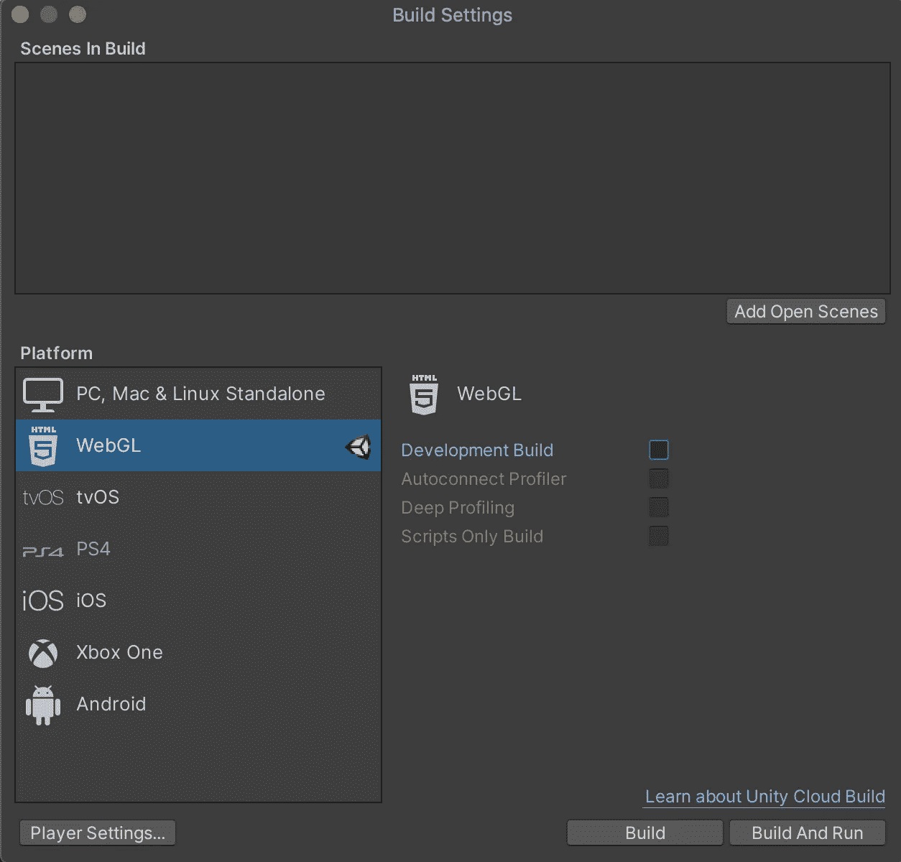

Unity 构建设置

*   点击播放器设置按钮，选择播放器菜单选项。
*   在“发布设置”面板下，将压缩格式设置为 Brotli(比 gzip 更优化，但构建时间更长)。

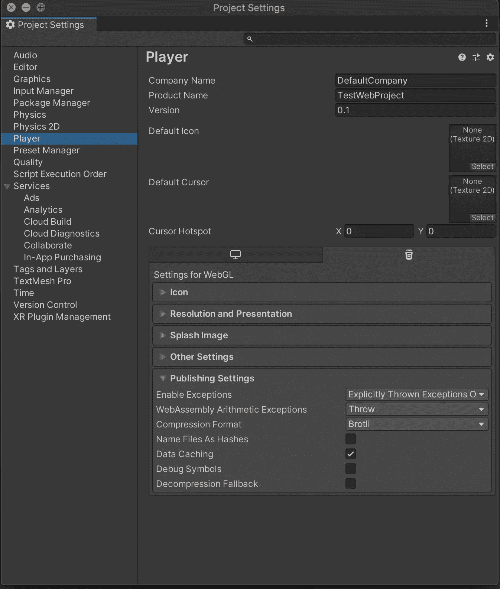

Unity 项目设置

*   首先点击**构建并运行**，在你的机器上本地运行它，并确保它加载良好。
*   构建完成后，您应该会看到类似如下的文件结构:

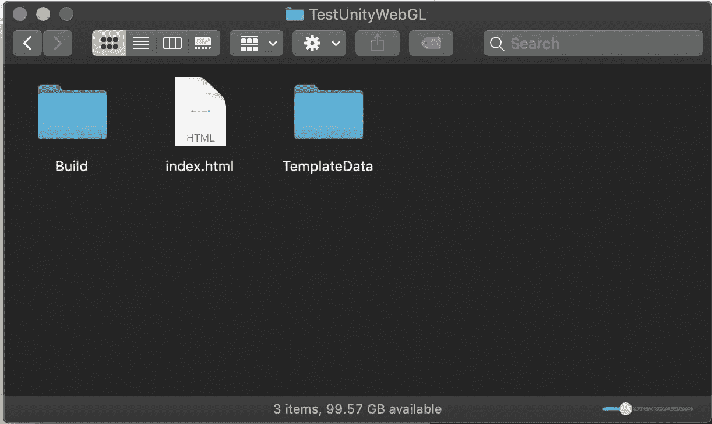

构建游戏后的文件夹结构示例

*   在构建文件夹中，您应该会看到以**结尾的文件。br** (brotli) 和**。js** (javascript)。

## 步骤 2:将资产上传到亚马逊 S3，并更新它们的元数据

*   登录您的 [AWS 控制台](https://console.aws.amazon.com/)。
*   去亚马逊 S3。
*   创建一个存储桶，并给它一个唯一的名称。
*   一旦创建了 bucket，将上面的三个资产(构建文件夹、index.html、模板数据文件夹)上传到根级别的 S3 Bucket。

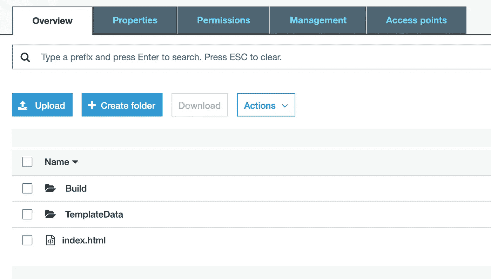

亚马逊 S3 桶中的文件夹视图

*   在 S3 桶的**构建**文件夹中导航。您应该会看到类似于以下文件的内容:

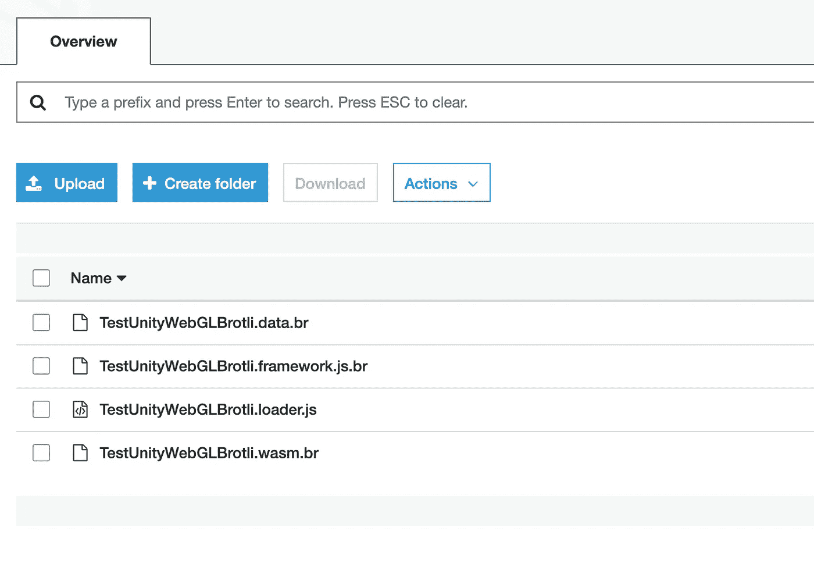

在亚马逊 S3 桶中构建文件夹

*   对于**每个以**结尾的**文件。br** 您必须修改它的元数据，并将内容编码头设置为 **br** 。这使得亚马逊 S3 可以将该文件作为 brotli 压缩文件提供。这里有一个例子:

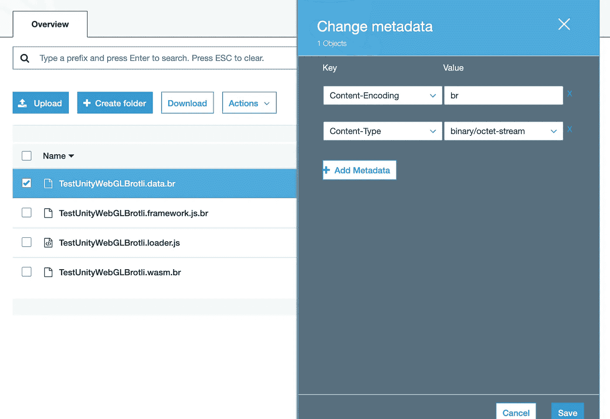

亚马逊 S3 中的对象元数据

> 注意:如果您使用了 GZIP 压缩，那么请确保将所有以结尾的文件的内容编码头设置为 gzip。地面零点

*   对于以 **.wasm 结尾的文件，br** 确保将内容类型也设置为 application/wasm。

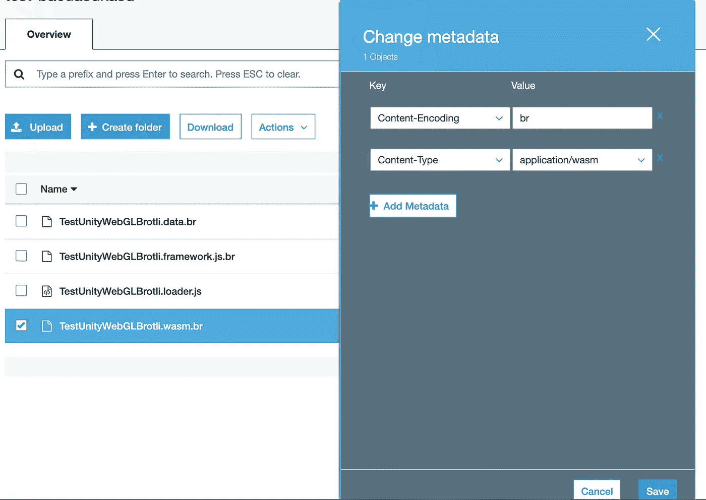

亚马逊 S3 中的对象元数据

## 步骤 3:设置 CloudFront 来服务 S3 桶

*   在 AWS 控制台中，转到 Amazon CloudFront
*   创建一个 **Web** 发行版
*   在**源域名**字段中输入您的 S3 bucket 的名称，您应该会看到您创建的 S3 bucket。确保选择它。
*   将**限制铲斗进入**设置为是
*   选择为**原始访问身份**创建新身份
*   选择是，更新**的存储桶策略，授予对存储桶**的读取权限

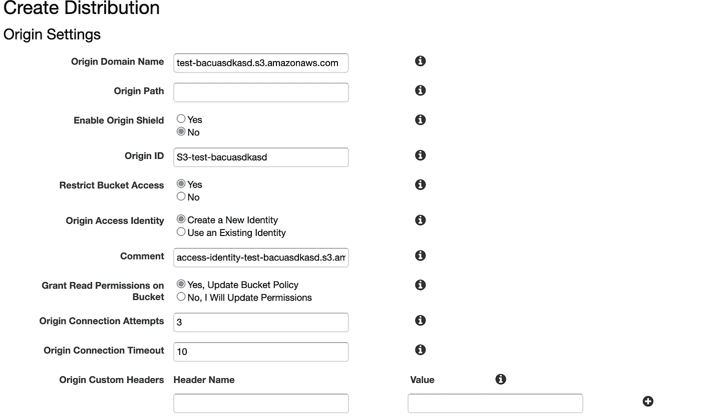

Amazon CloudFront 中的原点设置

*   在默认缓存行为设置下，为**查看器协议策略**选择将 HTTP 重定向到 HTTPS

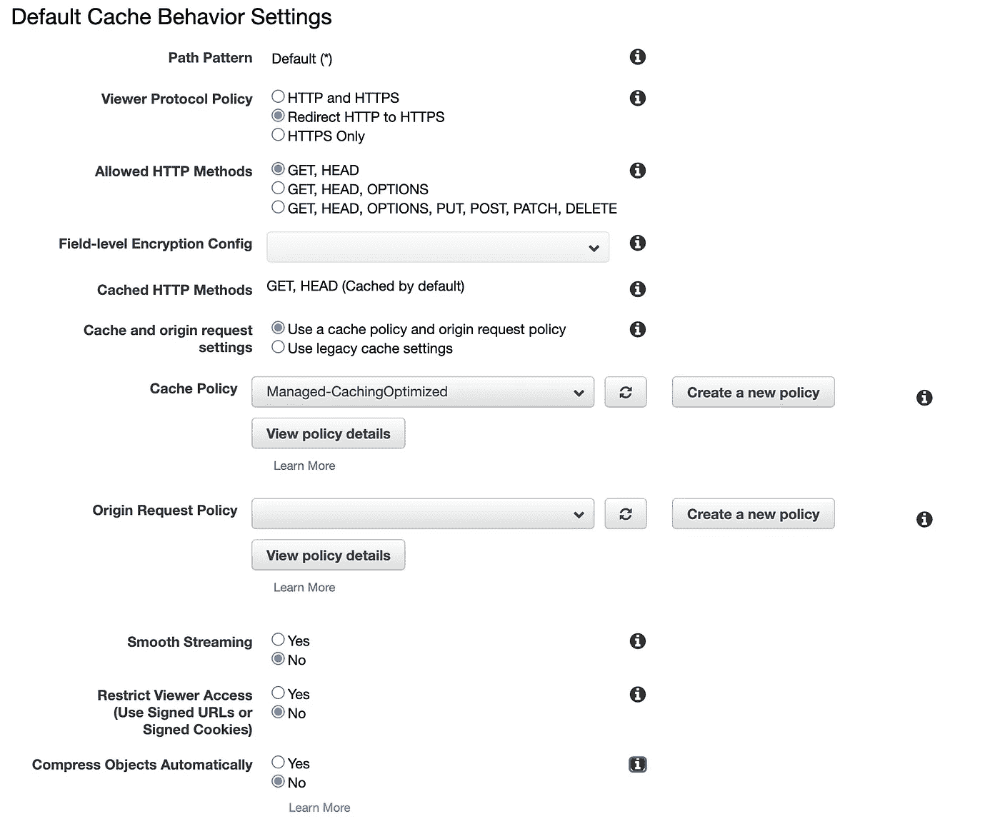

Amazon CloudFront 中的默认缓存行为设置

*   在**分布设置**下，确保将**默认根对象**设置为 index.html

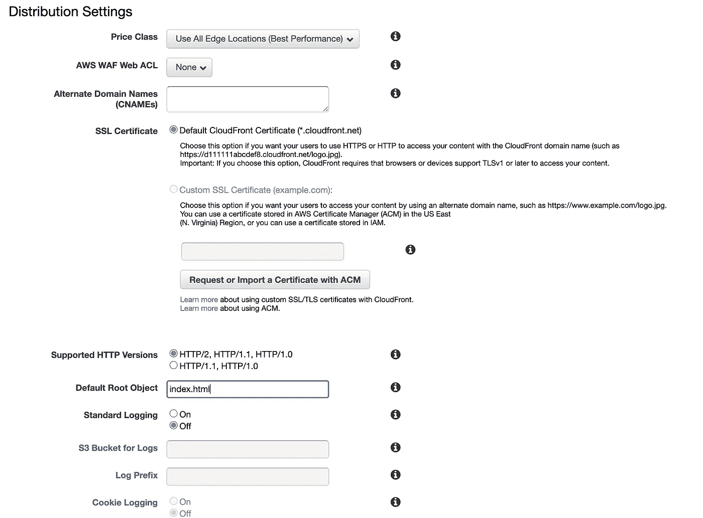

Amazon CloudFront 中的分发设置

*   您可以将其余值保留为默认值。
*   点击**创建分配**
*   现在，您可以去喝杯咖啡或休息 15 分钟，直到 CloudFront 发行版的状态从 InProgress 变为 Deployed。部署完成后，您可以将域名复制并粘贴到您的 web 浏览器中，您应该会看到:

从 Amazon CloudFront 加载的浏览器中运行的空白 Unity WebGL 项目的 GIF 示例

# 结论

希望这篇文章能帮助你在 AWS 上发布 Unity3D 构建的应用程序或游戏。

如果你想看更多这样的文章，请告诉我！

谢谢大家！

# 你可能喜欢的其他文章

 [## 亚马逊苏美尔主机:如何降低你的亚马逊波利成本

### 本文的目标读者是已经熟悉亚马逊苏美尔主机并且正在寻找…

levelup.gitconnected.com](/amazon-sumerian-hosts-how-to-reduce-your-amazon-polly-cost-eb13db90a47d)  [## AWS 初学者 CDK

### 本文的目标读者是不熟悉亚马逊 Web 服务(AWS)或 AWS 云的人…

levelup.gitconnected.com](/aws-cdk-for-beginners-e6c05ad91895)