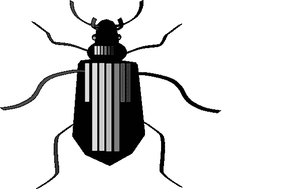
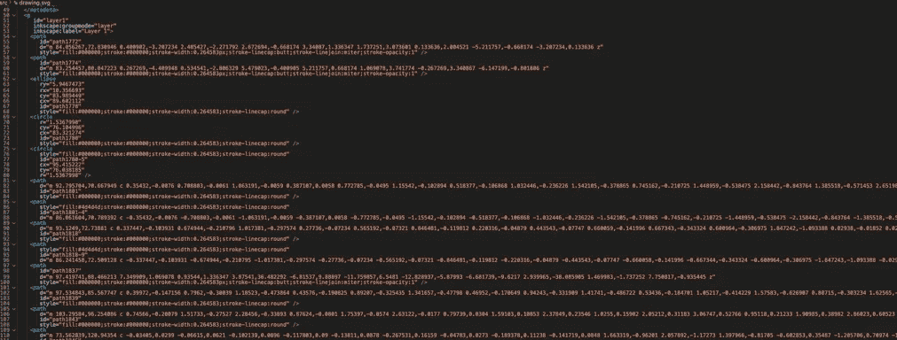
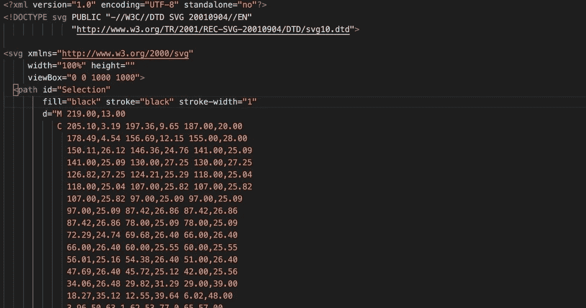
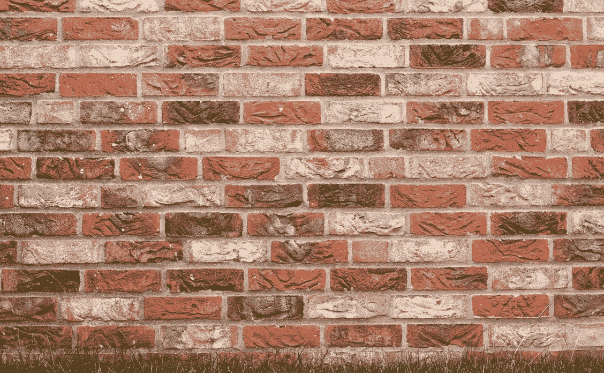
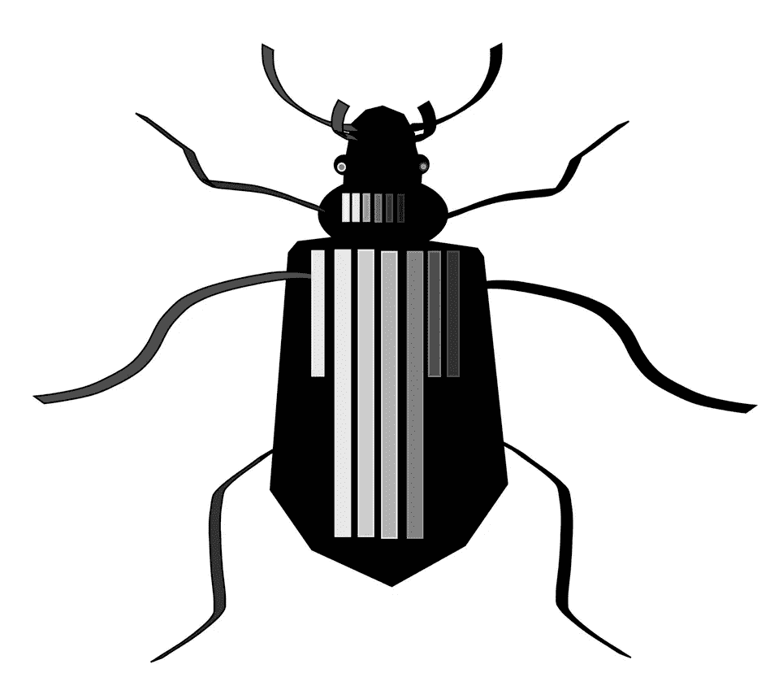

# 如何将 SVG 放入任何使用 HTML 的应用程序中

> 原文：<https://levelup.gitconnected.com/how-to-put-an-svg-into-any-application-that-uses-html-6065f2ec26a0>



对于那些赶时间的人，我将在接下来的几段中直接跳到标题的答案。然后，我将为那些想更深入了解这些东西如何工作的人提供更多的细节。

# 如果您已经有一个 SVG 文件…

如果你有一个来自图标工厂网站的 SVG 文件，或者是你自己做的，你需要做的就是把你的文件拖放到你的项目目录中。然后，用代码编辑器打开 SVG 文件。

它看起来像一个巨大的代码块。这是从两个不同的 SVG 编辑应用程序中导出的两个 SVG 文件。我们在这里需要看到的是，这两个文件在一个 SVG 标记中至少包含一个 path 标记。



从 Inkscape 导出的 SVG



从 GIMP 导出的 SVG 文件

现在，有几种方法可以把它放到你的网页上。

# 方法 1

您可以复制这段代码并将其直接粘贴到页面的 HTML 文件(或者您的框架使用的任何标记格式)中，因为您导入的 SVG 文件在大多数情况下都是以标记友好的方式进行格式化和组织的。

在 HTML 中包含文字 SVG 路径还将允许您利用标准 SVG 标签的所有特性。

然而，根据您使用的框架或用于制作 SVG 的软件，这并不总是有效的。

# 如果方法 1 不起作用…

您应该能够在目录中引用您的 SVG 文件，并将该引用传递到一个 IMG 标记中。(或者你的框架正在使用的任何等同于的标记)

如果您选择的编程语言不能读取其他文件，那么您需要选择一种新的编程语言。

> 反应示例

```
import bug from "./drawing.svg"
...
...
...</img>
```

使用普通的 javascript、Angular、React 或 Ruby on rails 等等，可以很容易地做到这一点(尽管语法和约定略有不同)。

# 如果方法 2 不起作用…

另一个选择是避免将 SVG 文件保存在目录中。然后，您可以在一些 SVG 编辑软件中打开您的 SVG 文件，例如 Inkscape，并根据需要调整其大小，然后从您的编辑软件中导出为 PNG 或 JPEG 格式。然后，您可以像使用任何其他图片一样，将 PNG 或 JPEG 文件移动到您的应用程序中。

# 在我看来

除非有特殊的原因，否则应该始终使用方法 1 或 2，因为使用 SVG 的价值在于可以在不丢失任何数据的情况下放大或缩小图像。

# 这导致了进一步的解释

什么是 SVG？

SVG 通过使用几何图形以编程方式绘制东西来工作。如果您使用普通图像，您的数据可能会因任何原因随时扭曲或丢失。

例如，如果你拍了一张照片并上传到脸书，你只是丢失了上传的数据。

脸书不想在他们的数据库中存储数万亿字节的图像，因为那要花钱。当你上传你的文件到他们的平台上时，他们要么验证文件的大小，要么自动缩小文件大小，这样他们就不必存储那么多数据了。

这就是为什么我们有这么多愤怒的奶奶在你当地的沃尔格林问为什么他们放大的照片是模糊的。脸书或其他任何人都无法轻易恢复这些数据。唯一对你的形象质量负责的人就是你自己。

理论上，任何图像都可以转换成 SVG，但是考虑到大多数 SVG 都是以编程方式绘制的，因此将详细的自然图像转换成 SVG 是不实际或不可行的。



例如，这个砖块图像可以转换成 SVG，但是精细的细节可以归结为成千上万的纯色形状。(游戏玩家和游戏开发人员可能会将它们识别为多边形和网格)每条路径都必须非常小，以至于它可以欺骗你的肉眼认为它是一个真实的图像。

这是不实际的，所以大多数 SVG 倾向于几何和简化的美学，就像这样:


这些 SVG 是由 Kurzgesagt youtube 频道制作的。如果你喜欢科学，你应该去看看。

[](https://www.youtube.com/c/inanutshell/featured) [## Kurzgesagt -简而言之

### 用乐观虚无主义解释事情的视频。我们是一个想让科学看起来很美的小团队。因为…

www.youtube.com](https://www.youtube.com/c/inanutshell/featured) 

这是我今天做的 SVG

# 为什么要使用它们呢？

要么你想在不损失连续性的情况下缩放你的图像，要么你喜欢美感。

SVG 在 web 或游戏开发中特别有用，因为如果你试图制作一个在未知屏幕尺寸上完美工作的 GUI，你需要可以自由缩放的项目。

知道这一点，SVG 是公司图标或标志的黄金标准，因为公司希望他们的标志和图标出现在所有地方。他们希望自己的商标出现在网站、门上，甚至广告牌上。标志应该在每一个媒体上看起来完全一样。

如果我们试图缩放一个多用途徽标的正常图像，它将扩展现有数据以满足我们的需求。

我希望我可以在这里直观地演示，但 Medium 只接受 jpegs 或 png，所以我在这里上传的任何 SVG 都只会作为其中一种文件类型呈现给你，所以你看不到它的价值。

# 如何制作它们？

如今大多数图像编辑软件都有一些 SVG 功能。你可以在 Gimp 或 Photoshop 中制作非常简单的 SVG，但是对于稍微复杂的东西，我会使用 Inkscape。这些应用程序功能丰富，你甚至可以像制作任何其他数字艺术作品一样，随心所欲地制作 SVG。

我目前只有这些了。感谢您的阅读。