# 如何用 CSS 在图片上放置文字

> 原文：<https://levelup.gitconnected.com/how-to-put-text-over-images-with-css-596ab68c0b0b>

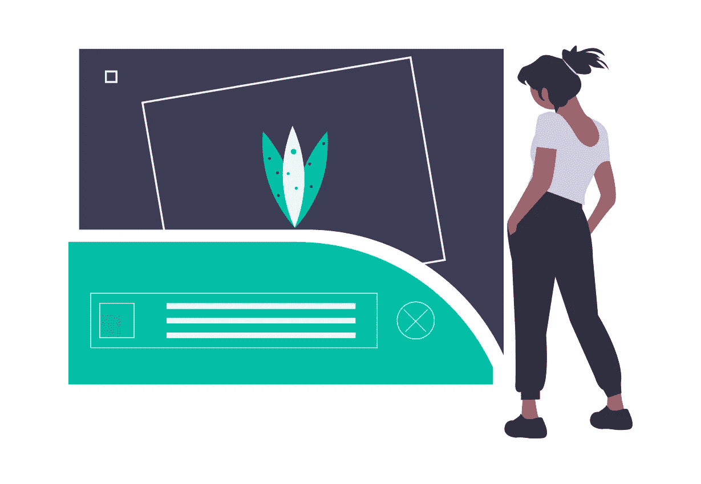

作为 Microverse 项目(一所面向软件开发人员的远程学校)的在校学生，我不得不花整整一个月的时间和我的编码伙伴一起专门研究 HTML 和 CSS，试图在转向 Ruby 之前尽可能多地学习。

> 差不多每周 40 小时。

该计划的一部分是克隆像 [youtube](https://rawcdn.githack.com/CalyCherkaoui/Youtube-Embeded/371d08d8ad00270eda2ae5303e1378a304c4f34e/index.html) 、[苹果](https://rawcdn.githack.com/ghamtre/AppleSolo/f6c0b14055d19a80be2457338831444ab999ebd0/index.html)，甚至是来自 Mint.com 的 [Intuit 注册表单这样的网站，至少在设计概念上，它不需要太多时间就可以用 CSS(仅桌面屏幕)克隆这类网站。](https://rawcdn.githack.com/ghamtre/HTMLForms/e59d169086ff23fd50b3673531a5d46321f09a36/index.html)

当我们不得不克隆更复杂的网站，如 thenextweb.com 的[或 newsweek.com 的](https://github.com/sebGilR/the-next-web)[或](https://github.com/ghamtre/newsweek)时，问题就来了，其中一些网站正在使用手机和平板电脑屏幕的响应功能。

幸运的是，我们可以通过媒体查询解决这个问题，在新闻周刊项目中，我们使用 Bootstrap4，而不是像以前的项目那样从头开始。

这里的问题是，并不是所有东西都是现成的，我们必须找出一些东西，即使使用 inspector 也不能让你清楚地了解开发人员是如何做的。

一个明显的例子是《新闻周刊》在他们的网站上使用简单的标签来说明这篇文章属于哪个类别:

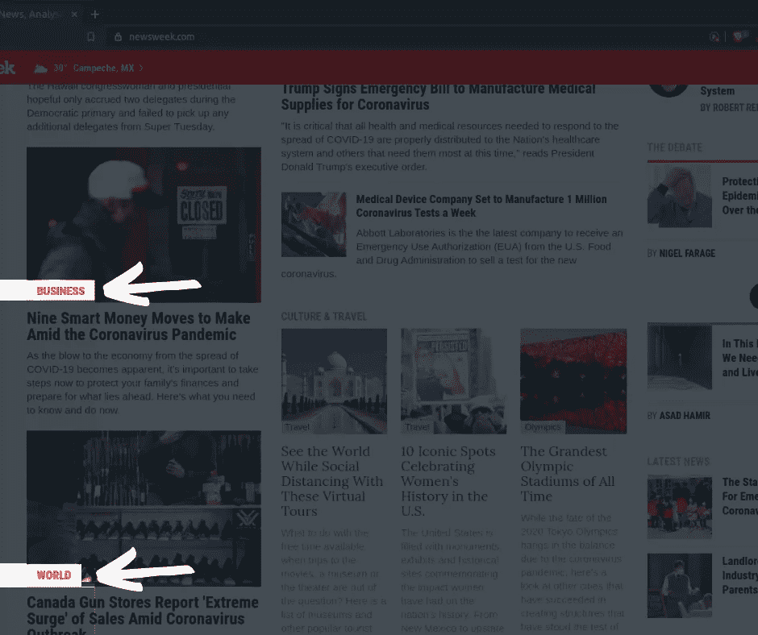

这里有一个更复杂的例子，next web 使用红色渐变将他们的徽标放在网站的顶部文章中，如果您将桌面分辨率更改为移动分辨率，红色渐变就会消失:


默认桌面分辨率

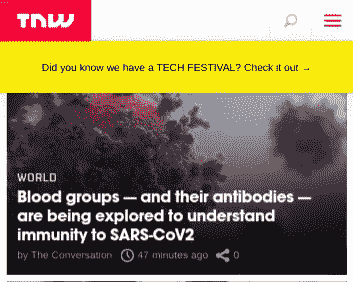

像素 2 XL

甚至一些创造性的方法将文字放在图片上，就像这个,《新闻周刊》用来计算每张幻灯片中的图片数量:

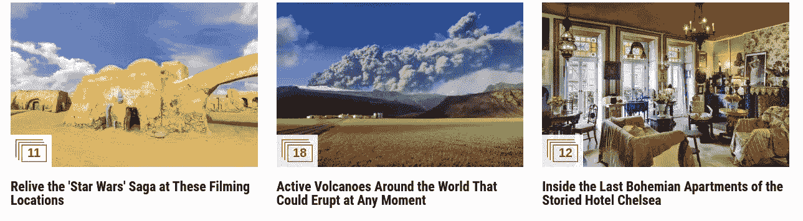

正如你所看到的，乍一看，它非常简单，对吗？但在现实中，它需要一些高级的 CSS3 技巧才能正常工作，不仅在桌面屏幕上，在移动设备上也是如此。

对于初学者来说，我相信如果我们利用背景属性，有一个简单的方法可以重现这种效果。我将尝试解释这种方法，同时我重现 TNW 标志的例子。

此外，我将在 codepen.io 中托管 CSS 代码，这样您就可以简单地使用那里的属性，以防您在智能手机中阅读此内容；)

> ***先说项目吧！【T2****🙌*

CSS 中排名靠前的 TNW 示例

以上是 codepen.io 上的完整代码，如果您想在开始学习教程之前看看最终结果。

让我们从设置我们的 Html 文件和完成这项任务所需的所有资源开始:

```
<html lang=”en”>
 <head>
 <script src=”[https://kit.fontawesome.com/8e996abce9.js](https://kit.fontawesome.com/8e996abce9.js)"> </script>
 <meta charset=”utf-8"/>
 </head>
</html>
```

我们将利用[fontawesome.com](http://fontawesome.com)库作为文章标题底部的图标。

此外，我们需要可以直接从网站获得的背景图像和徽标:

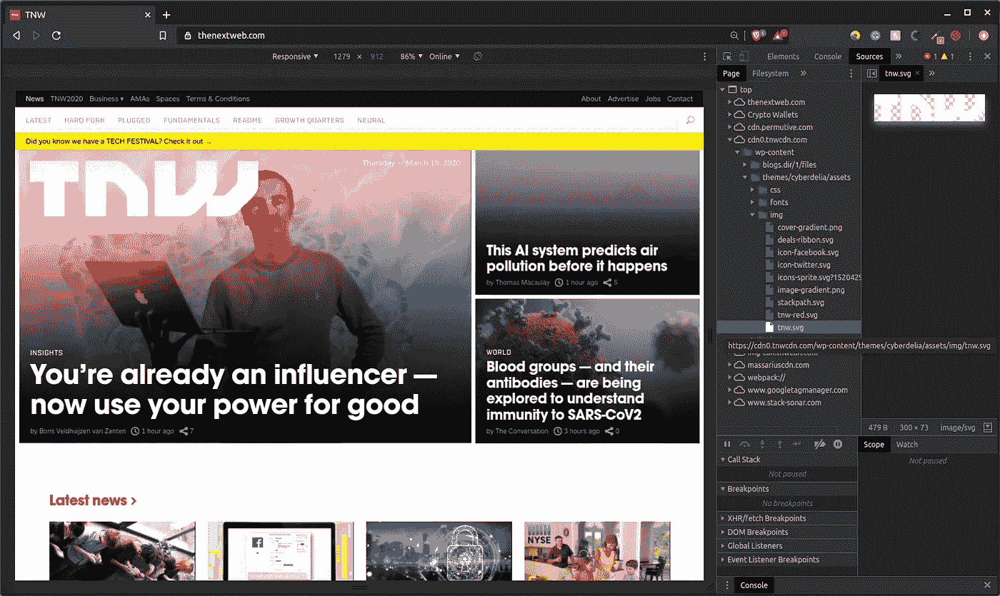

右键单击>检查器>源

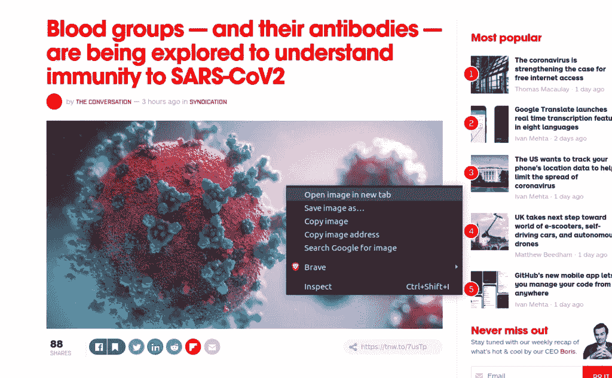

右键单击>在新选项卡中打开图像

万一你对检查器有问题，或者你找不到我们在这个例子中使用的文章，这里有两个链接:

```
Background image: 
[https://cdn0.tnwcdn.com/wp-content/blogs.dir/1/files/2020/03/Copy-of-Copy-of-Copy-of-Copy-of-Copy-of-Copy-of-...-3-796x417.png](https://cdn0.tnwcdn.com/wp-content/blogs.dir/1/files/2020/03/Copy-of-Copy-of-Copy-of-Copy-of-Copy-of-Copy-of-...-3-796x417.png)Logo image:
[https://cdn0.tnwcdn.com/wp-content/themes/cyberdelia/assets/img/tnw.svg](https://cdn0.tnwcdn.com/wp-content/themes/cyberdelia/assets/img/tnw.svg)
```

> 现在是公式的最后一部分，我希望你像一个设计师而不是程序员一样思考。🎨

在开始工作之前，一定要花时间分析这个概念。在这种情况下，试着分析一下图片，看看你是否能抓住一个想法，如何在图片中分配所有的元素。

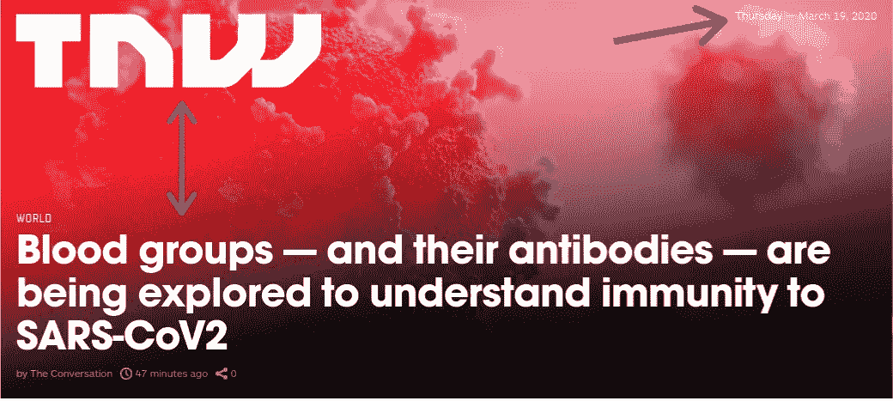

看箭头，提出问题。

看右上角的日期。你认为如何将日期放在那个角落，为什么？

还有，你打算怎么保持 logo 在顶部，标题在底部？

在我的例子中，我将使用 flexes，但这也可以用网格甚至浮动来完成。只是视角的问题。

我决定使用 flexes 而不是 grids，因为至少对于这个任务来说，所有的东西都可以放在一个单独的列中。这也可以用浮动和位置来完成，但是我觉得用 flexes 更舒服。

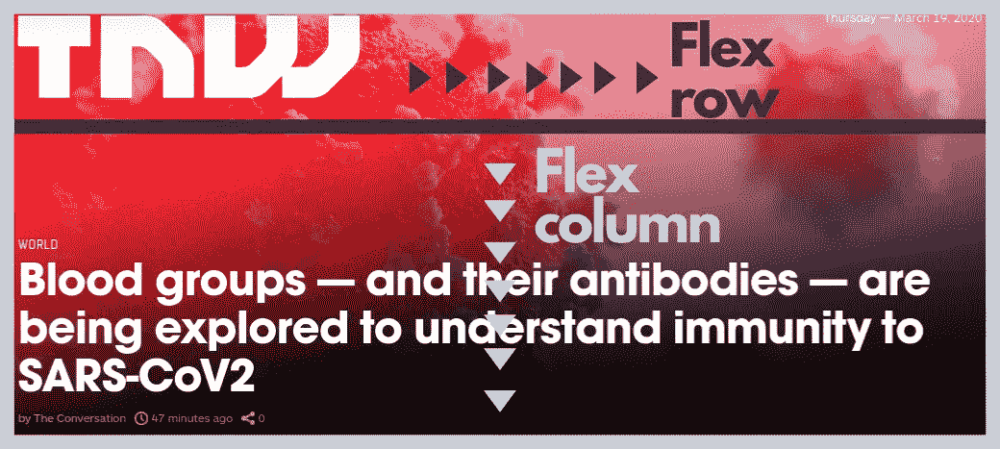

弯曲方向属性

乍一看，我们可以确定我们将需要使用一个单独的列来保持图片中的所有元素与 TNW 主文章的顺序相同。同时，对于标志和日期，我们可以用一排来保持它们之间的距离。

在这种情况下，我们将利用 flex，以防您不熟悉 flex-direction:

这里有一个快速的视频讲座，你可以在继续学习教程之前观看

现在您对 flex-direction 更加熟悉了，我可以更好地向您解释我的 Html 模板了:

```
<article>
  <div>
    
    <p> </p>
  </div>

  <div>
    <span> </span>

    <h2>  </h2>
    <ul>
      <li></li>
    </ul>
  </div>
</article>
```

正如你所看到的，我使用文章标签作为主容器，它是一个具有 flex-direction: column 的容器，同时第一个 div 将成为一行，以保持徽标(IMG 标签)和日期(段落标签)分开，但仍然在图片的顶部。

同样对于第二个 **div** ，我将为文本**“world”**使用一个 span 标签，它将有一个独特的字体样式，并使用 **ul** 标签为文章底部的图标和元素创建一个列表。

因此，根据这一快速观察，我们可以在转向 CSS 之前完成设置 Html 文件:

```
<html lang=”en”>
 <head>
 <script src=”[https://kit.fontawesome.com/8e996abce9.js](https://kit.fontawesome.com/8e996abce9.js)"> </script>
 <meta charset=”utf-8"/>
 </head>
<body>
    <article>
      <div>
        
        <p>
          Wednesday — March 4, 2020
        </p>
      </div>
      <div>
        <span>
          world
        </span>
        <h2>
          Blood groups — and their antibodies — are being explored to understand immunity to SARS-CoV2
        </h2>
        <ul>
          <li>
            by The Conversation
          </li>
          <li><i class="far fa-clock"></i> 47 minutes ago</li>
          <li><i class="fas fa-share-alt"></i> 10</li>
        </ul>
      </div>
    </article>
</body>
</html>
```

> ***现在是魔法开始的时候！🧙‍♂️***

要做的第一件事是确定 Html 文件的默认属性，在这种情况下，应该将边距和填充保持在 0。

```
* {
  margin: 0;
  padding: 0;
}
```

您可以在这里了解更多关于[通配符的信息](https://www.geeksforgeeks.org/wildcard-selectors-and-in-css-for-classes/)，但是在这个场景中，如果我不使用通配符，我就必须在每次创建新的标签或 div 块时重置页眉和列表的默认边距和填充。

在理解了这一部分之后，现在我们可以开始研究 flexes 和背景属性了。

```
article {
  display: flex;
  flex-direction: column;
}
```

我们将把“article”声明为 flex，并像我们之前讨论的那样使它成为一个列，但我们还必须保持徽标在顶部，标题在底部。

正如您所记得的，我们在文章中使用了两个 div 块，一个用作徽标和日期的容器，另一个用于保存其他内容。所以两个 div 意味着在我们的列中可以被**分隔的**两个块**。**

```
article {
  display: flex;
  flex-direction: column;
  justify-content: space-between;
}
```

使用 justify-content: space-between，我们可以将第一个孩子**放在顶部，将最后一个孩子**放在底部。

在移至背景之前，让我们将第一个子对象设为一行，这样它就可以将日期和徽标分开。

```
article > div:first-child {
  display: flex;
  justify-content: space-between;
}
```

默认情况下，flex 是一个行，所以我们不必使用 flex-direction 来保持它为一行，除非我们使用媒体查询或任何其他类型的场景，在这些场景中，我们必须重置以前建立的值。

此外，first-child 是一个 CSS 选择器，我们使用它来只选择容器的第一个 div，我们也可以只选择最后一个 child，或者在有多个选项的情况下甚至指定 child 的编号。

现在我们可以继续为我们的主容器——文章标签——建立背景属性:

```
background-image: url([https://cdn0.tnwcdn.com/wp-content/blogs.dir/1/files/2020/03/Copy-of-Copy-of-Copy-of-Copy-of-Copy-of-Copy-of-...-3-796x417.png](https://cdn0.tnwcdn.com/wp-content/blogs.dir/1/files/2020/03/Copy-of-Copy-of-Copy-of-Copy-of-Copy-of-Copy-of-...-3-796x417.png));
background-repeat: no-repeat;
background-size: cover;
background-position: center;
```

有些属性是不言自明的，如背景图像和背景重复，但大小和位置可能不会太多。所以我会尽可能简单地解释它们。

**background-size: cover** 在不改变图片大小的情况下，允许图片扩展到填满整个容器，如果图片太大，它将删除剩余的空间。与此同时，另一个选项如“背景-尺寸:填充”将改变尺寸和拉伸图像到与容器块相同的尺寸。

**background-position:center**允许图像保持居中，所以图像不会从左边开始，这是任何 Html 元素的默认方向。

你可以在这里了解更多关于[背景的信息。](https://css-tricks.com/perfect-full-page-background-image/)

在建立了 flex 和 background 属性之后，我们必须给主容器一些尺寸。

```
width: 1040px;
height: 467px;
```

我将使用自定义维度，因为我们只有一篇文章，但理论上，您应该只为主要容器(如节或带列的 div 块)保留自定义维度。

最终产品应该是这样的:

```
article {
  display: flex;
  flex-direction: column;
  justify-content: space-between;
  background-image: url([https://cdn0.tnwcdn.com/wp-content/blogs.dir/1/files/2020/03/Copy-of-Copy-of-Copy-of-Copy-of-Copy-of-Copy-of-...-3-796x417.png](https://cdn0.tnwcdn.com/wp-content/blogs.dir/1/files/2020/03/Copy-of-Copy-of-Copy-of-Copy-of-Copy-of-Copy-of-...-3-796x417.png));
  background-repeat: no-repeat;
  background-size: cover;
  background-position: center;
  width: 1040px;
  height: 467px;
}
```

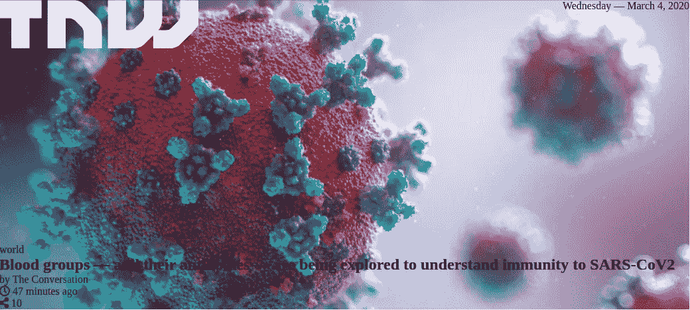

> ***时间换取一些 CSS 魔法符咒！✨***

让我们从突出显示背景图像中的文本开始，我们可以在一行中轻松完成:

```
linear-gradient(rgba(0, 0, 0, 0.4), rgba(0, 0, 0, 0.2))
```

在我们的背景图片属性中使用线性渐变,我们可以在文本后面添加一个带有透明度的黑色背景。

```
background-image: linear-gradient(rgba(0, 0, 0, 0.4), rgba(0, 0, 0, 0.2)), url([https://cdn0.tnwcdn.com/wp-content/blogs.dir/1/files/2020/03/Copy-of-Copy-of-Copy-of-Copy-of-Copy-of-Copy-of-...-3-796x417.png](https://cdn0.tnwcdn.com/wp-content/blogs.dir/1/files/2020/03/Copy-of-Copy-of-Copy-of-Copy-of-Copy-of-Copy-of-...-3-796x417.png));
```

如果你把原图和我们的设计对比一下，我们还需要修正填充。

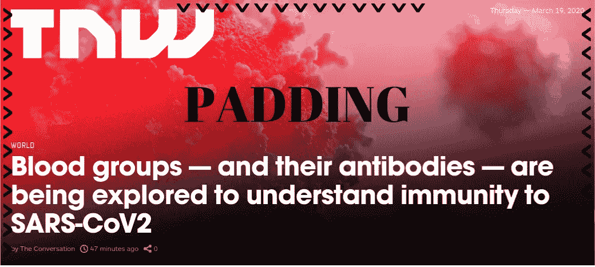

我们可以通过从文章标签中选择 div 来做到这一点:

```
article div {
  padding: 0.5rem 1.3rem;
}
```

对侧面使用 1.3 规则，对顶部和底部使用 1 规则，应该足以使外观与原始外观相似。

以防你正在考虑 rems vs 像素，让我告诉你，这是一个你不想要的辩论。尽管如此，你可以在这里阅读更多关于 rem vs px 的内容。

现在，让我们修复我们丑陋的列表，以便我们可以移动到字体样式和颜色，你可以想象的第一件事是从列表中删除要点:

```
article > div:last-child ul {
  list-style: none;
}
```

既然已经没有了项目符号，我们可以通过将列表转换为 flex 来对一行中的元素进行排序:

```
article > div:last-child ul {
  list-style: none;
  display: flex;
}
```

*我不需要解释最后一个孩子的选择器吧？；)*

让我们更改徽标图像的大小，使其在图片中看起来更有吸引力:

```
article div > img {
  width: 300px;
}
```

对于标题，我们将使用 48px 的字体大小:

```
article > div:last-child h2 {
  font-size: 48px;
}
```

对于 span 标签，我们想要一个不同的字体样式，它看起来与原来的相似，我们必须使所有的字母大写:

```
article > div:last-child span {
  text-transform: uppercase;
  font-family: roboto, san-serif;
}
```

列表中的元素需要一些额外的填充，以便它们可以在元素之间有一些空间(边长 0.3 毫米应该足够了):

```
article ul > li {
  padding: 0 0.3rem;
}
```

现在它开始看起来更像原来的了，对吗？

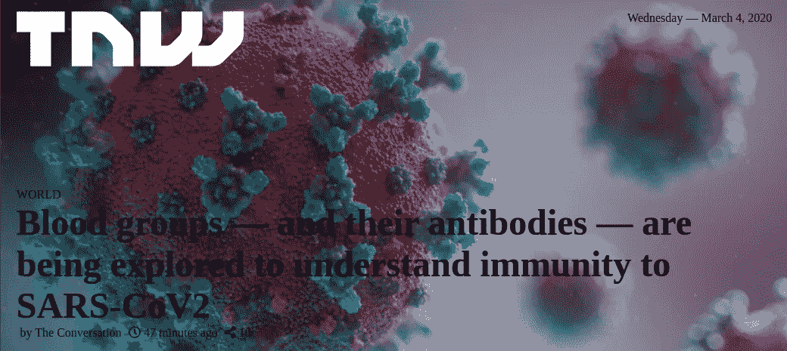

最后要添加的是颜色。

```
color: hsla(0,0%,100%,.6); Add this inside ul
color: white; Add this inside of article tag
```

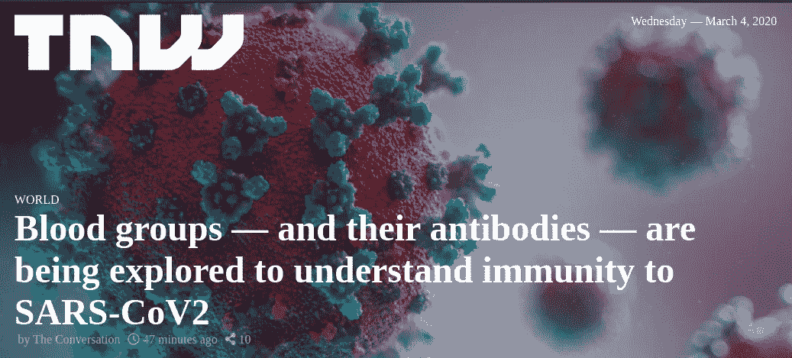

> 如果你的照片和这张一模一样，那么恭喜你！🎉

红色渐变的时间到了…你认为我会忘记什么？

这是最有趣的部分，我欢迎你的任何建议。；)

对于红色渐变，因为我们只有一篇文章，我们将在 Html 文件中的文章标记之外创建一个 span 标记。

```
<span> </span>  // outside of <article>
```

现在我们给它一个类名“红色效果”,或者你可以给它另一个名字。

```
<span class="red-effect"></span>
```

还记得我们在文章中用于背景的线性渐变吗？嗯…你猜怎么着？是的，回来了！

```
linear-gradient(120deg, rgba(238, 73, 44, 1) 0%, rgba(238, 73, 44, 1) 0%, rgba(255, 255, 255, 0) 64%);
```

然后…停在那里！

在你复制和粘贴这个线性渐变之前，我想给你解释一下线性渐变里面发生了什么。😅

首先，让我们把线性梯度转换成更简单的东西来解释:

```
linear-gradient(45deg, red, blue);
```

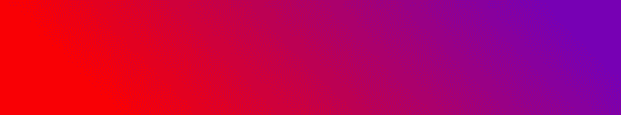

这是 developer.mozilla.org 的一个例子

本例中的 45 度代表渐变起点的位置，我们也可以切换位置命令的角度，如“向左、向右、到底”，可以是 270 度、90 度或 180 度。

```
linear-gradient(135deg, orange, orange 60%, cyan);
```

颜色右边的百分比代表长度。

还是很困惑？嗯……我不是专家，但我可以推荐你去读读帕特里克·布罗塞特关于线性渐变的大师课。

现在，让我们坚持基本的，并利用一个强大的工具，我用来创建我的红色线性梯度(一个你几乎复制)。

[我们将使用这个工具来创建我们的红色渐变。](https://cssgradient.io/)

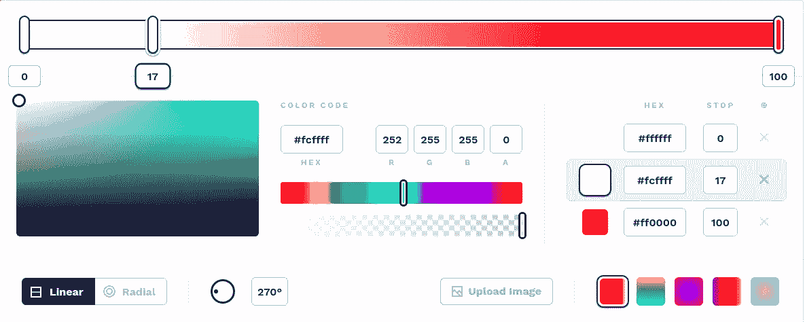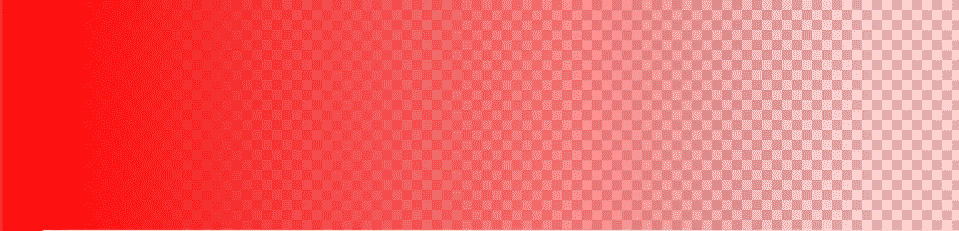

正如你记得在原始图片中，红色集中在左边，但当它移动到右边时开始消失。

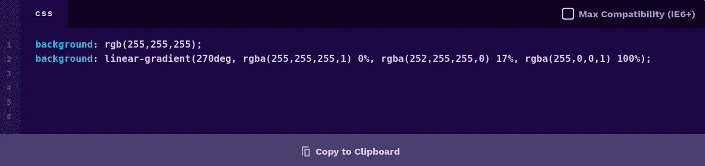

在网站的底部，您可以找到您的代码，准备好进行复制和粘贴。现在，我将坚持使用我已经创建的前一个工具，但是您也可以使用这个工具来创建您自己的工具。

现在我们的 span 标记应该是这样的:

```
.red-effect {
  background: linear-gradient(120deg, rgba(238, 73, 44, 1) 0%,   rgba(238, 73, 44, 1) 0%, rgba(255, 255, 255, 0) 64%);
}
```

我们必须给它和文章一样的大小，这样它才能覆盖整个图片而不留空间:

```
.red-effect {
  background: linear-gradient(120deg, rgba(238, 73, 44, 1) 0%, rgba(238, 73, 44, 1) 0%, rgba(255, 255, 255, 0) 64%);
  width: 1040px;
  height: 467px;
}
```

最后，我们将利用 z-index，它允许我们的渐变停留在文本之后，但仍然在图像背景之上。此外，我们正在利用 position: absolute，这样我们的 span 可以在 body 容器内自由移动。

```
position: absolute;
z-index: 0;
```

我们还需要将 z-index 添加到文章内部的 div 块中:

```
article div {
  padding: 1rem 1.3rem;
  z-index: 0;
}
```

关于 z-index 的问题？[你可以在这里阅读更多关于 z-index 的内容，甚至可以在这篇由 MaryAnn Chukwuka 撰写的不可思议的文章中用 CSS 重建一座不可思议的 3D 房子。](https://hackernoon.com/how-to-create-a-3d-art-model-with-css3-ilt32wp)

所以现在我们最终的“红色效果”类应该是这样的:

```
.red-effect {
  background: linear-gradient(120deg, rgba(238, 73, 44, 1) 0%, rgba(238, 73, 44, 1) 0%, rgba(255, 255, 255, 0) 64%);
  position: absolute;
  z-index: 0;
  width: 1040px;
  height: 467px;
}
```

最后的结果是这样的:

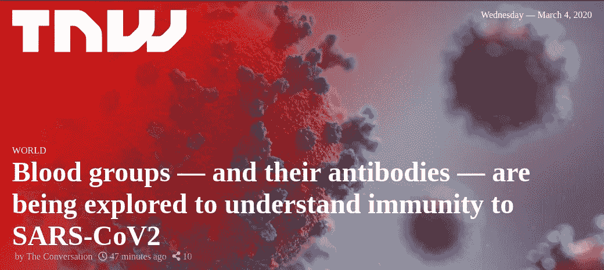

对于使红色渐变和徽标在移动屏幕中消失的最后一种效果，您只需添加一个媒体查询并选择这些元素:

```
[@media](http://twitter.com/media) (max-width: 460px) {
  .red-effect,
  article div > img {
    display: none;
  }
}
```

我不会在 codepen.io 实例中添加这一部分，这样人们就可以在没有剧透的情况下在手机上查看最终结果。；)

我们完成了！

如果你设法按照完整的教程，并重新创建图片，那么恭喜你！去拿瓶汽水或啤酒，因为这是你应得的！🍻

你想看看其他例子吗？ [**用推特**](https://twitter.com/idgm5) **或** [**让我知道如果你有任何问题就发邮件给我**](https://github.com/ghamtre) **！📣**

[](https://skilled.dev) [## 编写面试问题

### 跳到内容一个完整的平台，在那里我会教你找到下一份工作所需的一切和技巧…

技术开发](https://skilled.dev)