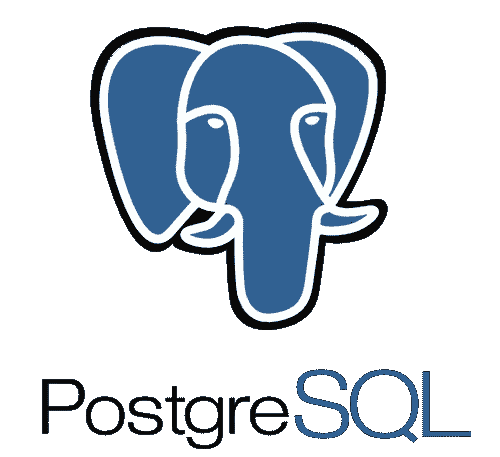
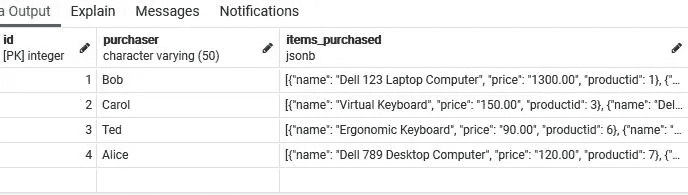
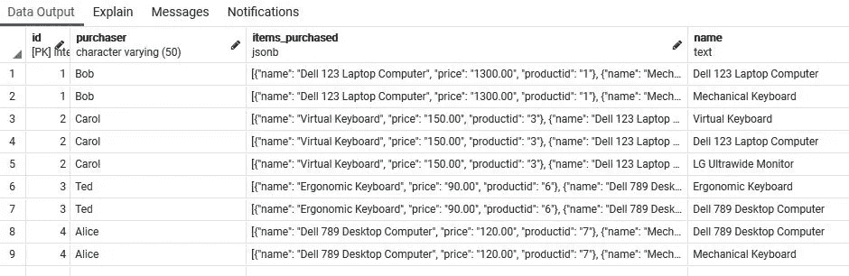
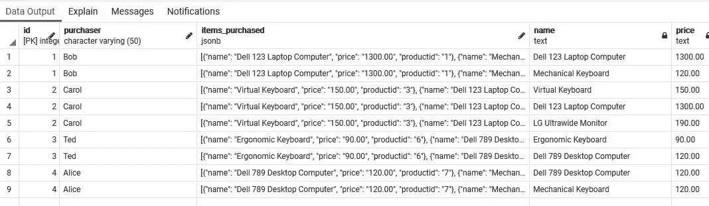
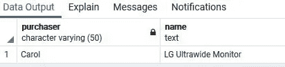
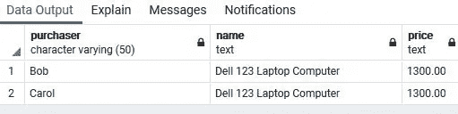
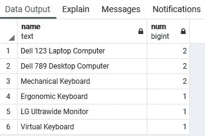

# 如何在 PostgreSQL 中将 JSONB 对象数组作为记录集进行查询

> 原文：<https://levelup.gitconnected.com/how-to-query-a-json-array-of-objects-as-a-recordset-in-postgresql-a81acec9fbc5>

## 数据库提示

使用 jsonb_to_recordset()函数将对象数组转换为行



来源。PostgreSQL Wiki

PostgreSQL 是一个很棒的数据库，有一个很棒的数据类型，JSON。它实际上有两种 json 数据类型，JSON 和 jsonb。

> JSON 数据类型用于存储 JSON (JavaScript 对象表示法)数据。
> 
> 有两种 json 数据类型:JSON 和 jsonb。它们接受几乎相同的一组值作为输入。主要的实际差异在于效率。json 数据类型存储输入文本的精确副本，处理函数必须在每次执行时重新解析该副本；而 jsonb 数据是以分解的二进制格式存储的，由于增加了转换开销，这使得输入速度稍慢，但处理速度明显加快，因为不需要重新解析。jsonb 还支持索引，这是一个显著的优势。

*   通常建议使用 jsonb。
*   PostgreSQL 有丰富的[函数和运算符](https://www.postgresql.org/docs/9.4/functions-json.html)来查询这种数据类型。

# 我们的目标

在本文中，我们将特别关注**的一个功能:**

**jsonb_to_recordset(jsonb 数据)。**

> 当您有一个对象数组，并且想要使用包括通配符在内的标准比较运算符来查询一个或多个键值时，此函数特别有用。

**例如**，我们可能有这样的 jsonb 数据，显示客户购买的产品。

```
[{
  "productid": "3",
  "name": "Virtual Keyboard",
  "price": "150.00"}, {
  "productid": "1",
  "name": "Dell 123 Laptop Computer",
  "price": "1300.00"},
 {
  "productid": "8",
  "name": "LG Ultrawide Monitor",
  "price": "190.00"}
]
```

如果我们有几个客户，他们的购买存储在一个 jsonb 列中，我们可能想知道这样的事情，

*   谁购买了虚拟键盘(**Where name = ' Virtual Keyboard '**)
*   谁买过任何一种键盘(**其中名字像“%Keyboard** )
*   谁购买了笔记本电脑和键盘(**其中名称像“%Laptop%”或名称像“% Keyboard”**)
*   每种产品(名称)的购买数量。

当然还有很多其他的。

# 假设

我假设你有 [PostgreSQL](https://www.postgresql.org/) 和类似 [pgAdmin](https://www.pgadmin.org/) 的东西。

# 我们开始吧

## 构建我们的数据

1.  打开 **pgAdmin** ，根据需要创建一个数据库。
2.  右击数据库名称，选择**查询工具**。
3.  运行下面的代码片段来创建一个简单的表，该表有一个 id、购买者姓名和一个存储 json 对象数组的 ***jsonb 列，该数组将存储购买的商品。***

```
CREATE TABLE public.purchases
(
    id   serial PRIMARY KEY,
    purchaser varchar(50),
    items_purchased jsonb
);
```

4.运行下面的代码片段，将四条记录插入到表中。

```
INSERT INTO purchases (purchaser,items_purchased) VALUES ('Bob','[{
  "productid": "1",
  "name": "Dell 123 Laptop Computer",
  "price": "1300.00"},
 {
  "productid": "2",
  "name": "Mechanical Keyboard",
  "price": "120.00"}
]');INSERT INTO purchases (purchaser,items_purchased) VALUES ('Carol','[{
  "productid": "3",
  "name": "Virtual Keyboard",
  "price": "150.00"}, {
  "productid": "1",
  "name": "Dell 123 Laptop Computer",
  "price": "1300.00"},
 {
  "productid": "8",
  "name": "LG Ultrawide Monitor",
  "price": "190.00"}
]');INSERT INTO purchases (purchaser,items_purchased) VALUES ('Ted','[{
  "productid": "6",
  "name": "Ergonomic Keyboard",
  "price": "90.00"},
 {
  "productid": "7",
  "name": "Dell 789 Desktop Computer",
  "price": "120.00"}
]');INSERT INTO purchases (purchaser,items_purchased) VALUES ('Alice','[{
  "productid": "7",
  "name": "Dell 789 Desktop Computer",
  "price": "120.00"},
 {
  "productid": "2",
  "name": "Mechanical Keyboard",
  "price": "120.00"}
]');
```

5.运行下面的代码片段，

```
select * from purchases;
```



购买商品的 jsonb 列

# 我们的职能

## 了解 jsonb_to_recordset(jsonb 数据)

> 从 JSON 对象数组构建任意一组记录(参见下面的注释)。与所有返回记录的函数一样，调用者必须用 As 子句显式定义记录的结构。

注意:

> 提取的键值可以在查询的其他部分引用，比如 WHERE 子句。

调用者必须用一个 AS 子句明确定义记录的结构。“意思是？

这基本上意味着我们正在定义记录集的结构、*列和它们的数据类型*。类似于定义关系表结构。

检查以下代码。

```
select * from purchases,**jsonb_to_recordset**(purchases.**items_purchased**) as **items(name text)**;
```

*   在 FROM 子句中，我们引用表和 jsonb 列 purchases.items，它被传递给 jsonb_to_recordset()函数。它返回一组键/值对，我们必须为其定义存储。
*   在 AS 子句中我们选择了一个*任意的*名、项，用于我们的记录集结构、键/值的存储。
*   圆括号中是我们需要的键的逗号分隔列表(在本例中只是 name)及其数据类型 text。
*   对于每个键，当查询运行时会创建一个新列。
*   因为创建了一个新列，所以我们可以在 Select、Where、Group By 和 Order by 子句中引用它。

运行上面的代码，



观察新列 name。对象键是列名，值是数据。

尝试使用这个代码片段创建两列。

```
select * from purchases,jsonb_to_recordset(purchases.items_purchased) as items(name text, price text);
```



观察两个新的列和数据

# 使用我们的新色谱柱

既然我们已经能够从 jsonb 键创建列，我们可以在 Select、Where、Group By 和 Order By 子句中引用它们。

## 尝试以下每一种方法

1.  使用 Select 和 Where 中的列

```
select purchaser,**items.name** from purchases,jsonb_to_recordset(purchases.items_purchased) as items(name text)
where **items.name** like '%Monitor';
```



2.使用 Select 和 Where 中的列

```
select purchaser,items.name, items.price from purchases,jsonb_to_recordset(purchases.items_purchased) as items(name text, price text)
where TO_NUMBER(items.price,'9999')>=1000
```

注意:因为我们的价格是文本，我们需要转换成数字。更多关于 TO_NUMBER()的内容可以在[这里](https://www.postgresqltutorial.com/postgresql-to_number/)找到。



3.使用分组依据中的列

```
select items.name, count(*) as num from purchases,jsonb_to_recordset(purchases.items_purchased) as items(name text)
group by items.name
order by num Desc
```



# 结论

如前所述，这不是唯一的 JSON 函数。JSON 数据有许多函数和操作符。

我每天都在探索它们，因为我为 PERN 堆栈构建了一个 RESTful API。

如果您觉得这很有用，可以开始研究 json、jsonb 和 JSON 的其他操作符和函数，以及 PostgreSQL 中可用的常规 SQL 操作。

感谢您的阅读和编码！

*尽情阅读，加入 Medium 帮我继续写*

[](https://bobtomlin-70659.medium.com/membership) [## 通过我的推荐链接加入灵媒——重力井(罗伯·汤姆林)

### 作为一个媒体会员，你的会员费的一部分会给你阅读的作家，你可以完全接触到每一个故事…

bobtomlin-70659.medium.com](https://bobtomlin-70659.medium.com/membership) 

**你也可以享受，**

[](/working-with-the-array-data-type-in-postgresql-1e6fecdb51fe) [## 在 PostgreSQL 中使用数组数据类型

### 创建、获取、修改、添加和删除数组中的数据

levelup.gitconnected.com](/working-with-the-array-data-type-in-postgresql-1e6fecdb51fe) [](/creating-a-data-pagination-function-in-postgresql-2a032084af54) [## 在 PostgreSQL 中创建数据分页函数

### 使用 LIMIT、OFFSET 和 FETCH NEXT 运算符。

levelup.gitconnected.com](/creating-a-data-pagination-function-in-postgresql-2a032084af54) [](/working-with-a-jsonb-array-of-objects-in-postgresql-d2b7e7f4db87) [## 在 PostgreSQL 中使用 JSONB 对象数组

### 从数组中获取、添加和移除 JSON 对象

levelup.gitconnected.com](/working-with-a-jsonb-array-of-objects-in-postgresql-d2b7e7f4db87) [](https://medium.com/javascript-in-plain-english/querying-sql-server-in-node-js-using-async-await-5cb68acf2144) [## 使用 Async/Await 在 Node.js 中查询 SQL Server

### 一种更简洁的数据库查询方式

medium.com](https://medium.com/javascript-in-plain-english/querying-sql-server-in-node-js-using-async-await-5cb68acf2144) [](https://medium.com/javascript-in-plain-english/how-to-download-files-from-an-amazon-s3-bucket-to-a-sql-server-rds-a6d20f3b9014) [## 将 AWS S3 中的文件下载到 SQL Server RDS

### 并将内容大容量装载到一个表中

medium.com](https://medium.com/javascript-in-plain-english/how-to-download-files-from-an-amazon-s3-bucket-to-a-sql-server-rds-a6d20f3b9014)