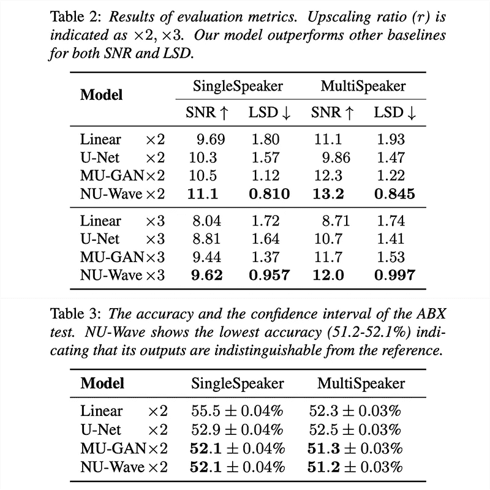

# 如何使用 PyTorch 提高音频质量

> 原文：<https://levelup.gitconnected.com/how-to-raise-audio-quality-using-a-pytorch-implementation-of-nu-wave-on-wsl2-e3dd979056e0>

## 深度学习

## 带有逐步说明的漂亮而简单的教程


瑞安·莫雷诺拍摄的图片

## 预览:

| [GitHub](https://github.com/mindslab-ai/nuwave) | [论文](https://arxiv.org/abs/2104.02321) | [音频样本](https://mindslab-ai.github.io/nuwave/) |

## 总结:

该存储库提高了较低质量音频文件的音频质量。它可以将音频文件的采样率从 16 kHz 或 24 kHz 提高到 48 kHz。默认情况下，它使用 48 kHz 采样速率和单声道声音加载数据集。它通过对数据进行下采样和上采样来修改加载的数据集。它还通过将修改后的数据与原始数据进行比较来训练模型。

## 目录:

1.  [知识库背景](#5d65)
2.  [安装要求](#0313)
3.  [安装仓库](#e328)
4.  [准备数据集](#0d0f)
5.  [训练模型](#012e)
6.  [恢复训练](#735b)
7.  [测试模型](#3106)
8.  [用自定义数据测试模型](#159e)

## 附录:

1.  [教程:人工智能设置](#50ec)
2.  [教程:人工智能课程](#c3c2)
3.  [教程:人工智能知识库](#e533)

## 存储库背景:

**NU-Wave:** 使用扩散概率模型从低采样率信号生成具有全频带宽度的高采样率音频信号的储存库。它应用 DiffWave 和 WaveGrad 架构，并对其噪声水平嵌入和局部调节器进行了修改。

*   它使用 16 kHz 或 24 kHz 采样速率的课程音频来产生几乎无法与源区分的 48 kHz 高质量音频。
*   它在信噪比(SNR)、对数谱距离(LSD)和 ABX 测试精度方面的性能均优于当时公认的性能指标评测标准线性插值、U-Net 和 MU-GAN。



图片由 [Nuwave](https://arxiv.org/pdf/2104.02321.pdf) 提供

## 安装要求:

这一节是关于安装操作系统运行特定存储库所需的各种软件。它可以包括更新包管理器、下载包管理器、安装包管理器以及向包管理器授予权限。它还可能涉及对所需的任何程序执行相同的过程。

```
**# open the bash shell on windows**
1\. press “⊞ windows”
2\. enter “wsl” into the search bar
3\. click “wsl”**# update the information about linux programs** 
sudo apt update**# upgrade the linux programs**
sudo apt --yes upgrade**# store the account account name**
username=$(wslvar username)**# install the linux programs** sudo apt install --yes axel unzip git ffmpeg**# install the youtube downloader**
sudo axel --num-connections 10 --output /usr/local/bin/yt-dlp [https://github.com/yt-dlp/yt-dlp/releases/latest/download/yt-dlp](https://github.com/yt-dlp/yt-dlp/releases/latest/download/yt-dlp)**# grant permissions to the youtube downloader** 
sudo chmod a+rx /usr/local/bin/yt-dlp**# install virtualenv to create virtual environments**
python -m pip install virtualenv
```

## 安装存储库:

这一节是关于准备在 python 中运行的存储库。它包括下载存储库、创建虚拟环境、激活虚拟环境以及安装必要的 python 程序。它还可能涉及从源代码安装存储库，以及使用特定的 python 包管理器、python 版本和 python 程序版本。

```
**# navigate to the desktop directory**
cd /mnt/c/users/$username/desktop/ **# install the nu-wave repository**
git clone [https://github.com/mindslab-ai/nuwave.git](https://github.com/mindslab-ai/nuwave.git) **# navigate to the nu-wave repository** cd nuwave **# create the python virtual environment**
python -m virtualenv venv **# activate the python virtual environment**
source venv/bin/activate **# install the python programs**
python -m pip install -r requirements.txt **# install an additional python program**
python -m pip install matplotlib
```

## 准备数据集:

本节是关于准备要加载到模型中的数据集。它包括下载、解包和将数据分成训练集、验证集和测试集。它可能涉及扩充数据、规范化数据、转换数据以及将数据转换成其他格式。它还包括删除不必要的、重复的和不一致的数据。

```
**# download the dataset**
axel --insecure --output vctk-corpus.zip [https://datashare.ed.ac.uk/bitstream/handle/10283/3443/VCTK-Corpus-0.92.zip](https://datashare.ed.ac.uk/bitstream/handle/10283/3443/VCTK-Corpus-0.92.zip?sequence=2&isAllowed=y)**# make the dataset directory**
mkdir -p datasets/vctk-corpus **# unzip the dataset**
unzip vctk-corpus.zip -d datasets/vctk-corpus/**# rename the** **wav48_silence_trimmed** **subdirectory to wav48**
mv datasets/vctk-corpus/wav48_silence_trimmed datasets/vctk-corpus/wav48**# remove the incompatible data from the dataset** rm -rf datasets/vctk-corpus/wav48/p280 datasets/vctk-corpus/wav48/p315**# set the data subdirectory in the yaml file** sed "s|"/DATA1/VCTK/VCTK-Corpus/wav48"|"/mnt/c/users/${username}/desktop/nuwave/datasets/vctk-corpus/wav48/"|" -i hparameter.yaml**# convert the wav files to pt files** python utils/wav2pt.py
```

## 训练模型:

本节是关于训练模型使用指定的设置进行预测。它可以包括指定预处理数据集位置、预训练模型位置和保存位置。它可以包括指定时期数、学习率和批量大小。它还可能涉及指定存储库特有的各种其他设置。

```
**# store the number of available workers** workers=$(nproc | awk '{ $0 = $0 - 2; print }')**# set the number of workers in the yaml file** sed "s|"num_workers: 64"|"num_workers: ${workers}"|" -i hparameter.yaml**# change "1" to a higher number based on the number of gpus**
gpus=1**# set the number of gpus in the yaml file** sed "s|"gpus: 2"|"gpus: ${gpus}"|" -i hparameter.yaml**# change "4" to a higher or lower number based on the gpu memory**
batch_size=4**# set the batch size in the yaml file**
sed "s|"batch_size: 18"|"batch_size: ${batch_size}"|" -i hparameter.yaml**# train the model for at least 300 epochs** python trainer.py
```

## 继续培训:

本节是关于从指定的检查点继续训练过程。它可以包括指定检查点位置、类型和纪元编号。它可能涉及指定相同的设置，以便从指定的检查点训练相同的模型。它还可以包括指定不同的设置来微调模型和实现各种训练技术。

```
**# change "150" to the epoch number of the last checkpoint** 
epoch_number=150**# continue training the model**
python trainer.py --resume_from ${epoch_number}
```

## 使用自定义数据测试模型:

本节是关于使用具有指定设置的训练模型来处理验证集中的数据。它可以包括检查日志文件以找到具有最低验证损失值的纪元编号。它可以包括指定检查点位置、类型和纪元编号。它还可能涉及指定存储库特有的各种其他设置。

```
**# change "300" to the epoch number of the last checkpoint** 
epoch_number=300**# test the model on files in the valid subdirectory**
python for_test.py --resume_from ${epoch_number} --save**# review the results** explorer.exe "c:\users\\${username}\desktop\nuwave\test_sample\result\"
```

## 使用自定义数据测试模型:

本节是关于使用具有指定设置的训练模型来处理自定义数据集中的数据。它可能涉及查找、下载、转换和转化自定义数据集中的数据。它可以包括指定检查点位置、类型和纪元编号。它还可能涉及指定存储库特有的各种其他设置。

```
**# select a youtube video that's less than 15 seconds**
1\. visit the y[outube](https://www.youtube.com/) website
2\. find a video with ok sound quality**# change the url to the url of the selected youtube video**
url=[https://www.youtube.com/watch?v=V1QidirATFc](https://www.youtube.com/watch?v=V1QidirATFc)**# make the custom dataset subdirectory**
mkdir -p datasets/custom/session**# download the youtube video as a wav file** yt-dlp --extract-audio --audio-format flac -o "datasets/custom/session/%(title)s.%(ext)s" ${video_url}**# set the data subdirectory in the yaml file** sed "s|"/mnt/c/users/${username}/desktop/nuwave/datasets/vctk-corpus/wav48/"|"/mnt/c/users/${username}/desktop/nuwave/datasets/custom/"|" -i hparameter.yaml**# convert the wav files to pt files**
python utils/wav2pt.py**# change "300" to the epoch number of the last checkpoint** 
epoch_number=300**# test the model on file in the session subdirectory**
python for_test.py --resume_from ${epoch_number} --save**# review the results**
explorer.exe "c:\users\\${username}\desktop\nuwave\test_sample\result\"
```

> "最后，记得订阅并按住鼓掌按钮，以获得定期更新和帮助."

## 附录:

这个博客的存在是为了提供完整的解决方案，回答你的问题，加速你与人工智能相关的进步。它提供了设置计算机和完成 fastai 课程前半部分所需的一切。它将让你接触到人工智能子领域中最先进的知识库。它也将涵盖 fastai 课程的后半部分。

## 教程:人工智能设置

本节提供了设置电脑所需的一切。

```
**# linux**
01\. [install and manage multiple python versions](https://medium.com/p/916990dabe4b)
02\. [install the nvidia cuda driver, toolkit, cudnn, and tensorrt](https://medium.com/p/cd5b3a4f824)
03\. [install the jupyter notebook server](https://medium.com/p/b2c14c47b446)
04\. [install virtual environments in jupyter notebook](https://medium.com/p/1556c8655506)
05\. [install the python environment for ai and machine learning](https://medium.com/p/765678fcb4fb)
06\. [install the fastai course requirements](https://medium.com/p/116415a9df22/)**# wsl 2**
01\. [install windows subsystem for linux 2](https://medium.com/p/cbdd835612fb)
02\. [install and manage multiple python versions](https://medium.com/p/1131c4e50a58)
03\. [install the nvidia cuda driver, toolkit, cudnn, and tensorrt](https://medium.com/p/9800abd74409) 
04\. [install the jupyter notebook server](https://medium.com/p/7c96b3705df1)
05\. [install virtual environments in jupyter notebook](https://medium.com/p/3e6bf456041b)
06\. [install the python environment for ai and machine learning](https://medium.com/p/612240cb8c0c)
07\. [install ubuntu desktop with a graphical user interface](https://medium.com/p/95911ee2997f)
08\. [install the fastai course requirements](https://medium.com/p/15a77fc7e301/)**# windows 10**
01\. [install and manage multiple python versions](https://medium.com/p/4876738e7aa0)
02\. [install the nvidia cuda driver, toolkit, cudnn, and tensorrt](https://medium.com/p/af58647b6d9a/)
03\. [install the jupyter notebook server](https://medium.com/p/e8f3e9436044)
04\. [install virtual environments in jupyter notebook](https://medium.com/p/5c189856479)
05\. [install the python environment for ai and machine learning](https://medium.com/p/23c34b2baf12)
06\. [install the fastai course requirements](https://medium.com/p/90236724f881/)**# mac** 01\. [install and manage multiple python versions](https://medium.com/p/ca01a5e398d4)
02\. [install the jupyter notebook server](https://medium.com/p/2a276f679e0)
03\. [install virtual environments in jupyter notebook](https://medium.com/p/e3de97491b3a)
04\. [install the python environment for ai and machine learning](https://medium.com/p/2b2353d7bcc3)
05\. [install the fastai course requirements](https://medium.com/p/90fdd524bc82)
```

## 教程:人工智能课程

本部分包含每课结束时对问卷的回答。

```
**# fastai course** 01\. [chapter 1: your deep learning journey q&](https://medium.com/p/6f266bdb1340/)a
02\. [chapter 2: from model to production q&a](https://medium.com/p/5a0902207f5b)
03\. [chapter 3: data ethics q&a](https://medium.com/p/501bb37ca30d)
04\. [chapter 4: under the hood: training a digit classifier q&a](https://medium.com/p/89077906197e/)
05\. [chapter 5: image classification q&a](https://medium.com/p/aa7cacdeab1/)
06\. [chapter 6: other computer vision problems q&a](https://medium.com/p/aa7cacdeab1/)
07\. [chapter 7: training a state-of-the-art model q&a](https://medium.com/p/6f6dcc83dd9f/)
08\. [chapter 8: collaborative filtering deep dive q&a](https://medium.com/p/52d3583d626b/)
```

## 教程:人工智能库

这个部分包含不同子领域中的最先进的知识库。

```
**# repositories related to audio** 01\. [raise audio quality using nu-wave](https://medium.com/p/e3dd979056e0/)
02\. [change voices using maskcyclegan-vc](https://medium.com/p/8bdfeb1faecb/)
03\. [clone voices using real-time-voice-cloning toolbox](https://medium.com/p/7b8609438001/)**# repositories related to images**
01\. [achieve 90% accuracy using facedetection-dsfd](https://medium.com/p/9c9fefb3f863/)
```