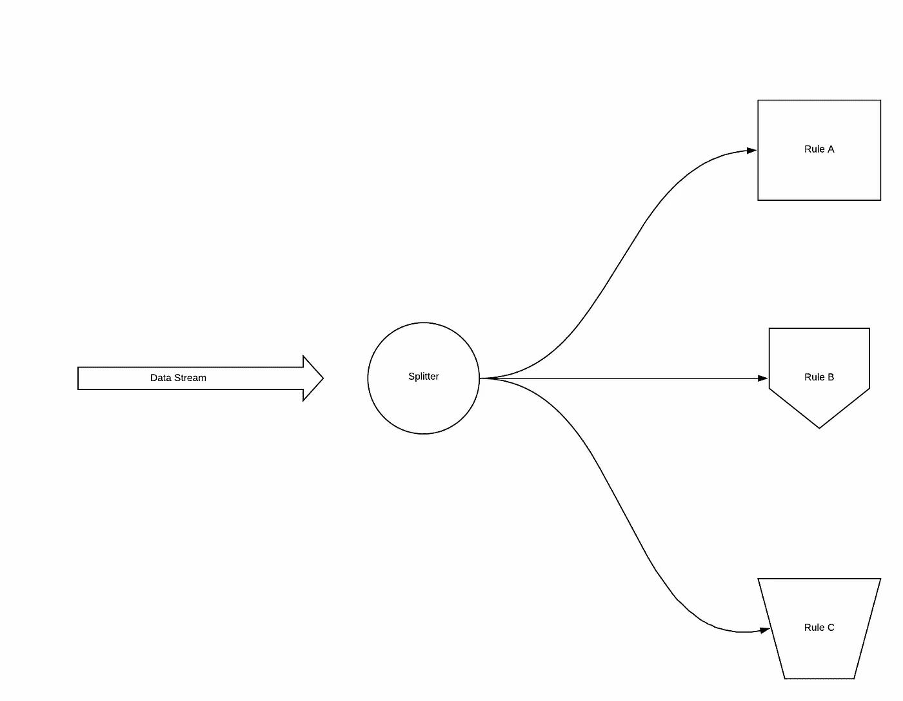

# 如何按百分比随机分割数据流中的元素

> 原文：<https://levelup.gitconnected.com/how-to-randomly-split-up-elements-from-a-stream-of-data-by-percentage-81434d040e50>



*最初发表于*[*【https://edward-huang.com】*](https://edward-huang.com/scala/algorithm/software-development/programming/tech/2020/03/10/how-to-randomly-split-up-an-elements-from-a-stream-of-data-in-percentage/)*。*

几周前，我被分配到一个需要创建规则引擎的项目中。规则引擎具有一个功能，即用户能够创建一个配置来分配特定的规则，以获得输入有效负载的百分比。例如，用户可以指定规则 A 接收 20%的有效负载，规则 B 接收 40%的有效负载，规则 C 接收 40%的有效负载。

你已经在很多 A/B 测试框架中看到过。您将系统配置为接收 40%的用户流量来呈现文本 A，而接收 60%的用户流量来呈现文本 b。

您还看到了在“智能”负载平衡分配算法中发生的情况，您可以自动将 20%配置给服务器 A，30%配置给服务器 B，50%配置给服务器 c。

在不知道即将到来的数据量的情况下，这些 A/B 测试框架和负载平衡器如何分配特性？

在这篇文章中，我想分享一下我是如何解决这个问题的，我希望我的回答也能让其他遇到同样问题的人受益。

首先，我搜索了所有关于流算法的相关文章。然而，那些流算法最终具有大量统计分析且实现起来非常复杂。

传入的有效载荷不需要精确。它需要在每次分配中得到一个估计的百分比数。所以，经过研究，我总结了两个解决方案。

# 掷骰子

掷骰子解决方案是基于随机生成器来选择哪个部分来分配来自流的元素。

想象一下，如果你有 70-30 的机会把进来的元素分配给 A 或 b。

当你收到进来的元素时掷骰子。如果骰子数在 1 到 4.2 之间，将值赋给 a。如果骰子数在 4.3 到 6 之间，将值赋给 b。

```
import scala.util.Random

var A = 0 *// 20%* var B = 0 *// 30%* var C = 0 *// 50%* 

(1 to 100000).foreach{ _ =>
  val random = new Random().nextInt(100)
  if(random < 20) {
    A += 1
  } else if(random >= 20 && random <50) {
    B += 1
  } else {
    C += 1
  }
}

println(s"${A}  ${B} ${C}")
```

这种方法的优点之一是易于实现。

接收元素时运行随机生成器。如果结果在 0 到 60 之间，分配给 a。如果结果在 70 到 99 之间，分配给 b。

如果你反复运行上面的函数，你会发现粗略估计的数量是 20–30–50。

但是，如果应用程序没有大量数据要消耗，使用随机生成器来拆分元素可能会导致 A 和 b 的数据消耗不成比例。

如果只有 100 个传入数据，使用掷骰子可能会导致 20%的数据传到 A，80%的数据传到 b。

由于赋值是估计的，我们可以从[大数定律](https://en.wikipedia.org/wiki/Law_of_large_numbers)中确定该算法接近精确。

# 缓冲溶液

另一种解决方案是使用缓存来存放传入的元素，直到它达到一个固定的数目。当缓存达到固定数量时，根据百分比将数据集分配到 A 和 B 中。

我称之为缓冲解决方案——它就像缓冲一样，在将所有字节刷新到输出流之前，它会一直等待，直到达到传入的字节数，然后一次性将它们全部赋值。

想象一下上面的例子，你需要分配 70%的流量给 A，30%给 b。

使用缓冲区解决方案，您可以创建一个存储 1000 个传入数据流的缓存。一旦缓存达到 1000 个传入数据，将该传入数据的 70%分配给 A，30%分配给 b。然后，通过让缓存数据通过来清除。在缓存中检索接下来的 1000 个数据。

该解决方案解决了掷骰子解决方案的问题，其中数据可能分布不均匀。然而，缓冲解决方案更难实现和维护。您需要在系统中引入缓存功能，并在以后维护状态。由于系统中涉及额外的 IO，系统的性能也可能受到影响。

这两个方案是我在网上无数次调研，看了一些白皮书后提出的方案。然而，当它偏离期望状态时，可以通过创建更精确的概率来优化该解决方案。

如果您有任何其他建议的解决方案或如何解决这个问题，请在下面分享您的解决方案。

# 来源

[JavaScript——在不知道元素总数的情况下从数据流中随机拆分元素——堆栈溢出](https://stackoverflow.com/questions/57482822/randomly-split-up-elements-from-a-stream-of-data-without-knowing-the-total-numbe)

**感谢阅读！如果你喜欢这篇文章，请随意订阅我的时事通讯，每周都会收到关于科技职业的文章、有趣的链接和内容。**

你可以关注我，也可以在[媒体](https://medium.com/@edwardgunawan880)上关注我，以获得更多类似的帖子。