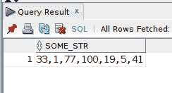
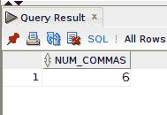
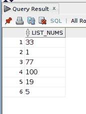
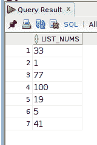
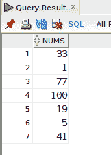
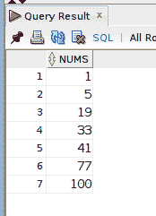
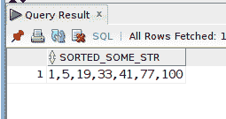
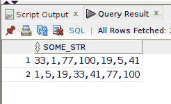

# 如何在 Oracle SQL 中对逗号分隔的列表重新排序

> 原文：<https://levelup.gitconnected.com/how-to-re-order-a-comma-separated-list-in-oracle-sql-eb5f9733c5cd>

假设您有一个由数字组成的逗号分隔列表，并且您希望它按从小到大的顺序排序。继续阅读，看看我在继续学习 Oracle SQL 时想到的一个工作示例…

自我推销:

如果你喜欢这里写的内容，尽一切办法，把这个博客和你最喜欢的帖子分享给其他可能从中受益或喜欢它的人。既然咖啡是我最喜欢的饮料，如果你愿意，你甚至可以给我买一杯！

**注意**:和任何事情一样，*你能做某件事并不一定意味着你应该去做*。这篇文章主要是对我将来学习 Oracle 数据库提供的一些 regex 函数的反思和记录。

我有一个简单的表，其中一列的数据类型为`VARCHAR2`:

存储在 VARCHAR2 列中的逗号分隔列表。

单行数据是逗号分隔的非连续数字列表。如果您想对数字进行排序，可能有几种方法可以实现。我在这个例子中使用了一些 regexp(正则表达式)函数。

## 使用 REGEXP_COUNT()确定元素的数量

首先你需要知道列表中有多少个元素。您可以通过计算逗号的数量并将该值加 1 来确定这一点。在下面的查询中，我使用了`REGEXP_COUNT()`函数并返回列表中逗号的数量。

使用 REGEXP_COUNT()计算逗号的数量。

为了遍历数字列表并每行返回一个元素，我使用了`CONNECT BY`子句和`REGEXP_COUNT()`返回的逗号数。

请注意，查询结果中缺少一个元素。因为我使用`REGEXP_COUNT()`遍历列表的次数等于逗号数，所以我需要给这个值加 1。回想一下，有 6 个逗号，但有 7 个元素。

与上面相同的查询，但是这次我在由`REGEXP_COUNT()`返回的总数上加 1，以便迭代正确的次数。

将 REGEXP_COUNT()返回值加 1。

## 使用 REGEXP_SUBSTR()将列表分割成单独的元素

在下一个查询中，`REGEXP_SUBSTR()` 函数用于*分割*逗号上的列表，返回每个单独的数字元素。使用`to_number()`函数，我将每个元素转换成一个实际的整数值。

使用 to_number()函数转换单个元素。

为了更容易处理，我使用了一个`WITH`子句并创建了一个临时结果集来进一步从`SELECT`开始，并按照`ASC`顺序对列表元素进行排序:

对数字元素排序。

我坚持每周写一封关于我正在学习并感兴趣的 SQL/PHP 的邮件。如果这听起来像是你想参与的事情，请使用此[注册](https://digitalowlsprose.ck.page/1b35a06295)表格进行订阅。谢谢大家！

## 使用 LISTAGG()重新构建逗号分隔的列表

我现在使用`LISTAGG()`和`**to_char()**`函数创建一个逗号分隔的排序数字列表。

按顺序排序的逗号分隔列表。

## 好处:使用 WITH 子句插入数据

`WITH`子句(公共表表达式或子查询分解子句)的一个重要特性是，通过用逗号分隔每个`AS`部分，我们可以在同一个 CTE 中拥有多个子查询。我在下面的`INSERT`语句中利用这个特性，使用`WITH`子句作为带有`SELECT`类型查询的`INSERT`的数据源:

一旦执行了`INSERT`，我现在就有了按顺序排序的原始逗号分隔列表，并存储在`A_STR_TBL`表中:

存储在表 A_STR_TBL 中的逗号分隔的排序列表。

这是我*第一次接触*甲骨文的`REGEXP_SUBSTR()`和`REGEXP_COUNT()`功能。我知道随着我更多地使用数据库，我可能会再次使用它们。如果你看到任何错误或对代码有疑问，请在评论中自由分享。建设性的反馈帮助我提供准确的文章，非常感谢！

喜欢你读过的？看到什么不正确的吗？请在下面评论，感谢阅读！！！

# 行动的号召！

感谢你花时间阅读这篇文章。我真心希望你发现了一些有趣和有启发性的东西。请在这里与你认识的其他人分享你的发现，他们也会从中获得同样的价值。

访问[投资组合-项目页面](https://wp.me/P28ctb-3KD)查看我为客户完成的博客帖子/技术写作。

[**咖啡是我绝对喜欢的饮料！！！**](https://ko-fi.com/joshlovescoffee)

要在最新的博客文章发表时收到来自本博客(“数字猫头鹰散文”)的电子邮件通知(绝不是垃圾邮件)，请点击“点击订阅！”按钮在首页的侧边栏！(如有任何问题，请随时查看 [Digital Owl 的散文隐私政策页面](https://wp.me/P28ctb-3gI):电子邮件更新、选择加入、选择退出、联系表格等)

请务必访问[“最佳”](https://joshuaotwell.com/where-blog_post-in-digital-owls-prose-best-of/)页面，收集我的最佳博文。

[作为一名 SQL 开发人员和博客写手，Josh Otwell](https://joshuaotwell.com/about/) 热衷于学习和成长。其他最喜欢的活动是让他埋头于一本好书、一篇文章或 Linux 命令行。其中，他喜欢桌面 RPG 游戏，阅读奇幻小说，并与妻子和两个女儿共度时光。

免责声明:本文中的例子是关于如何实现类似结果的假设。它们不是最好的解决方案。所提供的大多数(如果不是全部)示例都是在个人发展/学习工作站环境中执行的，不应被视为生产质量或就绪。您的特定目标和需求可能会有所不同。使用那些最有利于你的需求和目标的实践。观点是我自己的。

*原载于 2021 年 7 月 21 日 https://joshuaotwell.com**[*。*](https://joshuaotwell.com/how-to-re-order-a-comma-separated-list-in-oracle-sql/)*