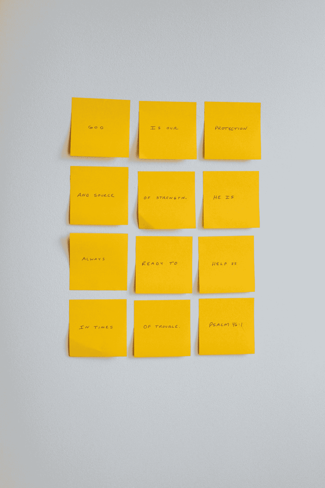

# 如何使用三关法阅读研究论文？

> 原文：<https://levelup.gitconnected.com/how-to-read-a-research-paper-using-the-three-pass-method-ca5453a19e0c>

[Firmbee.com](https://unsplash.com/@firmbee?utm_source=medium&utm_medium=referral)在 [Unsplash](https://unsplash.com?utm_source=medium&utm_medium=referral) 上拍照

阅读一篇研究论文似乎是一项令人生畏的任务，但是通过结构化的方法，它变得更容易管理。一个有效的方法是**三步法**，你在**三个不同的阶段阅读论文:**

照片由[内森·杜姆劳](https://unsplash.com/@nate_dumlao?utm_source=medium&utm_medium=referral)在 [Unsplash](https://unsplash.com?utm_source=medium&utm_medium=referral) 上拍摄

1.  第一遍:**这有助于你理解论文的内容。阅读标题、摘要、引言和结论。**确定章节和小节标题，浏览参考文献。在此过程中，尝试回答五个 c:类别、上下文、正确性、贡献和清晰性。这大约需要**5-10 分钟。**

在第一遍的过程中，你应该试着对论文的内容有一个大概的了解，以及它是否与你的需求相关。根据论文的相关性，你可能不需要读完这个阶段。

1.  第二遍:这是你抓住文章核心的地方。更加仔细地阅读论文，注意论点、证据和统计方法。确保**阅读文献综述，因为它提供了有价值的上下文和背景材料**。当你阅读的时候，心中有问题并试着回答它们。这一关大约需要一个小时。

第二遍是你真正开始理解论文中提出的主要论点和证据的时候。阅读文献综述也很重要，因为它可以提供关于本研究试图解决的问题的有价值的上下文和背景信息。

照片由 [Enoc Valenzuela](https://unsplash.com/es/@enoc_vt?utm_source=medium&utm_medium=referral) 在 [Unsplash](https://unsplash.com?utm_source=medium&utm_medium=referral) 上拍摄

1.  第三关:这是最耗时最细致的一关。在这一阶段，你的目标应该是完全理解并复制论文。这可能包括**通过数学证明，检查和运行代码，或者在你自己的实验室里进行实验**。这一关**要求你对细节给予极大的关注，并要求你挑战论文**中的每一个假设和陈述。这一过程可以在任何地方进行**1-5 个小时**。

第三关是**最耗时，也往往是最令人沮丧的，但也是最重要的。**通过全面理解和复制论文，**您可以更深入地理解创新，并找出任何假设或遗漏的细节**。如果您计划在自己的研究中使用论文的结果，或者如果您正在审阅要发表的论文，这可能特别有用。

虽然三关方法有助于理解研究论文，但重要的是要记住，并非所有论文都是平等的。 **有些论文可能写得很差，有未经证实的主张和断言**。在这种情况下，可能有必要给作者发电子邮件进行澄清或寻找额外的背景材料。

此外，你可能会遇到使用不熟悉的术语或首字母缩略词的论文，或者描述对你来说是新的新颖实验技术的论文。在这种情况下，做一些额外的研究或寻找可以提供澄清的资源会很有帮助。

总的来说，阅读一篇研究论文是一项耗时但有价值的任务。它可以让你加深对某个特定主题的理解，了解最新的研究，并进行批判性思考和评估。

通过使用三遍方法，你可以有效地阅读研究论文，并从中提取最重要的信息。无论你是学生、研究人员，还是仅仅对了解某个特定主题感兴趣，从阅读研究论文中获得的技能和知识都是无价的。

 [## 使用 Python 和 AI 从图像创建铅笔草图

### 学习如何使用 Python 和 AI 从图像创建铅笔素描。这个简单易懂的教程将向你展示如何…

levelup.gitconnected.com](/create-a-pencil-sketch-from-an-image-using-python-and-ai-638483a26fc) 

> 你对人工智能和机器学习有热情吗？你想了解该领域的最新进展和见解吗？
> 
> 然后**订阅介质是必须的**。只需(**每天 16 美分**)**每月 5 美元**，你就能从该领域的专家那里获得丰富的知识和见解。
> 另外，**你的订阅有助于支持独立作家**和像我一样的研究人员。随着人工智能世界的快速变化，保持消息灵通至关重要。
> 
> 不要错过——今天就加入 Medium，成为人工智能革命的一部分。这是你做过的最好的决定。
> **今日订阅中** **利用本** [**链接**](https://medium.com/@arjungullbadhar/membership) **。**