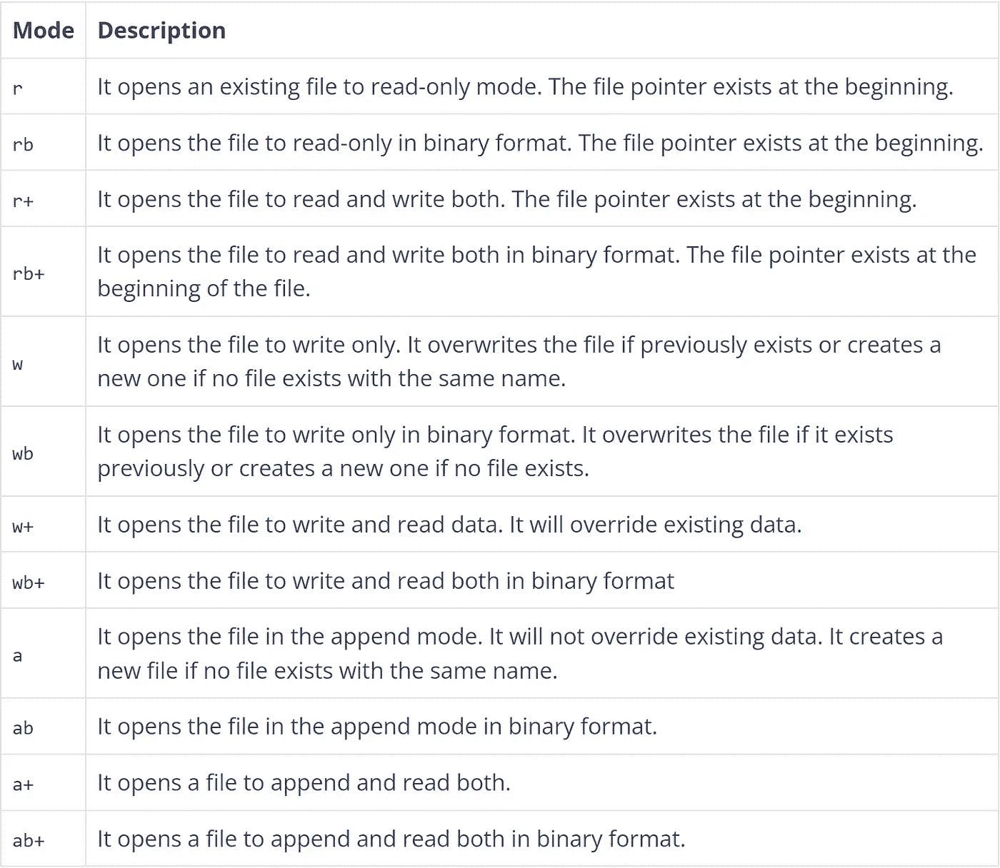

# 如何在 Python 中读写文件

> 原文：<https://levelup.gitconnected.com/how-to-read-and-write-files-in-python-75ed4aa6fbf7>

## 如何在 Python 中处理文件的教程


由[马丁·范·登·霍维尔](https://unsplash.com/@mvdheuvel?utm_source=medium&utm_medium=referral)在 [Unsplash](https://unsplash.com?utm_source=medium&utm_medium=referral) 拍摄的照片

[](https://jorgepit-14189.medium.com/membership) [## 用我的推荐链接加入媒体-乔治皮皮斯

### 阅读乔治·皮皮斯(以及媒体上成千上万的其他作家)的每一个故事。您的会员费直接支持…

jorgepit-14189.medium.com](https://jorgepit-14189.medium.com/membership) 

大多数数据科学家使用 Pandas 来读取文件，前提是数据是结构化的。在本教程中，我们将使用带有两个参数的“open”内置函数，例如文件名和模式。模式指示需要什么动作，如读、写或创建，它还定义了格式，如文本或二进制。下面，我们描述这些模式。

# 文件模式



来源 [PYnative](https://pynative.com/python/file-handling/)

# 读取文件

对于本教程，我们创建了一个名为`myfile.txt`的简单 txt 文件，其内容如下:

```
This is the first line
This is the second line
This is the third line
This is the forth line
and this is the fith and final line
```

我们来看看怎么读。

## 使用打开功能

我们可以使用“打开”功能读取文件，如下所示:

```
# open the file with the mode r which means "read"
my_file = open('myfile.txt', mode = 'r')# read the content of the file storing 
# it in a variable called data
data = my_file.read()print(data)# close the connection
my_file.close()
```

输出:

```
This is the first line
This is the second line
This is the third line
This is the forth line
and this is the fith and final line
```

## **使用带开放功能的**

或者，我们可以使用“打开”功能。主要区别是它自动关闭连接，这对文件和处理非常有帮助。我们来编码吧！

```
with open('myfile.txt', mode = 'r') as my_file:
    data = my_file.read()
    print(data)
```

输出:

```
This is the first line
This is the second line
This is the third line
This is the forth line
and this is the fith and final line
```

# 读取文件的三种方法

使用 open 函数在 Python 中读取文件的三种方法是:

## 阅读()

它将文件的全部内容作为包含所有字符的字符串返回。还可以传入一个整数，以便只返回文件中指定数量的字符。例如，让我们返回**的前 10 个字符**。

```
with open('myfile.txt', mode = 'r') as my_file:

    # read the 10 first characters
    data = my_file.read(10)
    print(data)
```

输出:

```
This is th
```

## 读取线()

它返回文件的第一行。例如:

```
with open('myfile.txt', mode = 'r') as my_file:

    data = my_file.readline()
    print(data)
```

输出:

```
This is the first line
```

请注意，readline()函数可以接受一个整数参数来返回第一行的特定数量的字符。

## 读取行()

它以列表的形式返回全部内容，其中每个元素对应一行。例如:

```
with open('myfile.txt', mode = 'r') as my_file:

    data = my_file.readlines()
    print(data)
```

输出:

```
['This is the first line\n', 'This is the second line\n', 'This is the third line\n', 'This is the forth line\n', 'and this is the fith and final line\n']
```

# 写文件

通过改变打开功能中的模式，我们可以创建文件。让我们创建一个名为“newfile.txt”的新的空文件。

```
# the 'w' mode is for write
with open('newfile.txt', mode='w') as my_file:
    pass
```

## write()方法

我们已经创建了一个名为“newfile.txt”的空文件。让我们看看如何向新文件添加内容。

```
# the 'w' mode is for write
with open('newfile.txt', mode='w') as my_file:

    # add text to the new file
    my_file.write('I write the first line')
```

于是“newfile.txt”就有了“我写第一行”这一行。

## writelines()方法

我们可以使用 writelines 方法并传递一个列表来一次写多行。比如说。

```
# the 'w' mode is for write
with open('newfile.txt', mode='w') as my_file:

    # add text as a list and add the \n for the new lines
    my_file.writelines(['first line\n', 'second line\n', 'third line\n'])
```

让我们看看文件的内容:

```
cat newfile.txtfirst line
second line
third line
```

注意，每次我们用“w”模式运行 open 函数时，它都会覆盖文件。

# 追加新行

我们可以使用 append 中的`a`模式添加新行。例如，让我们在前面的文件中再添加三行。

```
# the 'w' mode is for write
with open('newfile.txt', mode='a') as my_file:

    # append new lines
    my_file.writelines(['forth line\n', 'fifth line\n', 'sixth line\n'])
```

让我们看看文件的内容。

```
cat newfile.txtfirst line
second line
third line
forth line
fifth line
sixth line
```

# 错误处理

在数据工程管道中，读取有时由于某种原因不存在的文件是很常见的。所以，有必要用异常来[处理错误。例如，假设我们试图打开一个不存在的文件。](https://predictivehacks.com/exceptions-in-python/)

```
with open('nonexisting.txt', mode = 'r') as my_file:

    data = my_file.readline()
    print(data)
```

输出:

```
---------------------------------------------------------------------------
FileNotFoundError                         Traceback (most recent call last)
~\AppData\Local\Temp\ipykernel_21724\2298896326.py in <module>
----> 1 with open('nonexisting.txt', mode = 'r') as my_file:
      2 
      3     # read the 10 first characters
      4     data = my_file.readline()
      5     print(data)FileNotFoundError: [Errno 2] No such file or directory: 'nonexisting.txt'
```

正如我们所看到的，我们得到了“FileNotFoundError”错误。让我们看看如何处理这个尝试-除了？

```
try:
    with open('nonexisting.txt', mode = 'r') as my_file: # read the 10 first characters
        data = my_file.readline()
        print(data)
except FileNotFoundError as e:
    print ('Error', e)
```

输出:

```
Error [Errno 2] No such file or directory: 'nonexisting.txt'
```

最初由[预测黑客](https://predictivehacks.com/how-to-read-and-write-files-in-python/)发布

# 分级编码

感谢您成为我们社区的一员！在你离开之前:

*   👏为故事鼓掌，跟着作者走👉
*   📰查看[升级编码出版物](https://levelup.gitconnected.com/?utm_source=pub&utm_medium=post)中的更多内容
*   🔔关注我们:[Twitter](https://twitter.com/gitconnected)|[LinkedIn](https://www.linkedin.com/company/gitconnected)|[时事通讯](https://newsletter.levelup.dev)

🚀👉 [**加入升级人才集体，找到一份神奇的工作**](https://jobs.levelup.dev/talent/welcome?referral=true)