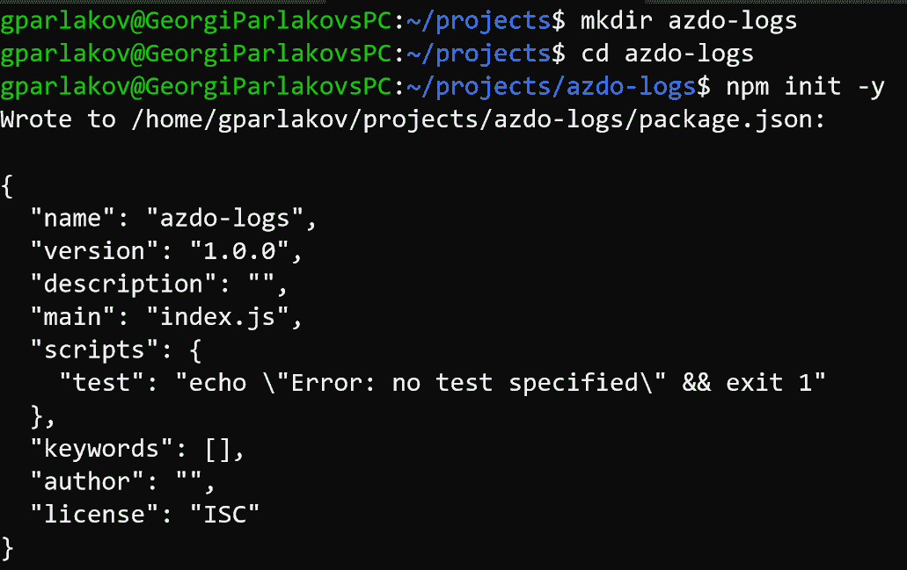
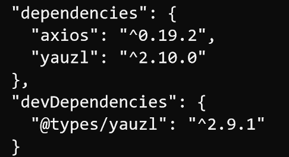
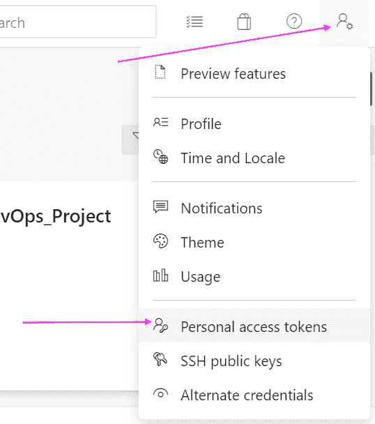
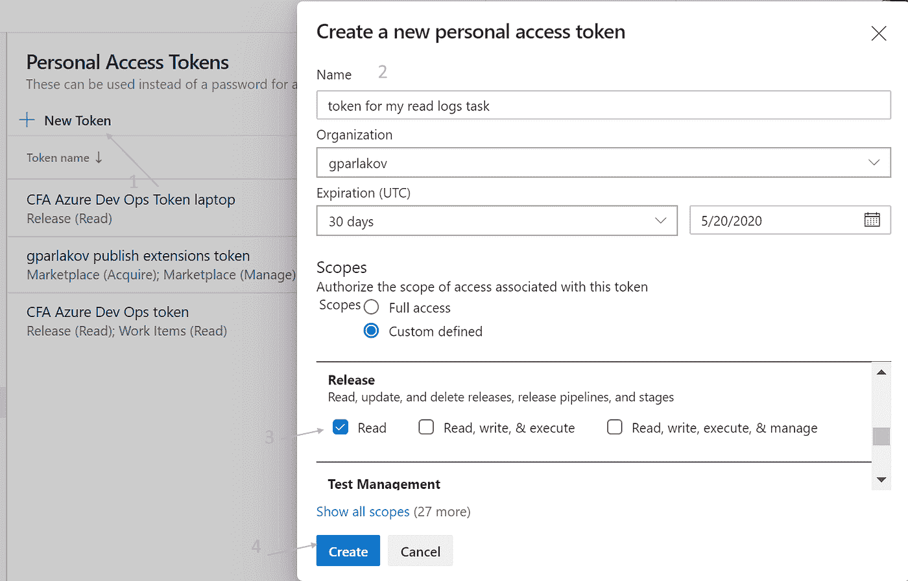
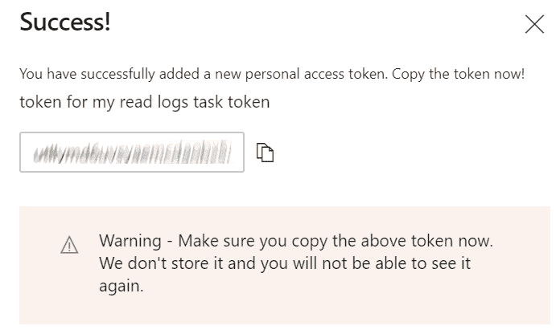
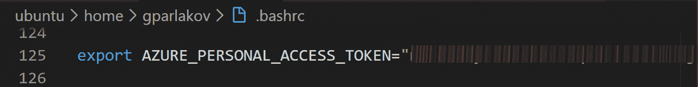
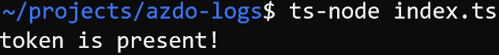
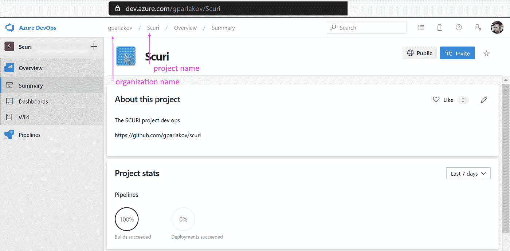
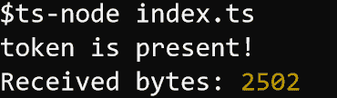
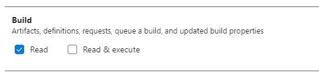

# 如何使用 REST API 从 Node.js 读取 Azure Dev Ops 日志

> 原文：<https://levelup.gitconnected.com/how-to-read-azure-dev-ops-logs-from-node-js-using-rest-api-e575a4c85cc3>


由[莫妮卡·格拉布斯卡](https://unsplash.com/@moniqa?utm_source=unsplash&utm_medium=referral&utm_content=creditCopyText)在 [Unsplash](https://unsplash.com/s/photos/%40moniqa-logs?utm_source=unsplash&utm_medium=referral&utm_content=creditCopyText) 拍摄的日志照片。

> 得到一些木头不会那么难吧？我肯定能用几行代码做到这一点！

*原发布* [*深度开发*](https://indepth.dev/how-to-read-azure-dev-ops-logs-from-node-js-using-rest-api/)

嗯，我最初也是这么想的。原来它不仅仅是调用一个 GET 端点。

一部分原因是来自 logs 端点的响应实际上是一个 zip 文件。其中有多个文件条目——每个管道任务一个。另外还有授权的部分。所以…

本文将带你一步一步地从一个空白文件到拥有来自你的 Azure Dev Ops 发布管道的日志。如你所知，它们可以在网上找到，但是要找到它们，必须经过几个步骤/点击。您可能希望获得日志并以编程方式处理它们。例如，我必须检查一个特定的字符串是否是发布管道日志的一部分。

先决条件:

*   从一个空白的 node.js 项目开始，并包含依赖项— [axios](https://npmjs.com/packages/axios) 和 [yauzl](https://npmjs.com/packages/yauzl) 。
*   从 Azure Dev Ops 获取个人访问令牌(PAT ),并将其存储在环境变量中。用它来获得授权。
*   通过 [Azure Dev Ops REST API](https://docs.microsoft.com/en-us/rest/api/azure/devops/) 获取压缩日志。
*   在内存中解压缩并读取文本内容。
*   我们将从发布管道运行中读取日志，但是在最后有一节是关于如何转换脚本和读取构建管道脚本的。

> *如果你只想要完成的脚本，下面是从* [*发布管道*](https://gist.github.com/gparlakov/426820697dc2574da6e6f6f6b31d5498) *和* [*构建管道*](https://gist.github.com/gparlakov/95e41ebee68c99baf36f36c12278deaf) *中读取日志的要点。我已经为变量留下了提醒* `*// TODO Replace with your own*` *。*

我将使用 [ts-node](https://npmjs.com/packages/ts-node) ,因为我更喜欢类型脚本安全，不想处理转换步骤。所以我用`ts-node index.ts`代替`node index.js`。如果您愿意的话，在类型被删除之后，脚本应该像普通 js 一样工作。

我的 shell 是在 Linux 的 Windows 子系统内运行的`bash`([WSL](https://docs.microsoft.com/en-us/windows/wsl/install-win10))。

## 1.开始

在文件夹`azdo-logs`中初始化一个节点包:

```
mkdir azdo-logs 
cd azdo-logs 
npm init -y
```

预期会看到类似于以下内容的输出:



创建`index.ts`文件，包括以下几行:

我们希望确保令牌在那里，安全地隐藏在您的**私有环境变量**中，而不是与代码一起签入！

顶部的`reference`让我们可以访问 nodejs 类型。您可能需要将它们作为开发依赖项来安装:

```
npm i @types/node -D
```

## 2.添加依赖关系

全局安装`ts-node`和`typescript`来执行我们的脚本。

```
npm i -g ts-node typescript
```

在我们的包装中安装`axios`和`yauzl`。标志`-s`会将它们保存到我们的`package.json`中。并且`@types/yauzl`会给我们输入，用`-D`标志将其添加到`devDependencies`

```
npm i axios yauzl -s 
npm i @types/yauzl -D
```



这是`package.json`现在的样子:

## 3.获取 Azure 开发操作令牌

它可以通过 profile 菜单获得

*   打开个人访问令牌页面



*   使用 Release `Read`权限创建新的访问令牌



*   把它储存起来，因为你再也看不到它了(*如果你丢失了它，你还可以重新创建它)*



最后，将它放在本地机器的环境变量中或安全存储中(例如 [secret 环境变量](https://docs.microsoft.com/en-us/azure/devops/pipelines/process/variables?view=azure-devops&tabs=classic%2Cbatch#secret-variables))

或 Windows 命令行

我已经将这一行添加到我的`.bashrc`文件中，这样 PAT 就可以在 bash start 上使用，这样我就不必在每次启动终端时都记住它。



在 Windows 上，您可以将它添加到环境变量中。请记住，要使 env 变量生效，您需要重启您的会话(注销/登录)。

现在运行`ts-node index.ts`，你应该会看到



有关如何获取个人访问令牌的更多详细信息，请参见[此链接](https://docs.microsoft.com/en-us/azure/devops/organizations/accounts/use-personal-access-tokens-to-authenticate?view=azure-devops&tabs=preview-page)。

好了—我们现在有了令牌和依赖项！

## 4.获取 Azure Dev Ops 组织和项目

为了获取日志，我们需要组织和项目名称，以及我们想要读取日志的发布 id。后者将在以后的每一次运行中增加——版本 1、2、3，所以我们需要在每次调用时提供它。对于这个例子，我将把我维护的包的[发布管道](https://dev.azure.com/gparlakov/Scuri/_releaseProgress?_a=release-environment-logs&releaseId=58&environmentId=87)作为目标。

我们可以从 Azure Dev Ops UI 获得的项目名称和组织:



就我而言，是组织‘gparlakov’和项目‘Scuri’。在`index.ts`中添加这些行，并替换为您的组织和项目名称:

## **5。授权**

为了使用个人访问令牌(PAT)获得 API 端点的授权，我们需要发送一个报头，该报头中的令牌以 base64 格式编码，符合特定的合同。在`index.ts`的末尾增加以下内容:

我们需要导入 axios 模块，在`index.ts`的顶部

## 6.获取发布日志

对于这个例子，我将使用带有`58`的`id`的实际版本(替换为您自己的版本)。追加到`index.ts`:

运行`ts-node index.ts`应该会产生类似于:



这证明我们被授权使用这个 REST API 端点！

## 7.解压缩日志

删除或注释掉`console.log`行——我们现在不需要它，并更改`axiosInstance`调用，使其看起来像这样:

最后是`readLogs`功能:

这里似乎发生了很多事情。归结起来就是处理 3 个流。

*   首先，我们将`zipFile`推入到`zipChunks`中，并将它们连接成一个`Buffer`。
*   然后，在返回具有`readEntry()`方法的对象的`yauzl.fromBuffer()`调用中使用`Buffer`。我认为它是一个`next`，因为它读取归档中的下一个条目。
*   我们为每个 zip 文件条目获取一个`readStream`。那是我们推入`chunks`的`ReadableStream`。
*   最后把字符串从`chunks`
    `Buffer.concat(chunks).toString('utf8');`中取出

## 完成的

我们现在有了一个包含所有日志的`string`变量！

以下是最终 [index.ts](https://gist.github.com/gparlakov/426820697dc2574da6e6f6f6b31d5498) 的要点。我已经为变量留下了提醒`// TODO Replace with your own`。

## **读取构建管道日志**

为了从构建管道中读取日志，我们需要

1.向我们的令牌添加“Build: Read”权限，或者颁发一个具有该权限的新令牌:



2.更改一点(只移除一部分)验证逻辑:

3.更改基本 URL:

4.更改端点地址并提供一个构建号(在我的例子中，我将使用 [this build](https://dev.azure.com/gparlakov/Scuri/_build/results?buildId=208&view=logs&j=12f1170f-54f2-53f3-20dd-22fc7dff55f9)

下面是最终的[剧本](https://gist.github.com/gparlakov/95e41ebee68c99baf36f36c12278deaf)。

## 内存消耗记录

这种方法在内存中保留了一些缓冲区，基本上就是在内存中多次复制 zip 文件。考虑到我们正在读取管道日志，这应该不是问题。我希望它们不会太大。如果这对你来说是个问题，那么在本地存储档案(尽管正如 Samuel Attard @marshallofsound 指出的那样，这可能是一个[安全问题](https://en.wikipedia.org/wiki/Zip_bomb)，然后使用另一种方法`yauzl`

*响应流、块、缓冲区、zip 内容块、它们的缓冲区，最后是字符串——对于一个 50k 的日志，我们最终使用 250k RAM。

## **资源**

*   Restful API [文档](https://docs.microsoft.com/en-us/rest/api/azure/devops/?view=azure-devops-rest-5.1)——非常有用
*   用于 API 的 nodejs [client](https://github.com/microsoft/azure-devops-node-api) (但是它大约 116k minified+GZipped！根据 [bundlephobia](https://bundlephobia.com/result?p=azure-devops-node-api@10.1.1) ~830k 值的脚本供您的运行时解析——对于每个请求
*   **[轴](https://github.com/axios/axios#request-config)的文档**
*   **[yauzl](https://github.com/thejoshwolfe/yauzl) 的文档**