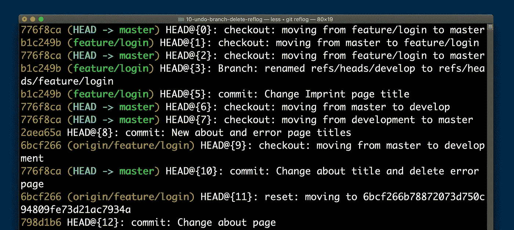
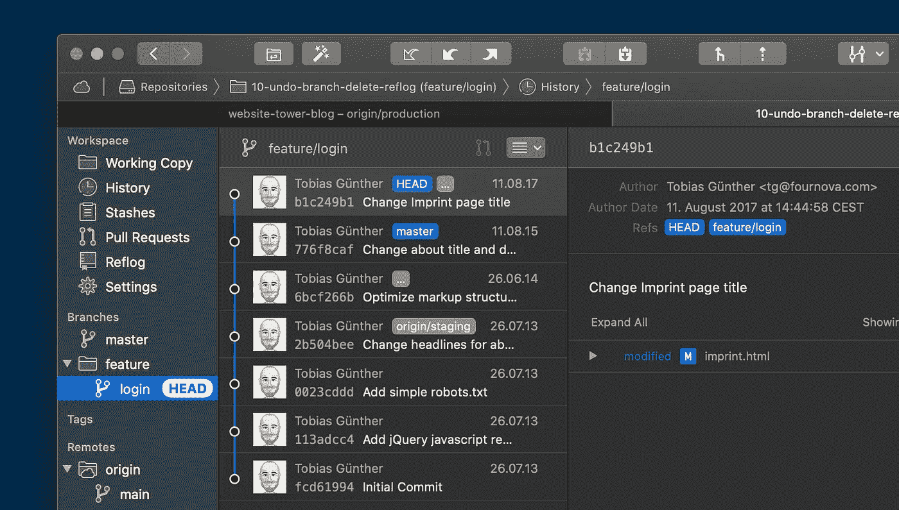
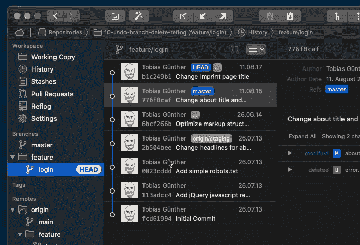
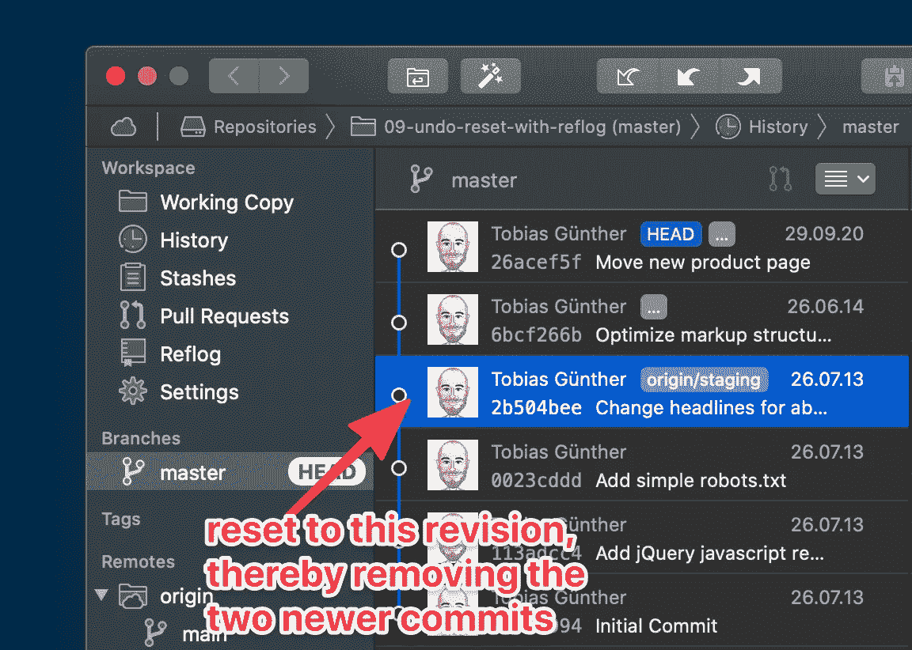

# 如何用“Reflog”恢复 Git 中删除的分支和提交

> 原文：<https://levelup.gitconnected.com/how-to-recover-deleted-branches-and-commits-in-git-with-the-reflog-761b37459ac9>


照片由[像素](https://www.pexels.com/photo/stainless-steel-close-wrench-on-spanner-210881/)上的 [Pixabay](https://www.pexels.com/@pixabay) 拍摄

Git 中有一个鲜为人知的特性叫做“Reflog”。这是 Git 的众多功能之一，可以帮助您挽救生命！例如，当你不小心删除了一个分支。或者当您执行“重置”并意识到您只是错误地删除了有价值的提交时。

让我们深入讨论一下 Reflog 实际上是什么，可以用来做什么，以及如何在实践中使用它。

# 什么是参考日志

你可以把 Reflog 想成一个类似“日志”的东西:Git 在这里协议所有的头指针移动，例如当一个签出、提交、合并、重定基础、重置等等。会发生。换句话说:每当真正重要的事情发生时，Git 都会在 Reflog 中记录它。当然，这意味着当事情出错时，Reflog 非常有用。

在我们继续之前，让我们快速浏览一个示例 Reflog:



默认情况下，Reflog 按时间顺序排序。这意味着最近的操作列在顶部。您还可以很容易地看到执行了哪种操作:是提交、拉取、检出还是其他。

# Reflog 能为你做什么？

正如我已经说过的，Reflog 是撤销错误的完美工具。让我们来看两个实例，其中 Reflog 非常有用。

## 如何撤消删除分支

为了保持 Git 存储库的整洁，不时删除存储库中过时的分支是很重要的。但是，有时您可能太快了，删除了一个您迫切需要恢复的分支。这是一个使用 Reflog 的完美例子！让我们来看一个示例场景:



*注意:在本文的一些截图中，我使用了* [*Git 桌面 GUI“塔”*](https://www.git-tower.com/?utm_source=gitconnected&utm_medium=guestpost&utm_campaign=how-to-recover-deleted-branches-reflog) *以便于可视化。*

假设我们(认为我们)不再需要这个“特性/登录”分支。当我们马上删除它时，我们不仅会丢失分支:因为它的最新提交不包含在任何其他地方，我们还会丢失这个提交！但我们还是闭上眼睛，删除分支，让灾难顺其自然吧。😱

但是由于它是我们当前的总分支，我们首先需要切换到另一个分支，然后才能删除它:

```
# switch away from the branch, to master
$ git switch master

# delete the unwanted feature branch
$ git branch -D feature/login
```

注意，在删除分支时，我们不得不使用大写的“-D”选项，因为它包含了未合并的变更(其他地方不存在的最新提交)。树枝现在不见了——当你意识到这是一个严重的错误时，我会给你几秒钟时间来哀悼！😢

让我们打开参考日志，看看我们是否能挽回这个不幸:

```
$ git reflog
776f8ca (HEAD -> master) HEAD@{0}: checkout: moving from feature/login to master
b1c249b HEAD@{1}: checkout: moving from master to feature/login
776f8ca (HEAD -> master) HEAD@{2}: checkout: moving from feature/login to master
b1c249b HEAD@{3}: Branch: renamed refs/heads/develop to refs/heads/feature/login
b1c249b HEAD@{5}: commit: Change Imprint page title
```

回想一下我们刚刚做的事情:在删除分支之前，我们切换到 master。这是 Reflog 中最新的协议项目。现在，为了撤销我们删除特性分支的致命错误，我们可以简单地返回到最后一个条目之前的状态！

我们可以从 Reflog 中复制必要的提交散列，并使用“git branch”命令取回我们删除的分支:

```
$ git branch feature/login b1c249b
```

瞧啊。我们刚刚让我们的分支起死回生:

```
$ git branch
 feature/login
 * master
```

如果您使用的是像 Tower 这样的桌面图形用户界面，您可以这样做:



## 如何恢复已删除的提交

Reflog 非常有用的另一个领域是当您想要恢复已删除的提交时。让我们再来看一个示例场景:



我们将把当前的 HEAD 分支重置为这个较旧的版本，从而“删除”随后出现的任何较新的提交。相当简单！

```
$ git reset --hard 2b504bee
```

但是，如果您意识到这是一个错误——并且您迫切需要那些删除的提交，该怎么办呢？！？😳让我们再看一下 Reflog，看看它是否能帮助我们:

```
$ git reflog
2b504be (HEAD -> master, origin/staging) HEAD@{0}: reset: moving to 2b504bee
26acef5 HEAD@{1}: commit (amend): Move new product page
83bfa7d HEAD@{2}: commit (amend): Move product page
```

Reflog 中的最新条目是我们刚刚执行的“重置”操作(可以说是我们的错误)。如果我们想撤销这个操作，并获得我们的旧的提交，我们可以简单地返回到之前的状态！因此，让我们复制第二个条目的提交散列，并再次使用“git reset ”:

```
$ git reset --hard 26acef5
```

瞧啊。如果您再次检查“git reflog ”,您将会看到我们看似丢失的提交被恢复，并且在我们的 HEAD 分支上再次可用！

# 发现 Git 的力量

Reflog 只是众多例子中的一个:Git 有大量非常有用的高级特性——可以撤销错误，生成更好的代码，或者让您在日常工作中更有效率。

有很多指南和教程可以帮助你更熟练地使用 Git。让你开始的一个很好的资源是“[**Git**](https://www.git-tower.com/learn/git/first-aid-kit?utm_source=gitconnected&utm_medium=guestpost&utm_campaign=how-to-recover-deleted-branches-reflog)急救包”，这是一个免费的视频系列，教你如何**用 Git 撤销几乎任何错误。**

祝你成为更好的程序员愉快！

# 关于作者

Tobias Günther 是 [Tower](https://www.git-tower.com/?utm_source=gitconnected&utm_medium=guestpost&utm_campaign=how-to-recover-deleted-branches-reflog) 的联合创始人，这是一款流行的 Git 桌面客户端，帮助全球超过 100，000 名开发人员使用 Git 提高工作效率。