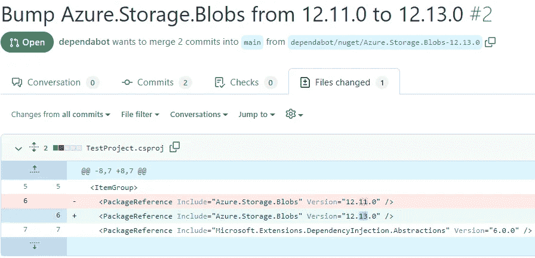

# 开发微服务时如何减少常规工作

> 原文：<https://levelup.gitconnected.com/how-to-reduce-routine-work-when-developing-microservices-b915e27020b9>

## 自动库版本更新，自定义项目模板和 Monorepo

[附身摄影](https://unsplash.com/es/@possessedphotography?utm_source=medium&utm_medium=referral)在 [Unsplash](https://unsplash.com?utm_source=medium&utm_medium=referral) 上拍照

每个项目的工作范围包括开发人员应该定期处理的一定量的日常工作。但是在被划分成许多存储库的微服务项目中，例行工作会多得多。

接下来，我们将查看微服务中日常工作的几个来源，以及尽可能将其最小化的方法。

# 使用 Dependabot 自动更新库版本

几乎每个项目都使用一组封装了一些可重用逻辑的第三方和自定义库。在不同的包服务器(npm，NuGet…)上有无数的第三方库的例子。此外，当一些代码需要由位于不同存储库中的几个不同的微服务重用时，开发人员可以开发自己的库，并将其发布到私有的包服务器。

越多的微服务使用同一套库，保持库版本**最新**和**跨微服务一致**就越困难。定期手动检查和更新版本可能会变得非常无聊和耗时，但不这样做会使开发过程变得复杂，并导致应用程序中出现奇怪的错误。

幸运的是，有一个叫做[dependent bot](https://github.com/dependabot)的很酷的工具，它可以几乎完全自动地将许多库中的库更新到新版本。一旦为您的存储库设置了 Dependabot，它将定期执行例行检查，查看是否有更新的第三方或自定义库可用，并自动生成如下所示的拉请求:

开发人员所要做的就是检查拉请求，批准它，并将其合并到主分支中。Dependabot 工具对于包含许多包的单个项目也很有用，但是对于被分割成许多存储库的微服务项目，该工具几乎是不可或缺的。

# 自定义项目模板

一旦大型微服务项目的开发开始，几乎每天或每周，开发团队都会创建一个新的存储库，其中包含一个新的项目。每个项目的结构缺乏严格的标准，这将导致许多不一致和相关的问题，例如:

1.  一个 repo 中的一个项目实现了洋葱架构，另一个 repo 中的另一个项目实现了垂直切片架构 **—** 在两个项目中实现某些特性的开发人员将会花更多的时间来理解不同项目的结构。
2.  一个 repo 中的一个项目直接在根文件夹中包含一个单元测试项目，而另一个 repo 中的另一个项目在/Tests 文件夹中包含一个单元测试项目 **—** DevOps 工程师不能简单地重用同一个模板来为两个存储库构建 CI 管道，因为单元测试项目的路径是不同的。
3.  这两个项目在如何处理传入的 JWT 令牌方面存在差异 **—** 两个微服务和 bug 的行为不一致。

开发人员可以通过在某个 confluence 页面上记录每个新项目的结构应该是什么，公共配置应该是什么样子，等等，来尝试缓解上述问题以及可能的其他问题。每当开发人员需要为新的微服务实现新项目时，他们都必须遵循该页面。但这是手工和多余的工作。

更好的方法是一次性创建一个项目模板，包括必要的结构、命名、基本的第三方和私有包、预配置通用特性，如授权、日志、缓存等。在积极发展阶段开始之前。

一个开发人员为一个新的微服务创建一个新的项目所需要的就是拿一个项目模板，把它放在新的存储库中，就这样。

# 把微服务挤压成 Monorepo？

正如我们之前所说的，开发和维护一个被划分为许多存储库的微服务项目会导致大量的路由工作，这些工作可以通过应用各种技巧来减少，但是仍然需要纪律、熟练的领导者和其他努力。

如果独立的存储库产生了大量的日常工作，开发人员也可以考虑对所有微服务使用 monorepo。多存储库和 monorepo 之间的区别已经在我的另一篇文章中[讨论过了。Monorepo 可以在某种程度上解决我们在这篇文章中提到的任何问题，但它也带来了其他挑战，你应该做好准备。](/how-many-repositories-do-you-need-for-a-microservices-project-b5c991aa440)

## 总结:

*   Dependabot 可以极大地简化对新版本的库版本更新。
*   创建自定义项目模板，以标准化组成应用程序的各种微服务项目。
*   当维护单个存储库的成本太高时，可以考虑 [Monorepo 方法](https://medium.com/r?url=https%3A%2F%2Flevelup.gitconnected.com%2Fhow-many-repositories-do-you-need-for-a-microservices-project-b5c991aa440)。

感谢阅读。如果你喜欢你所读到的，看看下面这个故事:

 [## 要问的 7 个棘手问题。NET 开发人员在工作面试

### 带着答案。

levelup.gitconnected.com](/7-tricky-questions-to-ask-net-developer-in-a-job-interview-9cdb3789db54)