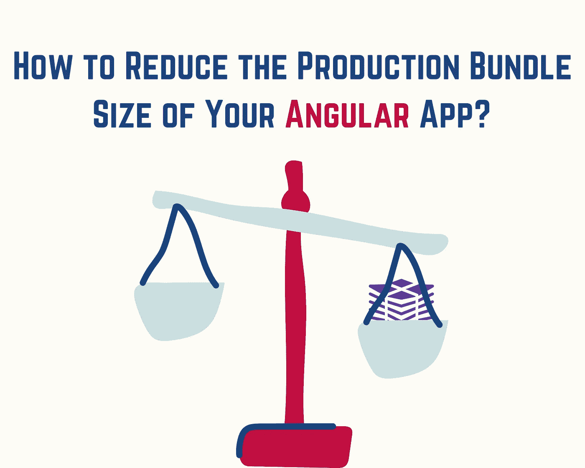

# 如何在 Angular 中减少您的应用程序的产品包大小

> 原文：<https://levelup.gitconnected.com/how-to-reduce-the-production-bundle-size-of-your-app-angular-e7126c7692b2>

## 减少包的大小=减少应用程序的加载时间

构建一个精彩的应用程序是非常酷的，但是不能充分利用 Angular robust 框架是一个遗憾。在本文中，我将讨论包的大小。对于大型企业应用程序来说，这是一件多么令人头痛的事情，不是吗？

React 应用程序和 Angular 应用程序的区别之一是，Angular 应用程序的包大小通常更大。Angular 是一个健壮的框架，带有许多有趣而有用的库，可以减少 Angular 应用程序的捆绑包大小。

这篇文章为你提供了减少你的应用包大小和充分利用 Angular 框架所需的基本要素。

要做到这一点，以下是我将要遵循的计划:

*   **惰性加载和预加载策略**
*   **调整进口的影响**
*   **更新至关重要**
*   **外卖**

兴奋吗？让我们开始吧😆

# 延迟加载和预加载策略

企业大型应用程序有许多特性和功能在启动应用程序后无法立即访问，或者因为许多原因而不常使用，例如用户没有登录就没有访问权限，或者因为他对应用程序的某些特性不感兴趣...等等。

当你开发应用程序的时候，把所有的功能都放在一个包里是很可惜的，要知道在启动应用程序之后，它们不一定需要被加载或者立即被使用。这里最棒的是拆分捆绑包，在主捆绑包中启动应用程序时，只保留基本的必备组件，并根据需要加载其余的块或捆绑包。

惰性加载是一个关键策略，可以帮助您将产品包分成几个部分。您将拥有许多更小的“块”，而不是一个大的生产包

这是非常强大的，因为:

*   首先:根据你的应用程序大小，你的应用程序加载时间会大大减少。
*   第二:你的应用将是一个智能的应用。它不会愚蠢地加载所有的东西，最终只使用了包的 30%。很可惜，不是吗？

为了更好地了解这个强大的策略，我邀请您阅读这篇文章，了解更多细节和您会惊讶地了解到的高级策略:

 [## 利用延迟加载优化应用启动时间—第 1 部分

### angular 中的懒装是什么？懒惰装载是如何工作的？

medium.com](https://medium.com/swlh/optimize-the-app-startup-time-with-lazy-loading-part-1-69be2a27322e)  [## 利用延迟加载优化应用启动时间—第 2 部分

### 什么是角预压？什么是预加载策略？

famzil.medium.com](https://famzil.medium.com/optimize-the-app-startup-time-with-lazy-loading-part-2-5da35cbd8af2) 

享受😉

# **调整导入的影响**

在大型应用程序中，有大型团队甚至多个团队。我们有死代码，因为一些原因，我们忘记删除，或一些进口没有使用。毕竟我们是人类。我们会犯错。令人欣慰的是，ECMAScript6 模块系统用动摇树的能力拯救了我们。有了这个强大的系统，我们可以删除不使用的死代码。

要在您的应用中实现这一点，您首先需要遵循以下步骤:

## **步骤#1:分析您当前的捆绑包大小**

*   **您可以使用** `**webpack-bundle-analyzer**`分析您当前的捆绑包大小。基于其结果，您可以直观地看到哪些包是最大的。
*   **分析并找到要调整的软件包。**

## 第二步:开始健身

*   示例:通过将针对整个库`lodash`的导入更改为默认的等效导入:`import last from ‘lodash'`。这个改变将会带来很大的不同，因为我们需要的是`last`函数，而不是整个库。这将根据您的产品包大小将千字节转换为字节。
*   另一个选择是将整个库换成一个更轻的替代库(如果存在的话)。如果我们以`loadch`为例，我们可以用`lodash-es`来代替。

## 第三步:继续分析和调整

调整导入可以减少大量的 JavaScript 代码，因为它可以确保您只将需要的 JavaScript 代码导入到应用程序中。

# 更新角度**至关重要**

更新！离上一个有角版本越远，迁移到上一个版本就越痛苦。我曾尝试将一个应用从 Angular 4 迁移到 Angular 9。这对我的神经很危险。

从版本 9 开始，Angular 开始使用新的 Ivy 编译器。Ivy 编译器在应用程序的渲染和编译阶段引入了一些优化。是的。这些优化将加快您的应用程序，并有助于使您的生产包大小更小。

这还不是全部。离上一个有角版本越远，迁移到上一个版本就越痛苦。我曾尝试将一个应用从 Angular 4 迁移到 Angular 9。这对我的神经很危险。

所以升级 Angular 是如此重要。

如果你对干净且编码良好的 Angular 应用程序的更多技巧感兴趣，这里有一篇文章适合你:

 [## 对于一个干净且编码良好的 Angular 应用程序，要记住哪些是应该做的，哪些是不应该做的。

### 我最喜欢的十大角度应用技巧

medium.com](https://medium.com/swlh/dos-and-don-ts-to-keep-in-mind-for-a-clean-and-well-coded-angular-app-69138c0b5edd) 

# 💼外卖:

*   使用`**webpack-bundle-analyzer**`分析您的捆大小。
*   利用 ES6 模块系统来调整您的应用程序，并通过摇树功能删除死代码。
*   惰性装载会把你的大包裹分成小块。
*   惰性加载策略将通过更快的加载时间来提升你的应用性能。
*   为了充分利用框架提供的捆绑包优化，更新是必不可少的。
*   这里是你升级的终极指南:[链接](https://update.angular.io/)。

亲爱的读者朋友们，感谢你们的支持和宝贵时间。我希望这对你有用和有帮助。

**关注我上** [**中**](https://medium.com/@famzil/) **、**[**Linkedin**](https://www.linkedin.com/in/fatima-amzil-9031ba95/)**、**[**Twitter**](https://twitter.com/FatimaAMZIL9)**了解更多文章。**

**后会有期(ﾉ◕ヮ◕)ﾉ*:･ﾟ✧**

**FAM**