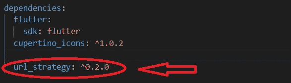
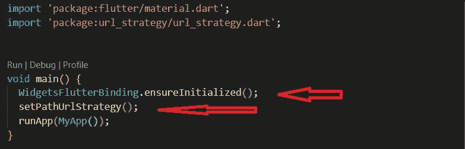
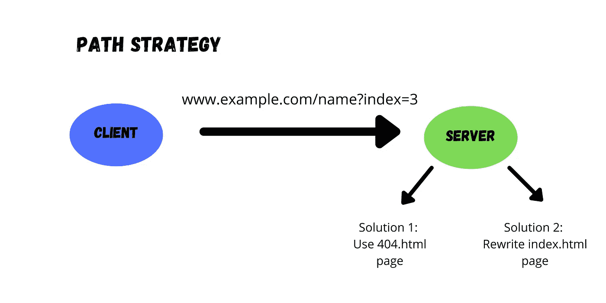
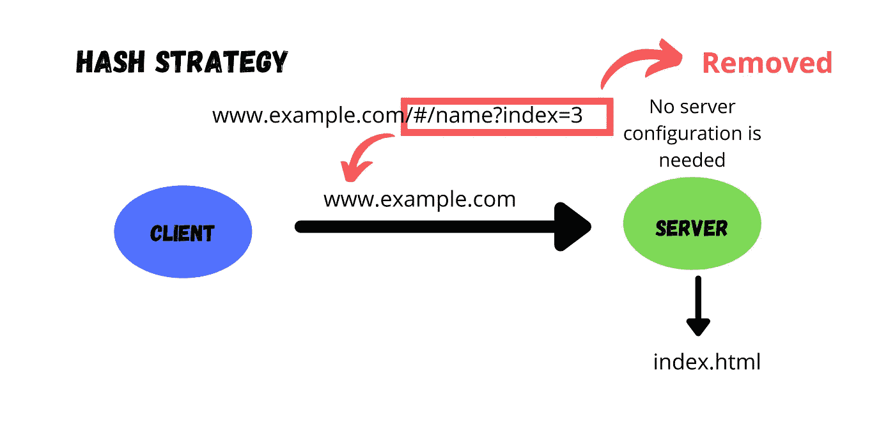

# 如何用 Flutter Web 从 URL 中删除# Hash 符号

> 原文：<https://levelup.gitconnected.com/how-to-remove-hash-symbol-from-url-with-flutter-web-d917137b8041>

## 处理根 URL 后面的默认标签


照片由[凯蒂·哈普](https://unsplash.com/@kharp?utm_source=unsplash&utm_medium=referral&utm_content=creditCopyText)在 [Unsplash](https://unsplash.com/s/photos/url-hashtag?utm_source=unsplash&utm_medium=referral&utm_content=creditCopyText) 拍摄

> 在**的 flutter web** 中，根 URL 后面有一个默认的标签。因此，如果我们使用一个包含网页浏览器地址栏标签的 URL，我们总是导航到网站的根页面。因此，我们必须执行一些配置更改来解决这个问题。

让我们按照下面的步骤来完成它…..

1.  转到 ***pubspec.yaml*** 文件，然后转到依赖项类别并添加 [***url_strategy 包***](https://pub.dev/packages/url_strategy)



作者图片

2.转到 main.dart 文件并导入，

```
import 'package:url_strategy/url_strategy.dart';
```

3.在 **main()方法**下，

添加***setpathurlrstrategy()***和***widgetsfutterbinding . ensureinitialized()***

在 runApp(MyApp())之前；



作者图片

> 通过正确地遵循这些步骤，您将最终得到在根 URL 之后不包含 hashtag 的 URL，现在您可以毫无问题地导航到其他路由。

值得一提的是，当您的应用程序处于调试模式时，上面提到的所有这些都可以正常工作。但是在将您的应用程序托管或部署到生产环境并且应用程序处于发布模式之后。那么没有 Hashtag 的 URL 将不会导航到相关的网页，并显示 page not found 404 页面。

要解决这个问题，我们必须更改服务器配置。为此，您可以使用两种解决方案。

# 解决方案 1:

1.  创建一个 ***。htaccess*** 根目录下的文件(这里存在同一级的 index.html 文件)。
2.  在...里面。htaccess 文件，我们必须通过添加**重写器将所有未知路由重定向到 index.html。/index.html [L]**

# 解决方案 2:

一些托管平台不支持。 ***htaccess*** 文件创建机制和一般解决方案如下。

1.  在根目录下创建一个***【404.html】***文件(与 index.html 文件同级)
2.  转到***【index.html】***文件，复制***index.html***文件的全部内容
3.  转到*文件，粘贴全部内容并保存*

*酷……😎现在也解决了在 flutter web 中释放模式下移除散列符号的问题。*

## *总结:*

> *如果客户端从服务器的根发出请求，它基本上是在处理 index.html 文件并导航到相关的网页。*

****路径策略****

**在路径策略中，如果客户端请求任何其他 URL，那么服务器将导航到 404.html 文件，或者在没有的情况下，特定浏览器中的默认“未找到页面”是一种解决方案。另一个解决方案是重写 index.html。**

**

*作者图片*

****哈希策略****

**在哈希策略中，#标签后的路径不会发送到服务器，因此它总是返回到 flutter web 应用程序中的 index.html。这不需要额外的服务器配置，从服务器加载 index.html 文件后，Flutter 会选择 URL 的最后一部分并导航到相关的 URL**

**

*作者图片*

> *我希望你通过这篇文章获得一些重要的事实。如果你喜欢这篇文章，那就鼓掌吧。🙌*

*感谢您的阅读。😎*

*继续学习！！！继续扑腾！！！*