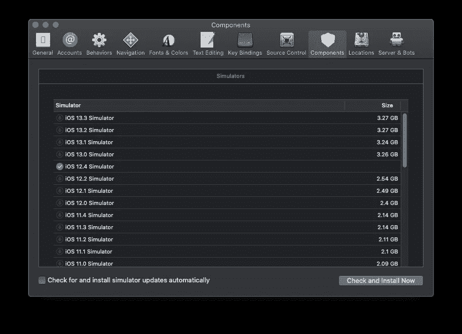

# 如何从 Xcode 中移除旧的模拟器？

> 原文：<https://levelup.gitconnected.com/how-to-remove-old-simulators-from-xcode-634111c3e94b>

## 通过删除旧的模拟器来节省一些空间

作为负责任的 iOS 开发者，我们经常需要在至少上一个 iOS 上测试应用。为此，我们转到首选项➡组件并下载 iOS 模拟器。太好了，我们现在已经安装好了。

# 删除🗑

如果需要，您如何移除这些内容？它们占据了很大的空间。事实证明，Xcode 并没有提供一种简单易用的方式来做到这一点。但是，我们可以找到它在磁盘上的位置并删除它，Xcode 会检测到磁盘上没有模拟器。

很简单。在 Finder 中打开这个文件夹，或者通过按下`CMD` + `SHIFT` + `G`复制粘贴这个路径`/Library/Developer/CoreSimulator/Profiles/Runtimes/`，或者手动导航到上面的路径。一旦打开，您将看到下载的所有运行时。删除它们，我们就可以开始了。