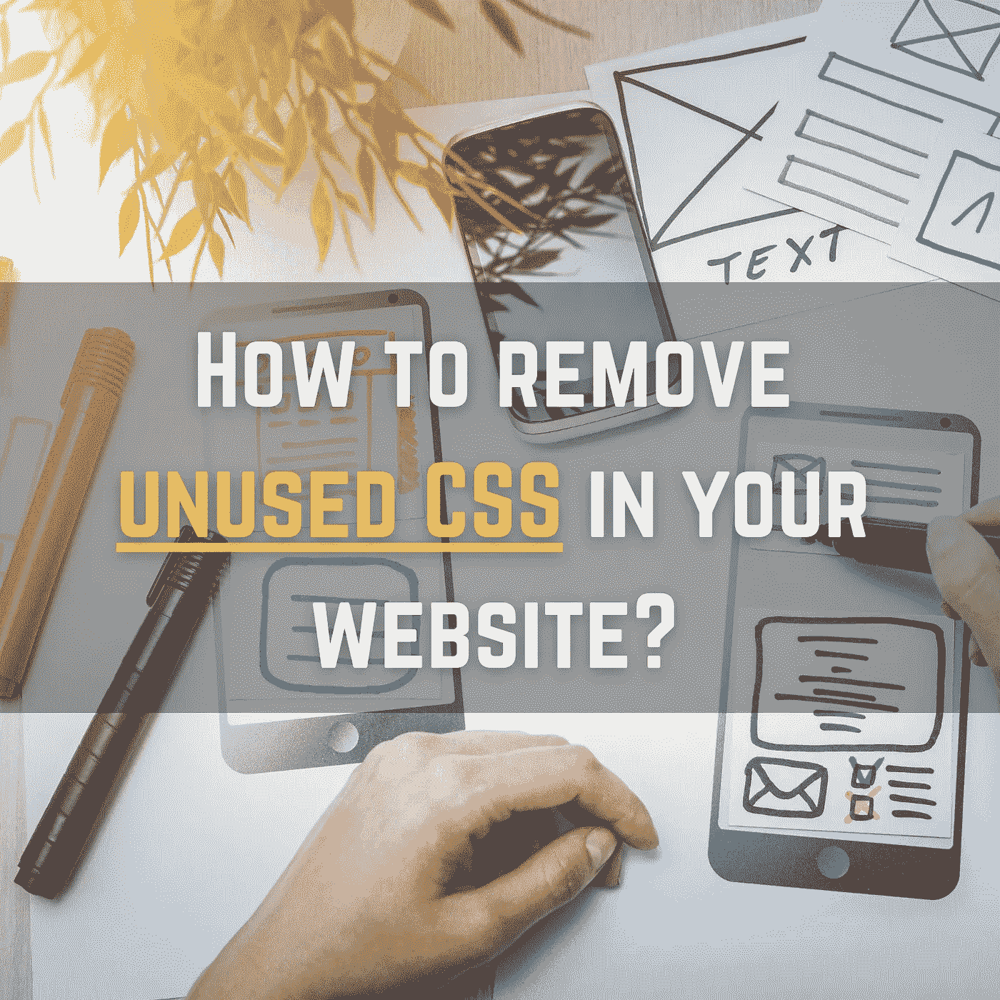

# 如何移除网站中未使用的 CSS

> 原文：<https://levelup.gitconnected.com/how-to-remove-unused-css-in-your-website-dfa9d2067679>

## 采购的力量



现在的开发商很贵。很多人即使对 web 一窍不通，也选择自己动手建立自己的网站。互联网上有很多资源可以为你提供现成的 CSS 主题和 HTML 页面。

这样做的问题是，你最终会一部分一部分地定制下载的网站，并且你不知道如何去除未使用的样式，因为 CSS 文件太长了，你不能只检查所有 HTML 文件中的类名来知道你是否可以从 CSS 文件中删除该类。否则，你会花几天时间去做。

> ***你的神经不值得这样！***

这就是为什么我想出了一个快速教程，它会在你的网站上施展魔法，告诉你需要什么，并删除你的 CSS 文件中不需要的内容。

准备好了吗？我们走吧！

# 采购的力量

能神奇地去除我们不需要的东西的是 purgeCSS:

[](https://purgecss.com/CLI.html#installation) [## 移除未使用的 CSS - PurgeCSS

### PurgeCSS 可以通过命令行界面获得。您可以单独使用 CLI，也可以与配置文件一起使用。

purgecss.com](https://purgecss.com/CLI.html#installation) 

> “PurgeCSS 是一个删除不用的 CSS 的工具。它可以是你开发工作流程的一部分。当你在建立一个网站时，你可能会决定使用一个 CSS 框架，如 TailwindCSS、Bootstrap、MaterializeCSS、Foundation 等，但你只会使用一小部分框架，而且会包含大量未使用的 CSS 样式。”—采购团队

所以 PurgeCSS 的工作就是分析你的内容(HTML 文件)和你的 CSS 文件。它将文件中使用的选择器与内容文件中的选择器相匹配。因此，它从你的 CSS 中删除了未使用的选择器，给你一个更小的 CSS 文件，只包含你需要的东西，没有别的！

## PurgeCSS，我爱 you🥰

好吧，很好，但是怎么做？

# 分两步开始魔法

*   首先，我们需要在全球范围内安装这个包

```
npm install **-g** **purgecss**
```

*   第二，跑起来！

现在，您已经确认 NPM 已经安装了该软件包，我们可以通过运行以下命令开始删除未使用的 CSS:

```
**purgecss** --css **style.css** --content ***.html** --output **result**
```

>在`--css`之后你需要指定你的 CSS 文件

>在`--content`之后你需要指定你的 HTML 文件(*。html 将扫描当前文件夹中的所有 HTML 文件)。

>在`--output`之后，我们指定一个现有的目录，prgeCSS 将在该目录中输出您需要的 CSS，并删除额外的样式和类。

# 如果我的应用在 React、Angular、Vue 或任何其他技术中会怎样？

别担心，真正的开发者也在互联网上使用 CSS 主题，所以我们有时需要删除不用的 CSS。

这篇文章是 HTML/CSS 用户的快速教程。因此，我不会详细介绍其他技术，但这里有您需要的文档:

*   **做出反应**

[](https://purgecss.com/guides/react.html) [## 移除未使用的 CSS - PurgeCSS

### React 是一个用于构建用户界面的 JavaScript 库。创建 React 应用程序是一个舒适的学习环境…

purgecss.com](https://purgecss.com/guides/react.html) 

*   **WordPress**

[](https://purgecss.com/guides/wordpress.html#installation) [## 移除未使用的 CSS - PurgeCSS

### 如果你想在 WordPress 中使用 PurgeCSS，你可能需要安全列表 WordPress 生成的类来避免它们…

purgecss.com](https://purgecss.com/guides/wordpress.html#installation) 

*   **Vue**

[](https://purgecss.com/guides/vue.html) [## 移除未使用的 CSS - PurgeCSS

### 如果你还没有安装 vue-cli 3，首先按照这里的安装说明:https://github.com/vuejs/vue-cli…

purgecss.com](https://purgecss.com/guides/vue.html) 

不幸的是，没有关于 *Angular* 的文档，但是 purgeCSS 做的事情仍然很有趣。

亲爱的读者，我希望这是明确和有用的。

我希望你和你的家人无论在哪里都平安无事！坚持住。明天会更好！

**我们来接触一下** [**中**](https://medium.com/@famzil/)**[**Linkedin**](https://www.linkedin.com/in/fatima-amzil-9031ba95/)**[**脸书**](https://www.facebook.com/The-Front-End-World)**[**insta gram**](https://www.instagram.com/the_frontend_world/)**，或者**[**Twitter**](https://twitter.com/FatimaAMZIL9)**。********

****🔗[www.fam-front.com](http://www.fam-front.com/)****

******FAM******