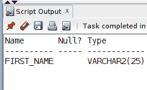
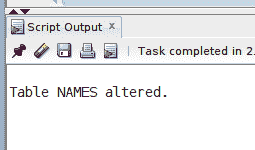
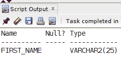
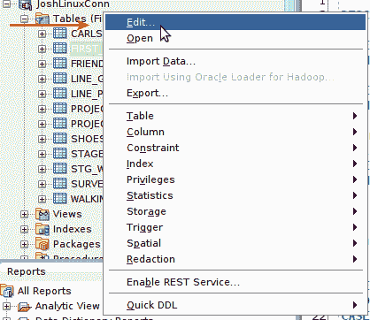
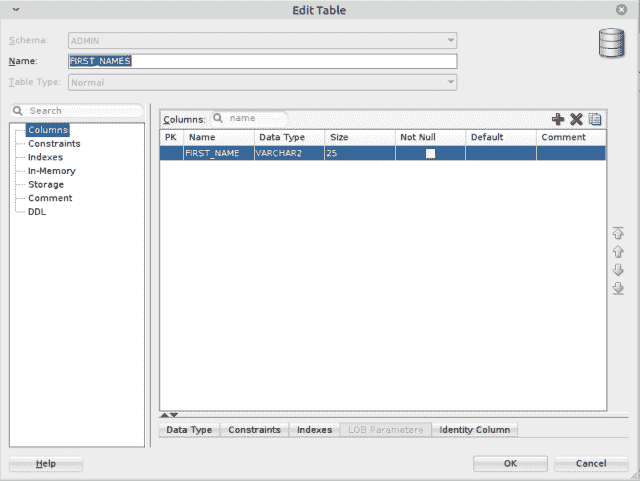
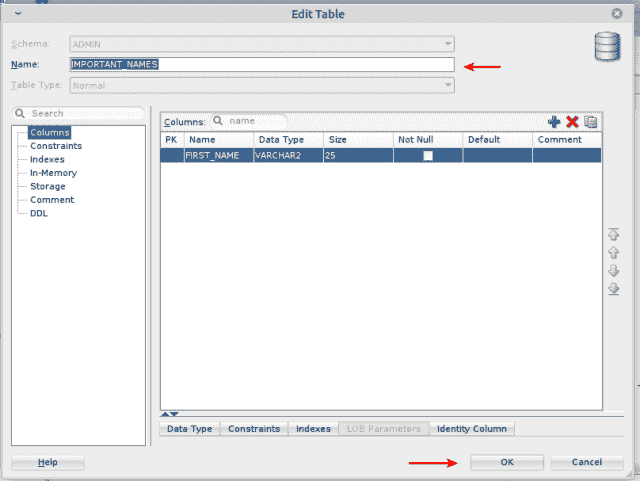
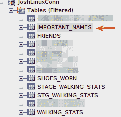

# 如何重命名 SQL 表

> 原文：<https://levelup.gitconnected.com/how-to-rename-an-sql-table-5f2ad4e7180c>

您可能需要重命名 SQL 数据库中的表，原因有很多。不管是什么情况，这个过程都非常简单。在这篇文章中，我分享了在 Oracle 数据库中重命名现有表的两种不同方法。

> 自我推销:
> 
> 如果你喜欢这里写的内容，尽一切办法，把这个博客和你最喜欢的帖子分享给其他可能从中受益或喜欢它的人。既然咖啡是我最喜欢的饮料，如果你愿意，你甚至可以给我买一杯！
> 
> 如果你喜欢 SQL 和 PHP 相关的内容，可以考虑通过访问[这个链接](https://digitalowlsprose.ck.page/1b35a06295)(非现场链接)来注册我的每周电子邮件。谢谢大家！

我在这篇文章中使用 Oracle SQL 作为例子。大多数 SQL 实现应该有类似的 **ALTER TABLE** 语法，但是请务必查看您的 RDBMS 文档以了解细节。

## 使用 ALTER TABLE DDL 命令重命名表

我有一个简单的一列表格，**命名为**，我想将其重命名为:

为了改变一个表的名称，你使用 SQL**ALTER TABLE**[DDL](https://en.wikipedia.org/wiki/Data_definition_language)命令。**重命名表时，ALTER TABLE** 语法很简单:

使用 **DESC** 命令，我们可以看到除了名称(现在命名为 **FIRST_NAMES** )之外，表没有任何变化。相同的**名字**列仍然存在:

## 在 Oracle SQL Developer 中重命名表

使用 Oracle SQL Developer IDE 重命名现有的表也很容易。

首先在 Oracle SQL Developer 的 ***表*** 窗格中右键单击要重命名的表，然后从菜单中单击**编辑**:

点击**编辑**，打开如下所示的可视化对话界面。从上往下数第二个字段是**名称**字段，显示当前表格名称:

在**名称**字段部分输入新的表格名称。在这个例子中，我选择了 **IMPORTANT_NAMES** 作为新的表名。确保点击底部的 **OK** 按钮保存更改:

要确认操作成功，请重新访问 ***表*** 窗格，您可以在其中看到重命名的表。

如下面的截图所示，正式命名为 **FIRST_NAMES** 的表格已被重命名为 **IMPORTANT_NAMES** :

这里有两个例子说明如何重命名 Oracle 数据库中的现有表。如果您有任何问题或在代码中看到任何问题，请添加评论。谢谢你。

喜欢你读过的？看到什么不正确的吗？请在下面评论，感谢阅读！！！

# 行动的号召！

感谢你花时间阅读这篇文章。我真心希望你发现了一些有趣和有启发性的东西。请在这里与你认识的其他人分享你的发现，他们也会从中获得同样的价值。

访问 [Portfolio-Projects 页面](https://wp.me/P28ctb-3KD)查看我为客户完成的博客帖子/技术写作。

我总是啜饮一大杯浓咖啡！

要在最新的博客文章发表时收到来自本博客(“数字猫头鹰散文”)的电子邮件通知(绝不是垃圾邮件)，请点击“点击订阅！”按钮在首页的侧边栏！(如有任何问题，请随时查看 [Digital Owl 的散文隐私政策页面](https://wp.me/P28ctb-3gI):电子邮件更新、选择加入、选择退出、联系表格等……)

请务必访问[“最佳”](https://joshuaotwell.com/where-blog_post-in-digital-owls-prose-best-of/)页面，收集我的最佳博客文章。

[Josh Otwell](https://joshuaotwell.com/about/) 作为一名 SQL 开发人员和博客作者，他热衷于学习和成长。其他最喜欢的活动是让他埋头于一本好书、一篇文章或 Linux 命令行。其中，他喜欢桌面 RPG 游戏，阅读奇幻小说，并与妻子和两个女儿共度时光。

免责声明:本文中的例子是关于如何实现类似结果的假设。它们不是最好的解决方案。所提供的大多数(如果不是全部)示例都是在个人发展/学习工作站环境中执行的，不应被视为生产质量或就绪。您的特定目标和需求可能会有所不同。使用那些最有利于你的需求和目标的实践。观点是我自己的。

*原载于 2021 年 6 月 23 日 https://joshuaotwell.com***。**