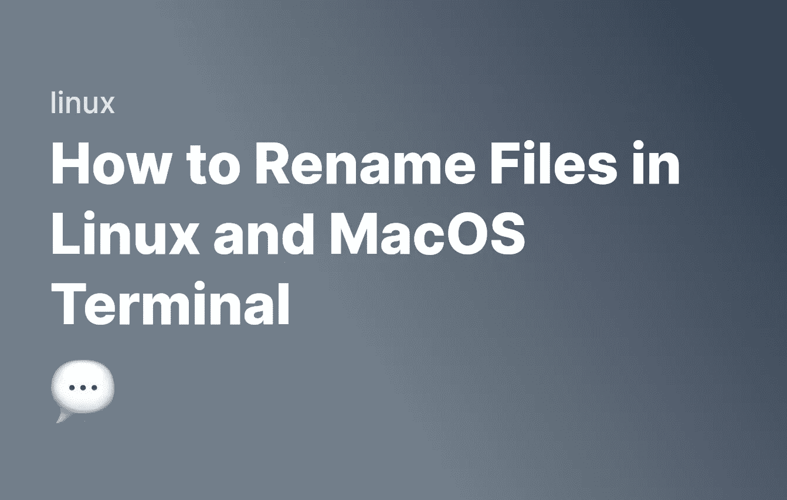

# 如何在 Linux 和 MacOS 终端中重命名文件

> 原文：<https://levelup.gitconnected.com/how-to-rename-files-in-linux-and-macos-terminal-97597d836778>



重命名文件是经常发生的事情，而在终端上的 Linux 中，重命名文件的方法有很多种。让我们来看看在 Linux 和其他基于 Unix 的系统如 MacOS 上重命名文件的一些主要方法。

# Linux 命令

如果你是 Linux 命令的新手，请在这里阅读我的 Linux 命令指南。

# 使用 mv 命令重命名文件

`mv`命令将文件移动到另一个地方。它也可以用来移动一个文件到相同的位置，并简单地改变它的名字。例如，如果您想将一个名为`file-1.txt`的文件重命名为`file-2.txt`，您将首先将 [cd](https://fjolt.com/article/linux-cd-command) 放入该目录，并运行以下命令:

```
mv file-1.txt file-2.txt
```

这在技术上“移动”了文件，但实际上最终结果是文件被重命名并在同一位置。

# 重命名多个文件

如果你想一次重命名多个文件，我们不能只使用`mv`命令。为此，我们需要遍历每个想要重命名的文件。我们可以将它与`find`命令结合使用，轻松找到所有符合我们标准的文件。例如，下面将找到所有。txt，。csv 和。html 文件，并把它们转换成。js 文件:

```
for f in $(find . -name '*.txt' -or -name '*.csv' -or -name '*.html'); do 
    mv $f ${f%.*}.js
done
```

让我们更详细地看看这是如何工作的:

*   我们运行一个`for`循环`for f in $()`。这将找到所有匹配`$()`的文件。在本例中，它查找文件类型为**的任何内容。txt** ，**。csv** 或**。html** 。你可以在这里了解更多关于 find 的信息。
*   对于每个匹配的文件，我们运行`mv`命令。我们跑`mv $f ${f%.*}.js`。
*   `$f`是我们正在循环的当前匹配文件。
*   `${f%.*}.html`是重命名任何扩展名的文件(`{f%.*}`可能是`{f%.html}`、`{f%.csv}`等)，并将其名称改为带有新扩展名的文件名`.js`。

之后，您将成功移动所有文件。