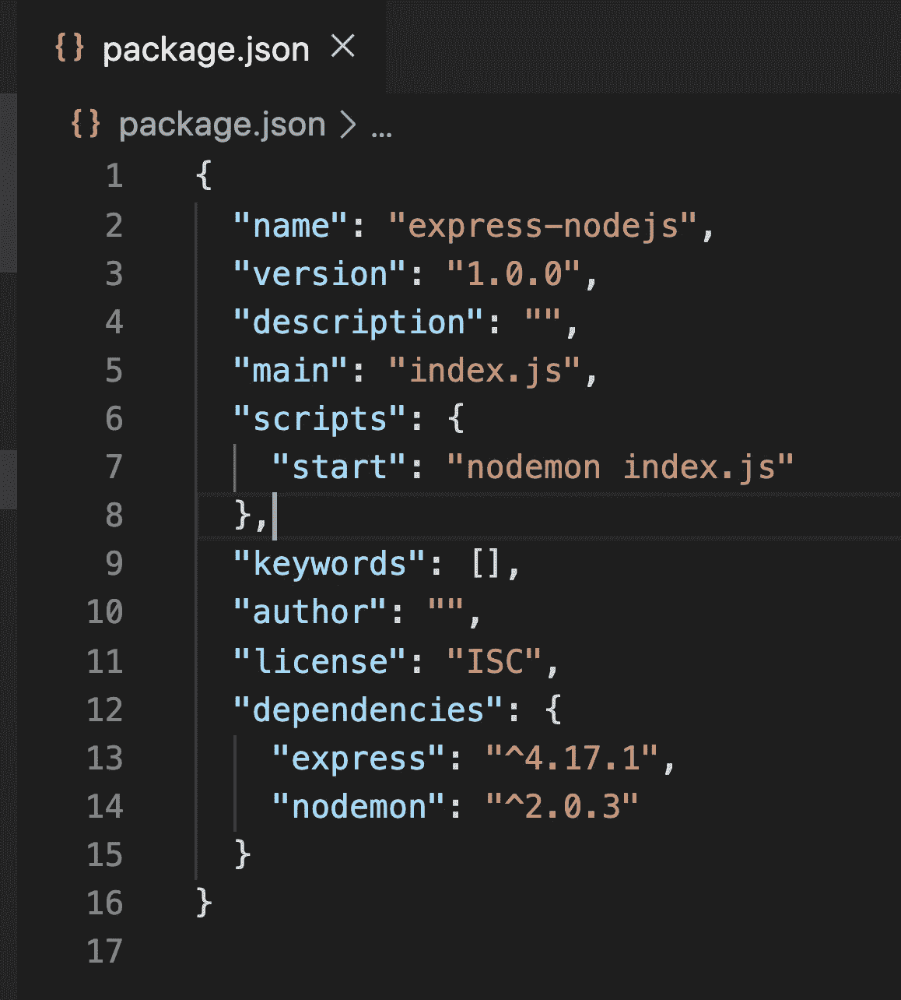
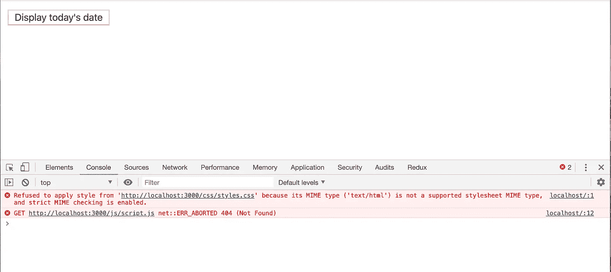
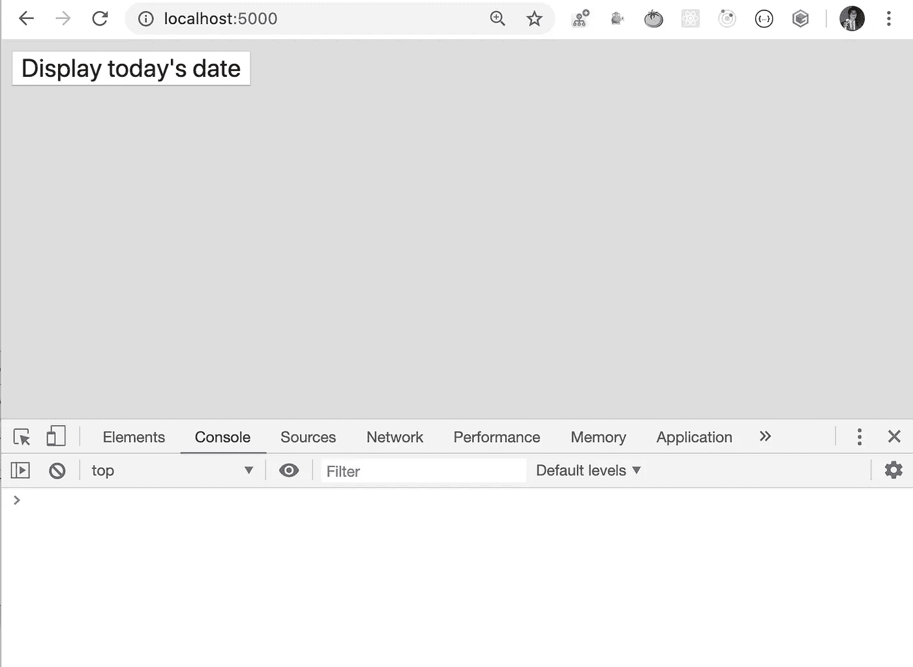
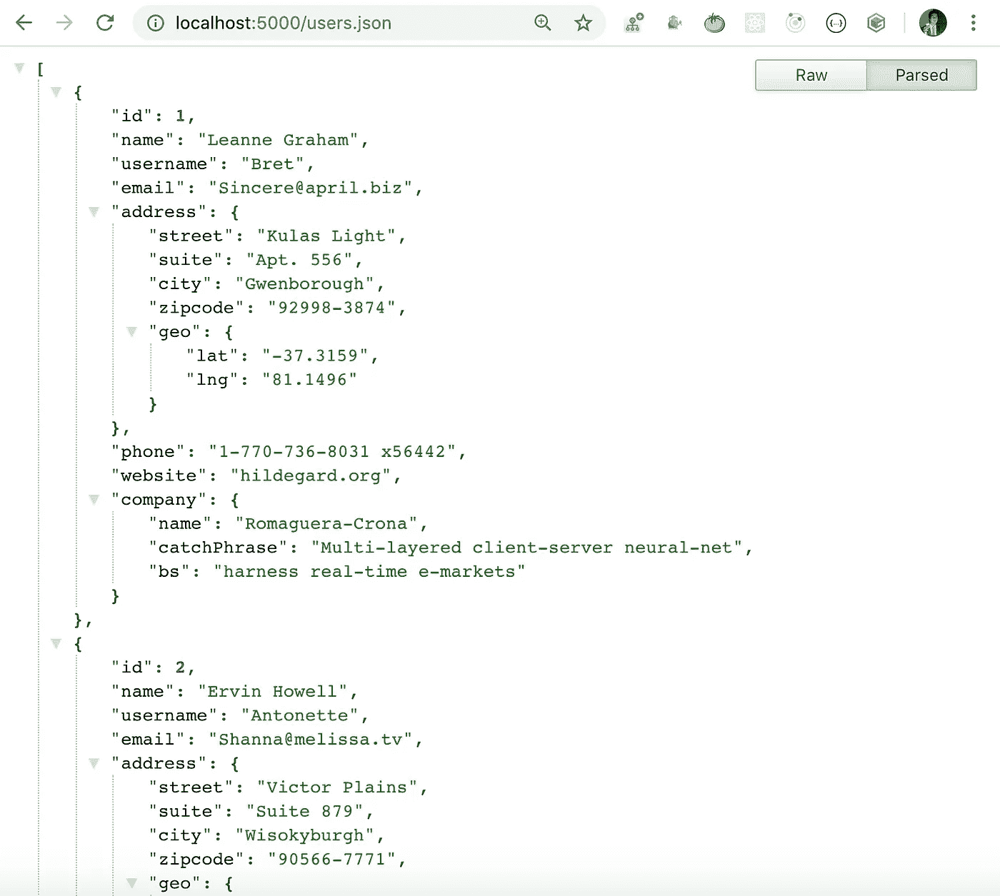
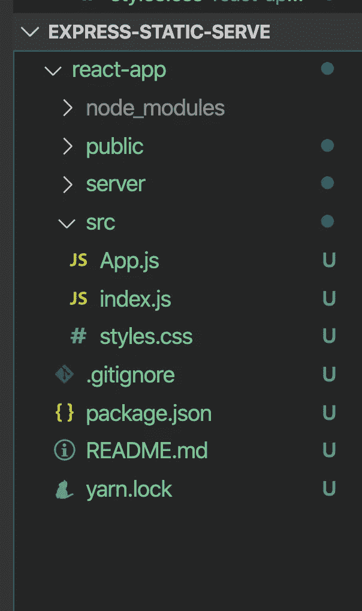
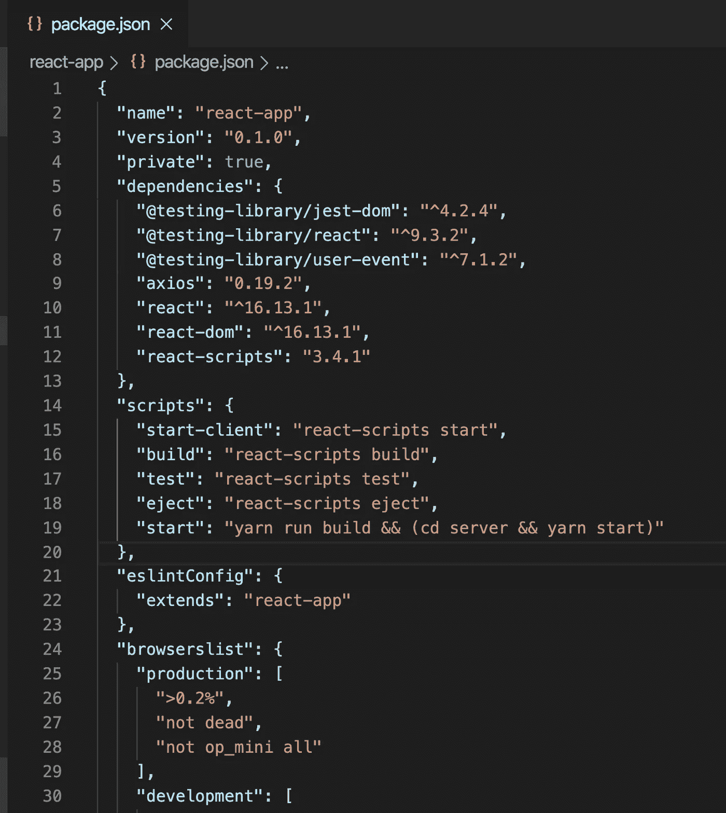
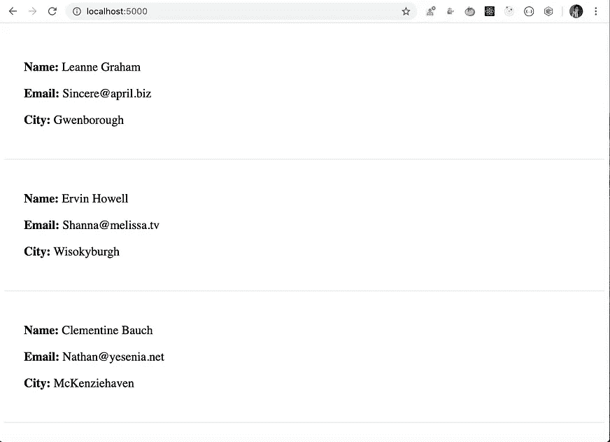
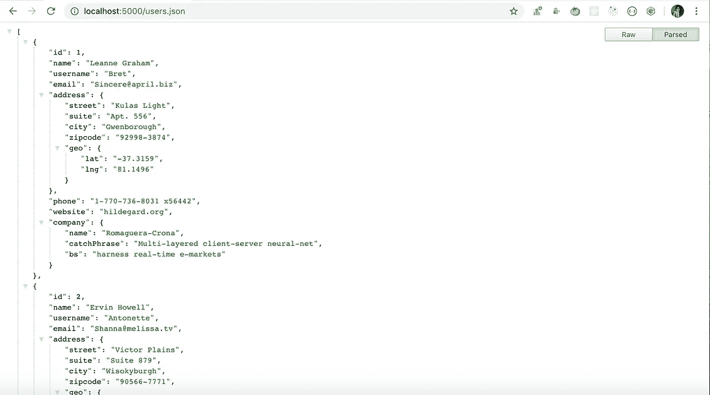

# 如何在 Node.js 中使用 Express 服务器呈现 React 应用程序

> 原文：<https://levelup.gitconnected.com/how-to-render-react-app-using-express-server-in-node-js-a428ec4dfe2b>

## 了解如何使用 Express.js 服务 create-react-app 创建的整个构建文件夹

在本文中，我们将探索如何使用`Express.js`服务器呈现 React 应用程序。

如果你正在使用`Express.js`、`React.js`、`Node.js`和`Nodejs`中的任何数据库创建一个全栈应用，这是非常有用的。因此，我们可以在同一个端口上运行我们的`React.js`和`Node.js`应用程序，避免运行两个单独的命令来启动`Node.js`和`React.js`应用程序。

在深入研究之前，让我们首先了解如何使用`Express.js`来服务静态文件

## **使用 Express.js 提供静态文件:**

有一些要求，我们需要在浏览器中访问一些文件，但如果您在服务器端运行的`Node.js`中使用`Express.js`，这些文件不会自动可用。为了让它工作，我们需要做一些代码更改。让我们开始吧。

创建一个名为`express-static-serve`的新文件夹，在该文件夹中，创建另一个名为`server`的文件夹，并从终端的`server`文件夹中运行以下命令。

```
yarn init -y
```

这将在`server`文件夹中创建一个`package.json`文件

运行以下命令安装`express`和`nodemon`包

```
yarn add express@4.17.1 nodemon@2.0.3
```

`nodemon`用于在我们更改代码时重启应用程序

创建一个新文件`index.js`并在其中添加以下内容

索引. js

在`package.json`的`scripts`部分添加新脚本

```
"start": "nodemon index.js"
```



package.json

现在，从`server`文件夹运行`yarn start`命令启动应用程序

如果导航到 [http://localhost:5000/](http://localhost:5000/) 。您将看到浏览器中显示的消息

这种静态硬编码的消息很好，但是如果我们想要呈现包含 CSS 和 Javascript 文件而不是文本的 HTML 文件的内容，我们该怎么做呢？

为此，创建一个名为`public`的新文件夹，并在其中创建两个名为`js`和`css`的文件夹。

在`public/js`文件夹中添加`script.js`，内容如下

脚本. js

将`styles.css`添加到`public/css`文件夹中，内容如下

样式. css

将`index.html`添加到`public`文件夹中，内容如下

index.html

现在，在`index.js`中，为`path`包添加一个导入，并发送`index.html`文件以响应`/`路径

```
const path = require("path");app.get("/", (req, res) => {
 res.sendFile(path.join(__dirname, "public", "index.html"));
});
```

更新的 index.js

现在，如果您检查应用程序，您会看到`index.html`中的按钮已显示，但 Javascript 和 CSS 文件未加载，浏览器控制台中显示错误



应用

因此，`Express.js`无法使用`sendFile`方法渲染`public`文件夹中的静态 CSS 和 JavaScript 文件。

为了解决这个问题，我们需要使用`Express.js`提供的`express.static`方法添加一个`middleware`

所以不要

```
app.get("/", (req, res) => {
 res.sendFile(path.join(__dirname, "public", "index.html"));
});
```

在`index.js`中添加以下代码

```
app.use(express.static("public"));
```

索引. js

这将通知`Express.js`提供`public`文件夹中的所有文件

现在，如果您在 [http://localhost:5000/](http://localhost:5000/) 检查应用程序，您将看到控制台中没有错误，CSS 被正确应用，并且单击按钮还会显示当前日期



工作应用

如果我们在`public`文件夹中有任何其他文件，如`help.html`或`contact.html`，我们也可以通过直接 URL 访问，如[http://localhost:5000/help . html](http://localhost:5000/help.html)或[http://localhost:5000/contact . html](http://localhost:5000/contact.html)

在`public`文件夹中新建一个`users.json`文件，内容如下

用户. json

您可以通过访问[http://localhost:5000/users . JSON](http://localhost:5000/users.json)进行访问



因此，只需添加`express.static`方法，我们就可以服务于所有的 JavaScript、CSS、HTML，甚至图像。

**注意:**我们可以在一个文件中有多个`express.static`方法，每个方法服务于不同的文件夹内容。

您可以在这里找到到此为止的源代码

## **使用 Express.js 渲染 React app:**

通过从`express-static-serve`文件夹运行以下命令，使用`create-react-app`创建一个新的 React 应用程序

```
create-react-app react-app
```

所以现在，`express-static-serve`文件夹中有两个文件夹，一个名为`server`，另一个名为`react-app`

从终端/命令提示符导航到`react-app`文件夹，运行以下命令安装`axios`库

```
yarn add axios@0.19.2
```

完成后，删除`react-app/src`文件夹中的所有文件，并在`src`文件夹中创建`index.js`、`App.js`和`styles.css`

打开`App.js`并添加以下内容

App.js

打开`styles.css`并添加以下内容

样式. css

打开`index.js`并添加以下内容

索引. js

现在，将`server`文件夹从`express-static-serve`移动到`react-app`文件夹

因此，您的文件夹结构将如下所示



文件夹结构

现在，从`react-app`文件夹中打开`package.json`并改变

```
"start": "react-scripts start",
```

到

```
"start-client": "react-scripts start",
```

并添加新的`start`脚本

```
"start": "yarn run build && (cd server && yarn start)"
```

这里，我们将首先生成`build`文件夹，然后使用`Express.js`服务于那个`build`文件夹

所以你的`package.json`会是这个样子



package.json

现在，打开`server/index.js`并为`path`和另一个`app.use`添加一个导入，以服务于`create-react-app`即将创建的`build`文件夹。

```
const path = require("path");app.use(express.static(path.join(__dirname, "..", "build")));
app.use(express.static("public"));
```

这里，在第一个`app.use`中，由于`build`文件夹将被创建在`react-app`文件夹内，我们为位于服务器文件夹外的`build`文件夹创建一个路径。

**注:`app.use`的**顺序此处为准。我们希望我们的`React`应用程序在页面加载时显示，所以应该首先加载`build`文件夹，因为它也将包含`index.html`。如果我们先添加`public`文件夹，那么`server/public`文件夹中的`index.html` 将被加载，因为`Express.js`从上到下读取文件，并且当它找到第一个匹配文件时停止渲染。

更新的 index.js

现在，从终端导航到`react-app`文件夹并运行`yarn start`命令，您将看到显示 React 应用程序，并且类似`help.html`、`users.json`的文件也可以在`5000`的同一个端口上访问。



最终应用

如果你的 React 应用程序使用路由，那么它将不会工作，因为我们从`Express.js`启动服务器，所以请求将总是发送到`Express.js`服务器，并且没有任何路由来处理它。

因此，要解决这个问题，请在`server/index.js`文件中的所有`Express.js`路线和中间件之后添加以下代码。

```
app.use((req, res, next) => {
  res.sendFile(path.join(__dirname, "..", "build", "index.html"));
});
```

所以现在，当任何路由的请求到达服务器，而您试图访问的路由在服务器端不存在时，我们将从`build`文件夹发送`index.html`文件，这样您的客户端路由(React App)将处理该请求并显示客户端路由页面。

您最终的`server/index.js`文件将如下所示:

你可以在这里找到本文[的完整源代码，在这里](https://github.com/myogeshchavan97/express-static-serve)找到现场演示

今天到此为止。我希望你学到了新东西。

看看我最近出版的[掌握 Redux](https://master-redux.yogeshchavan.dev/) 课程。

在本课程中，您将构建 3 个应用程序以及一个点餐应用程序，您将了解:

*   基本和高级冗余
*   如何管理数组和对象的复杂状态
*   如何使用多个减速器管理复杂的冗余状态
*   如何调试 Redux 应用程序
*   如何在 React 中使用 Redux 使用 react-redux 库让你的 app 反应性。
*   如何使用 redux-thunk 库处理异步 API 调用等等

最后，我们将从头开始构建一个完整的[订餐应用](https://www.youtube.com/watch?v=2zaPDfCKAvM)，集成 stripe 以接受支付，并将其部署到生产中。

**别忘了直接在你的收件箱** [**订阅我的每周时事通讯，里面有惊人的技巧、诀窍和文章。**](https://yogeshchavan.dev/)

# 分级编码

感谢您成为我们社区的一员！升级正在改变技术招聘。 [**在最好的公司**](https://jobs.levelup.dev/talent) **找到你的完美工作**。

[](https://jobs.levelup.dev/talent) [## 提升——改变招聘流程

### 🔥让软件工程师找到他们热爱的完美角色🧠寻找人才是最痛苦的部分…

作业. levelup.dev](https://jobs.levelup.dev/talent)