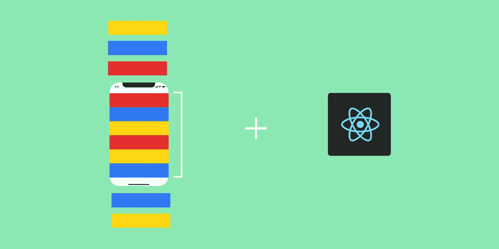
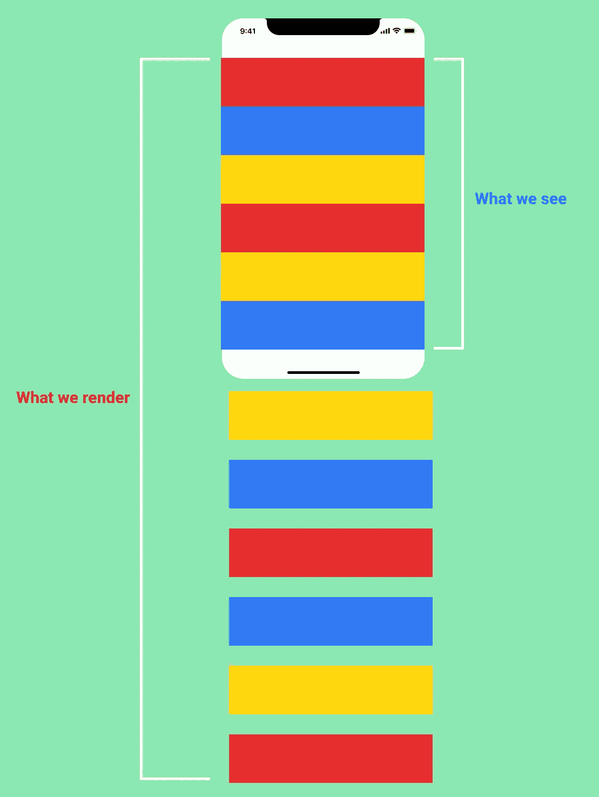
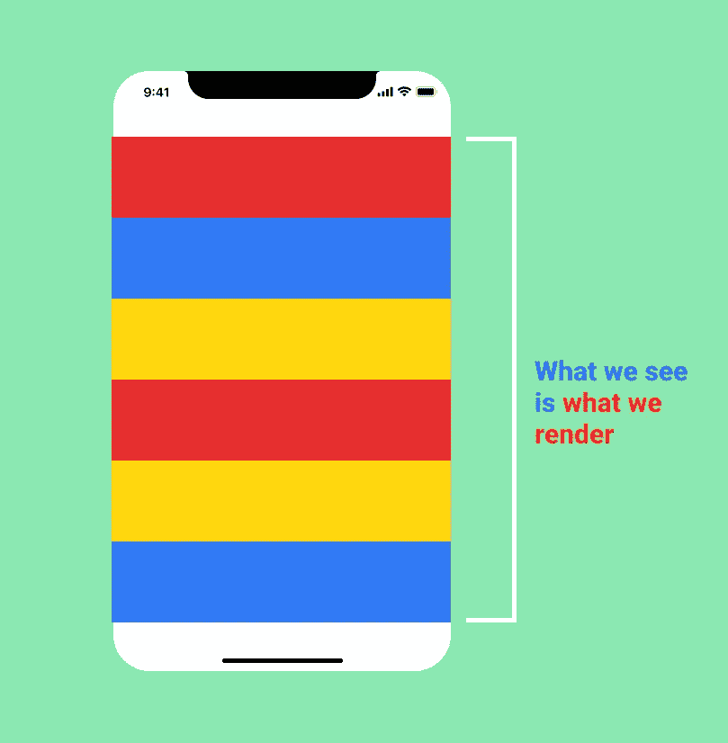
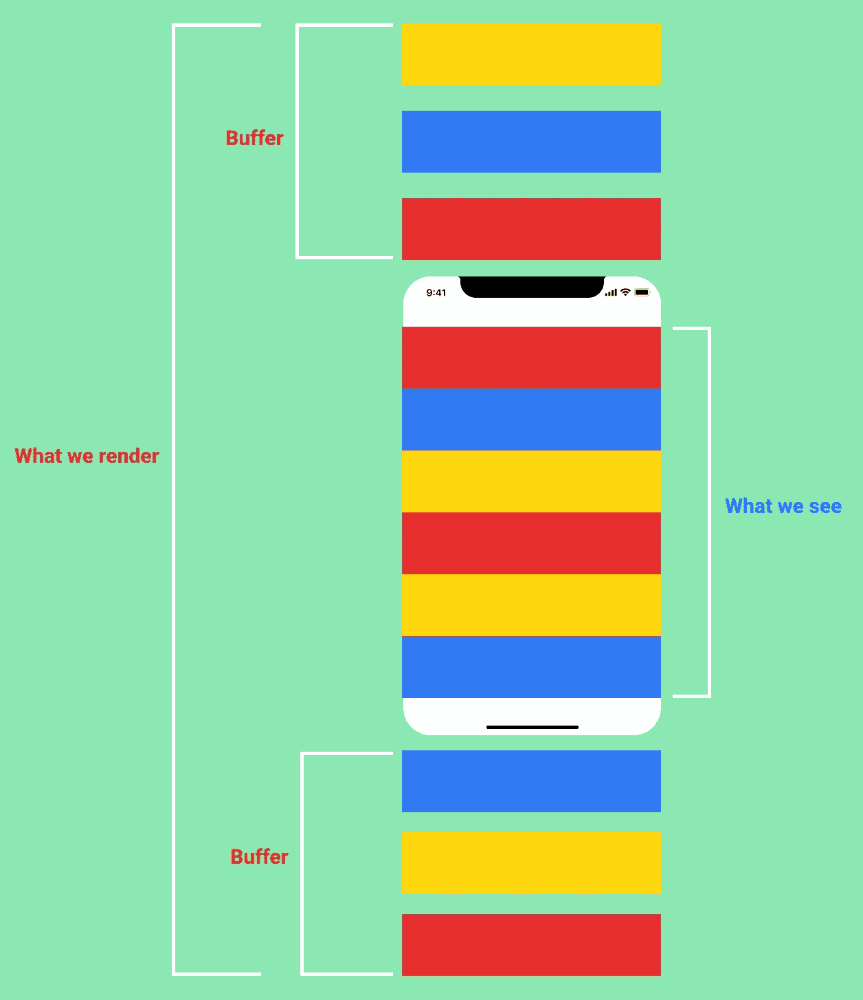

# 如何使用 React 虚拟化更快地呈现您的列表

> 原文：<https://levelup.gitconnected.com/how-to-render-your-lists-faster-with-react-virtualization-5e327588c910>

React 中的虚拟化。作者插图。

## 什么是虚拟化？

假设您想要呈现每分钟生成的大量 tweets 列表。你获取大量的数据(可能是 JSON 格式的),并使用 HTML、CSS 和 JavaScript 将其添加到 DOM 中。

在数据发生变化之前，我们可能无法在一分钟内看到所有推文。不仅如此，由于渲染 DOM 元素会占用浏览器内存，我们的浏览器有可能会受到性能影响，速度会变慢。

这里有一个快速的可视化:

呈现大型列表。作者插图。

那么，我们能做些什么来确保我们的浏览器快如闪电，即使我们显示巨大的数据列表？

进入 UI 虚拟化。

UI 虚拟化是一个前端概念，它要求我们只渲染用户视口中可见的数据量，而不是一次性添加所有 DOM 元素。

UI 虚拟化。作者插图。

如果我们在用户的视口中呈现精确的可见数据量，用户可能需要等待几秒钟才能在 DOM 中滚动到下面的数据集。

为了避免这样的用户体验，我们可以获取额外的缓冲数据来解释用户的滚动行为。

下面是它的样子:

使用缓冲数据的 UI 虚拟化。作者插图。

这个公式确保我们的浏览器和用户在呈现和查看大型数据列表时感到满意。

现在我们对 UI 虚拟化有了一些了解，我们可以看看如何在 React 中实现它。

## React 中的虚拟化

我们将使用 react-virtualized 包来实现虚拟化。

在最基本的层面上，react-virtualized 包的列表组件负责呈现整个元素列表。

它需要以下道具:

*   列表的高度和宽度。
*   元素每行的大小。
*   列表中的项目数。
*   负责呈现列表的函数。

相当多。我知道。

为了更好地理解，让我们看看在下面的代码沙箱中实现时的情况。

如您所见，我们已经对列表的宽度和高度以及元素的行高进行了硬编码。我保证会在接下来的代码示例中告诉你如何让这个列表具有响应性。

您可能还注意到 rowRenderer 属性接受一个函数作为值。该函数可以访问参数，如 key、index 和 style 元素。

让我告诉你它们的意思。

*   键—分配给列表中项目的唯一键。
*   索引—列表中每个元素的索引。
*   Style —动态添加的样式属性，用于在用户滚动时将 DOM 元素放在列表的正确位置。

现在我们知道了如何呈现虚拟化列表，是时候兑现我的承诺，继续关注它的响应能力了。

为此，让我们看看下面的代码沙箱。

扩展我们之前的示例，您可以看到添加了一个名为 AutoSizer 的新组件。

react-virtualized 的 AutoSizer 组件为您提供了要传递给 List 组件的宽度和高度属性。

AutoSizer 接受一个函数，该函数获取宽度和高度作为道具，并返回要呈现的元素。在我们的例子中，这将是列表组件。

AutoSizer 可以有一个父 div 来决定它的高度和宽度，从而使您可以完全控制所呈现列表的尺寸。

好吧。听起来不错。

但还是少了一块。

我们确实有行高硬编码。

如果列表中有多个元素，每个元素都有不同的高度，该怎么办？

我们如何解决这个问题？

react-virtualized 的 CellMeasurer 组件可以解决这个问题。

让我们看一看。

CellMeasurer 和 CellMeasurerCache 是 react-virtualized 提供的两个组件，可以帮助您动态地测量元素大小。

我来详细说明一下。

CellMeasurer 将测量元素的大小。CellMeasurerCache 将存储 CellMeasurer 测量值，以便与父组件共享。

CellMeasurerCache 接受一个对象，您可以在其中配置所需的度量。在上面的代码示例中，fixedWidth 意味着项目将具有固定的宽度和动态的高度。

更进一步，List 组件的 rowHeight 使用 CellMeasurerCache 中的值。这是因为缓存存储了来自 CellMeasurer 的测量值。deferredMeasurementCache 允许在 List 和 CellMeasurer 组件之间共享度量数据。

CellMeasurer 的 columnIndex 为 0，因为 List 组件只有一列。rowIndex 是要测量的行的索引。parent 是对用于呈现项目的父列表的引用。

这就是了。React 中使用 react-virtualized 动态配置的虚拟化列表。

我希望这篇文章为您更详细地探索虚拟化和 react-virtualized 包提供了一个良好的起点。

如果你有任何问题，建议，评论，欢迎在下面的评论区分享。

到那时，快乐的编码！

***参考文献:***

[什么是 UI 虚拟化？](https://www.kirupa.com/hodgepodge/ui_virtualization.htm)

[使用 react-virtualized 渲染大型列表](https://www.youtube.com/watch?v=UrgfPjX97Yg)