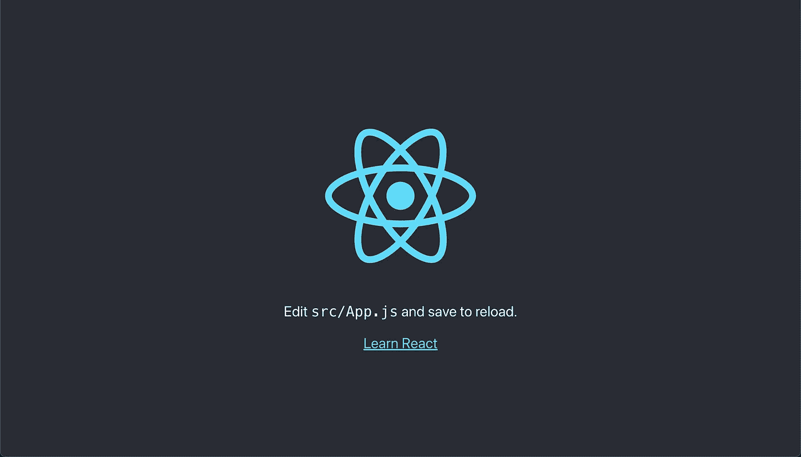
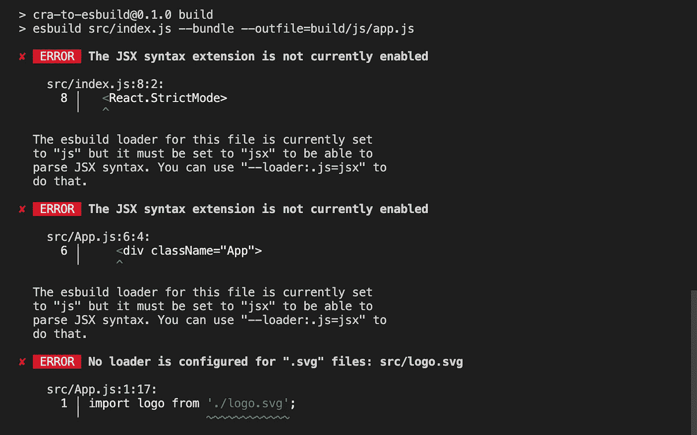
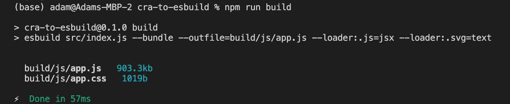

# 如何用 esbuild 替换 Create React App 中的 Webpack

> 原文：<https://levelup.gitconnected.com/how-to-replace-webpack-in-create-react-app-with-esbuild-c1a768183a20>

*原载于 2022 年 2 月 28 日*[*https://devtails . XYZ*](https://devtails.xyz/how-to-replace-webpack-in-create-react-app-with-esbuild)*。*

今年是 2022 年，你所有的 web 开发朋友都告诉你要学习 React。为了简单起见，他们会告诉你这个叫做 [Create React App](https://github.com/facebook/create-react-app) 的东西。您可以看到，在三个命令中，您可以运行一个完全配置的 React 应用程序，并感到欢欣鼓舞。

```
npx create-react-app my-app
cd my-app
npm start
```

在大约一分钟的安装包和几秒钟的`npm start`启动之后，你就可以开始了。



现在您已经有了一个基本的 React 应用程序，您可以添加几个额外的组件和页面来构建您梦想的 React 应用程序。到目前为止，一切进展顺利，您所做的更改似乎会神奇地出现在 localhost 上。

最后，是时候把这个应用程序部署到全世界，分享你的创造了。您只需运行一个`npm run build`并添加一个命令将文件`scp`到您的服务器上，事情就变得简单了。

这是你第一次运行`npm run build`，你发现用了 20 秒。“这是我唯一一次部署”，你告诉自己，并不理会构建需要多长时间。

你打开你的新网站，发现你有一个打印错误。您进行了快速更改，然后重新部署。再过 20 秒，您的更改就会生效。

"嗯，也许我应该更新这里的填充."“如果这是不同的颜色呢？”“我应该加上谷歌分析。”各种各样的新想法涌入你的脑海。它们中的每一个都只需要一行代码来更新。然而，部署这些代码需要 20-30 秒。

当您意识到有一个关键的 bug 刚刚被部署并需要修复时，问题会变得更糟。修复很简单，但是在修复上线之前，我们还有半分钟的时间。

这不是编造的故事。这是我目前在做的音乐应用 [Kaizen](https://kaizen.place) 的现状。

在其他项目中，我看到生产构建时间膨胀到一分钟以上。有时在较慢的构建机器上运行会花费两倍的时间。

过去，我在[中写过快速迭代时间的重要性，3 行代码不应该花一整天的时间](https://devtails.xyz/3-lines-of-code-shouldnt-take-all-day)。同样的原则也适用于部署代码。有些事情只有在生产环境中得到充分验证后才能宣称已经完成。这个过程越慢，一个人必须等待越长的时间来查看他们的代码是否按预期工作。

这篇文章演示了如何用更快的 esbuild bundler 替换 create-react-app 安装的 webpack bundler。

我以前写过关于[使用 esbuild](https://devtails.xyz/bundling-your-node-js-express-app-with-esbuild) 捆绑您的 express 应用程序，它捕捉到了 esbuild 的一些好处。

# 安装 esbuild

`npm i -D esbuild`

# 更新 package.json 中的构建脚本

```
// package.json
"scripts": {
    "start": "react-scripts start",
    "build": "esbuild src/index.js --bundle --outfile=public/js/app.js --loader:.js=jsx",
    "test": "react-scripts test",
    "eject": "react-scripts eject"
},
```

# 重新运行构建

`npm run build`

对于默认的 create-react-app 应用程序，您应该会看到以下错误:



# 为 js 文件启用 JSX 语法

前两个错误建议将`--loader:.js=jsx`添加到构建命令中。缺省情况下，Esbuild 会为扩展名为`jsx`的文件执行此操作，但这是处理扩展名仅为`.js`的文件所必需的。

```
// package.json
"build": "esbuild src/index.js --bundle --outfile=build/js/app.js --loader:.js=jsx"
```

前两个错误建议将`--loader:.js=jsx`添加到构建命令中。缺省情况下，Esbuild 会为扩展名为`jsx`的文件执行此操作，但这是处理扩展名仅为`.js`的文件所必需的。

# 为 SVG 添加加载程序

默认应用程序使用导入语法来包含 svg 图像。默认情况下，esbuild 不处理这种类型的文件。为了支持这些东西，esbuild 提供了插件支持。你可以在这里找到[社区 esbuild 插件列表](https://github.com/esbuild/community-plugins)。在这种情况下，我们将使用[es build-plugin-inline-image](https://github.com/natrim/esbuild-plugin-inline-image)来内联我们的 svg 图像。作为奖励，这个插件也将处理未来的`img`需求。

`npm i -D esbuild-plugin-inline-image`

为了加载新的插件，我们需要将构建命令改为使用 esbuild JavaScript API。

```
// build.js
const esbuild = require("esbuild");
const inlineImage = require("esbuild-plugin-inline-image");

esbuild.build({
  entryPoints: ["./src/index.js"],
  outfile: "./public/js/app.js",
  minify: true,
  bundle: true,
  loader: {
    ".js": "jsx",
  },
  plugins: [inlineImage()],
}).catch(() => process.exit(1));// package.json
"build": "node build.js"
```

通过这些修改，您应该可以在运行`npm run build`时看到一个成功的构建。



在我的电脑上，这个构建命令现在需要大约 60 毫秒。**比 6 秒的 webpack 版本快 100 倍。**但是我们还没有完成，我们仍然需要能够看到和运行这些变化。

# 更新`public`文件夹中的 index.html

Create React App 创建一个`public`文件夹，里面预装了几个文件。包含的`index.html`更多的是一个模板，当`react-scripts build`运行时，它被处理并输出到`build`文件夹。

对于我们新的 esbuild 构建，这个文件不需要作为模板。删除对`%PUBLIC_URL%`的引用，并添加一个指向我们新构建的`app.js`和`app.css`包的脚本标签。

```
// public/index.html
<!DOCTYPE html>
<html lang="en">
  <head>
    <meta charset="utf-8" />
    <link rel="icon" href="/favicon.ico" />
    <meta name="viewport" content="width=device-width, initial-scale=1" />
    <meta name="theme-color" content="#000000" />
    <meta
      name="description"
      content="Web site created using create-react-app"
    />
    <link rel="apple-touch-icon" href="/logo192.png" />
    <link rel="manifest" href="/manifest.json" />
    <title>React App</title>
    <script src="/assets/app.js" async defer></script>
    <link rel="stylesheet" href="/assets/app.css"/>
  </head>
  <body>
    <noscript>You need to enable JavaScript to run this app.</noscript>
    <div id="root"></div>
  </body>
</html>
```

您可能还想将`public/js`添加到您的`.gitignore`中，因为您可能不想签入生产版本。

# 添加 serve.js 脚本以自动重建更改

```
// serve.js
const esbuild = require("esbuild");
const inlineImage = require("esbuild-plugin-inline-image");

esbuild
  .serve(
    {
      servedir: "public",
      port: 8000,
    },
    {
      entryPoints: ["./src/index.js"],
      outfile: "./public/js/app.js",
      bundle: true,
      loader: {
        ".js": "jsx",
      },
      plugins: [inlineImage()],
    }
  )
  .catch(() => process.exit());
```

# 用 serve.js 替换 npm start

```
// package.json
"start": "node serve.js"
```

运行`npm start`将在端口 8000 上启动一个本地开发服务器，因此您可以通过`http://localhost:8000`进行访问。有了这个，你应该看到应用程序按预期工作，初始构建和后续构建都非常快。

# 结论

只需几个步骤，我们就可以将 6 秒的构建转换为 60 毫秒的构建。有几件事情仍然可以整理，但最终这应该为如何将基于 webpack 的 React build 转换为 esbuild 留下一个良好的开端。如前所述，我将用 [Kaizen](https://kaizen.place) 的前端代码进一步探索这种转换，并将写下我在一个更大的项目中遇到的任何问题。

*原载于 2022 年 2 月 28 日*[*https://devtails . XYZ*](https://devtails.xyz/how-to-replace-webpack-in-create-react-app-with-esbuild)*。*