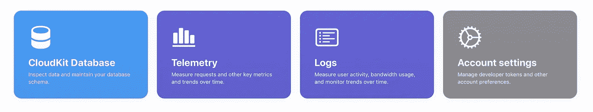
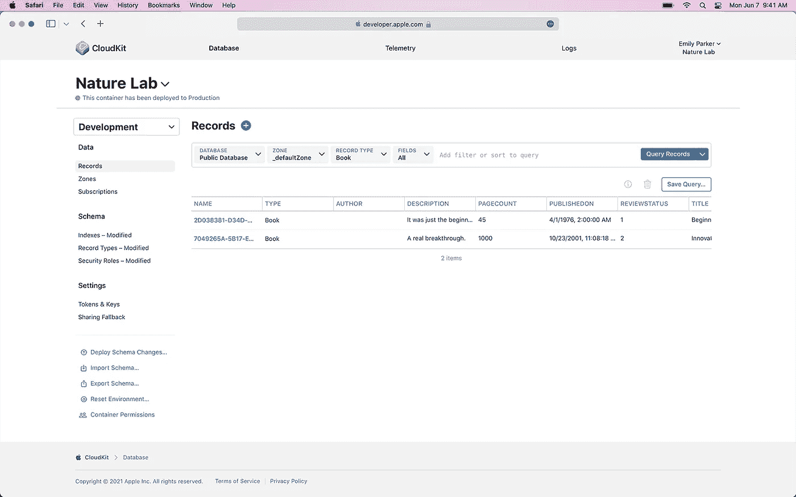
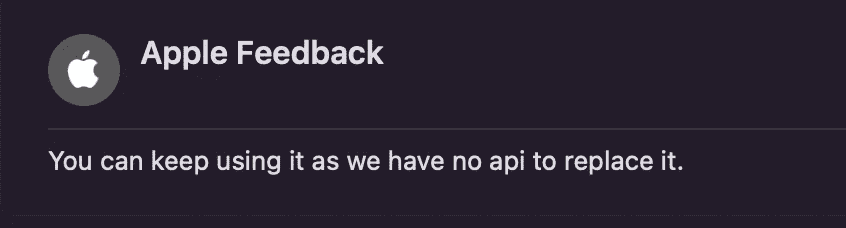

# 如何:在 iOS/iPadOS 15 上重置 CloudKit 远程通知的徽章值

> 原文：<https://levelup.gitconnected.com/how-to-reset-badge-value-of-cloudkit-remote-notification-on-ios-ipados-15-46726a435599>

## 帮助解决徽章计数问题的简单易行的解决方案。

在 WWDC21 期间，我和苹果工程师讨论了 CloudKit 和通知相关的问题。

**问题**:“当我们从 CloudKit 推送远程通知到设备时，工卡计数与“记录类型”中的行号相同。
虽然我们可以在本地使用
`UIApplication.shared.applicationIconBadgeNumber = 0`重置徽章号，但是再按一次后，徽章号就会大于 1。例如:
行为— —徽章号
设备收到推送通知— — 1
用户打开应用/点击通知横幅— — 0
设备收到另一个通知— — 2(假设应该是 1)”

**问题**:“那么，我们如何在本地和 CloudKit 中重置徽章号？”🧐

**回答**:苹果工程师告诉我这个问题和 CKModifyBadgeOperation 有关。但是，多年前就被弃用了。因此，我可能需要向反馈助理发送建议。🥲

**打完**电话后，我意识到`CKModifyBadgeOperation`仍然可以在 iOS/iPadOS 15 上工作。😆

# 编码教程

## 环境

*   iOS / iPadOS 15
*   Xcode 13

在 SwiftUI 上测试和工作(如果您没有 AppDelegate，请使用*UIApplicationDelegateAdaptor 将其集成到您的应用程序中)。* [*https://www . hackingwithswith swift . com/quick-start/swift ui/what-is-the-uiapplicationdelegateadaptor-property-wrapper*](https://www.hackingwithswift.com/quick-start/swiftui/what-is-the-uiapplicationdelegateadaptor-property-wrapper)

让我们开始吧！

第 1 步:将下面的代码放在“didFinishLaunchingWithOptions”或“applicationDidBecomeActive”下

您可能会看到警告说，“CKModifyBadgeOperation”在 iOS 11.0 中已被否决:不再受支持，将在未来的某个时间点停止工作”。请忽略它并重新运行应用程序。

第二步:…不，第二步😇

现在，您可以通过 CloudKit 仪表板再次推送通知，看看它是否对您有用。

 [## 使用您的 Apple ID 登录

### 使用您的 Apple ID 登录

使用您的 Apple IDicloud.developer.apple.com 登录](https://icloud.developer.apple.com) 

**更新(24/6/2021):** 我也问了 API 弃用日期，下面是苹果的回应。

P.S .如果您想了解更多关于 CloudKit 及其用法的信息，您可以访问苹果的 Github repo 并查看示例项目:

 [## 苹果

### Swift 编程语言 C++ 56.3k 9k 这维护了对更改和用户可见增强的建议…

github.com](https://github.com/apple?q=cloudkit-sample&type=repository) 

# 感谢阅读:)

**关于作者:**
明— UI 设计师& App 开发者
奖项:苹果 WWDC2021 Swift 学生挑战赛冠军
推特:[https://twitter.com/1998design](https://twitter.com/1998design)
雇佣我: [job@1998.media](mailto:job@1998.media) (无垃圾广告或宣传片，谢谢)