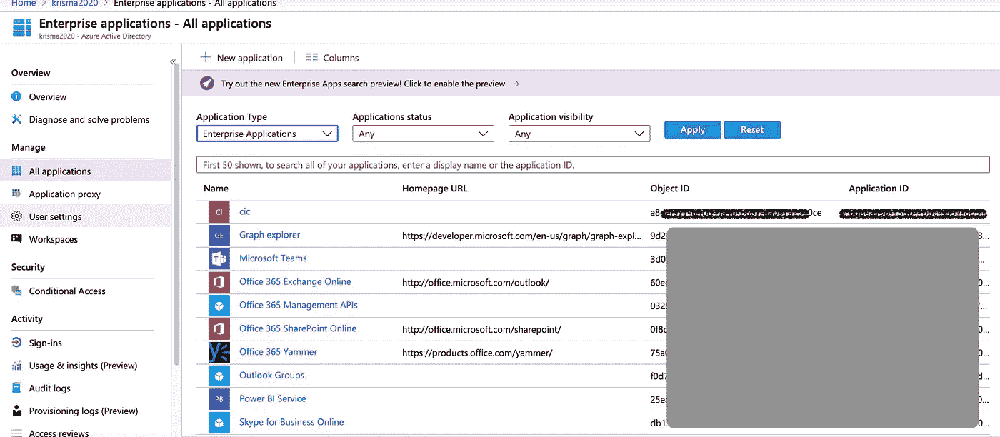
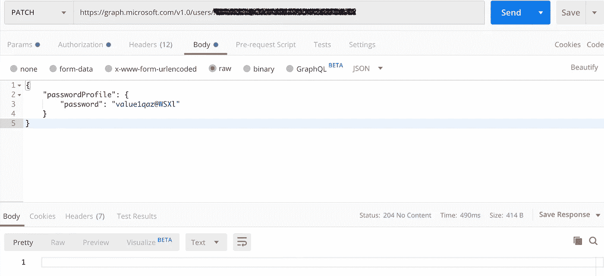

# 在 Azure AD 中使用 Microsoft Graph API 以编程方式更新用户密码配置文件的秘诀

> 原文：<https://levelup.gitconnected.com/how-to-reset-or-update-user-passwords-with-microsoft-graph-api-in-azure-ad-c6733c3b0ac3>

## 微软图形语言

## 通过 Microsoft Graph API 更新密码配置文件时，权限不足以完成操作这一错误的最佳解决方案

最近，我在做一个项目，将它的信息管理系统与微软 office365 和 Azure AD 整合起来，用于邮件交换服务。在开发过程中，我遇到了一个问题，通过 Microsoft graph API 在 azure active directory 中重置用户密码时，总是显示以下错误:

```
"code": "Authorization_RequestDenied",
"message": "Insufficient privileges to complete the operation.",
```

很快我发现许多开发者遇到了同样的问题，并简单地放弃了，因为似乎没有解决这个问题的灵丹妙药。然而，经过长时间的研究，我终于找到了原因和解决办法。因此，我想分享它，并希望它可以帮助其他开发者。


# 背景和原因——关键秘密

使用 Microsoft Graph 读取和写入资源有两种方式

> 委托权限模式:可以有委托权限，比如目录。一个用户，但它必须通过一个交互式登录
> 
> 应用许可模式:不需要交互式登录，非常适合后端服务使用。但是，由于它不是真正的用户，所以不能拥有一些委托权限，所以不能被委托。

因此，如果我们构建一个服务或应用程序来访问 Microsoft graph，我们必须使用应用程序权限模式来避免交互式登录，这意味着访问不是由任何用户触发的。但是，当更新 **passwordProfile** 属性时，需要以下权限:Directory。AccessAsUser.All，这只是委派的权限。这就是为什么不管分配什么权限，密码配置文件的更新都会失败。

# 解决办法

当然，人们可以切换到委托许可访问模式，并使用一些 GUI 框架(如 WebDriver)来自动化交互式登录网页过程，这非常麻烦、不方便，并且更糟糕的是，不稳定和不可靠。

那么对此的最佳解决方案是什么呢？

> 答案是在我们的应用程序中添加必要且足够的角色，这样我们的应用程序就可以执行原本需要授权用户才能完成的任务。这可以通过一些 Powershell 模块来实现，并且只在服务器端一次性完成。

有两个版本的 PowerShell 模块可用于连接到 Office 365 并管理用户帐户、组和许可证:

> azure Active Directory PowerShell for Graph
> 
> 用于 Windows PowerShell 的 Microsoft Azure Active Directory 模块

截至本文，Azure Active Directory PowerShell for Graph 模块并没有完全取代 Microsoft Azure Active Directory Module for Windows PowerShell 模块的 cmdlets 中用于用户、组和许可证管理的功能。我还发现 Azure AD PowerShell 甚至不能在 Mac 上安装。所以我会用`MSOL`。`Windows os` 这里强烈推荐，虽然它声称 MSOL 模块完全转移到点网核心。

## 安装 MSOL 并使用 MSOL 登录 Azure Active Directory。

打开 PowerShell 并输入:

`Install-Module -Name MSOnline`

如果您使用的是带点网核心的 Mac OS，那么需要显式导入模块

`Import-Module MSOnline`

然后连接服务

`Connect-MsolService`

现在应该会有一个弹出窗口，要求您登录 Azure。请确保使用全局管理员帐户。

## 获取应用程序的 ObjectID

我们可以使用以下命令获取对象 ID:

```
$tenantID = “<Tenant ID>”
$appID = “<Application ID>”
$myAp = Get-MsolServicePrincipal -AppPrincipalId $appID -TenantID $tenantID
$objectId = $myAp.ObjectId
```

或者直接在 azure 广告中获取。



## 添加角色成员

这里我们选择`Helpdesk Administrator`，它做用户管理的权力最小。(实际上，密码管理的最小角色是`Password Administrator`，但它不足以实现用户管理的其他必要功能)

```
Add-MsolRoleMember -RoleName “Helpdesk Administrator” -RoleMemberType ServicePrincipal -RoleMemberObjectId $objectId
```

如果它碰巧不是你需要的角色，你也可以轻松地删除它。

```
Remove-MsolRoleMember -RoleName “Helpdesk Administrator” -RoleMemberType ServicePrincipal -RoleMemberObjectId $objectId
```

## 测试更新操作

等待几分钟后，当我们再次点击端点时，我们可以看到服务器返回 204 No Content，显示密码更新成功。



# 使用 AAD PowerShell V2.0 的解决方案

## 安装 AAD PowerShell V2.0 模块并登录

```
Install-Module AzureAD
Connect-AzureAD
```

## 获取应用程序的 ObjectID

```
$myAp = Get-AzureADServicePrincipal -searchstring <your application name>$myAp.ObjectId
```

## 添加角色成员

```
$myAADRole = Get-AzureADDirectoryRole | Where-Object {$_.displayName -eq ‘Helpdesk Administrator’}Add-AzureAD DirectoryRoleMember -ObjectId $myAADRole.ObjectId -RefOb jectId $myAp.Object Id
```

# 参考:

**Azure 角色和权限**:[https://docs . Microsoft . com/en-us/Azure/active-directory/users-groups-Roles/directory-assign-admin-Roles # details-about-the-global-administrator-role](https://docs.microsoft.com/en-us/azure/active-directory/users-groups-roles/directory-assign-admin-roles#details-about-the-global-administrator-role)

**关于 office-365-PowerShell 的更多信息**:[https://docs . Microsoft . com/en-us/office 365/enterprise/PowerShell/why-you-need-to-use-office-365-PowerShell](https://docs.microsoft.com/en-us/office365/enterprise/powershell/connect-to-office-365-powershell)