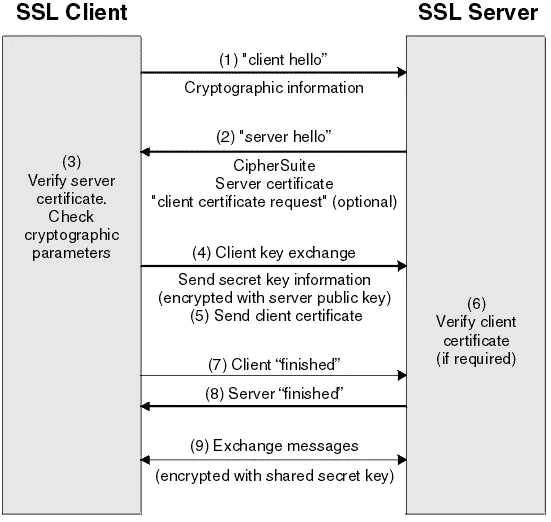
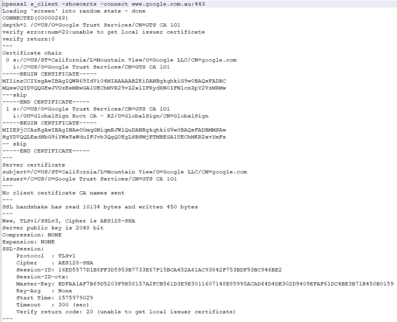

# 如何通过 SSL 调用解决 NodeJS 应用程序中的证书错误

> 原文：<https://levelup.gitconnected.com/how-to-resolve-certificate-errors-in-nodejs-app-involving-ssl-calls-781ce48daded>

## 解决 SSL 证书错误的实用指南

在非生产环境中，使用 HTTPS 和服务器证书设置 NodeJS 应用程序相对简单。在生产环境中，如果您的 Node/Express 应用程序位于反向代理(如 Nginx)之后，它不需要调用其他外部服务，则不需要 HTTPS 和服务器证书。

然而，在现实中，您的节点应用程序将需要调用 HTTPS 保护的各种后端服务。默认情况下，NodeJs 是用[一组常用的 CA 根证书](https://github.com/nodejs/node-v0.x-archive/blob/master/src/node_root_certs.h)构建的。即使有了这些证书，如果您的后端服务使用自签名证书(即特定于公司的私有 CA)托管，我们仍然可能会遇到与 HTTPS 相关的错误。

这些错误包括:

> `*UNABLE_TO_GET_ISSUER_CERT_LOCALLY*`
> 
> `*UNABLE_TO_VERIFY_LEAF_SIGNATURE*`
> 
> `*DEPTH_ZERO_SELF_SIGNED_CERT*`

我们需要了解这些错误，然后才能解决它们。

让我们深入研究这些错误。

## SSL 握手



这些错误源于 SSL 握手过程。当客户端开始与服务器建立连接时，会发生 TLS 握手。它是客户端和服务器之间交换的一系列消息。在这些消息中，他们同意使用 TLS 和密码套件的版本，验证服务器的身份，并生成会话密钥。

在上图的步骤 2 中，服务器发送包含服务器 SSL 证书的消息。然后，客户端向颁发证书的 CA(证书颁发机构)验证证书。这一步确认了服务器就是它所声称的那个人，并且客户端正在与域的实际所有者进行交互。

抛出上述 SSL 错误是因为客户端无法验证在步骤 2 中发送的自签名服务器证书的信任链。

> TLS 握手是一个复杂的过程，你可以阅读下面的文章了解更多的细节。

[](/deep-dive-into-tls-handshake-e029e28e2eb3) [## 深入了解 TLS 握手

### 逐步解释 TLS 1.2 握手过程

levelup.gitconnected.com](/deep-dive-into-tls-handshake-e029e28e2eb3) 

## 快速而肮脏的解决方法:拒绝未授权

解决这些错误最简单的方法是使用下面的“`rejectUnauthorized`”选项。

```
https.request({ 
      ....,
      rejectUnauthorized: false,
    },
...)
```

或者将其设置为环境变量

```
NODE_TLS_REJECT_UNAUTHORIZED=0
```

然而，这种方法是不安全的，因为它禁用了服务器证书验证，使节点应用程序对 [MITM](https://en.wikipedia.org/wiki/Man-in-the-middle_attack) 攻击开放。因此，强烈建议只在开发环境中禁用证书验证，而不要在生产环境中应用这种方法。

## 使用 CA 选项

更安全的方法是指定期望从服务器获得的 CA 证书。换句话说，证书的通用名称需要与服务器证书相匹配。

```
request({ 
   ca: [fs.readFileSync([certificate path])],
   rejectUnauthorized: true,
}
```

如您所见，`ca`选项是一个数组，因此如果需要，您可以设置多个证书文件。在代码中硬编码证书文件会使根据需要更新或轮换证书变得困难。为了避免这些问题，可以考虑使用配置管理工具来处理证书的安装和更新。

## 节点额外证书

从节点版本 7.3.0 开始，引入了`NODE_EXTRA_CA_CERTS`环境变量来指定所需的任何附加证书颁发机构(CA)证书的位置。这允许使用文件中的额外证书来扩展“根”ca。该文件应包含一个或多个 **PEM** 格式的可信证书。

要使用`NODE_EXTRA_CA_CERTS`环境变量，可以在启动 Node.js 应用程序时指定证书文件的路径。例如，您可以使用以下命令:

```
NODE_EXTRA_CA_CERTS=path/to/ca/certificates.pem node app.js
```

该命令设置`NODE_EXTRA_CA_CERTS`变量，然后启动`app.js` Node.js 应用程序。Node.js 应用程序将在进行 SSL 调用时使用 CA 证书，这将有助于解决证书错误。

请注意，如果为 HTTPS 客户端或服务器显式指定了`ca`选项属性，额外的证书将不会生效。

## 如何排除故障？

如果您使用了`ca`选项或`NODE_EXTRA_CA_CERTS`，但仍然收到相同的错误。这通常是由于使用了不正确的证书。

首先，让我们检查证书链，以确保所有必要的中间证书都包含在证书链中。证书链应该包括服务器证书、中间 CA 证书和根 CA 证书。

为了让`ca`选项或额外的证书起作用，我们需要获得完整的 CA 链或至少是根 CA 证书。

您可以使用 [OpenSSL](https://www.openssl.org/) 来检索完整的 CA 链，如下所示:

```
openssl s_client -connect ${REMHOST}:${REMPORT}
```

证书链的示例如下所示。



Google CA 证书链

> 请注意， *showcerts* 命令可能无法工作，如果该命令在代理后面执行或者远程服务器使用 [SNI](https://en.wikipedia.org/wiki/Server_Name_Indication) 。

如果错误仍然存在，请检查以下其他内容

*   检查证书路径以确保证书路径正确且可被应用程序读取。
*   验证证书的格式是否正确(通常是 PEM 或 DER)。您可以使用`openssl` 命令将证书转换成所需的格式。

## 摘要

在本文中，我们将详细讨论如何解决 NodeJs 应用程序中的证书错误。如果你在尝试了所有方法后仍然无法修复错误，那么 StackOverflow 就是你最好的朋友:)。

如果您还不是付费媒体会员， [**您可以通过访问此链接**](https://sunnysun-5694.medium.com/membership) 进行注册。你可以无限制地阅读媒体上的所有报道。我会收你一部分会员费作为介绍费。

感谢阅读，祝编程愉快！