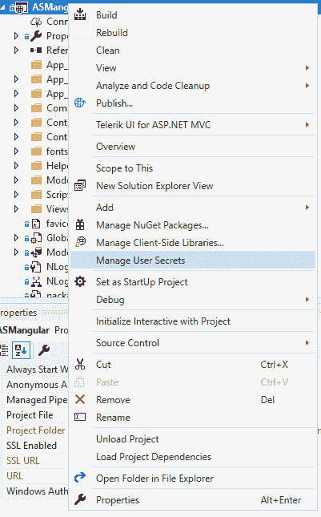
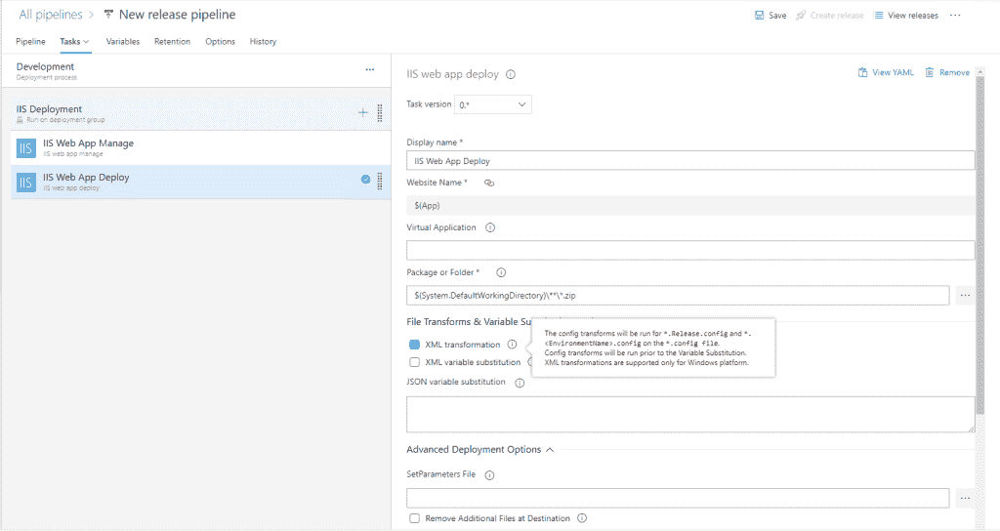
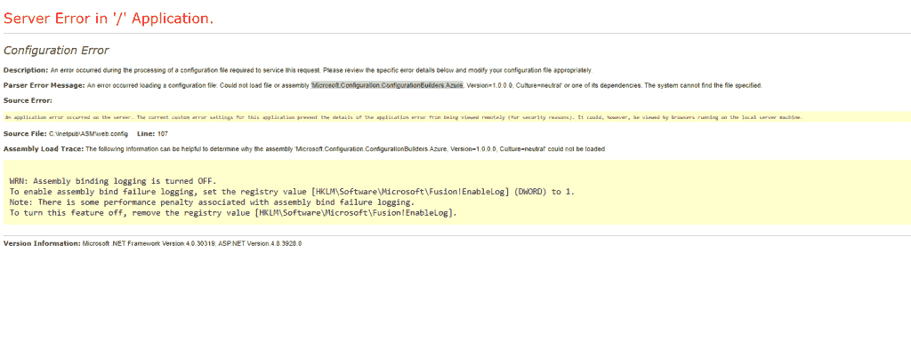
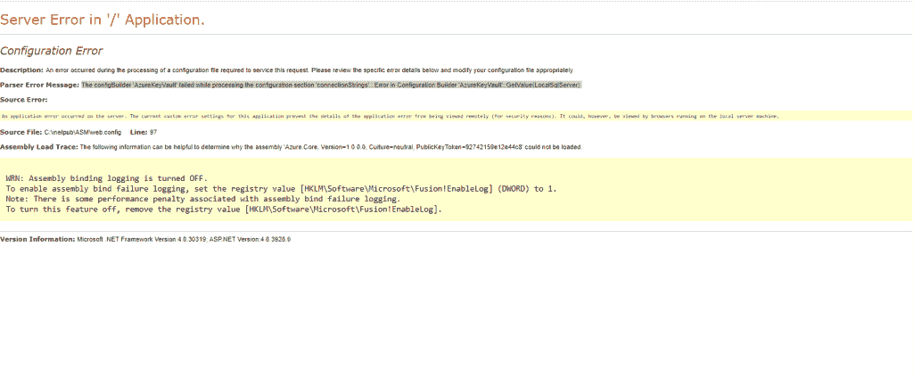
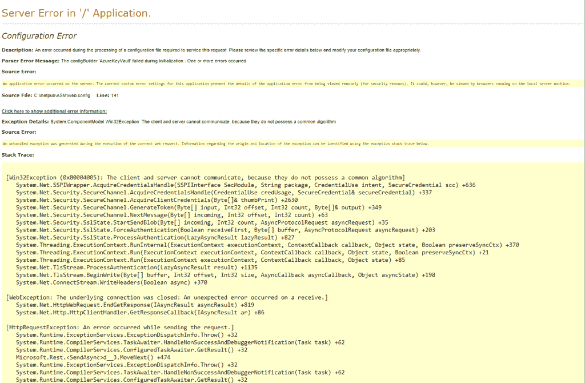

# 如何使用配置生成器、XML 转换和 azure devops 从 ASP.NET 检索 azure key vault 中的连接字符串。

> 原文：<https://levelup.gitconnected.com/how-to-retrieve-connection-strings-in-azure-key-vault-from-asp-net-2d8d9e15c87c>


来自 [Pixabay](https://pixabay.com/?utm_source=link-attribution&utm_medium=referral&utm_campaign=image&utm_content=2054429) 的[塔伊布·梅扎迪亚](https://pixabay.com/users/TayebMEZAHDIA-4194100/?utm_source=link-attribution&utm_medium=referral&utm_campaign=image&utm_content=2054429)的图片

配置生成器是从外部源检索连接字符串的机制。使用配置构建器，除了安装包和为连接到流行的源提供 XML 配置之外，您可能不需要做太多的编码工作。在这篇文章中，我将与你分享我使用配置生成器的经验。NET 从 azure 密钥库中安全地检索连接字符串。我将检查设置，并分享我在将我的应用程序与 azure key vault 集成时遇到的一些问题。

# 配置生成器是用来做什么的。网

配置生成器是一个类，它公开用于检索在 web.config 或 appsettings 文件的`<appSettings>`或`connectionStrings`节中指定的键值的元数据和方法。微软提供了连接到 secrets.json、azure key vault、环境变量等流行资源的配置生成器...您还可以实现自己的配置生成器，以连接到您想要的任何源。

> *配置生成器为 ASP.NET 应用程序提供了一种现代、灵活的机制来从外部来源获取配置值。*
> 
> [*为 ASP.NET 配置建设者*](https://docs.microsoft.com/en-us/aspnet/config-builder)

对于我的 ASP.NET 应用程序，我使用了微软提供的两个配置生成器:`Microsoft.Configuration.ConfigurationBuilders.UserSecretsConfigBuilder` 和`Microsoft.Configuration.ConfigurationBuilders.AzureKeyVaultConfigBuilder`

从文档中，配置生成器:

> *。在中提供。NET Framework 4.7.1 及更高版本。*
> 
> *。为读取配置值提供灵活的机制。*
> 
> *。当应用程序迁移到以容器和云为中心的环境中时，满足它们的一些基本需求。*
> 
> *。中以前不可用的资源(例如，Azure Key Vault 和环境变量)来提高对配置数据的保护。NET 配置系统。*
> 
> [*配置建设者为 ASP.NET*](https://docs.microsoft.com/en-us/aspnet/config-builder)

# 总体战略

下面我概述了我用来从源代码中删除连接字符串的高级计划:

1.  将应用程序更新到目标。NET framework 4.7.1 或更高版本。
2.  对于本地环境，利用`UserSecretsConfigBuilder`和。NET secret management 来存储和检索 secrets.json 中的连接字符串，secrets . JSON 是一个驻留在您的计算机上并通过 secret manager 与您的项目链接的文件。
3.  对于其他环境(开发、试运行、生产等..)，使用`AzureKeyVaultConfigBuilder`在 azure key vault 中存储和检索连接字符串。
4.  为每个其他环境创建一个 web.config 文件，在这些环境中，您可以指定 XML 转换规则来应用连接到特定密钥库的配置。
5.  在 azure 发布管道中，使用**文件转换**特性来转换 web.config 和 web 中的配置。{环境}。配置文件。

在接下来的部分中，我将讨论细节并分享代码。

# 将您的应用程序更新到目标。NET Framework 4.7.1 或更高版本

根据文档，如果您的应用程序的目标版本是。NET 早于 4.7.1，需要升级到 4.7.1 或更高版本。对于我的项目，我的目标是。NET 4.8，因为在撰写本文时这是最新版本。

# 使用 UserSecretsConfigBuilder 存储和检索连接字符串

秘密管理是一个链接源代码之外的 XML 文件的工具。默认情况下，该文件的名称是 **secrets.xml.** 在运行时，框架将 secrets.xml 中的名称与 web.config 或 appsettings.config 中的连接字符串进行匹配，并用 secrets.xml 文件中的值替换连接字符串。

> [*用户机密存储是保存在用户配置文件文件夹下的文件，因此机密不会签入源代码管理。*](https://docs.microsoft.com/en-us/azure/key-vault/general/vs-secure-secret-appsettings#save-secret-settings-in-user-secret-store-that-is-outside-of-source-control-folder)

使用秘密管理最简单的方法是使用 Visual Studio。你只需要右击你的项目，选择**管理用户机密**



该工具的作用是安装必要的 nuget 包，为您的秘密文件生成一个 id，在以 id 为名称的文件夹下创建一个文件，并在 web.xml 文件中插入相关配置。比如我用的是 Windows 10，对我来说，工具在:`C:\Users\tbo\AppData\Roaming\Microsoft\UserSecrets\ffc6ae13-97c8-489c-b519-3f724580a587.`下创建文件

在 my web.xml 中，该工具插入了以下内容:

```
<configSections>
 <section name="configBuilders" type="System.Configuration.ConfigurationBuildersSection, System.Configuration, Version=4.0.0.0, Culture=neutral, PublicKeyToken=b03f5f7f11d50a3a" restartOnExternalChanges="false" requirePermission="false" />
</configSections>
<configBuilders>
 <builders>
  <add name="Secrets" userSecretsId="ffc6ae13-97c8-489c-b519-3f724580a587" type="Microsoft.Configuration.ConfigurationBuilders.UserSecretsConfigBuilder, Microsoft.Configuration.ConfigurationBuilders.UserSecrets, Version=1.0.0.0, Culture=neutral" />
 </builders>
</configBuilders>
```

该工具还会将以下软件包安装到我的应用程序中:

```
<package id="Microsoft.Configuration.ConfigurationBuilders.Base" version="2.0.0" targetFramework="net48" /> 
<package id="Microsoft.Configuration.ConfigurationBuilders.UserSecrets" version="2.0.0" targetFramework="net48" />
```

My secrets.xml 如下所示:

```
<?xml version="1.0" encoding="utf-8"?>
<root>
 <secrets ver="1.0">
  <secret name="MyConnectionString" value="insert your connection string here"></secret>
 </secrets>
</root>
```

在我的 web.config 中，

```
<connectionStrings configBuilders="Secrets">
 <add name="MyConnectionString" providerName="System.Data.SqlClient" connectionString="from secrets" />
</connectionStrings>
```

注意 configBuilders 的值是 **Secrets** ，它与**config sections->builders**下的名称相匹配。您可以使用不同的名称，它必须与您在 **builders** 部分中指定的名称相匹配。

# 使用 AzureKeyVaultConfigBuilder 存储和检索连接字符串

添加一个配置生成器来与 azure key vault 集成是相当简单的，因为设置与 secrets.xml 文件类似。

首先，确保您的项目包含以下 nuget 包:

```
<package id="Microsoft.Configuration.ConfigurationBuilders.Azure" version="1.0.1" targetFramework="net48" />
<package id="Microsoft.Configuration.ConfigurationBuilders.Base" version="1.0.1" targetFramework="net48" />
<package id="Azure.Core" version="1.0.0" targetFramework="net48" />
<package id="Azure.Identity" version="1.0.0" targetFramework="net48" />
<package id="Azure.Security.KeyVault.Secrets" version="4.0.0" targetFramework="net48" />
<package id="Microsoft.Azure.KeyVault" version="3.0.5" targetFramework="net48" />
<package id="Microsoft.Azure.KeyVault.WebKey" version="3.0.5" targetFramework="net48" />
<package id="Microsoft.Azure.Services.AppAuthentication" version="1.4.0" targetFramework="net48" />
```

在上面的片段中，我展示了适用于我的项目的 nuget 版本。如果您的项目针对不同的。NET framework 版本，您应该检查文档，或者您可能必须经过几次试验才能获得适用于您的项目的版本。由于不兼容的 nuget 包，我遇到了问题。

*注意* :
***如果库的版本不兼容，您可能会遇到问题。比如微软。configuration builders . Azure 1 . 0 . 1 版可能无法与 Microsoft 一起使用。configuration . configuration builders . base 版本 2.0。***

安装完软件包后，在 web.config 中添加配置生成器:

```
<configBuilders>
 <builders>
  <add name="AzureKeyVault" uri="[VaultUri]" type="Microsoft.Configuration.ConfigurationBuilders.AzureKeyVaultConfigBuilder, Microsoft.Configuration.ConfigurationBuilders.Azure, Version=1.0.0.0, Culture=neutral" />
 </builders>
</configBuilders>
```

在上面的片段中，注意我有 uri =**【VaultUri】**。请注意，我将展示如何使用 azure devops 在发布管道中进行 XML 转换，用连接到我的密钥库的 Uri 替换[VaultUri]。

在您的`<connectionStrings>`部分中，设置 configBuilders 属性以使用 azure key vault 配置生成器。

```
<connectionStrings configBuilders="AzureKeyVault">
 <add name="MyConnectionString" providerName="System.Data.SqlClient" connectionString="from key vault" />
</connectionStrings>
```

在您的密钥库中，您的机密的名称应该与您的连接字符串的名称相匹配。按照上面的例子，您应该在您的密钥库中将您的秘密命名为“MyConnectionString”。

你可能想知道应用程序如何认证访问密钥库？神奇就在`Microsoft.Azure.Services.AppAuthentication` 包里。在没有连接字符串的情况下，库会自动尝试其他方法来验证 azure:托管服务标识、Azure CLI 和 Visual Studio。我的应用运行在启用了托管身份的 azure VM 上，因此我不必指定连接字符串。我相信当前版本的`AzureKeyVaultConfigBuilder`不允许指定连接字符串，因为它违背了在源代码中没有连接字符串的初衷。如果你的应用不在具有托管身份的 azure 资源上运行，你可能需要考虑通过其他方法配置身份验证。

如果一切正常，您应该能够从密钥库中检索连接字符串。

在实际项目中，我们通常必须处理多种环境，并从不同的密钥库中提取连接字符串。此外，对于本地开发，我们可能希望只使用秘密管理。处理多种环境的一种方式是使用 azure devops。

# 为多种环境应用不同的配置

在一个典型的 ASP.NET 项目中，通常有这些 Web.config 文件。使用 MSBuild 生成项目时，可以指定一个配置标志。例如，如果使用发布配置进行生成，MSBuild 将应用您在 Web 文件中指定的 XML 转换逻辑。在构建的最后，您有了一个包含 Web.config.xml 的工件，其中的一些配置已经根据您的 xml 转换逻辑进行了更新。

例如，下面的命令将在 Web 中应用 XML 转换逻辑。Release.config.xml 来修改 Web.config.xml 中的内容。

```
"C:\Program Files (x86)\Microsoft Visual Studio\2019\Enterprise\MSBuild\Current\Bin\msbuild.exe" "D:\a\1\s\ASMAngular\ASMangular.sln" /nologo /nr:false /dl:CentralLogger,"D:\a\_tasks\VSBuild_71a9a2d3-a98a-4caa-96ab-affca411ecda\1.166.0\ps_modules\MSBuildHelpers\Microsoft.TeamFoundation.DistributedTask.MSBuild.Logger.dll";"RootDetailId=3985d9c0-f0b7-4859-974e-6de12c486b5e|SolutionDir=D:\a\1\s\ASMAngular"*ForwardingLogger,"D:\a\_tasks\VSBuild_71a9a2d3-a98a-4caa-96ab-affca411ecda\1.166.0\ps_modules\MSBuildHelpers\Microsoft.TeamFoundation.DistributedTask.MSBuild.Logger.dll" /p:DeployOnBuild=true /p:WebPublishMethod=Package /p:PackageAsSingleFile=true /p:SkipInvalidConfigurations=true /p:PackageLocation="D:\a\1\a" /p:platform="Any CPU" /p:configuration="Release" /p:VisualStudioVersion="16.0" /p:_MSDeployUserAgent="VSTS_dbbe18ec-e0b5-4828-8485-4939250dac49_build_98_0"
```

作为一个例子，我的 Web 中有以下转换逻辑。Development.config.xml 来检索我们的开发环境密钥库中的连接字符串。

```
<configuration
 xmlns:xdt="[http://schemas.microsoft.com/XML-Document-Transform](http://schemas.microsoft.com/XML-Document-Transform)">
 <configBuilders>
  <builders>
   <add name="AzureKeyVault" xdt:Transform="SetAttributes" xdt:Locator="Match(name)" uri="[https://myvaultdev.vault.azure.net/](https://myvaultdev.vault.azure.net/)"/>
  </builders>
 </configBuilders>
 <connectionStrings configBuilders="AzureKeyVault" xdt:Transform="SetAttributes"></connectionStrings>
</configuration>
```

上面的代码片段搜索名为**azurekeyfault**的`<builders>` 部分，并用值设置 uri 属性以连接到密钥库。它还更新 Web.config.xml 中的`<connectionStrings>`部分，以使用配置生成器**azurekeyfault**。

如您所见，我们可以有一个 Web.config 文件，其中包含核心配置和多个 Web。{环境}。每个文件都有针对不同环境的特定配置。接下来，我将向您展示如何使用 azure devops 在部署时转换 Web.config，以实现“一次构建，随处部署”。

# 在 azure 发布管道中使用文件转换来转换 Web.config。

Azure devops 拥有模板 **IIS 部署**，它拥有将应用部署到 IIS 所需的一切。在 **IIS Web App Deploy** 任务下，您可以启用 **XML 转换**在您想要部署应用的机器上运行转换规则。Azure devops 根据阶段**的值**选择正确的文件来获取转换逻辑。

例如，在我的发布管道中，我有**开发**阶段，我的任务是将应用程序部署到我们的开发服务器。当发布管道运行时，azure devops 代理会自动在 my Web 中应用转换逻辑。将 Development.config xml 文件转换为 Web.config xml 文件。



下面的代码片段显示了应用转换后生成的 Web.config 文件中的相关部分:

```
<configuration>
 <configSections>
  <section name="configBuilders" type="System.Configuration.ConfigurationBuildersSection, System.Configuration, Version=4.0.0.0, Culture=neutral, PublicKeyToken=b03f5f7f11d50a3a" restartOnExternalChanges="false" requirePermission="false" />
 </configSections>
 <configBuilders>
  <builders>
   <add name="Secrets" userSecretsId="ffc6ae13-97c8-489c-b519-3f724580a587" type="Microsoft.Configuration.ConfigurationBuilders.UserSecretsConfigBuilder, Microsoft.Configuration.ConfigurationBuilders.UserSecrets, Version=1.0.0.0, Culture=neutral" />
   <add name="AzureKeyVault" uri="[https://myvaultdev.vault.azure.net/](https://myvaultdev.vault.azure.net/)" type="Microsoft.Configuration.ConfigurationBuilders.AzureKeyVaultConfigBuilder, Microsoft.Configuration.ConfigurationBuilders.Azure, Version=1.0.0.0, Culture=neutral" />
  </builders>
 </configBuilders>
 <connectionStrings configBuilders="AzureKeyVault">
  <add name="MyConnectionString" providerName="System.Data.SqlClient" connectionString="from key vault" />
 </connectionStrings>
</configuration>
```

如果一切正常，你可以声明你的代码没有敏感信息。但是，如果这是您第一次使用配置生成器，您可能会遇到问题。在下一节中，我将分享我在使用这个库时遇到的一些错误。

# 您可能遇到的错误

如果你遇到错误，帮助调试的一个技巧是在本地浏览器中运行应用程序，因为如果你远程访问应用程序，框架可能不会显示太多细节。另一个技巧是在您的 web.xml 开发/测试环境中设置`<customErrors mode="Off">`，因为这将允许您查看错误细节。

> [*当< customErrors >被启用时，ASP.NET 不显示详细的错误信息。*](https://support.microsoft.com/en-us/help/815166/how-to-troubleshoot-asp-net-web-applications)

我学到的第三个技巧是用最少的代码创建一个简单的控制台应用程序来测试配置。

下面是我在使用配置生成器将我的应用程序与 azure key vault 集成时遇到的一些错误。



未能加载文件或程序集。配置. ConfigurationBuilders.Azure

上面的错误可能与不兼容的 nuget 包有关。检查您的依赖项列表，确保它们彼此兼容。



加载程序集的另一个问题是

上面的错误确实具有误导性，因为它似乎表明库试图从密钥库中提取一个名为“LocalSqlServer”的秘密。我有时会花很多时间查看`AzureKeyVaultConfigBuilder`的源代码，看看它为什么会试图获取那个秘密。然而，事实证明这个错误是因为无法加载 Azure。堆芯组件，如**组件载荷跟踪**部分所示。



httpRuntime 的问题

如果您使用面向的 HttpRunTime 的旧版本，则可能会出现上述错误。NET Framework 4.7.1 或更低版本。在 Web.config 文件中，确保 httpRunTime 目标。NET Framework 4.7.1 或以上版本。

```
<httpRuntime targetFramework="4.7.1" />
```

我想分享的最后一个错误是例外:

> *尝试了以下 4 种方法来获取访问令牌，但都不起作用*。

我得到这个错误是因为使用了旧版本的

`Microsoft.Azure.Services.AppAuthentication`。在我将这个库的版本更新到 1.4.0 之后，这个问题就消失了。

就是这样。希望您现在已经知道如何使用配置生成器、每个环境一个 Web.config 文件、XML 转换和 azure devops 来为不同的环境提取配置，而不必编写太多样板代码。

# 参考

[Azure key vault 配置生成器](https://docs.microsoft.com/en-us/aspnet/config-builder#azurekeyvaultconfigbuilder)

[安全保存网络应用的秘密应用设置](https://docs.microsoft.com/en-us/azure/key-vault/general/vs-secure-secret-appsettings)

[Web 配置转换—权威语法指南](https://blog.elmah.io/web-config-transformations-the-definitive-syntax-guide/)

[Web 应用项目部署的 Web.config 转换语法](https://docs.microsoft.com/en-us/previous-versions/dd465326(v=vs.100)?redirectedfrom=MSDN)

[Azure devops 文件转换和变量替换参考](https://docs.microsoft.com/en-us/azure/devops/pipelines/tasks/transforms-variable-substitution?view=azure-devops&tabs=Classic)

[如何使用 Web。ASP.NET 的配置客户错误](https://stackify.com/web-config-customerrors-asp-net/)

*原载于 2020 年 5 月 19 日 https://www.taithienbo.com*[](https://www.taithienbo.com/how-to-retrieve-connection-strings-in-azure-key-vault-from-asp-net-using-configuration-builders-xml-transformation-and-azure-devops/)**。**