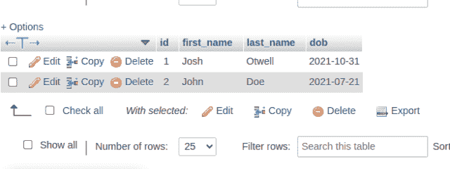
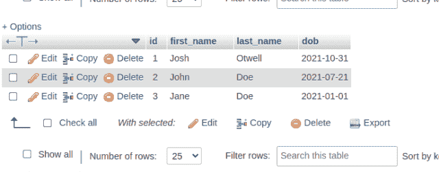

# 如何在 CodeIgniter 4 中检索 MySQL 最后插入 ID

> 原文：<https://levelup.gitconnected.com/how-to-retrieve-mysql-last-insert-id-in-codeigniter-4-c727e68b3efb>

我在学习、个人项目和应用程序开发中大量使用 CodeIgniter 4。在这篇文章中，我将介绍两种不同的方法，在 CodeIgniter 中执行了一个 **INSERT** 语句后，您可以使用这两种方法来检索 MySQL 最后插入的 ID 值。继续阅读了解更多信息…


自我推销:

如果你喜欢这里写的内容，尽一切办法，把这个博客和你最喜欢的帖子分享给其他可能从中受益或喜欢它的人。[因为咖啡是我最喜欢的饮料，如果你愿意，你甚至可以给我买一杯！](http://ko-fi.com/joshlovescoffee)

## 模型设置

首先，我使用 [CLI 生成器](https://codeigniter4.github.io/userguide/cli/cli_generators.html)特性，并通过在项目根目录的终端中执行以下代码来创建一个模型:

```
php spark make:model user --suffix
```

我已经删除了大部分*样板*代码，保留了这个*基本的*用户模型。我将根据需要添加更多功能:

## 创建 Home Controller users()方法

访问 URL **/cicrud/home/users，**在默认的 **Home** 控制器文件中执行这个 **users()** 方法:

重要！假设 **$data** 关联数组在被传递给 Model **insert()** 方法之前已经过验证和清理。始终验证和整理您的数据！

你是[中](http://medium.com/)成员吗？如果是这样的话，[每次我发表一篇博客文章时都会收到一封电子邮件通知](https://parabollus.medium.com/subscribe)如果你更喜欢中型平台的话。不是会员？别担心！使用[我的注册链接](https://parabollus.medium.com/membership)(我会向你收取佣金，无需额外费用)并加入。我真的很喜欢阅读所有伟大的内容，我知道你也会！！！

检查**用户的**表中的数据，我们可以看到已经添加了一行:


作为开发人员，有时您需要从用 **AUTO_INCREMENT** 属性定义的 MySQL 表列中捕获最后一个插入 ID 值。MySQL 有一个*本机* [LAST_INSERT_ID()](https://dev.mysql.com/doc/refman/8.0/en/information-functions.html#function_last-insert-id) 信息函数，您可以在查询中使用它并检索这个值。

如果您使用 CodeIgniter 4，根据您插入数据的方式，有几种不同的方法可以利用，允许您检索最后插入的 ID 值。我将在这篇文章中讨论这两个问题。

## CodeIgniter 4 模型 getInsertID()方法

CodeIgniter 4 模型有内置的方法来处理应用程序中需要的大多数 CRUD 操作。

我已经在这篇[中型](https://parabollus.medium.com/membership)帖子中写了关于 CodeIgniter 4 Model**insert()**方法的文章， [CodeIgniter 4 CRUD 系列与 MySQL: Create](https://link.medium.com/J26yFkx0Ajb) 。

如果您已经使用 Model **insert()** 方法插入了一个新行，并且需要最后一个插入 ID 值，那么如何获得它呢？

您可以在当前模型实例上调用 Model **getInsertID()** 方法并检索值。

截至撰写本文时，我还没有找到关于这种方法的官方文档。出于这篇博文的目的，我借用了我在 Stackoverflow 上找到的这篇文章。请在下面的评论中为这个 CodeIgniter 4 方法提供相关的资源或链接。

请参见下面更新的 **users()** 方法和代码:


重新访问**用户的**表也显示了该值:



我每周写一封关于我正在研究、学习和感兴趣的 SQL/PHP 的电子邮件。如果这听起来像是你想参与的事情，[点击这里](https://digitalowlsprose.ck.page/1b35a06295)了解更多信息。谢谢大家！

## CodeIgniter 4 查询生成器 insertID()

在 UserModel 模型文件中，我创建了这个 **dataInsert()** 方法:

使用[查询构建器类](https://codeigniter.com/user_guide/database/query_builder.html)，我们可以利用内置的 **$builder insertID()** 方法**插入**并检索最后的插入 ID 值，该方法在 **$db** 连接实例上调用。

在家庭控制器中，我已经编辑了 **users()** 方法，以使用该代码片段中所示的 UserModel **dataInsert()** 方法

再次访问 URL，/ **cicrud/home/users，**执行 **users()** Home 控制器方法。然而，在这个实例中，查询构建器 **insertID()** 方法检索最后一个插入 ID 值，而不是模型 **getInsertID()** 方法。



现在你知道了。在 CodeIgniter 4 中检索最后一个插入 ID 值的两种方法。如果你知道任何其他的，请在下面的评论中分享，这样我和其他读者也会知道。谢谢大家！

## 类似的最后插入 ID 博客帖子

我已经写了几篇关于 MySQL Last Insert ID 的博文，涵盖了几种不同的环境/语言，希望在下面与任何感兴趣的读者分享。也请一起分享吧！谢谢大家！

*   [MySQL 的 AUTO_INCREMENT 属性](https://joshuaotwell.com/mysqls-auto_increment-attribute/)
*   [MySQL Shell get _ auto _ increment _ value()方法— Python 模式](https://joshuaotwell.com/mysql-shell-get_auto_increment_value-method-python-mode/)
*   [PHP PDO lastInsertId()方法](https://joshuaotwell.com/php-pdo-lastinsertid-method-with-examples-in-mysql/)
*   [MySQL 中的 AUTO_INCREMENT 列属性—一个开始透视图](https://wordpress.com/posts/joshuaotwell.com?s=mysql+auto+increment)

如果您有任何问题或看到代码中的任何错误，请通过评论让我知道。建设性的意见有助于我提供准确的博客帖子，我非常感激。感谢您的阅读！

喜欢你读过的？看到什么不正确的吗？请在下面评论，感谢阅读！！！

# 行动的号召！

感谢你花时间阅读这篇文章。我真心希望你发现了一些有趣和有启发性的东西。请在这里与你认识的其他人分享你的发现，他们也会从中获得同样的价值。

访问 [Portfolio-Projects 页面](https://wp.me/P28ctb-3KD)查看我为客户完成的博客帖子/技术写作。

[**如果你喜欢我制作的内容，用一杯咖啡表达你的欣赏。**](https://ko-fi.com/joshlovescoffee)

要在最新的博客文章发表时收到来自本博客(“数字猫头鹰散文”)的电子邮件通知(绝不是垃圾邮件)，请点击“点击订阅！”按钮在首页的侧边栏！(如有任何问题，请随时查看 [Digital Owl 的散文隐私政策页面](https://wp.me/P28ctb-3gI):电子邮件更新、选择加入、选择退出、联系表格等……)

请务必访问[“最佳”](https://joshuaotwell.com/where-blog_post-in-digital-owls-prose-best-of/)页面，收集我的最佳博文。

作为一名 SQL 开发人员和博客作者，Josh Otwell 热衷于学习和成长。其他最喜欢的活动是让他埋头于一本好书、一篇文章或 Linux 命令行。其中，他喜欢桌面 RPG 游戏，阅读奇幻小说，并与妻子和两个女儿共度时光。

免责声明:本文中的例子是关于如何实现类似结果的假设。它们不是最好的解决方案。所提供的大多数(如果不是全部)示例都是在个人发展/学习工作站环境中执行的，不应被视为生产质量或就绪。您的特定目标和需求可能会有所不同。使用那些最有利于你的需求和目标的实践。观点是我自己的。

*原载于 2021 年 10 月 20 日*[*【https://joshuaotwell.com】*](https://joshuaotwell.com/how-to-retrieve-mysql-last-insert-id-in-codeigniter-4/)*。*