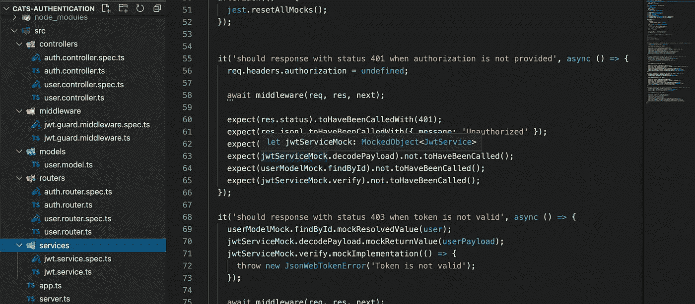
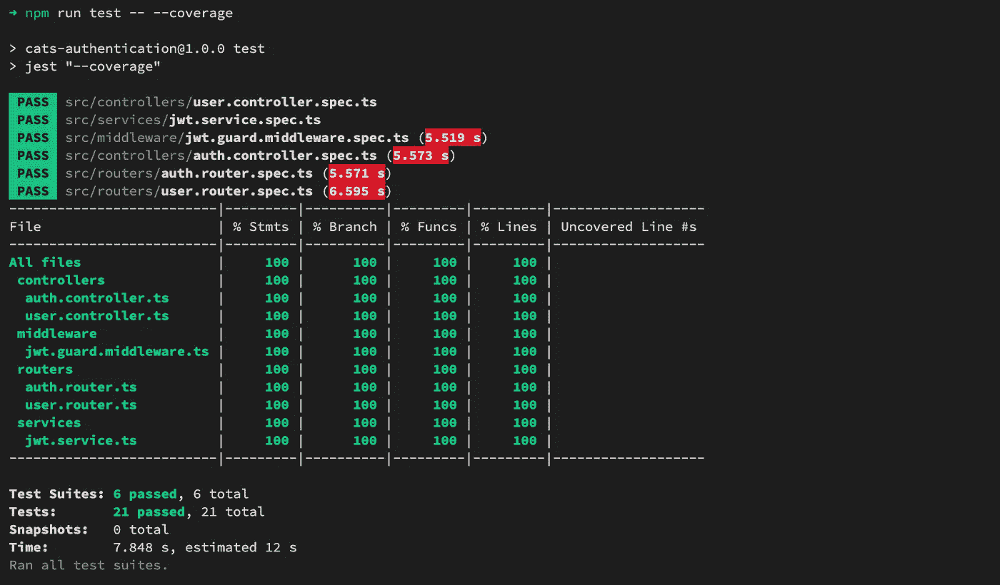

# 如何撤销 JWT 代币？Typescript，MongoDB

> 原文：<https://levelup.gitconnected.com/how-to-revoke-a-jwt-token-typescript-mongodb-c88485681486>

如您所知，jwt 令牌生来就是一个无状态的实体。就其本身而言，我们可以仅通过一个秘密令牌及其过期时间来验证 jwt 令牌。

然而，有时我们的服务要求令牌成为有状态的，这意味着我们可以在服务中使 jwt 令牌无效。

一个特殊的情况是，当您的服务用户登录到服务时，服务将为用户生成一个 jwt 令牌，用户可以使用这个令牌对其他请求进行身份验证。用户可以随时随地使用他们的凭证(用户名/密码)获得新的 jwt 令牌。但是，当会话调用注销请求时，所有会话都将被注销(意味着它们的令牌将无效)。

有一些策略来实现这个需求:

*   使用黑名单(白名单)使令牌无效(或仍然有效)。
    正常情况下，我们会将令牌存储到黑名单中(实际上，只存储令牌的签名就足够了)。这样，您必须在黑名单上存储大量令牌，并且只有在令牌过期时才能删除它们(例如，通过 cronjob)。
*   当您希望所有旧令牌失效时，更新令牌密钥。
    对于每个用户，我们使用一个密钥来生成令牌。这意味着用户的所有令牌具有相同的秘密。当你想撤销它们的时候，只需要改变密钥。

在本文中，我们将实现第二种方法。

# 使用 JWT 的传统 express 应用程序

首先，我们将使用 jwt 实现一个 express 应用程序。

我们创建一个 jwt 服务类作为 jwt 助手。该类将提供两个函数— `sign`和`verify`来创建和验证 jwt 令牌。

`JwtService`是一个简单的类，只需使用`SECRET, TOKEN_LIFE`环境变量调用`jsonwebtoken`函数来签署一个有效载荷并验证一个 jwt 令牌。

逻辑文件:`src/services/jwt.service.ts`

用户模型类——定义用户表模式，我们使用这个类连接到 MongoDB 服务。

`src/models/user.model.ts`

在将密码保存到数据库之前，使用`pre save`钩子散列密码的用户模型类。`isPasswordValid`方法是一个帮助器函数，该函数返回一个布尔值，当将一个普通的密码文本与一个用户的密码进行比较时会得到什么结果。

*返回用户信息到客户端时，记得删除* `*password*` *字段。*

我们正在构建一个简单的认证服务，它包括 4 个 API:

*   `POST /auth/register`创建一个用户。
*   `POST /auth/login`生成用户令牌。
*   `GET /users/profile`获取用户信息。要访问该资源，我们需要一个有效的用户令牌。
*   `POST /user/logout`撤销所有用户的令牌(现在不执行任何操作)

1.  认证路由器

路由器:`src/auth.router.ts`

控制器:`src/controllers/auth.controller.ts`

2.带有 jwt 令牌中间件的用户路由器

路由器:`src/routers/user.router.ts`

该路由器将`JwtGuardMiddleware`注册为路由器的全局中间件。

让我们看看中间件— `src/middleware/jwt.guard.middleware.ts`

中间件从请求头中获得一个访问令牌，然后调用 jwt 服务的函数来验证这个令牌。

验证用户令牌后，中间件将用户信息保存到`req`对象。

控制器:`src/controllers/user.controller.ts`

# 撤销用户 jwt 令牌

撤销所有用户令牌的思想是每个用户保存一个 jwt“秘密密钥”，当用户注销时，秘密密钥将被改变。

更新模型类:

现在，用户将拥有一个新的属性— `personalKey`。属性值将在用户创建时生成。

`logout`方法—改变用户的`personalKey`。

JWT 服务:

现在使用秘密密钥的服务是从环境变量和`personalKey`编译而来的。

新功能— `decodePayload`总是返回令牌有效载荷(包括令牌是否有效)。

认证控制器:

更新生成用户令牌的方式。

JWT 卫士中间件:

在验证用户令牌之前，我们需要用户的个人密钥，然后我们可以使用`decodePayload`函数来获取用户的 id。

用户控制器:

在注销处理程序中，我们调用`user.logout()`来更改用户的个人密钥。前一个密钥生成的所有令牌都将失效。

# 摘要

这是撤销 jwt 令牌的简单方法。它不能涵盖您的生产的所有情况，但也许这将是一个值得考虑的好事情。

项目以 TDD 风格完成。几乎逻辑功能被覆盖:

代码覆盖率

该项目的完整代码已经发布在 [Github](https://github.com/codetheworld-io/cats-authentication) 上。

感谢您的阅读！