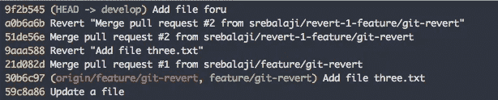
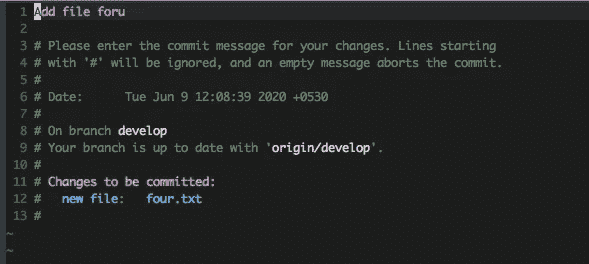
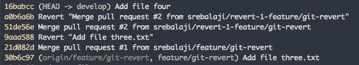
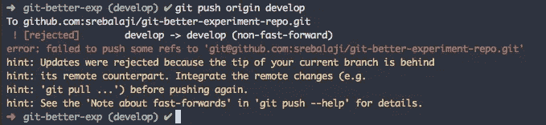

# 如何用 git amend 重写最新提交

> 原文：<https://levelup.gitconnected.com/how-to-rewrite-the-latest-commit-with-git-amend-48a8d5f27758>


有时我们希望改写历史。与现实世界不同，git 提供了各种选项来重写 Git 历史。

在本帖中，我们将介绍如何在 Git 中重写最新的提交。

# 重写最新的 git 提交消息

Git 提供了重写最新提交消息的选项。

该命令将打开带有最新提交消息的编辑器。然后，您可以更改提交消息并进行推送。



在上面的例子中，您可以看到最近的提交在消息中有一个输入错误。你可以用**修正**来修正这个打字错误



**修改**命令将打开一个编辑器。现在，您可以在这里编辑提交消息并保存它。

现在让我们看看 git 日志



错别字是固定的。还要注意，最新的提交散列也发生了变化。

所以无论你什么时候做修改，Git 都会重写整个提交，并为它生成一个新的散列。理解这一点非常重要。

还有一个修正的简写

```
git commit --amend -m "Your rewrite message"
```

您可以使用-m 属性直接传递消息。而且这个命令会直接提交更改，不会打开编辑器进行编辑。

现在是棘手的部分。假设您已经用错误的提交消息提交了一些更改，并且已经推送到远程。意识到错误后，您使用 amend 更改了提交消息，并试图将更改推送到远程。

Git 不允许您推送更改，您将会看到如下的错误消息。



Git 拒绝推送，并警告本地分支在远程分支后面。

这意味着远程中有新的变化，而这些变化在本地中不存在。因此，您可能应该通过从本地获取更改来修复它。

发生这种情况是因为我们使用了 amend 来更改最新的提交，而远程并不知道这一点。

因此，您应该告诉 Git，本地更改应该是更新的更改，并且无论如何都必须推送它。

您可以通过以下方式实现这一点

```
git push origin develop --force
```

上面的命令将强制 Git 将本地更改推送到远程。

## 当心暴力

如果您已经将更改推送到远程，并且其他开发人员已经开始使用这些更改，建议不要使用 amend。

因为 **-force** 基本上是在 remote 本身重写 git 历史。因此，在此期间被推到远程的任何更改都将从历史中抹去，并且将永久消失。

因此，当您还没有将更改推送到远程时，或者如果您非常确信没有其他开发人员已经开始使用这些更改或者没有其他人将任何新的更改推送到当前分支时，使用 **amend** 总是明智的。

# 使用 amend 向最新提交添加更多更改

还可以使用 amend 向最近的提交添加更多的更改。以便您不需要为遗漏的更改添加新的提交。

假设您错过了添加一些更改，这些更改必须是您所做的最后一次提交的一部分。你可以试试

```
git add file_one.txt git commit --amend
```

首先，您必须添加文件，然后您可以使用 **-amend** 将这些更改添加到最后一次提交中。该命令将打开编辑器，您可以添加更新的提交消息。现在，更改被添加到最近提交本身中。

你也可以使用

```
git commit --amend -m "Updated commit message"
```

正如已经讨论过的，这是一种简写，将接受提交消息。

有时，您不需要更新提交消息本身。您只需要在最近的提交中添加更多的更改。

这可以通过以下方式实现

```
git commit --amend --no-edit
```

此命令将添加暂存的更改，并保持提交消息不变。

**但是记住，amend 将总是重写整个提交，所以它为它生成一个新的提交散列。**

如前所述，如果更改已经被推送到远程，那么向最新提交添加更改是不明智的。

确保你不会因为使用 amend 而影响他人的工作。小心使用它。

在 Git 中也有重写旧提交和重写多个提交的方法。这些话题将在接下来的文章中讨论。

感谢您的阅读:)

**你可以在这里找到我的其他 git 相关文章**

```
1\. [Useful tricks you might not know about git log](/useful-tricks-you-might-not-know-about-git-log-ed5ac32625ef)2\. [How git revert works](/how-git-revert-works-9b87b8b03dd3)3\. [How git cherry-pick works and how to use it effectively](/what-is-git-cherry-pick-and-how-to-use-it-effectively-665247192442)4\. [Automate repetitive tasks in Git](/automate-repetitive-tasks-with-custom-git-commands-76a4b71d262f)5\. [Useful tricks of git fetch and git pull](/how-to-use-git-fetch-and-git-pull-effectively-c6a4becfbc16)6\. [A very basic intro of Git](https://medium.com/@srebalaji/a-very-basic-intro-of-git-b9cab0e64153)
```

如果你已经来了这么久，那么我想你会对 Git 更感兴趣。可以订阅我的简讯[**Git better**](https://gitbetter.substack.com/)**获取 Git 的招数、技巧、高级话题。**