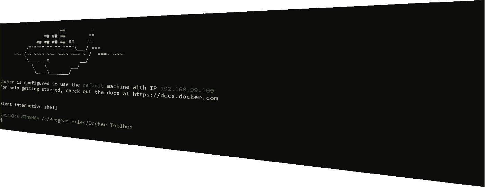

# TTY 输入后如何在后台运行 Docker 命令

> 原文：<https://levelup.gitconnected.com/how-to-run-a-docker-command-in-background-after-tty-input-616b5ffad444>

## 为需要输入的命令附加 TTY，然后将其分离以在后台运行



几天前，我为 [Tezos 区块链](https://tezos.com/)创建了自己的[远程签名者](https://tezos.gitlab.io/user/key-management.html#signer)。对于那些不熟悉 Tezos 的人来说，签名者是一个持有用户凭证并代表用户签署所有事务的进程。多亏了 Tezos 的 docker 库，安装进行得很顺利。我要做的是提取 docker 图像，并运行它的命令。

```
$ docker run --net=host tezos/tezos:carthagenet tezos-signer launch socket signer -a 127.0.0.1 -p 22000 -W
```

当我以纯文本方式添加一个测试密钥时，测试环境中的一切都很顺利。对于生产，我需要引入一些加密。一个简单的方法是使用 Tezos 的默认加密，这将要求我在启动该过程时输入密码。执行过程是这样的:

```
$ docker run --net=host -it tezos/tezos:carthagenet tezos-signer launch socket signer -a 127.0.0.1 -p 22000 -W Enter password for encrypted key "my_account": (I enter my password here) Jun 9 02:58:39 - client.signer: Accepting TCP requests on 127.0.0.1:22000 <-- (this line means signer process started)
```

注意，我在`docker run`命令中添加了`-it`参数。这些参数[将 TTY 附加到 docker 执行](https://stackoverflow.com/questions/22272401/what-does-it-mean-to-attach-a-tty-std-in-out-to-dockers-or-lxc)以支持密码提示。听起来不错？还剩一件事。我如何在后台运行这个命令？我运行脚本时输入密码就可以了。但是我希望它在那之后在后台运行，而不是在前台作为一个阻塞进程在我的终端上运行(如果我的会话终止，它就会终止)。

# 不工作:使用`yes`命令

我曾经使用 [yes](https://www.howtogeek.com/415535/how-to-use-the-yes-command-on-linux/) 命令来预先提供输入。该命令将为下一个命令所需的所有输入发送`y`。请看下面的例子(我们可以用`rm -rf`来代替，我只是想在这里展示一下`yes`是如何工作的):

`yes`也可以支持自定义输入。在下一个示例中，我创建了一个`test.sh`文件，它要求输入名称并打印出一条欢迎消息。

```
$ vi test.sh #!/bin/bash 
read -p "Enter Your Name: " username 
echo "Welcome $username!" $ chmod +x ./test.sh $ yes Huy | test.sh 
Welcome Huy!
```

我想`yes`可以帮我填写上面命令的密码。如果是这样，我可以在尾部添加`&`来在后台运行。但事实并非如此。

如果我保留`-it` params，docker 不会接受输入。它抱怨`input device is not a TTY`。

```
$ yes (my-password) | docker run --net=host -it tezos/tezos:carthagenet tezos-signer launch socket signer -a 127.0.0.1 -p 22000 -W the input device is not a TTY
```

如果我删除了`-i`，似乎 Docker 接收到了错误格式的输入。它导致签名者抛出一个错误(Unix。ENOTTY)。

```
$ yes (my-password) | docker run --net=host -t tezos/tezos:carthagenet tezos-signer launch socket signer -a 127.0.0.1 -p 22000 -W Enter password for encrypted key "my_account": 
Fatal error: Unix.Unix_error(Unix.ENOTTY, "tcgetattr", "")
```

如果我删除了`-t`，Docker 确实要求我输入，但是之后就挂起了，而且我的进程似乎无法工作。

```
$ yes (my-password) | docker run --net=host -i tezos/tezos:carthagenet tezos-signer launch socket signer -a 127.0.0.1 -p 22000 -W Enter password for encrypted key "my_account": (hang here > <! )
```

所以，`yes`命令不能帮忙。

# 不起作用:使用`mkfifo`

我能想到的另一个解决方案是使用`mkfifo`创建一个[输入管道](https://www.networkworld.com/article/3251853/why-use-named-pipes-on-linux.html)。让我们回来看看我在上面创建的`test.sh`。

```
$ vi test.sh #!/bin/bash 
read -p "Enter Your Name: " username 
echo "Welcome $username!" $ chmod +x ./test.sh $ mkfifo ./myname $ ./test.sh < ./myname & $ echo "Huy" > ./myname 
Welcome Huy!
```

当我的命令需要输入时，它会一直等到有人向管道中添加内容。管道现在将取代传统的输入 TTY。

但是这个解决方案在 Docker 上也不起作用。我得到的很像`yes` : `Unix.Unix_error(Unix.ENOTTY, "tcgetattr", "")`或者`the input device is not a TTY`

# 工作解决方案:运行 TTY，输入，然后分离 TTY

我找到解决办法了(耶)！幸运的是，这个解决方案比上面的两个简单得多。Docker 支持[将 TTY 从附加的会话中分离](https://stackoverflow.com/questions/19688314/how-do-you-attach-and-detach-from-dockers-process)。现在的解决方案非常简单:

*   运行我的命令
*   如果需要，键入输入
*   **按** `**Ctrl+P, Ctrl+Q**` **(我用的是 MacOS)** 将 TTY 从正在运行的会话中分离

撞！默认情况下，分离的会话是后台进程。

*原载于*[*https://huynvk . dev*](https://huynvk.dev/blog/how-to-run-a-docker-command-in-background-after-tty-input)*。*