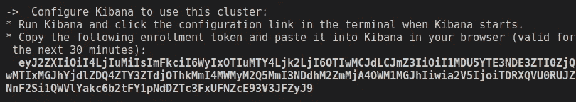
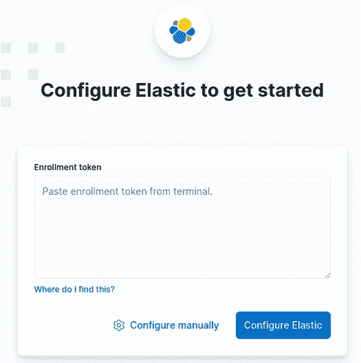
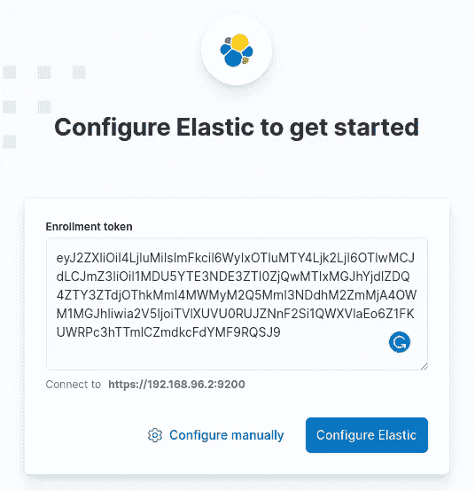
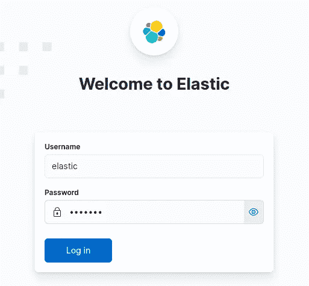

# 如何在 Docker 上运行 Elasticsearch 8 进行本地开发

> 原文：<https://levelup.gitconnected.com/how-to-run-elasticsearch-8-on-docker-for-local-development-401fd3fff829>

## 使用 Docker 和 Docker Compose 在几分钟内启动 Elasticsearch 和 Kibana


图片由 Pixabay 上的 [512893](https://pixabay.com/photos/fantasy-illusion-sailboat-sea-sky-1204156/) 提供

对于新的主要版本 Elasticsearch (8.x.x)，在 Docker 上运行 Elasticsearch 和 Kibana 有重大更新。用于以前版本的 Docker 和 Docker Compose 的命令和语法需要更新，以便用于最新版本。在本帖中，我们将介绍如何用 Docker 和 Docker Compose 启动 elastic search(8 . 2 . 2 版)和 Kibana 进行本地开发。

## 在禁用 xpack 安全性的情况下，在 Docker 上运行 Elasticsearch 和 Kibana

[xpack 安全](https://www.elastic.co/guide/en/elasticsearch/reference/current/security-settings.html)默认启用，这意味着您需要认证才能访问 Elasticsearch 服务器。然而，对于本地开发，我们通常不需要高安全级别，因为一切都是本地的。我们会更加关注业务逻辑和代码，而不是基础设施。当代码准备好生产时。我们可以使用托管的弹性搜索解决方案，比如开发和维护弹性搜索的[elastic.co](https://www.elastic.co/)。

直接用 Docker 启动 Elasticsearch 和 Kibana 非常直接。首先，我们需要创建一个由 Elasticsearch 和 Kibana 共同使用的网络。

```
$ docker network create elastic
```

然后我们可以为 Elasticsearch 创建一个 Docker 容器:

这里的要点是:

*   刚刚创建的网络用于 Elasticsearch，因此它可以被 Kibana 发现，Kibana 也会使用这个网络。
*   创建了一个单节点 Elasticsearch 集群。
*   环境变量`ES_JAVA_OPTS`用于指定最小和最大 JVM 堆大小(本例中为 1GB)。如果没有设置，很有可能你的 Elasticsearch 容器无法成功启动。
*   我们需要显式禁用 xpack 安全性，这样我们就不需要认证来访问 Elasticsearch 服务器。这对于本地开发是可以的，但是应该支持生产。
*   我们可以使用托管在 [Dockerhub](https://hub.docker.com/_/elasticsearch) 上的 docker 图片，或者直接由 [Elasticsearch](https://www.docker.elastic.co/r/elasticsearch) 提供的图片。

我们现在可以使用 *curl* 调用 Elasticsearch API 并检查 Docker 容器是否成功启动:

当您看到上面的输出时，这意味着 Elasticsearch Docker 容器已成功启动。然后我们可以启动一个 Kibana 容器，用一个漂亮的用户界面来管理 Elasticsearch 服务器。

要启动 Kibana 的 Docker 容器，请运行:

此处的主题演讲:

*   我们必须为 Kibana 指定与 Elasticsearch 相同的网络。
*   最好使用与 Elasticsearch 相同版本的 Kibana。

如果你访问 [http://localhost:5601](http://localhost:5601) ，你将能够直接打开 Kibana 的 Web UI，无需认证。

## 用 Docker Compose 运行 Elasticsearch 和 Kibana

最好在一个`docker-compose.yaml`文件中指定我们需要运行的 Docker 容器，尤其是当您有多个容器时。这样，您可以同时管理它们，而不需要逐一启动它们。有了`docker-compose.yaml`，代码版本控制和共享也更加方便。

上面演示的 Elasticsearch 和 Kibana 容器的`docker-compose.yaml`文件如下。设置与直接启动 Docker 容器的设置相同。

如您所见，我们可以在同一个文件中管理网络、卷和容器，这非常方便。记得在使用这个`docker-compose.yaml`文件启动容器/服务之前，先关闭上面启动的`elasticsearch`和`kibana`容器，否则将会有端口冲突。或者，您可以在该文件中指定不同的已发布端口。

## 在启用 xpack 安全性的情况下，在 Docker 上运行 Elasticsearch 和 Kibana

上面我们已经介绍了如何为 Elasticsearch 和 Kibana 快速启动 Docker 容器进行本地开发。当不需要担心认证问题时，它们非常适合本地开发。

对于生产，我们当然应该启用 xpack 安全特性。然而，如果可能的话，我们不应该自己托管 Elasticsearch 服务器，而应该通过专门的提供商来托管，例如开发和维护 Elasticsearch 的[elastic.co](https://www.elastic.co/)公司。这样，我们就不需要担心硬件、安全性或升级问题，而可以专注于业务逻辑和数据。

尽管如此，有时也需要本地身份验证。我们可以删除上面演示的`xpack.security.enabled=false`环境变量，xpack 安全性将自动启用。

要启动启用了 xpack 安全性的 Elasticsearch 容器，请运行:

注意，我们为默认用户 *elastic* 指定了一个密码。如果没有在这里指定，当您启动容器时会生成一个随机密码。您还将看到为 Kibana 生成的注册令牌:



打开新的控制台，我们先直接调用 Elasticsearch API。奇怪的是，我们需要从 Docker 容器中复制安全证书，并用它与 *curl* 进行认证:

然后让我们创建一个 Kibana 容器来管理这个带有身份验证的 Elasticsearch 服务器。该命令实际上如上所示:

在控制台中，我们看到类似这样的内容:

```
Go to [http://0.0.0.0:5601/?code=038409](http://0.0.0.0:5601/?code=038409) to get started.
```

注意，我们需要在 URL 中指定验证码来访问 Kibana。`0.0.0.0`表示本地机器上的所有 IPv4 地址都可以访问该端口。当你去 [http://localhost:5601？code=038409，](http://localhost:5601,)系统将提示您输入注册令牌:



复制并粘贴启动 Elasticsearch 容器时屏幕上显示的注册令牌。如果屏幕上挤满了日志或者令牌已经过期，您可以使用`elasticsearch-create-enrollment-token`命令生成一个新的日志。我们可以直接使用 Elasticsearch 容器中的`elasticsearch-create-enrollment-token`命令:



点击“配置弹性”后，您需要输入您的用户名和密码，在本例中均为`elastic`:



最后，你可以使用 Kibana 来管理你的 Elasticsearch 服务器。嗯，启用了 xpack 安全功能，它确实非常安全。我们需要验证码，注册令牌和用户名/密码，这将确保安全的一切手段🛡️.

## 启用 xpack 安全时，使用 Docker Compose 运行 Elasticsearch 和 Kibana

令人惊讶的是，在启用了 xpack 安全性的情况下，编写一个`docker-compose.yaml`文件来管理 Elasticsearch 和 Kibana 容器非常复杂。我们需要自己明确管理证书，这可以在[官方文件](https://www.elastic.co/guide/en/elastic-stack-get-started/current/get-started-stack-docker.html#get-started-docker-tls)中找到。非常奇怪的是，直接使用 Docker 是如此简单，而使用 Docker Compose 对于 xpack 安全性来说要复杂得多。我认为在他们有更好的版本之前，我们应该避免使用它。

我们已经介绍了在 Docker 上运行 Elasticsearch 和 Kibana 的各种方法。对于本地开发，我们可以在大多数情况下禁用 xpack 安全性，只关注数据和查询。当 xpack 安全性被禁用时，使用 Docker 要简单得多。对于生产，我们通常会将我们的数据托管在一个专门的提供商上，如[elastic.co](https://www.elastic.co/)，这样可以节省我们管理服务器、安全和升级的工作量，并让我们专注于重要的业务逻辑。

相关文章:

*   [关于在 Python 中使用 Elasticsearch 你需要知道的一切](https://lynn-kwong.medium.com/all-you-need-to-know-about-using-elasticsearch-in-python-b9ed00e0fdf0)
*   [从实例中学习弹性搜索](https://lynn-kwong.medium.com/learn-elasticsearch-from-practical-examples-495f2f8db83e)