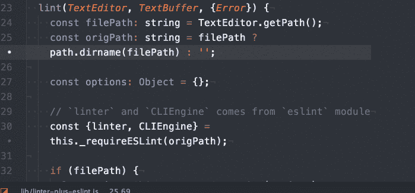

# 如何使用预提交钩子运行 ESLint

> 原文：<https://levelup.gitconnected.com/how-to-run-eslint-using-pre-commit-hook-25984fbce17e>

> 更新:有一个更好的方法来添加预提交挂钩到您的项目。结账 [**哈士奇**T3**。**你可以按照下面给出的教程学习如何手动添加预提交钩子，但是**请注意**我不再坚持要点了。](https://medium.com/@lorenzen.jacob/git-hooks-with-husky-8b98f2556363)

在我们继续之前，我想提供一些关于 ESLint 和 Git 预提交钩子的背景知识。如果你熟悉它们，你可以跳过接下来的两个部分。

# **ESLint**

图片来源:[https://libraries.io/atom/linter-plus-eslint](https://libraries.io/atom/linter-plus-eslint)

开发人员在编码时容易犯错误。例如，您可能忘记关闭一个括号，或者您可能最终创建了一个已经存在的变量。但是，像这样的错误最终可能会破坏你的应用程序或网站。我们可能会将这些有问题的代码推送到云仓库，或者可能需要相当长的时间来解决由于这些错误导致的问题。如果你的代码正在被审查，这将消耗你的审查者的时间来发现这样的草率的错误，或者他们可能完全错过它。

这就是林挺开始描绘的地方。**林挺**是运行一个程序来分析代码潜在错误的过程。对于林挺这样的潜在错误，我们使用棉绒。

帮助开发者写出干净的代码。每种语言可能都有自己的 linters 来解析代码。这里有一个我喜欢的链接，它列出了一些写更干净代码的好材料:
[https://github.com/showcases/clean-code-linters](https://github.com/showcases/clean-code-linters)

在这些工具中，我们将特别提到 ESLint，它是一个用于林挺 JavaScript/ECMAScript 6 的现代林挺工具。根据他们[网站](http://eslint.org/docs/about/)上的描述，

> ESLint 是一个开源的 JavaScript 林挺实用程序，最初由 Nicholas C. Zakas 于 2013 年 6 月创建。代码[林挺](http://en.wikipedia.org/wiki/Lint_(software))是一种静态分析，经常被用来发现有问题的模式或不符合特定风格指南的代码。

简而言之，它用于验证 JavaScript 文件是否存在潜在错误。ESLint 中的“*ES”*代表 **ECMAScript** 。你可以创建一个*。eslintrc* 配置文件，并指定验证代码所依据的规则。您可以在您想要的编辑器中动态地 Lint 您的代码(检查是否有将 ESLint 与您的编辑器集成的插件/API ),或者您可以使用命令行工具 lint 它。选择权在你。我更喜欢飞行中的林挺。

# **Git 预提交挂钩**

图片来源:[http://www . sterling Hamilton . com/git-hook-pre-commit-for-debug-comments/](http://www.sterlinghamilton.com/git-hook-pre-commit-for-debug-comments/)

在讨论 ESLint 时，我举了一个例子，提到开发人员可能最终会推出一个有错误的代码，即使该代码是无效的。即使你已经建立了一个 linter，它可能会保护你免受无效代码，但它不能保护你不把无效代码推给回购。我们需要一种机制来停止将这样的代码推给回购。

这就是 Git 预提交挂钩的地方。如果代码没有通过`.git/hooks`中钩子设置的规则，它将阻止开发者提交代码。这些钩子应该是可执行的。

**请注意，**Git 预提交钩子不仅仅可以用来验证你的代码。有关 Git 挂钩的信息，请访问[https://git-scm.com/book/gr/v2/Customizing-Git-Git-Hooks](https://git-scm.com/book/gr/v2/Customizing-Git-Git-Hooks)

# **ESLint Git 预提交挂钩**

我会使用现有的脚本[https://gist.github.com/linhmtran168/2286aeafe747e78f53bf](https://gist.github.com/linhmtran168/2286aeafe747e78f53bf)

以下是我在提交 lint JavaScript/ES6 之前遵循的步骤:

1.  如果您还没有为您的 repo 初始化 git，那么通过运行命令:
    `git init`来初始化 git
2.  您应该会看到在您的项目文件夹中创建了一个`.git`文件夹。
3.  转到`.git/hooks`。你会看到一个名为`pre-commit.sample`的文件
4.  将该文件重命名为`pre-commit`
5.  删除现有的示例代码。
6.  我根据 Gist 中 iamjochem *的*评论修改了脚本[https://gist.github.com/linhmtran168/2286aeafe747e78f53bf](https://gist.github.com/linhmtran168/2286aeafe747e78f53bf)，并创建了自己的 Gist 来与 ESLint 一起使用。
    [https://gist . github . com/rash tay/328 da 46 a 99 a9 d7c 746636 df 1 cf 769675](https://gist.github.com/rashtay/328da46a99a9d7c746636df1cf769675)
7.  运行`chmod +x .git/hooks/pre-commit`使其成为可执行文件。
8.  瞧啊。

我希望听到反馈/改进建议。

 [## 编写面试问题

### 掌握编码面试的过程

技术开发](https://skilled.dev)