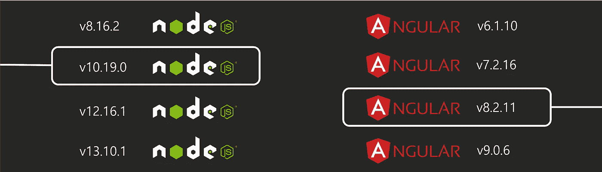

# 如何同时运行多个节点和角度版本

> 原文：<https://levelup.gitconnected.com/how-to-run-multiple-node-and-angular-versions-simultaneously-1f58e6d150de>



在我作为一名网络工程师的工作中，我在不太长的时间内完成了大量的项目。不仅如此，所有这些项目都有至少一个基于[节点](https://nodejs.org/)的组件，并且其中很大一部分还使用 [Angular](https://angular.io/) 作为他们的前端框架。因此，我最终来到了一个点，我需要积极地工作在我当前的项目上，但能够迅速切换回任何其他项目。

我必须承认，第一次需要这个开关时，我天真地将 Node 和 [Angular CLI](https://cli.angular.io/) 都降级了……结果当我回到我当前的项目时，又将它们升级了。这不仅是一个浪费时间的过程，而且很容易因为缺少信息而出错。一个 Angular 项目的 CLI 版本在`package.json`文件里，但是节点版本呢？这是一条必须记录在案的信息，众所周知，记录几乎总是被遗忘。

> **每个角度版本都与一系列节点版本兼容。**降级/升级 Angular CLI 时，您还需要确保正在使用的节点版本是兼容的。此外，在开发过程中维护版本是一个很好的实践，除非明确地想要改变它们。

就在那一刻，我开始寻找一个可能的解决方案来管理不同项目的不同节点和角度版本。我发现了两个似乎有希望一起使用的概念:

*   [nvm](https://github.com/nvm-sh/nvm) ，节点版本管理器
*   局部角度 CLI

# nvm

nvm 是一个节点版本管理器命令行工具。它允许用户在其机器上安装多个节点版本，然后在不同的 shells 中同时使用不同的版本。

> 如果你不熟悉 nvm 命令，请记住:
> - `*nvm run [arguments]*`相当于`*node [arguments]*`
> - `*nvm exec [command] [arguments]*`相当于`*[command] [arguments]*`

一个正常的 nvm 使用工作流程(以及我们将要用来管理不同项目的节点版本的工作流程)将是**安装每个项目的节点版本，然后在一个独立的项目专用外壳**中执行它。节点可以本地安装在机器上，也可以不安装在机器上，这对于这个用例没有影响。

出于演示目的，假设我们有以下项目:

*   项目 XPTO，节点版本 8.17.0
*   项目 EPIC，节点版本 12.16.1

为了能够在不需要降级/升级节点版本的情况下执行这两个项目，您必须:

1。使用 nvm 安装两个节点版本:

```
**$** nvm install 8.17.0
**$** nvm install 12.16.1
```

2。转到 XPTO 项目目录，设置 nvm 使用正确的节点版本:

```
**$** nvm use 8.17.0*# check Node version being used*
**$** nvm run -v
> Running node v8.17.0
> v8.17.0# start project XPTO
**$** nvm run npm start
```

> 通过执行`nvm use`,您定义了 nvm 将在该 shell 中运行的节点版本，而不仅仅是在您执行命令的目录中。

3。打开一个新的 shell，转到项目 EPIC 的目录，对该项目的节点版本执行相同的操作。

现在有两个不同的项目由两个不同的节点版本执行！*少了什么？*嗯，`nvm use`动作是 **shell 会话作用域**，这意味着新的 shell 将以默认的 nvm 版本的 Node 开始。因此，当您明天回来工作并打开一个 shell 来启动您的任一项目时，nvm 将不再指向它们正确的节点版本。

幸运的是，nvm 有`[.nvmrc](https://github.com/nvm-sh/nvm#nvmrc)`文件，它允许用户在目录及其所有子目录中指定 nvm 使用的**节点版本。使用正确的节点版本在项目的根目录下创建此文件:**

```
*# in project root directory* **$** echo "8.17.0" > .nvmrc
```

确保您总是使用 nvm 命令来执行 Node 或 npm，因为这些是搜索和使用`.nvmrc`文件的命令:

```
*# "node server.js" with Node version from .nvmrc*
**$** nvm run server.js*# "npm start" with Node version from .nvmrc*
**$** nvm exec npm start
```

现在，nvm 将始终为您的项目运行正确的节点版本！

# 局部角度 CLI

如果你正在做一个 Angular 项目，除了保证正确的节点版本，你还需要确保在运行`ng`命令时使用正确的 Angular CLI 版本。

当您创建一个 Angular 项目时， **Angular CLI 作为一个开发依赖项**被添加到您的项目的`package.json`:

```
{
  ...
  "devDependencies": {
    "@angular/cli": "9.0.5",
    ...
  }
}
```

这意味着，在安装完项目的依赖项后，在 `**node_modules**`文件夹中会有一个**本地安装的 Angular CLI，与您在机器中全局安装的 Angular CLI 版本无关。您需要做的是确保执行这个本地安装的版本，而不是全局版本。您可以执行下列操作之一:**

*   **使用** `**package.json**` **脚本**

`npm run-script`命令将`node_modules/.bin`二进制文件添加到预先存在的 shell 路径中，然后提供给脚本。这意味着`package.json`中执行`ng`的脚本将运行本地安装的 Angular CLI。如果您也想使用这种方法在 shell 中直接执行`ng`，您可以在`package.json`中添加`"ng": "ng"`作为脚本。

```
{
  ...
  "scripts": {
    "ng": "ng",
    "start": "ng serve",
    ...
  }
}*# serve your application with nvm and local Angular CLI*
**$** nvm exec npm start*# create an Angular component using local Angular CLI*
**$** nvm exec npm run ng g component my-cool-component
```

*   **使用** `**node_modules/.bin/ng**`

通过在 shell 中直接执行`node_modules/.bin`文件夹中的二进制文件来运行本地 Angular CLI。

```
*# create an Angular component using local Angular CLI*
**$** nvm exec ./node_modules/.bin/ng g component my-cool-component
```

# 结论

通过利用 **nvm 和本地 Angular CLI 二进制文件**，不仅可以管理不同的节点和 Angular 版本化项目，还可以以简单直接的方式完成。

使用这种方法，重要的是**永远不要忘记使用 nvm 命令**！的确，一个简单的命令(例如启动一个项目)会变得有点冗长，但是能够无缝地处理和执行多个项目的好处是巨大的。

*希望这对外面的人有帮助！*💡
*当然还有感谢阅读。*🤓
*如果您有任何问题/建议/反馈，欢迎留下评论。*📝

[*Patrice pear tree*](https://twitter.com/PatricePeartree)*@ Twitter*