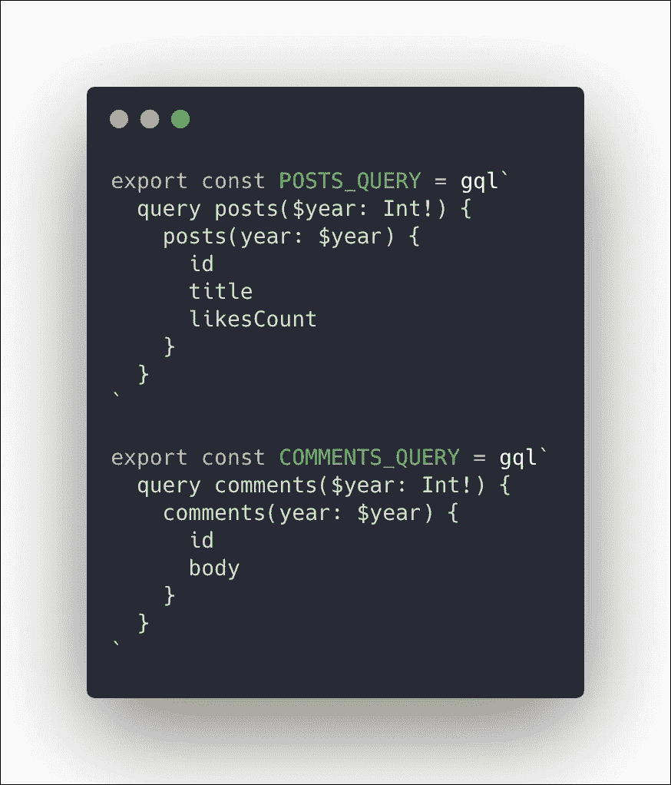

# 如何使用 GraphQL 和 Apollo 客户机一次运行多个查询

> 原文：<https://levelup.gitconnected.com/how-to-run-multiple-queries-at-once-using-graphqls-apollo-client-c24bea52e079>

有些情况下，您希望一次运行多个查询。例如，您有一个由两个组件组成的页面，每个组件的数据都来自一个单独的查询，但是您希望在继续呈现之前执行并解析这两个组件。有许多方法可以实现这一点。

下面是我们将要开始的两个查询。我们将寻找多种解决方案来同时执行和解决它们。

## 解决方案 1:为它们定义一个组合查询

定义一个组合查询，使用共享变量集执行这两个查询。这是一个简单但不可扩展的解决方案。

然后，您可以像这样将它与来自`react-apollo`的`<Query>`组件一起使用:

> 注意:这将在一次网络调用中完成。

虽然这在本例中非常有效，但它有两个缺点:

1.  因为我们在两个组件中重用了相同的变量，如果两个查询不接受相同的变量(或它们的类型定义)，我们就不能对它们有多个定义。例如，如果两个查询将一个变量标记为 required，而第二个查询没有将它标记为 required，那么在这种情况下将会抛出一个错误，因为定义不匹配。
2.  当它增长时很容易变得混乱，并且很难传递数据

## 解决方案 2:使用来自`apollo-client`的合成工具

来自`apollo-client`文档:

> 出于实用目的，`react-apollo`导出一个`compose`函数。使用此功能，您可以一次干净地使用几个组件增强器。包括多种`[graphql()](https://www.apollographql.com/docs/react/api/react-apollo/#graphqlquery-configcomponent)`、`[withApollo()](https://www.apollographql.com/docs/react/api/react-apollo/#withapollocomponent)`或[还原](https://github.com/reduxjs/react-redux/blob/master/docs/api/connect.md)、`[connect()](https://github.com/reduxjs/react-redux/blob/master/docs/api/connect.md)`增强剂。当您使用多个增强器时，这会清理您的代码。 [Redux](http://redux.js.org/) 也导出了一个`compose`函数，而[重新组合](https://github.com/acdlite/recompose)也是如此，所以你可以选择使用任何一个你认为最合适的库中的函数。
> 
> 一个重要的注意事项是`compose()`首先执行第一个增强器*然后在增强器列表中前进。换句话说，像这样调用三个函数:`funcA(funcB(funcC(component)))`相当于像这样调用`compose()`:`compose(funcC, funcB, funcA)(component)`。*

那么查询和变异将在组件 props 中可用。

> 注意:这将为每个 GraphQL 操作进行一次网络调用。

## 解决方案 3:使用`apollo-client`中的`[withProvider](https://www.apollographql.com/docs/react/api/react-apollo/#withapollocomponent)`实用程序

来自`apollo-client`文档:

> 一个简单的增强器，它提供了对您的`[ApolloClient](https://www.apollographql.com/docs/react/api/apollo-client#apolloclient)`实例的直接访问。如果你想用 Apollo 做定制逻辑，这是很有用的。例如调用一次性查询。通过用您想要增强的组件调用这个函数，`withApollo()`将创建一个新的组件，它将把一个`[ApolloClient](https://www.apollographql.com/docs/react/api/apollo-client#apolloclient)`的实例作为一个`client`道具传入。

然后，您可以像这样执行查询:

## 解决方案 4:使用[反应-采用](https://github.com/pedronauck/react-adopt)

由于`<Query>`是阿波罗的渲染道具工具，`react-adopt`可以用来组合多个渲染道具。你可以这样使用它:

## 解决方案 5:使用 react-apollo-hooks 中的 useQuery 实用程序

这种解决方案可能并不适用于每个应用程序，因为它依赖于 React 挂钩，而 React 挂钩仅从 React 版本 16.8 开始可用。

你可以这样使用它:

 [## 学习 GraphQL -最佳 GraphQL 教程(2019) | gitconnected

### 11 大 GraphQL 教程-免费学习 GraphQL。课程由开发人员提交和投票，使您能够…

gitconnected.com](https://gitconnected.com/learn/graphql)