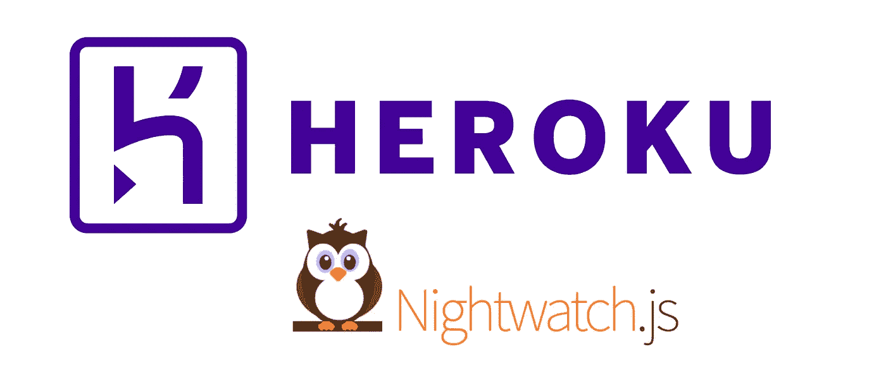

# 如何在 Heroku 管道上运行夜间监视测试

> 原文：<https://levelup.gitconnected.com/how-to-run-nightwatch-tests-on-heroku-pipelines-7c21de641003>

端到端测试是每一个良好的持续集成过程中非常重要的一部分，而 [Nightwatch.js](https://nightwatchjs.org/) 是一个非常好的工具。在本文中，我将向您展示如何轻松地将 Nightwatch 集成到 Heroku 构建管道中。我们将使用 [Node.js](https://nodejs.org/en/) 和 [Express](https://expressjs.com/de/) ，测试将在 Chrome 浏览器中运行。

你可以在这里找到完成的范例项目

> *“再多的测试也不能证明一个软件是对的，一次测试就能证明一个软件是错的。”*
> 
> *-阿米尔·加莱*

# 拥有正确的构建包

首先，我们必须定义所需的构建包。使用 buildpacks，您可以指定 Heroku 应该如何设置运行您的应用程序和 ci 的机器。如果你想了解更多关于 buildpacks 的信息，你可以看看 Heroku [文档](https://devcenter.heroku.com/articles/buildpacks)。

出于我们的目的，我们需要三个构建包:

1.  运行我们的应用程序。[链接](https://elements.heroku.com/buildpacks/heroku/heroku-buildpack-nodejs)
2.  谷歌 Chrome 来运行我们的夜间监控测试。[链接](https://elements.heroku.com/buildpacks/heroku/heroku-buildpack-google-chrome)
3.  和 ChromeDriver，以便 Nightwatch 可以控制 Chrome 浏览器。[链接](https://elements.heroku.com/buildpacks/heroku/heroku-buildpack-chromedriver)

我们只需在项目的基础上添加一个`app.json`文件，然后添加下面的代码块。

如果你想知道更多关于`app.json`的信息，你可以在这里查阅关于它的文档[。](https://devcenter.heroku.com/articles/app-json-schema)

就是这样！现在我们已经完成了构建包的设置。

# *创建守夜配置*

既然我们已经将 those 驱动程序和浏览器添加到我们的环境中，我们需要告诉 Nightwatch 在哪里可以找到它们。我们通过创建新的 Nightwatch 配置或向现有配置添加环境来实现这一点。

在本例中，我们将创建一个名为`nightwatch_heroku.conf.js`的新配置文件。

为了让一切工作，我们必须添加一些配置的东西。在 webdriver 键下，我们必须指定`server_path`。这里我们需要将目录添加到 ChromeDriver 中。当您使用建议的构建包时，驱动程序的默认路径是`/app/.chromedriver/bin/chromedriver`。

我们还必须在`desiredCapabilities`下添加 Chrome 二进制文件的路径。安装 Chrome 浏览器的 buildpack 会自动添加一个带有正确路径的环境变量，所以我们可以使用它。

就是这样！现在我们有了守夜人的配置文件。

# 准备您的 index.js

在开始测试之前，我们需要在我们的`index.js`上做一些准备。

首先，我们必须确保我们的应用程序使用正确的端口。Heroku 会用我们可以使用的端口自动设置一个环境变量。因此，我们将使用该端口或一些默认端口进行本地测试。

我们还必须确保我们的应用程序在启动过程完成时会发出一个事件。我们通过简单地使用 listen 函数的回调方法来做到这一点。在我们的应用程序监听到所需的端口后，我们只需发出一个事件。

如果您使用的是 express 之外的任何其他框架，您必须找到自己的实现。

就是这样！我们的`index.js`现在准备好了。在下一步中，我们将创建一个 test runner 脚本，它现在可以等到应用程序完全启动后再开始测试。

# 创建测试运行程序脚本

接下来，我们必须创建一个守夜人跑步者。这个运行者将从代码而不是命令行启动 Nightwatch。我们创建一个名为`herokuTestRunner.js`的新文件。

正如你在下面的代码中看到的，首先我们等待我们的应用程序发出`listening`事件。现在我们知道应用程序已经准备好了，我们可以开始测试了。这是通过 Nightwatch cli 函数完成的。我们只需指定配置文件的路径，并在`argv`对象中传递它。在这个对象中，您可以添加任何 Nightwatch cli 参数。

之后，我们开始测试，并定义在出现错误或所有测试成功运行的情况下会发生什么。如果我们的测试过程以除零以外的任何值终止，Heroku 会将这个构建标记为失败。

现在我们已经做好了运行夜间监视测试的一切准备！

# 自动运行测试

每当我们在 Heroku 上建立一个分支，我们也想运行我们的守夜人测试。我们只需添加另一个 npm 脚本来执行我们的测试运行程序。只需在您的`package.json`中添加以下行即可。

现在我们必须告诉 Heroku 在测试我们的应用程序时应该运行哪个脚本。这是在`app.json`中完成的，我们简单地添加下面的块。

因此，我们只需在那里添加我们的正常测试，还可以添加我们的自定义 Nightwatch 脚本。就是这样！现在当你触发你的 Heroku CI 时，你应该看到你的运行守夜人测试正在运行。

# TL；速度三角形定位法(dead reckoning)

如果你没有时间通读所有这些，下面是基本步骤:

1.  将 Chrome 和 ChromeDriver 的构建包添加到您的`app.json`
2.  用 Chrome 和 ChromeDriver 的正确路径为 Heroku 创建一个定制的 Nightwatch 配置。
3.  在代码中创建一个守夜人跑步者。
4.  添加一个 npm 脚本来运行 Heroku Nightwatch runner。
5.  将 npm 脚本添加到您的`app.json`中，这样 Heroku 将在每次构建时运行它。

正如我之前提到的，你可以在 GitHub [这里](https://github.com/TimonBerlin/heroku-pipelines-nightwatch)查看示例项目。

**测试愉快！**

*最初发表于*[https://github.com/TimonBerlin/heroku-pipelines-nightwatch](https://github.com/TimonBerlin/heroku-pipelines-nightwatch)